<div align="center">


Universidad Peruana de Ciencias Aplicadas
Carrera de Ingeniería de Software

##### ASI0732

##### Diseño de Experimentos de Ingeniería de Software

NRC

##### 9108

#### Informe del Trabajo Final

Docente

##### Julio Manuel Noriega Melendez

Proyecto

##### SmartQuote

##### Integrantes

<table align="center">
  <thead>
    <tr>
      <th>Código</th>
      <th>Apellidos y nombres</th>
    </tr>
  </thead>
  <tbody>
    <tr>
      <td>u201819276</td>
      <td>Luis Alexis Bardales Tejada</td>
    </tr>
    <tr>
      <td>u202424059</td>
      <td>Mathias Marcelo De La Cruz De Los Santos</td>
    </tr>
    <tr>
      <td>u202116246</td>
      <td>Jhon Danny Guerrero Vasquez</td>
    </tr>
    <tr>
      <td>u20211d989</td>
      <td>Fabio Cesar Vallejo Trujillo</td>
    </tr>
  </tbody>
</table>

##### Periodo 202620

##### Septiembre 2026

</div>

## Registro de Versiones del Informe

| Versión | Fecha | Autor | Descripción de modificación |
| --- | --- | --- | --- |
| **AV1** | **13/09/2026** | **Bardales Tejada, Luis Alexis; De La Cruz De Los Santos, Mathias Marcelo; Guerrero Vasquez, Jhon Danny; Vallejo Trujillo, Fabio Cesar** | Consolidación del avance **AV1** del reporte de SmartQuote. Se incorporaron el Student Outcome 4; el Capítulo I (Startup Profile, Solution Profile y segmentos objetivo); el Capítulo II (Competidores, análisis competitivo, estrategias y tácticas, diseño de entrevistas y Ubiquitous Language); el Capítulo III (User Stories y Product Backlog); el Capítulo IV (Style Guidelines, Information Architecture, Landing Page wireframes y mock-ups, arquitectura DDD, diagramas de componentes y clases, y diseño de base de datos); y el Capítulo V (Software Configuration Management y Sprint 1: Sprint Planning, LACX y Sprint Backlog). También se actualizaron los perfiles y assets del equipo, las fuentes citadas, las conclusiones, recomendaciones, bibliografía y anexos. Las evidencias de entrevistas aún no registradas, prototipos de aplicaciones, implementación de productos, documentación de servicios y despliegue se mantienen pendientes para futuras actualizaciones. |

---

## Project Report Collaboration Insights

**AV1:**

| Entregable | Repositorio GitHub | Evidencia de colaboración |
|---|---|---|
| Landing Page | [smartquote-landing-page](https://github.com/upc-pre-202620-1asi0732-9108-smartquote/smartquote-landing-page) | 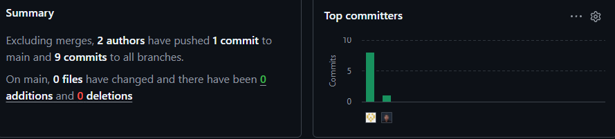 |
| Frontend Web Application | [smartquote-frontend-web](https://github.com/upc-pre-202620-1asi0732-9108-smartquote/smartquote-frontend-web) | 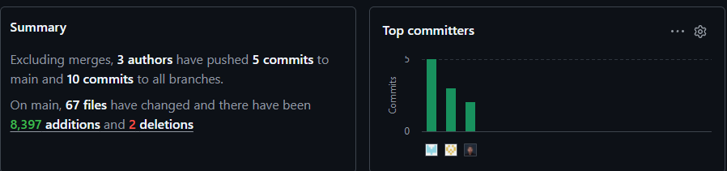 |
| Native Mobile Application | [smartquote-native-mobile](https://github.com/upc-pre-202620-1asi0732-9108-smartquote/smartquote-native-mobile) | 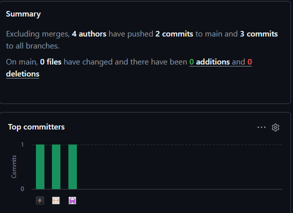 |
| Web Services | [smartquote-web-services](https://github.com/upc-pre-202620-1asi0732-9108-smartquote/smartquote-web-services) | 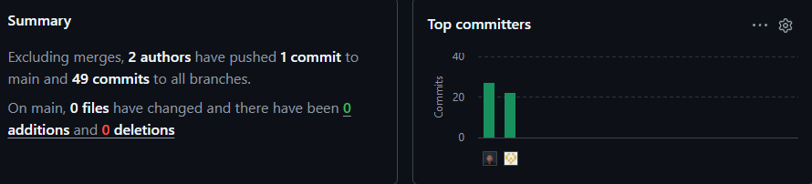 |

## Contenido

- [Student Outcome](#student-outcome)
  - [ABET – EAC - Student Outcome 4](#abet--eac---student-outcome-4)
- [Capítulo I: Introducción](#capítulo-i-introducción)
  - [1.1. Startup Profile](#11-startup-profile)
    - [1.1.1. Descripción de la Startup](#111-descripción-de-la-startup)
    - [1.1.2. Perfiles de integrantes del equipo](#112-perfiles-de-integrantes-del-equipo)
  - [1.2. Solution Profile](#12-solution-profile)
    - [1.2.1. Antecedentes y problemática](#121-antecedentes-y-problemática)
      - [Análisis 5W2H](#análisis-5w2h)
    - [1.2.2. Lean UX Process](#122-lean-ux-process)
      - [1.2.2.1. Lean UX Problem Statements](#1221-lean-ux-problem-statements)
      - [1.2.2.2. Lean UX Assumptions](#1222-lean-ux-assumptions)
        - [Business assumptions](#business-assumptions)
        - [User assumptions](#user-assumptions)
        - [Feature assumptions](#feature-assumptions)
        - [Outcome assumptions](#outcome-assumptions)
      - [1.2.2.3. Lean UX Hypothesis Statements](#1223-lean-ux-hypothesis-statements)
      - [1.2.2.4. Lean UX Canvas](#1224-lean-ux-canvas)
  - [1.3. Segmentos objetivo](#13-segmentos-objetivo)
    - [Segmento 1: Área de Adquisiciones — Analistas y jefes de compras](#segmento-1-área-de-adquisiciones--analistas-y-jefes-de-compras)
    - [Segmento 2: Área de Producción y Sanidad — Médicos veterinarios, nutricionistas y jefes de granja](#segmento-2-área-de-producción-y-sanidad--médicos-veterinarios-nutricionistas-y-jefes-de-granja)
- [Capítulo II: Requirements Elicitation \& Analysis](#capítulo-ii-requirements-elicitation--analysis)
  - [2.1. Competidores](#21-competidores)
    - [2.1.1. Análisis competitivo](#211-análisis-competitivo)
      - [Competitive Analysis Landscape](#competitive-analysis-landscape)
    - [2.1.2. Estrategias y tácticas frente a competidores](#212-estrategias-y-tácticas-frente-a-competidores)
      - [Tácticas de validación](#tácticas-de-validación)
  - [2.2. Entrevistas](#22-entrevistas)
    - [2.2.1. Diseño de entrevistas](#221-diseño-de-entrevistas)
      - [Guion de presentación y consentimiento](#guion-de-presentación-y-consentimiento)
      - [Preguntas de perfil para ambos segmentos](#preguntas-de-perfil-para-ambos-segmentos)
      - [Segmento 1: Área de Adquisiciones — Analistas y jefes de compras](#segmento-1-área-de-adquisiciones--analistas-y-jefes-de-compras-1)
      - [Segmento 2: Área de Producción y Sanidad — Médicos veterinarios, nutricionistas y jefes de granja](#segmento-2-área-de-producción-y-sanidad--médicos-veterinarios-nutricionistas-y-jefes-de-granja-1)
      - [Pregunta de cierre](#pregunta-de-cierre)
    - [2.2.2. Registro de entrevistas](#222-registro-de-entrevistas)
      - [Ficha de registro — Entrevista 1](#ficha-de-registro--entrevista-1)
      - [Ficha de registro — Entrevista 2](#ficha-de-registro--entrevista-2)
      - [Ficha de registro — Entrevista 3](#ficha-de-registro--entrevista-3)
    - [2.2.3. Análisis de entrevistas](#223-análisis-de-entrevistas)
      - [Segmento 1: Área de Adquisiciones (n = 2)](#segmento-1-área-de-adquisiciones-n--2)
      - [Segmento 2: Área de Producción y Sanidad (n = 1)](#segmento-2-área-de-producción-y-sanidad-n--1)
      - [Síntesis comparativa de los segmentos](#síntesis-comparativa-de-los-segmentos)
  - [2.3. Needfinding](#23-needfinding)
    - [2.3.1. User Personas](#231-user-personas)
      - [User Persona — Analista de adquisiciones](#user-persona--analista-de-adquisiciones)
    - [2.3.2. User Task Matrix](#232-user-task-matrix)
    - [2.3.3. User Journey Mapping](#233-user-journey-mapping)
    - [2.3.4. Empathy Mapping](#234-empathy-mapping)
    - [2.3.5. As-is Scenario Mapping](#235-as-is-scenario-mapping)
  - [2.4. Ubiquitous Language](#24-ubiquitous-language)
- [Capítulo III: Requirements Specification](#capítulo-iii-requirements-specification)
  - [3.1. To-Be Scenario Mapping](#31-to-be-scenario-mapping)
  - [3.2. User Stories](#32-user-stories)
  - [3.3. Product Backlog](#33-product-backlog)
  - [3.4. Impact Mapping](#34-impact-mapping)
- [Capítulo IV: Product Design](#capítulo-iv-product-design)
  - [4.1. Style Guidelines](#41-style-guidelines)
    - [4.1.1. General Style Guidelines](#411-general-style-guidelines)
      - [Colores](#colores)
      - [Tipografía](#tipografía)
      - [Branding](#branding)
      - [Espaciado](#espaciado)
      - [Dimensiones para el tono de comunicación y lenguaje aplicado](#dimensiones-para-el-tono-de-comunicación-y-lenguaje-aplicado)
      - [Elementos de diseño](#elementos-de-diseño)
      - [Principios de diseño](#principios-de-diseño)
    - [4.1.2. Web Style Guidelines](#412-web-style-guidelines)
    - [4.1.3. Mobile Style Guidelines](#413-mobile-style-guidelines)
      - [4.1.3.1. iOS Mobile Style Guidelines](#4131-ios-mobile-style-guidelines)
      - [4.1.3.2. Android Mobile Style Guidelines](#4132-android-mobile-style-guidelines)
  - [4.2. Information Architecture](#42-information-architecture)
    - [4.2.1. Organization Systems](#421-organization-systems)
    - [4.2.2. Labeling Systems](#422-labeling-systems)
    - [4.2.3. SEO Tags and Meta Tags](#423-seo-tags-and-meta-tags)
    - [4.2.4. Searching Systems](#424-searching-systems)
    - [4.2.5. Navigation Systems](#425-navigation-systems)
  - [4.3. Landing Page UI Design](#43-landing-page-ui-design)
    - [4.3.1. Landing Page Wireframe](#431-landing-page-wireframe)
        - [Versión Desktop Web Browser](#versión-desktop-web-browser)
        - [Versión Mobile Web Browser](#versión-mobile-web-browser)
    - [4.3.2. Landing Page Mock-up](#432-landing-page-mock-up)
        - [Versión Desktop Web Browser](#versión-desktop-web-browser-1)
        - [Versión Mobile Web Browser](#versión-mobile-web-browser-1)
  - [4.4. Mobile Applications UX/UI Design](#44-mobile-applications-uxui-design)
    - [4.4.1. Mobile Applications Wireframes](#441-mobile-applications-wireframes)
    - [4.4.2. Mobile Applications Wireflow Diagrams](#442-mobile-applications-wireflow-diagrams)
    - [4.4.3. Mobile Applications Mock-ups](#443-mobile-applications-mock-ups)
    - [4.4.4. Mobile Applications User Flow Diagrams](#444-mobile-applications-user-flow-diagrams)
  - [4.5. Mobile Applications Prototyping](#45-mobile-applications-prototyping)
    - [4.5.1. Android Mobile Applications Prototyping](#451-android-mobile-applications-prototyping)
    - [4.5.2. iOS Mobile Applications Prototyping](#452-ios-mobile-applications-prototyping)
  - [4.6. Web Applications UX/UI Design](#46-web-applications-uxui-design)
    - [4.6.1. Web Applications Wireframes](#461-web-applications-wireframes)
      - [Acceso y Configuración (Universal)](#acceso-y-configuración-universal)
        - [Autenticación y Acceso](#autenticación-y-acceso)
      - [Production Specialist](#production-specialist)
        - [Gestión de Solicitudes de Compra](#gestión-de-solicitudes-de-compra)
      - [Purchase Analyst / Purchase Manager (Purchasing Staff)](#purchase-analyst--purchase-manager-purchasing-staff)
        - [Revisión y Avance de Estado](#revisión-y-avance-de-estado)
        - [Gestión de Cotizaciones](#gestión-de-cotizaciones)
        - [Evaluación Comparativa](#evaluación-comparativa)
      - [Purchase Manager (Exclusivo)](#purchase-manager-exclusivo)
        - [Aprobación y Orden de Compra](#aprobación-y-orden-de-compra)
    - [4.6.2. Web Applications Wireflow Diagrams](#462-web-applications-wireflow-diagrams)
      - [Task Flow 1: Registro y Seguimiento de Solicitudes de Compra](#task-flow-1-registro-y-seguimiento-de-solicitudes-de-compra)
      - [Pasos del Task Flow:](#pasos-del-task-flow)
        - [User Goal 1 (US02): Como Production Specialist, quiero registrar una solicitud de insumos desde la operación.](#user-goal-1-us02-como-production-specialist-quiero-registrar-una-solicitud-de-insumos-desde-la-operación)
        - [User Goal 2 (US03): Como Production Specialist, quiero conocer el avance de una solicitud de compra.](#user-goal-2-us03-como-production-specialist-quiero-conocer-el-avance-de-una-solicitud-de-compra)
      - [Segmento: Purchasing Staff (Analyst / Manager)](#segmento-purchasing-staff-analyst--manager)
      - [Task Flow 2: Incorporación y Verificación de Cotizaciones](#task-flow-2-incorporación-y-verificación-de-cotizaciones)
      - [Pasos del Task Flow:](#pasos-del-task-flow-1)
        - [User Goal 3 (US04): Como Purchasing Staff, quiero incorporar cotizaciones de proveedores.](#user-goal-3-us04-como-purchasing-staff-quiero-incorporar-cotizaciones-de-proveedores)
        - [User Goal 4 (US05): Como Purchasing Staff, quiero verificar la información extraída de una cotización.](#user-goal-4-us05-como-purchasing-staff-quiero-verificar-la-información-extraída-de-una-cotización)
      - [Task Flow 3: Evaluación Comparativa de Proveedores](#task-flow-3-evaluación-comparativa-de-proveedores)
      - [Pasos del Task Flow:](#pasos-del-task-flow-2)
        - [User Goal 5 (US06): Como Purchasing Staff, quiero definir los criterios de evaluación de cotizaciones.](#user-goal-5-us06-como-purchasing-staff-quiero-definir-los-criterios-de-evaluación-de-cotizaciones)
        - [User Goal 6 (US07): Como Purchasing Staff, quiero simular y comparar las cotizaciones elegibles.](#user-goal-6-us07-como-purchasing-staff-quiero-simular-y-comparar-las-cotizaciones-elegibles)
      - [Segmento: Purchase Manager](#segmento-purchase-manager)
      - [Task Flow 4: Aprobación y Cierre de Compra](#task-flow-4-aprobación-y-cierre-de-compra)
      - [Pasos del Task Flow:](#pasos-del-task-flow-3)
        - [User Goal 7 (US08): Como Purchase Manager, quiero aprobar la alternativa seleccionada y generar la orden de compra.](#user-goal-7-us08-como-purchase-manager-quiero-aprobar-la-alternativa-seleccionada-y-generar-la-orden-de-compra)
    - [4.6.3. Web Applications Mock-ups](#463-web-applications-mock-ups)
      - [Acceso y Configuración (Universal)](#acceso-y-configuración-universal-1)
        - [Autenticación y Acceso](#autenticación-y-acceso-1)
      - [Production Specialist](#production-specialist-1)
        - [Gestión de Solicitudes de Compra](#gestión-de-solicitudes-de-compra-1)
      - [Purchase Analyst / Purchase Manager (Purchasing Staff)](#purchase-analyst--purchase-manager-purchasing-staff-1)
        - [Revisión y Avance de Estado](#revisión-y-avance-de-estado-1)
        - [Gestión de Cotizaciones](#gestión-de-cotizaciones-1)
        - [Evaluación Comparativa](#evaluación-comparativa-1)
      - [Purchase Manager (Exclusivo)](#purchase-manager-exclusivo-1)
        - [Aprobación y Orden de Compra](#aprobación-y-orden-de-compra-1)
    - [4.6.4. Web Applications User Flow Diagrams](#464-web-applications-user-flow-diagrams)
    - [User Flows](#user-flows)
      - [User Flow 1:](#user-flow-1)
      - [User Flow 2:](#user-flow-2)
      - [User Flow 3:](#user-flow-3)
      - [User Flow 4:](#user-flow-4)
      - [User Flow 5:](#user-flow-5)
      - [User Flow 6:](#user-flow-6)
      - [User Flow 7:](#user-flow-7)
  - [4.7. Web Applications Prototyping](#47-web-applications-prototyping)
  - [4.8. Domain-Driven Software Architecture](#48-domain-driven-software-architecture)
    - [Architecture Overview Diagram](#architecture-overview-diagram)
    - [4.8.1. Software Architecture Context Diagram](#481-software-architecture-context-diagram)
    - [4.8.2. Software Architecture Container Diagrams](#482-software-architecture-container-diagrams)
    - [4.8.3. Software Architecture Components Diagrams](#483-software-architecture-components-diagrams)
      - [Web Services RESTful API (`smartquote-web-services`)](#web-services-restful-api-smartquote-web-services)
        - [Supply Requests Context](#supply-requests-context)
        - [Quotation Intake Context](#quotation-intake-context)
        - [Evaluation \& Simulation Context — Core Domain](#evaluation--simulation-context--core-domain)
        - [Purchase Ordering Context](#purchase-ordering-context)
      - [Web Application (`smartquote-frontend-web`)](#web-application-smartquote-frontend-web)
        - [Supply Requests Context](#supply-requests-context-1)
        - [Quotation Intake Context](#quotation-intake-context-1)
        - [Evaluation \& Simulation Context — Core Domain](#evaluation--simulation-context--core-domain-1)
        - [Purchase Ordering Context](#purchase-ordering-context-1)
      - [Native Mobile Application (`smartquote-native-mobile`)](#native-mobile-application-smartquote-native-mobile)
  - [4.9. Software Object-Oriented Design](#49-software-object-oriented-design)
    - [4.9.1. Class Diagrams](#491-class-diagrams)
      - [4.9.1.1. Supply Requests Context](#4911-supply-requests-context)
      - [4.9.1.2. Quotation Intake Context](#4912-quotation-intake-context)
      - [4.9.1.3. Evaluation \& Simulation Context — Core Domain](#4913-evaluation--simulation-context--core-domain)
      - [4.9.1.4. Purchase Ordering Context](#4914-purchase-ordering-context)
      - [4.9.1.5. Identity \& Access Management Context](#4915-identity--access-management-context)
    - [4.9.2. Class Dictionary](#492-class-dictionary)
      - [Shared (tipos genéricos)](#shared-tipos-genéricos)
        - [`AggregateRoot<TId>`](#aggregateroottid)
        - [`IDomainEvent`](#idomainevent)
        - [`UserId`](#userid)
        - [`Money`](#money)
      - [4.9.2.1. Supply Requests Context](#4921-supply-requests-context)
        - [`PurchaseRequestsController`](#purchaserequestscontroller)
        - [`PurchaseRequestCommandService`](#purchaserequestcommandservice)
        - [`PurchaseRequestQueryService`](#purchaserequestqueryservice)
        - [`IPurchaseRequestRepository`](#ipurchaserequestrepository)
        - [`IRequestNotificationPort`](#irequestnotificationport)
        - [`IPurchaseRequestSnapshotProvider`](#ipurchaserequestsnapshotprovider)
        - [`PurchaseRequestSnapshot`](#purchaserequestsnapshot)
        - [`RequestStatusChangedNotificationHandler`](#requeststatuschangednotificationhandler)
        - [`PurchaseRequest`](#purchaserequest)
        - [`RequestedItem`](#requesteditem)
        - [`TechnicalRequirement`](#technicalrequirement)
        - [`RequestAttachment`](#requestattachment)
        - [`RequestStatusEntry`](#requeststatusentry)
        - [`RequestPriority`](#requestpriority)
        - [`RequestStatus`](#requeststatus)
        - [`ComparisonOperator`](#comparisonoperator)
        - [`PurchaseRequestSubmitted`](#purchaserequestsubmitted)
        - [`PurchaseRequestStatusChanged`](#purchaserequeststatuschanged)
        - [`PostgreSqlPurchaseRequestRepository`](#postgresqlpurchaserequestrepository)
        - [`InAppRequestNotificationAdapter`](#inapprequestnotificationadapter)
      - [4.9.2.2. Quotation Intake Context](#4922-quotation-intake-context)
        - [`PoultryQuotesController`](#poultryquotescontroller)
        - [`QuoteExtractionService`](#quoteextractionservice)
        - [`IPoultryQuoteRepository`](#ipoultryquoterepository)
        - [`IQuoteExtractionAgent`](#iquoteextractionagent)
        - [`IPurchaseRequestReferenceReader`](#ipurchaserequestreferencereader)
        - [`IVerifiedQuotationSnapshotProvider`](#iverifiedquotationsnapshotprovider)
        - [`ExtractionResult`](#extractionresult)
        - [`ExtractedFieldResult`](#extractedfieldresult)
        - [`VerifiedQuotationSnapshot`](#verifiedquotationsnapshot)
        - [`PoultryQuote`](#poultryquote)
        - [`QuotationLine`](#quotationline)
        - [`QuotedSpecification`](#quotedspecification)
        - [`ExtractedField`](#extractedfield)
        - [`FieldCorrection`](#fieldcorrection)
        - [`PurchaseRequestReference`](#purchaserequestreference)
        - [`SupplierReference`](#supplierreference)
        - [`SourceDocument`](#sourcedocument)
        - [`ConfidenceScore`](#confidencescore)
        - [`SourceReference`](#sourcereference)
        - [`ExtractedQuotationData`](#extractedquotationdata)
        - [`QuotationStatus`](#quotationstatus)
        - [`FieldResolutionStatus`](#fieldresolutionstatus)
        - [`QuotationUploaded`](#quotationuploaded)
        - [`QuotationVerified`](#quotationverified)
        - [`PostgreSqlPoultryQuoteRepository`](#postgresqlpoultryquoterepository)
        - [`SemanticKernelAgentConnector`](#semantickernelagentconnector)
        - [`SupplyRequestReferenceAdapter`](#supplyrequestreferenceadapter)
        - [`OpenAIPlatform`](#openaiplatform)
        - [`SupplyRequestsPublicContract`](#supplyrequestspubliccontract)
      - [4.9.2.3. Evaluation \& Simulation Context](#4923-evaluation--simulation-context)
        - [`SimulationsController`](#simulationscontroller)
        - [`ScenarioApplicationService`](#scenarioapplicationservice)
        - [`SimulationApplicationService`](#simulationapplicationservice)
        - [`SimulationValidityService`](#simulationvalidityservice)
        - [`EvaluationInputAssembler`](#evaluationinputassembler)
        - [`IEvaluationScenarioRepository`](#ievaluationscenariorepository)
        - [`ISimulationRunRepository`](#isimulationrunrepository)
        - [`IPurchaseRequestSnapshotReader`](#ipurchaserequestsnapshotreader)
        - [`IVerifiedQuotationSnapshotReader`](#iverifiedquotationsnapshotreader)
        - [`ISimulationDecisionReader`](#isimulationdecisionreader)
        - [`PurchaseRequestSnapshot`](#purchaserequestsnapshot-1)
        - [`VerifiedQuotationSnapshot`](#verifiedquotationsnapshot-1)
        - [`ApprovedSimulationSnapshot`](#approvedsimulationsnapshot)
        - [`EvaluationScenario`](#evaluationscenario)
        - [`EvaluationCriterion`](#evaluationcriterion)
        - [`SimulationRun`](#simulationrun)
        - [`QuotationEvaluation`](#quotationevaluation)
        - [`CriterionResult`](#criterionresult)
        - [`ExclusionReason`](#exclusionreason)
        - [`Recommendation`](#recommendation)
        - [`Score`](#score)
        - [`InputFingerprint`](#inputfingerprint)
        - [`EvaluationDataset`](#evaluationdataset)
        - [`RequestEvaluationSnapshot`](#requestevaluationsnapshot)
        - [`QuotationEvaluationSnapshot`](#quotationevaluationsnapshot)
        - [`SimulationEngine`](#simulationengine)
        - [`CriterionCategory`](#criterioncategory)
        - [`CriterionMode`](#criterionmode)
        - [`ComparisonOperator`](#comparisonoperator-1)
        - [`ScenarioStatus`](#scenariostatus)
        - [`SimulationCompleted`](#simulationcompleted)
        - [`PostgreSqlEvaluationScenarioRepository`](#postgresqlevaluationscenariorepository)
        - [`PostgreSqlSimulationRunRepository`](#postgresqlsimulationrunrepository)
        - [`SupplyRequestSnapshotAdapter`](#supplyrequestsnapshotadapter)
        - [`VerifiedQuotationSnapshotAdapter`](#verifiedquotationsnapshotadapter)
        - [`SupplyRequestsPublicContract`](#supplyrequestspubliccontract-1)
        - [`QuotationIntakePublicContract`](#quotationintakepubliccontract)
      - [4.9.2.4. Purchase Ordering Context](#4924-purchase-ordering-context)
        - [`PurchaseOrdersController`](#purchaseorderscontroller)
        - [`PurchaseOrderApplicationService`](#purchaseorderapplicationservice)
        - [`ApprovedDecisionMapper`](#approveddecisionmapper)
        - [`IPurchaseOrderRepository`](#ipurchaseorderrepository)
        - [`IOrderNumberGenerator`](#iordernumbergenerator)
        - [`ISimulationDecisionReader`](#isimulationdecisionreader-1)
        - [`ApprovedSimulationSnapshot`](#approvedsimulationsnapshot-1)
        - [`PurchaseOrder`](#purchaseorder)
        - [`PurchaseOrderLine`](#purchaseorderline)
        - [`ApprovedPurchaseDecision`](#approvedpurchasedecision)
        - [`ApprovedPurchaseLine`](#approvedpurchaseline)
        - [`SupplierSnapshot`](#suppliersnapshot)
        - [`Approval`](#approval)
        - [`SourceSimulationReference`](#sourcesimulationreference)
        - [`DeliveryTerms`](#deliveryterms)
        - [`OrderNumber`](#ordernumber)
        - [`PurchaseOrderStatus`](#purchaseorderstatus)
        - [`PurchaseOrderGenerator`](#purchaseordergenerator)
        - [`PurchaseOrderIssued`](#purchaseorderissued)
        - [`PostgreSqlPurchaseOrderRepository`](#postgresqlpurchaseorderrepository)
        - [`SequentialOrderNumberGenerator`](#sequentialordernumbergenerator)
      - [4.9.2.5. Identity \& Access Management Context](#4925-identity--access-management-context)
        - [`AccountStatus`](#accountstatus)
        - [`SmartQuoteRole`](#smartquoterole)
        - [`UserAccount`](#useraccount)
        - [`UserRole`](#userrole)
        - [`RefreshSession`](#refreshsession)
        - [`AuthenticationService`](#authenticationservice)
        - [`IUserAccountRepository`](#iuseraccountrepository)
        - [`IRefreshSessionRepository`](#irefreshsessionrepository)
        - [`IPasswordHasher`](#ipasswordhasher)
        - [`IAccessTokenIssuer`](#iaccesstokenissuer)
        - [`IRefreshTokenGenerator`](#irefreshtokengenerator)
        - [`IIdentityAccessUnitOfWork`](#iidentityaccessunitofwork)
        - [`IdentityAccessDbContext`](#identityaccessdbcontext)
        - [`UserAccountRepository`](#useraccountrepository)
        - [`RefreshSessionRepository`](#refreshsessionrepository)
        - [`AspNetPasswordHasher`](#aspnetpasswordhasher)
        - [`JwtAccessTokenIssuer`](#jwtaccesstokenissuer)
        - [`RefreshTokenGenerator`](#refreshtokengenerator)
        - [`IdentityAccessUnitOfWork`](#identityaccessunitofwork)
        - [`AuthController`](#authcontroller)
  - [4.10. Database Design](#410-database-design)
    - [4.10.1. Relational/Non-Relational Database Diagram](#4101-relationalnon-relational-database-diagram)
      - [4.10.1.1. Supply Requests Context](#41011-supply-requests-context)
      - [4.10.1.2. Quotation Intake Context](#41012-quotation-intake-context)
      - [4.10.1.3. Evaluation \& Simulation Context — Core Domain](#41013-evaluation--simulation-context--core-domain)
      - [4.10.1.4. Purchase Ordering Context](#41014-purchase-ordering-context)
- [Capítulo V: Product Implementation](#capítulo-v-product-implementation)
  - [5.1. Software Configuration Management](#51-software-configuration-management)
    - [5.1.1. Software Development Environment Configuration](#511-software-development-environment-configuration)
    - [5.1.2. Source Code Management](#512-source-code-management)
      - [GitFlow Workflow](#gitflow-workflow)
      - [Conventional Commits](#conventional-commits)
      - [Semantic Versioning](#semantic-versioning)
    - [5.1.3. Source Code Style Guide \& Conventions](#513-source-code-style-guide--conventions)
      - [Regla de idioma para código y contratos técnicos](#regla-de-idioma-para-código-y-contratos-técnicos)
    - [5.1.4. Software Deployment Configuration](#514-software-deployment-configuration)
      - [Pipeline de integración y despliegue](#pipeline-de-integración-y-despliegue)
      - [Configuración local de contingencia](#configuración-local-de-contingencia)
  - [5.2. Product Implementation \& Deployment](#52-product-implementation--deployment)
    - [5.2.1. Sprint Backlogs](#521-sprint-backlogs)
      - [5.2.1.1. Sprint 1](#5211-sprint-1)
        - [Sprint Planning 1](#sprint-planning-1)
        - [Aspect Leaders and Collaborators](#aspect-leaders-and-collaborators)
        - [Sprint Backlog 1](#sprint-backlog-1)
    - [5.2.2. Implemented Landing Page Evidence](#522-implemented-landing-page-evidence)
      - [Repositorio de código fuente](#repositorio-de-código-fuente)
      - [Despliegue](#despliegue)
      - [Evidencias principales](#evidencias-principales)
      - [Tabla de commits de implementación](#tabla-de-commits-de-implementación)
    - [5.2.3. Implemented Frontend-Web Application Evidence](#523-implemented-frontend-web-application-evidence)
      - [Repositorio de código fuente](#repositorio-de-código-fuente-1)
      - [Despliegue](#despliegue-1)
      - [Evidencias principales](#evidencias-principales-1)
      - [Tabla de commits de implementación](#tabla-de-commits-de-implementación-1)
    - [5.2.4. Implemented Native-Mobile Application Evidence](#524-implemented-native-mobile-application-evidence)
      - [Repositorio de código fuente](#repositorio-de-código-fuente-2)
      - [Evidencias principales de la aplicación](#evidencias-principales-de-la-aplicación)
      - [Tabla de commits de implementación](#tabla-de-commits-de-implementación-2)
      - [Conexión con los servicios web](#conexión-con-los-servicios-web)
      - [Video de demostración](#video-de-demostración)
    - [5.2.5. Implemented RESTful API and/or Serverless Backend Evidence](#525-implemented-restful-api-andor-serverless-backend-evidence)
      - [Estructura implementada](#estructura-implementada)
      - [Ejecución local y persistencia](#ejecución-local-y-persistencia)
      - [Despliegue en la nube (Azure)](#despliegue-en-la-nube-azure)
      - [Comprobación local observada](#comprobación-local-observada)
      - [Registro de modificaciones del backend](#registro-de-modificaciones-del-backend)
    - [5.2.6. RESTful API documentation](#526-restful-api-documentation)
      - [Acceso y autenticación](#acceso-y-autenticación)
      - [Evidencias de Swagger y OpenAPI](#evidencias-de-swagger-y-openapi)
      - [Convención de respuestas y errores](#convención-de-respuestas-y-errores)
      - [Endpoints — Supply Requests Context](#endpoints--supply-requests-context)
      - [Endpoints — Quotation Intake Context](#endpoints--quotation-intake-context)
      - [Endpoints — Evaluation \& Simulation Context](#endpoints--evaluation--simulation-context)
      - [Endpoints — Purchase Ordering Context](#endpoints--purchase-ordering-context)
      - [Rutas operativas y de documentación](#rutas-operativas-y-de-documentación)
      - [Principales esquemas de respuesta](#principales-esquemas-de-respuesta)
    - [5.2.7. Team Collaboration Insights](#527-team-collaboration-insights)
      - [Landing Page](#landing-page)
      - [Frontend Web Application](#frontend-web-application)
      - [Native Mobile Application](#native-mobile-application)
      - [Web Services](#web-services)
  - [5.3. Video About-the-Product](#53-video-about-the-product)
    - [Enlaces de publicación](#enlaces-de-publicación)
- [Conclusiones](#conclusiones)
  - [Conclusiones y recomendaciones](#conclusiones-y-recomendaciones)
- [Bibliografía](#bibliografía)
- [Anexos](#anexos)
  - [Anexo A. Videos de Exposiciones](#anexo-a-videos-de-exposiciones)

# Student Outcome


## ABET – EAC - Student Outcome 4

**Criterio:** La capacidad de reconocer responsabilidades éticas y profesionales en situaciones de ingeniería y hacer juicios informados, que deben considerar el impacto de las soluciones de ingeniería en contextos globales, económicos, ambientales y sociales.

| Criterio específico | Acciones realizadas | Conclusiones |
|---|---|---|
| 4.c.1 Reconoce responsabilidad ética y profesional en situaciones de ingeniería de software | **Luis Alexis Bardales Tejada** _AV1_: desarrolló el proceso Lean UX, el análisis de competidores, el diseño y registro de entrevistas, su análisis y el Ubiquitous Language; incorporó consentimiento, confidencialidad, fuentes citadas y un vocabulario verificable para representar responsablemente el problema y a sus usuarios.<br><br>**Jhon Danny Guerrero Vasquez**<br>     _AV1_: realizó entrevistas para ambos segmentos y elaboró User Personas, User Task Matrix, User Journey Maps, Empathy Maps y As-Is Scenario Maps; vinculó los hallazgos con las necesidades reales y consideró accesibilidad y contexto operativo en las guías, wireframes, wireflows, mock-ups y prototipos móviles.<br><br>**Mathias Marcelo De La Cruz De Los Santos**<br>_AV1_: realizó entrevistas, escenarios To-Be, Impact Mapping, Style Guidelines, Information Architecture y los artefactos UX/UI de la Landing Page y Web App; aplicó i18n, accesibilidad, tono verificable y una comunicación clara para evitar mensajes engañosos a los usuarios.<br><br>**Fabio Cesar Vallejo Trujillo**<br>_AV1_: definió las User Stories, criterios de aceptación, Product Backlog, arquitectura DDD, diseño de clases y base de datos, configuración de desarrollo y el Sprint Backlog; estableció supervisión humana sobre la recomendación de IA, trazabilidad, controles de acceso, protección de secretos e idempotencia para que las decisiones profesionales no fueran reemplazadas ni quedaran sin evidencia. | En el entregable **AV1**, el equipo reconoció que una solución de adquisiciones con IA debe respetar la autonomía y la confidencialidad de las personas, comunicar la incertidumbre, ser accesible y conservar evidencia de cada decisión. La investigación con usuarios, el diseño inclusivo y la arquitectura con revisión y aprobación humana establecen una base ética y profesional para el desarrollo de SmartQuote. |
| 4.c.2 Emite juicios informados considerando el impacto de las soluciones de ingeniería de software en contextos globales, económicos, ambientales y sociales | **Luis Alexis Bardales Tejada**<br> _AV1_: utilizó entrevistas, Lean UX y el análisis competitivo/FODA para contrastar la propuesta con necesidades y alternativas existentes, priorizando la reducción del trabajo manual, la trazabilidad y la especialización avícola antes de definir el alcance.<br><br>**Jhon Danny Guerrero Vasquez**<br>AV1: transformó la evidencia de las entrevistas en personas, tareas, journeys y mapas de empatía, y la empleó para decidir que el especialista de producción y sanidad requiere una experiencia móvil centrada en registrar solicitudes y anticipar riesgos de abastecimiento.<br><br>**Mathias Marcelo De La Cruz De Los Santos**<br>_AV1_: construyó el To-Be Scenario Mapping y el Impact Map con una meta SMART, y tomó decisiones de diseño, arquitectura de información, responsive, i18n y accesibilidad considerando la adopción de la solución por los segmentos de adquisiciones, producción y sanidad.<br><br>**Fabio Cesar Vallejo Trujillo**<br>_AV1_: priorizó y estimó las historias, y alineó requisitos, arquitectura, modelo de datos, configuración y Sprint Backlog; evaluó los efectos económicos de reducir tiempos y errores de compra, los riesgos técnicos de la extracción con IA, la seguridad de la información y la continuidad operativa mediante modo de contingencia. | En el entregable **AV1**, las decisiones del equipo se sustentaron en entrevistas, competencia, impacto y restricciones técnicas, en lugar de asumir que la automatización era suficiente por sí misma. El alcance resultante considera el contexto global mediante i18n y una arquitectura extensible, el económico mediante menor retrabajo y decisiones trazables, el social mediante roles y accesibilidad, y el ambiental mediante la digitalización y reducción de reprocesos documentales; los riesgos de IA permanecen sujetos a validación humana. |


# Capítulo I: Introducción

## 1.1. Startup Profile

### 1.1.1. Descripción de la Startup

SmartQuote es una startup tecnológica orientada a digitalizar y fortalecer la toma de decisiones en los procesos de adquisición de empresas del sector productivo pecuario. Su primera propuesta se dirige al rubro avícola, donde la disponibilidad oportuna y la conformidad técnica de los insumos son factores relevantes para la continuidad de las operaciones.

El modelo de negocio de SmartQuote es Software como Servicio (SaaS), con acceso mediante membresías periódicas. La plataforma concentra el registro de solicitudes de compra, el tratamiento de cotizaciones de proveedores y la evaluación comparativa de las alternativas recibidas. A partir de criterios técnicos definidos por el personal especializado y de criterios comerciales establecidos por el área de adquisiciones, el sistema busca generar una recomendación trazable para la selección de la mejor alternativa y la preparación de la orden de compra.

El núcleo tecnológico propuesto es un Agente de Inteligencia Artificial (IA) que combina procesamiento de lenguaje natural y extracción de información no estructurada. Este componente permitirá interpretar cotizaciones digitales con formatos distintos, incluidos archivos PDF, identificar los datos relevantes de cada oferta y estructurarlos para su comparación. Entre los atributos que se evaluarán se encuentran las especificaciones técnicas de los insumos, como la composición nutricional de un alimento balanceado o las características de una vacuna veterinaria, además de variables comerciales como precio, cantidad y plazo de entrega.

La solución está concebida como una herramienta de apoyo a la decisión, no como sustituto de la responsabilidad profesional de las áreas involucradas. El Agente de IA contrastará la información extraída con los criterios técnicos y comerciales configurados para cada solicitud, y la plataforma presentará una recomendación y una orden de compra propuesta. El área de adquisiciones conservará la revisión y aprobación de la decisión, mientras que producción y sanidad podrán validar las condiciones técnicas. La viabilidad, precisión y límites de esta capacidad de IA deberán comprobarse durante el desarrollo y la validación con usuarios.

### 1.1.2. Perfiles de integrantes del equipo

<table align="center">
  <thead>
    <tr>
      <th>Foto</th>
      <th>Apellidos y nombres</th>
      <th>Código</th>
      <th>Carrera</th>
      <th>Resumen</th>
    </tr>
  </thead>
  <tbody>
    <tr>
      <td style="text-align: center; vertical-align: top;"></td>
      <td style="vertical-align: top;">Luis Alexis Bardales Tejada</td>
      <td style="vertical-align: top;">u201819276</td>
      <td style="vertical-align: top;">Ingeniería de Software</td>
      <td style="vertical-align: top;">Soy estudiante de octavo ciclo de la carrera de Ingeniería de Software. Me interesa participar en proyectos que combinan el análisis de problemas, el diseño de soluciones y la documentación técnica. Puedo aportar al equipo mis conocimientos en análisis de requisitos, elaboración de documentación y trabajo colaborativo mediante Git y GitHub. Me caracterizo por ser responsable, perseverante, receptivo a la retroalimentación y dispuesto a aprender, cualidades que me permiten colaborar con el equipo y mejorar continuamente la calidad de los entregables.</td>
    </tr>
    <tr>
      <td style="text-align: center; vertical-align: top;"></td>
      <td style="vertical-align: top;">Mathias Marcelo De La Cruz De Los Santos</td>
      <td style="vertical-align: top;">u202424059</td>
      <td style="vertical-align: top;">Ingeniería de Software</td>
      <td style="vertical-align: top;">Soy estudiante de la carrera de Ingeniería de Software y actualmente me encuentro cursando el 7to ciclo de la carrera en la Universidad Peruana de Ciencias Aplicadas. Me considero un fanático de la programación, del futbol y los videojuegos. Considero que puedo aportar al equipo y al proyecto mis conocimientos técnicos, además de considerarme una persona disciplinada, responsable y que valora el trabajo en equipo.</td>
    </tr>
    <tr>
      <td style="text-align: center; vertical-align: top;"></td>
      <td style="vertical-align: top;">Jhon Danny Guerrero Vasquez</td>
      <td style="vertical-align: top;">u202116246</td>
      <td style="vertical-align: top;">Ingeniería de Software</td>
      <td style="vertical-align: top;">Soy estudiante de noveno ciclo de la carrera de Ingeniería de Software. Me encanta los proyectos innovadores y diseñar arquitecturas de sistemas. Estoy capacitado en diferentes areas de conocimientos tales como programación(C++, Python, etc), manejo de bases de datos (relacionales y no relacionales) para apoyar al equipo y organizar adecuadamente el desarrollo del proyecto. Me caracterizo por </td>
    </tr>
    <tr>
      <td style="text-align: center; vertical-align: top;"></td>
      <td style="vertical-align: top;">Fabio Cesar Vallejo Trujillo</td>
      <td style="vertical-align: top;">u20211d989</td>
      <td style="vertical-align: top;">Ingeniería de Software</td>
      <td style="vertical-align: top;">Soy estudiante de séptimo ciclo de Ingeniería de Software. Me caracterizo por tener conocimientos técnicos en múltiples áreas del desarrollo de software y por mantener organizados los equipos de trabajo para asegurar entregables de alta calidad. Puedo aportar al proyecto mis conocimientos de arquitectura limpia, programación y organización del equipo.</td>
    </tr>
  </tbody>
</table>

## 1.2. Solution Profile

### 1.2.1. Antecedentes y problemática

En una empresa avícola, el proceso de adquisición debe articular las necesidades operativas de producción y sanidad con la gestión administrativa y comercial de las compras. Insumos como alimento balanceado, vacunas, medicamentos, material de empaque y otros suministros especializados deben satisfacer condiciones técnicas definidas por profesionales del área de producción, además de criterios como precio, cantidad, disponibilidad y plazo de entrega.

El problema inicial identificado es la dependencia de actividades manuales y dispersas para revisar cotizaciones recibidas en formatos heterogéneos. Esta situación obliga al personal de adquisiciones a trasladar y contrastar información de distintos documentos, coordinar aclaraciones con especialistas técnicos y elaborar cuadros comparativos antes de emitir una orden de compra. Cuando no existe una trazabilidad clara entre la solicitud técnica, las ofertas evaluadas y la decisión final, aumenta el tiempo de atención del proceso y se dificulta justificar por qué se eligió una alternativa determinada.

Además, el personal de adquisiciones no necesariamente dispone del conocimiento especializado para interpretar, por sí solo, especificaciones de sanidad o nutrición animal. A la vez, los responsables de producción y sanidad requieren visibilidad sobre el avance de sus solicitudes para anticipar posibles riesgos de abastecimiento. Por ello, la problemática no se limita al procesamiento de documentos: comprende la coordinación entre áreas, la evaluación consistente de criterios técnicos y comerciales, y la trazabilidad de la decisión de compra.

#### Análisis 5W2H

La técnica 5W2H permite ordenar el problema inicial y explicitar los aspectos que deberán validarse con los segmentos objetivo durante el proceso de investigación.

| Pregunta | Análisis inicial |
|---|---|
| **Who — ¿Quién está afectado?** | Los analistas y jefes de adquisiciones que evalúan cotizaciones, así como los responsables de producción y sanidad que definen las condiciones técnicas de los insumos y dependen de su disponibilidad oportuna. |
| **What — ¿Cuál es el problema?** | La evaluación manual de cotizaciones con formatos y especificaciones distintas puede convertirse en un cuello de botella para comparar alternativas y sustentar la decisión de compra. |
| **Where — ¿Dónde ocurre?** | En la interacción entre el área corporativa de adquisiciones y las áreas operativas de producción y sanidad de las empresas avícolas. |
| **When — ¿Cuándo ocurre?** | Cuando se generan solicitudes de insumos esenciales y se reciben cotizaciones de diversos proveedores que requieren validación técnica y comercial antes de emitir una orden de compra. |
| **Why — ¿Por qué ocurre?** | Porque la información de las cotizaciones suele estar distribuida en documentos con estructuras diferentes y la evaluación exige combinar conocimiento comercial con criterios técnicos propios de la operación avícola. |
| **How — ¿Cómo se atiende actualmente?** | Los dos entrevistados de adquisiciones describen la revisión manual de cotizaciones y su comparación en hojas de cálculo. La coordinación con especialistas técnicos se describirá a partir de entrevistas de producción y sanidad. |
| **How Much — ¿Cuál es el impacto?** | Las demoras o una evaluación insuficiente pueden afectar la planificación de abastecimiento y generar costos operativos. La magnitud económica, los tiempos actuales y los insumos más críticos deberán medirse con información de las empresas entrevistadas. |

SmartQuote propone centralizar este flujo mediante una plataforma que permita registrar solicitudes con criterios técnicos, cargar cotizaciones digitales, estructurar la información relevante mediante un Agente de IA y comparar las alternativas conforme a criterios configurables. El resultado esperado es una recomendación de compra que sirva como base para la revisión, aprobación y generación de la orden de compra. La validación con usuarios permitirá precisar el alcance funcional, los criterios de evaluación prioritarios y los indicadores de mejora del proceso.

### 1.2.2. Lean UX Process

#### 1.2.2.1. Lean UX Problem Statements

El Lean UX Problem Statement expresa las creencias iniciales del equipo sobre el dominio, los usuarios, sus dificultades y la oportunidad de producto. Estas definiciones orientan el aprendizaje y deberán validarse durante las siguientes iteraciones.

| Aspecto obligatorio | Definición para SmartQuote |
|---|---|
| **Domain** | Gestión de solicitudes, cotizaciones, evaluación y decisión de compra de insumos para empresas avícolas. |
| **Customer segments** | Analistas y jefes de adquisiciones, y especialistas de producción y sanidad, incluidos veterinarios, nutricionistas, jefes de granja y personal operativo que solicita o valida insumos. |
| **Pain points** | Adquisiciones: traslado manual de datos, cotizaciones incompletas o ambiguas, alto esfuerzo de comparación y preocupación por la confidencialidad. Producción/sanidad: comunicación fragmentada, solicitudes difíciles de rastrear, aclaraciones por modelos o lenguajes distintos y necesidad de datos claros de cantidad, peso, marca y calidad. |
| **Gap** | No existe un flujo digital único que conecte la necesidad técnica con la cotización, la comparación y la orden. Los canales actuales —ERP, correo, hojas de cálculo, informes y documentos físicos— dejan información fragmentada y dificultan el seguimiento y la justificación de la decisión. |
| **Vision / strategy** | Complementar los sistemas existentes con SmartQuote, una plataforma B2B SaaS que estructura solicitudes, extrae datos de cotizaciones con IA, conserva evidencia y correcciones, simula escenarios ponderados y facilita una aprobación humana trazable. |
| **Initial segment** | Empresas avícolas medianas y grandes, comenzando por sus analistas y jefes de adquisiciones, porque concentran la necesidad de comparar ofertas y conectar la información técnica con la decisión comercial. |

**Problem statement — adquisiciones:** Consideramos que los analistas y jefes de compras de empresas avícolas necesitan comparar ofertas técnicas y comerciales con rapidez, evidencia y control humano. Suponemos que hoy deben transcribir datos de cotizaciones heterogéneas a hojas de cálculo y afrontar información incompleta o ambigua, mientras el requisito y la orden pueden permanecer en sistemas separados. Esta brecha puede aumentar el tiempo de atención y dificultar la justificación de la selección; SmartQuote debe estructurar la información sin reemplazar el ERP ni la responsabilidad profesional.

**Problem statement — producción y sanidad:** Consideramos que los responsables operativos que solicitan o controlan insumos necesitan comunicar cantidad, calidad, destinatario y demás especificaciones en un lenguaje común, además de seguir el avance de la solicitud. Suponemos que los canales jerárquicos y los documentos físicos pueden perderse y que la validación puede pasar por varios filtros antes de la aprobación final. Esta creencia debe validarse con usuarios representativos de producción, sanidad y operación.

#### 1.2.2.2. Lean UX Assumptions

Las suposiciones son premisas de trabajo, no hechos demostrados. Se clasifican por el tipo de decisión que afectan y se vinculan con una validación concreta para reducir la incertidumbre del producto.

##### Business assumptions

- **BA1 — Modelo de negocio:** Creemos que empresas avícolas estarán dispuestas a contratar una membresía B2B SaaS si SmartQuote reduce el esfuerzo y el tiempo de su proceso de adquisiciones. **Validación:** sesiones de validación con decisores y prueba piloto con intención de uso o compra; todavía no es un resultado demostrado.
- **BA2 — Complemento del ecosistema:** Creemos que complementar el ERP, el correo y los procesos existentes será más viable que reemplazarlos, porque las empresas ya disponen de sistemas operativos que deben continuar funcionando. **Validación:** mapear integraciones y pasos de exportación/importación con organizaciones del segmento.
- **BA3 — Costo del problema:** Creemos que las demoras, los errores y la pérdida de trazabilidad tienen un costo operativo suficiente para justificar una solución especializada. **Validación:** medir tiempos, retrabajo, incidencias y costos con datos reales autorizados.

##### User assumptions

- **UA1 — Analistas de adquisiciones:** Creemos que necesitan estructurar y comparar ofertas sin dominar todas las especificaciones técnicas. **Validación:** observar tareas y medir errores, consultas y tiempo de procesamiento durante un piloto.
- **UA2 — Producción, sanidad y operación:** Creemos que necesitan registrar requisitos claros y consultar el avance sin depender de documentos físicos o comunicaciones indirectas. **Validación:** evaluar el flujo con usuarios representativos en su contexto de trabajo.
- **UA3 — Responsables de aprobación:** Creemos que requieren una recomendación explicable, evidencia de origen y control humano antes de autorizar una orden. **Validación:** revisar escenarios de aprobación con responsables reales y verificar que puedan justificar su decisión.

##### Feature assumptions

- **FA1 — Extracción asistida:** Creemos que un agente de IA puede convertir cotizaciones PDF heterogéneas en datos estructurados sin inventar valores ausentes. **Validación:** comparar la salida con una referencia verificada, campo por campo, incluyendo documentos ambiguos.
- **FA2 — Revisión y trazabilidad:** Creemos que mostrar fuente, confianza, valor original y correcciones permitirá al analista resolver excepciones antes de verificar una cotización. **Validación:** prueba de tareas y revisión de auditoría con usuarios.
- **FA3 — Simulación ponderada:** Creemos que criterios obligatorios y pesos configurables permitirán simular prioridades financieras o de emergencia sin ocultar las ofertas no elegibles. **Validación:** ejecutar escenarios con al menos dos cotizaciones verificadas y revisar la explicación del ranking.
- **FA4 — Solicitud móvil:** Creemos que un formulario móvil con requisitos técnicos, adjuntos, historial y notificaciones facilitará la coordinación desde la operación. **Validación:** prueba contextual con personal de campo o almacén.
- **FA5 — Aprobación segura:** Creemos que roles, control de versiones e idempotencia permitirán aprobar una decisión vigente sin duplicar órdenes. **Validación:** pruebas de permisos, concurrencia y repetición de la misma aprobación.

##### Outcome assumptions

- **OA1 — Eficiencia:** Creemos que estructurar y comparar cotizaciones reducirá el tiempo de elaboración del cuadro comparativo frente al proceso manual. **Indicador:** tiempo mediano y número de correcciones antes/después.
- **OA2 — Calidad de la información:** Creemos que los campos normalizados y requisitos claros reducirán aclaraciones y datos incompletos. **Indicador:** aclaraciones por solicitud y campos obligatorios pendientes.
- **OA3 — Confianza y control:** Creemos que evidencia, historial y aprobación humana aumentarán la confianza para utilizar la recomendación. **Indicador:** éxito de tareas y confianza reportada por los participantes.
- **OA4 — Continuidad operativa:** Creemos que el seguimiento digital reducirá el riesgo de perder solicitudes y permitirá anticipar retrasos de abastecimiento. **Indicador:** solicitudes localizables, estados consultados y tiempos de respuesta.

#### 1.2.2.3. Lean UX Hypothesis Statements

Las hipótesis conectan una funcionalidad con un segmento y un resultado observable. Los umbrales propuestos son metas de validación, no métricas ya alcanzadas; la línea base debe medirse con participantes y documentos autorizados.

* **H1 — Extracción de cotizaciones:** **Creemos que** al ofrecer extracción asistida por IA de precios, cantidades, plazos y especificaciones desde PDF heterogéneos **para** analistas de adquisiciones, **lograremos** reducir la transcripción manual sin introducir valores no presentes en el documento. **Sabremos que hemos tenido éxito cuando** el tiempo mediano de estructuración sea menor que la línea base manual y al menos el 90 % de los campos obligatorios de la muestra coincida con la referencia verificada; ambos valores deben medirse en el piloto.

* **H2 — Verificación explicable:** **Creemos que** al mostrar confianza, evidencia de origen, valor original y correcciones **para** analistas y responsables de compras, **lograremos** que puedan detectar excepciones y justificar la selección manteniendo la supervisión humana. **Sabremos que hemos tenido éxito cuando** los participantes localicen la fuente, corrijan un campo ambiguo y expliquen la decisión en una prueba de tareas, registrando tasa de éxito, errores y confianza reportada.

* **H3 — Simulación por escenarios:** **Creemos que** al permitir criterios obligatorios y pesos configurables de precio y plazo **para** el personal de adquisiciones, **lograremos** comparar ofertas con prioridades distintas y una recomendación explicable. **Sabremos que hemos tenido éxito cuando** dos escenarios con pesos diferentes produzcan rankings coherentes con sus reglas, excluyan incumplimientos obligatorios y repitan el mismo resultado cuando las entradas no cambian.

* **H4 — Solicitud y seguimiento operativo:** **Creemos que** al ofrecer un formulario móvil con requisitos técnicos, adjuntos, historial y estados **para** especialistas de producción, sanidad y personal de almacén, **lograremos** reducir aclaraciones y pérdida de solicitudes durante la coordinación con adquisiciones. **Sabremos que hemos tenido éxito cuando** los participantes registren una solicitud completa, identifiquen su responsable y estado, y el piloto muestre menos aclaraciones o solicitudes no localizadas que la línea base.

* **H5 — Aprobación trazable:** **Creemos que** al exigir una simulación vigente, roles autorizados y generación idempotente **para** jefes de compras, **lograremos** emitir una única orden de compra consistente y auditable. **Sabremos que hemos tenido éxito cuando** una aprobación válida genere la orden con sus referencias de origen y repetir la misma solicitud devuelva la orden existente sin crear un duplicado.

#### 1.2.2.4. Lean UX Canvas

El Lean UX Canvas sintetiza las creencias iniciales sobre el problema, los usuarios, los resultados esperados, las soluciones y el aprendizaje prioritario. Ningún resultado de negocio se presenta como logrado: todos deben validarse con experimentos y un piloto.

| Bloque del Lean UX Canvas | Contenido de SmartQuote |
|---|---|
| **1. Business Problem — Problema de negocio** | La compra de insumos avícolas se fragmenta entre informes, correo, ERP, hojas de cálculo y documentos físicos. La transcripción manual, los formatos heterogéneos, la falta de un lenguaje común y la pérdida de solicitudes retrasan la comparación y dificultan justificar la orden de compra. |
| **2. Business Outcomes — Resultados de negocio** | Reducir el tiempo de atención y el retrabajo; disminuir errores, aclaraciones y solicitudes no localizadas; conservar evidencia de criterios, fuentes y aprobaciones; favorecer la adopción de una membresía B2B SaaS. Son objetivos por medir, no resultados alcanzados. |
| **3. Users — Usuarios y clientes** | Cliente: empresas avícolas. Segmento inicial de aprendizaje: analistas y jefes de adquisiciones. Segmento operativo: especialistas de producción y sanidad, incluidos veterinarios, nutricionistas, jefes de granja y personal de almacén. Participan además los jefes de compras como aprobadores. |
| **4. User Outcomes / Benefits — Beneficios para usuarios** | Adquisiciones obtiene cotizaciones estructuradas, comparaciones explicables y una decisión trazable con menos transcripción. Producción, sanidad y almacén registra requisitos claros, consulta responsables y estados y reduce la dependencia de documentos físicos. Los beneficios requieren validación contextual. |
| **5. Solutions — Ideas de solución** | Formulario móvil de solicitudes y requisitos; carga de PDF; extracción asistida por IA con confianza y evidencia; corrección auditable; criterios obligatorios y ponderados para simular escenarios; aprobación humana y orden idempotente; integración gradual con el ERP. |
| **6. Hypotheses — Hipótesis** | H1: extracción verificable reduce la transcripción; H2: evidencia y correcciones permiten justificar la decisión; H3: escenarios ponderados producen rankings coherentes; H4: solicitud y seguimiento digital reducen aclaraciones y pérdidas; H5: aprobación vigente e idempotente evita órdenes duplicadas. Se detallan en la sección 1.2.2.3. |
| **7. What is the most important thing we need to learn first? — Aprendizaje prioritario** | Determinar si SmartQuote extrae con precisión suficiente los campos obligatorios de cotizaciones heterogéneas y si analistas y usuarios operativos confían en la evidencia, el lenguaje común y el flujo de aprobación. También se debe comprender el proceso real de veterinarios, nutricionistas, jefes de granja y personal de almacén. |
| **8. What's the least amount of work we need to do to learn it? — Experimento mínimo** | Ejecutar un piloto pequeño con cotizaciones anonimizadas y autorizadas: comparar tiempo manual frente a extracción asistida, revisar campos y fuentes, configurar dos escenarios de ponderación, registrar una solicitud móvil y observar el seguimiento. Medir precisión, correcciones, aclaraciones, éxito de tareas y repetibilidad antes de ampliar el alcance. |

## 1.3. Segmentos objetivo

SmartQuote se dirige a dos segmentos que participan de forma directa en el ciclo de adquisición de insumos para la producción avícola. Las siguientes caracterizaciones delimitan sus funciones en la propuesta; los rasgos derivados de usuarios se distinguen en el análisis de entrevistas y los artefactos de *needfinding*.

### Segmento 1: Área de Adquisiciones — Analistas y jefes de compras

Este segmento reúne a los usuarios administrativos que gestionan las compras corporativas y que, en determinados casos, también influyen o deciden sobre la selección final del proveedor. Por su intervención directa en la evaluación de cotizaciones, constituye un segmento *Buyer/User Persona*.

| Aspecto | Caracterización del segmento |
|---|---|
| Perfil profesional | Profesionales de administración, ingeniería industrial, comercio exterior o carreras afines, generalmente entre 25 y 50 años, que trabajan en las oficinas administrativas de empresas avícolas medianas. |
| Objetivos | Reducir el tiempo de atención de las solicitudes, comparar propuestas con criterios consistentes, sustentar la elección de un proveedor y disminuir el trabajo manual de consolidación de datos. |
| Necesidades y dificultades | Requieren revisar un volumen considerable de cotizaciones y contrastarlas con condiciones técnicas que no siempre dominan. La revisión manual de documentos y la falta de información estructurada pueden generar retrabajo, demoras y una trazabilidad limitada de la decisión. |
| Relación con SmartQuote | Utilizan la aplicación web para cargar cotizaciones digitales, consultar la información extraída, configurar o aplicar criterios de priorización —como precio, plazo de entrega y cumplimiento técnico—, revisar el cuadro comparativo y generar una orden de compra propuesta. |

### Segmento 2: Área de Producción y Sanidad — Médicos veterinarios, nutricionistas y jefes de granja

Este segmento representa a los usuarios internos que definen o validan las condiciones técnicas de los insumos necesarios para la operación productiva. Constituye un segmento *User Persona*, pues su interacción con la plataforma está centrada en formular y monitorear solicitudes, más que en la negociación comercial con los proveedores.

| Aspecto | Caracterización del segmento |
|---|---|
| Perfil profesional | Médicos veterinarios, zootecnistas, ingenieros agrónomos, nutricionistas o jefes de granja, generalmente entre 28 y 60 años, vinculados a la operación de granjas y centros de producción avícola. |
| Objetivos | Mantener la disponibilidad de insumos adecuados, asegurar que las compras cumplan las especificaciones técnicas y conocer el estado de las solicitudes que respaldan la producción y la sanidad de las aves. |
| Necesidades y dificultades | Necesitan expresar requisitos técnicos de manera precisa —por ejemplo, composición nutricional, presentación, concentración o características sanitarias— y contar con visibilidad del avance de la compra. Las demoras administrativas pueden dificultar la planificación operativa y la atención oportuna de necesidades críticas. |
| Relación con SmartQuote | Utilizan la aplicación móvil para registrar solicitudes desde el entorno operativo, especificar condiciones técnicas, adjuntar información cuando corresponda y monitorear el estado de atención de cada solicitud. También validan que la alternativa seleccionada cumpla las condiciones definidas para el insumo. |

# Capítulo II: Requirements Elicitation & Analysis

## 2.1. Competidores

SmartQuote participa en el mercado de soluciones digitales para la gestión de adquisiciones y evaluación de proveedores. Su propuesta se concentra inicialmente en empresas del sector avícola, donde las cotizaciones deben evaluarse combinando condiciones comerciales con especificaciones técnicas de producción, nutrición y sanidad.

Para este análisis se consideran competidores directos las plataformas que gestionan procesos de abastecimiento, comparación de ofertas y evaluación de proveedores. Asimismo, se consideran competidores indirectos los ERP generalistas y las herramientas con las que el proceso puede desarrollarse manualmente.

**Competidores directos**

- **SAP Ariba Sourcing:** plataforma de abastecimiento estratégico que permite organizar eventos de compra, comparar ofertas, calificar respuestas y colaborar con proveedores.
- **Oracle Fusion Cloud Procurement:** suite que integra compras, sourcing, calificación y gestión de relaciones con proveedores.
- **Coupa:** plataforma de gestión del gasto empresarial que permite gestionar órdenes, proveedores y eventos de sourcing.

**Competidores indirectos**

- **Odoo Purchase:** módulo de compras que permite crear solicitudes de cotización, comparar alternativas y convertir la alternativa seleccionada en una orden de compra.
- **Microsoft Excel y Google Sheets:** herramientas utilizadas para consolidar manualmente precios, cantidades, plazos y características técnicas.
- **Correo electrónico y aplicaciones de mensajería:** canales utilizados para recibir cotizaciones, solicitar aclaraciones y coordinar aprobaciones.
- **ERP desarrollados internamente:** sistemas propios que registran solicitudes y órdenes, pero que no necesariamente interpretan automáticamente las cotizaciones ni evalúan requisitos técnicos.

### 2.1.1. Análisis competitivo

El análisis competitivo permite conocer la posición inicial de SmartQuote frente a plataformas empresariales consolidadas. Se comparan la propuesta de valor, el mercado, el producto, los canales y los factores FODA de la startup y de tres competidores directos.

#### Competitive Analysis Landscape

| ¿Por qué llevar a cabo este análisis? | Objetivo del análisis |
|---|---|
| Pregunta que se busca responder | ¿Cómo puede diferenciarse SmartQuote de las principales plataformas digitales de adquisición mediante su especialización en el sector avícola, la evaluación conjunta de criterios técnicos y comerciales y la trazabilidad de sus recomendaciones? |

| Perfil evaluado | **SmartQuote**<br> | **SAP Ariba Sourcing**<br> | **Oracle Fusion Cloud Procurement**<br> | **Coupa**<br> |
|---|---|---|---|---|
| **Perfil - Overview** | Startup SaaS orientada a digitalizar la evaluación de cotizaciones y apoyar la selección de proveedores en empresas pecuarias, inicialmente avícolas. | Solución cloud de abastecimiento estratégico para gestionar eventos, ofertas, adjudicaciones y colaboración con proveedores. | Suite cloud que integra compras, sourcing, calificación y gestión de proveedores dentro del ecosistema Oracle. | Plataforma de gestión del gasto que conecta sourcing, compras, proveedores, órdenes y control del gasto empresarial. |
| **Perfil - Ventaja competitiva: ¿qué valor ofrece a los clientes?** | Especialización en requisitos técnicos avícolas; extracción de datos desde cotizaciones heterogéneas; comparación comercial y técnica; recomendación trazable con aprobación humana. | Escala global, red extensa de proveedores, automatización e integración con soluciones SAP y de terceros. | Integración de datos y procesos de adquisiciones, finanzas, logística y cadena de suministro en una misma suite. | Visibilidad integral del gasto y colaboración digital entre compradores y proveedores dentro de una plataforma madura. |
| **Perfil de Marketing - Mercado objetivo** | Empresas avícolas medianas; analistas y jefes de adquisiciones; médicos veterinarios, nutricionistas y responsables de producción y sanidad. | Empresas medianas y grandes con procesos formales de abastecimiento y redes amplias de proveedores. | Organizaciones medianas y grandes que utilizan o buscan integrar aplicaciones empresariales Oracle. | Empresas medianas y grandes que requieren controlar compras, proveedores y gasto corporativo. |
| **Perfil de Marketing - Estrategias de marketing** | Pilotos con empresas avícolas, demostraciones del flujo, contenido especializado, alianzas con profesionales del sector y adopción progresiva por suscripción. | Venta empresarial consultiva, demostraciones, red de socios, casos de éxito y promoción conjunta con el ecosistema SAP. | Venta B2B, demostraciones, socios de implementación y venta cruzada con ERP, SCM y otras aplicaciones Oracle. | Demostraciones empresariales, contenido sobre gestión del gasto, casos de clientes, eventos y ecosistema de socios. |
| **Perfil de Producto - Productos y servicios** | Aplicación web para adquisiciones; aplicación móvil para producción y sanidad; registro de solicitudes; carga e interpretación de cotizaciones; matriz comparativa; validación y orden de compra propuesta. | Sourcing estratégico, eventos RFx, evaluación de ofertas, gestión de proveedores, contratos, análisis de gasto y SAP Business Network. | Purchasing, Sourcing, Supplier Qualification Management, Self Service Procurement y portal de proveedores. | Sourcing, procurement, gestión de proveedores, órdenes, facturación y analítica del gasto. |
| **Perfil de Producto - Precios y costos** | Modelo SaaS por membresía periódica. Los precios definitivos quedan pendientes de validación con clientes y del alcance de cada plan. | Precio mediante cotización comercial, condicionado por módulos, usuarios, volumen e implementación. | Precio mediante cotización comercial según módulos, usuarios, servicios e integración requerida. | Precio mediante cotización comercial de acuerdo con módulos, usuarios y alcance de implementación. |
| **Perfil de Producto - Canales de distribución** | Aplicación web para adquisiciones y aplicación móvil nativa para producción y sanidad; atención directa y futura API de integración. | Aplicación web cloud, aplicaciones móviles, SAP Business Network e integraciones empresariales. | Aplicación web cloud, experiencia móvil e integraciones con Oracle Fusion y servicios empresariales. | Aplicación web cloud, portal de proveedores, acceso móvil e integraciones con sistemas empresariales. |
| **Análisis SWOT - Fortalezas** | Especialización avícola; criterios técnicos y comerciales; flujo entre áreas; trazabilidad; supervisión humana; experiencia web y móvil diferenciada por rol. | Marca reconocida; red global; amplitud funcional; capacidades de sourcing e integración; experiencia empresarial. | Integración con finanzas y cadena de suministro; amplitud funcional; infraestructura global; gestión integral de proveedores. | Cobertura del ciclo de gasto; experiencia consolidada; colaboración con proveedores; analítica e integración. |
| **Análisis SWOT - Debilidades** | Producto nuevo; precisión aún no validada; pocas integraciones iniciales; menor reconocimiento y cobertura funcional. | Complejidad de adopción e implementación para empresas con procesos pequeños; solución amplia para una necesidad especializada. | Implementación y configuración de alcance empresarial; dependencia del ecosistema y conocimiento especializado. | Alcance amplio y configuración empresarial frente a un problema sectorial específico; precio no publicado. |
| **Análisis SWOT - Oportunidades** | Digitalización del sector pecuario; documentos no estructurados; necesidad de trazabilidad; expansión a otros sectores e integración con ERP. | Mayor automatización del abastecimiento; expansión de redes digitales; incorporación de IA y analítica en decisiones de compra. | Migración de procesos empresariales a la nube; adopción de IA; demanda de integración entre compras y operaciones. | Crecimiento de la gestión digital del gasto; automatización; fortalecimiento de portales y redes de proveedores. |
| **Análisis SWOT - Amenazas** | Entrada de competidores consolidados al nicho; resistencia al cambio; preocupación por confidencialidad; errores de extracción o recomendación. | Competencia de otras suites source-to-pay; presión por costos; clientes que prefieren soluciones más simples o especializadas. | Competencia de SAP, Coupa y ERP flexibles; complejidad de migración; preferencia por soluciones modulares. | Competencia de suites ERP y plataformas especializadas; presión por demostrar retorno de inversión; cambios en expectativas de IA. |

El Landscape evidencia que SAP Ariba, Oracle Procurement y Coupa poseen mayor alcance, reconocimiento e integración empresarial. SmartQuote no debe competir por cantidad de módulos, sino por resolver con menor complejidad un problema concreto: transformar cotizaciones heterogéneas en una comparación que combine requisitos comerciales y técnicos del sector avícola y conserve evidencia de la decisión.

### 2.1.2. Estrategias y tácticas frente a competidores

A partir del análisis competitivo y del FODA, se plantean estrategias ofensivas, adaptativas, defensivas y de supervivencia. Cada estrategia combina factores internos de SmartQuote con las condiciones del mercado.

| Competidor | Fortaleza que SmartQuote debe afrontar | Debilidad u oportunidad aprovechable | Respuesta estratégica de SmartQuote |
|---|---|---|---|
| SAP Ariba Sourcing | Marca, red global, automatización e integración empresarial | Amplitud y complejidad superiores a las requeridas por una empresa que busca resolver un flujo sectorial concreto | Especialización avícola, adopción progresiva, configuración reducida y acompañamiento directo |
| Oracle Fusion Cloud Procurement | Integración de adquisiciones con finanzas, logística y cadena de suministro | Implementación empresarial y dependencia de una suite amplia | Funcionamiento complementario, exportación de datos e integración gradual sin reemplazar el ERP |
| Coupa | Cobertura integral del gasto y colaboración con proveedores | Propuesta generalista frente a requisitos técnicos pecuarios | Plantillas de insumos, evaluación técnica especializada y participación directa de producción y sanidad |

Las oportunidades comunes son la digitalización del abastecimiento, el tratamiento de documentos heterogéneos y la necesidad de decisiones trazables. Las amenazas principales son la entrada de plataformas consolidadas al nicho, la resistencia al cambio y la desconfianza frente a recomendaciones automáticas.

| Tipo | Estrategia | Tácticas |
|---|---|---|
| **FO: Fortalezas–Oportunidades** | Aprovechar la especialización para atender la digitalización de las compras avícolas | Crear plantillas para alimento balanceado, vacunas, medicamentos y otros insumos; configurar criterios técnicos por categoría; presentar comparaciones comerciales y técnicas en una matriz |
| **FO: Fortalezas–Oportunidades** | Utilizar la IA para disminuir actividades manuales | Extraer proveedor, producto, precio, cantidad, plazo y especificaciones; mostrar el documento de origen; generar una recomendación preliminar |
| **FO: Fortalezas–Oportunidades** | Fortalecer la colaboración entre adquisiciones y las áreas técnicas | Permitir que producción y sanidad registren requisitos; enviar solicitudes de validación; mantener comentarios y estados visibles |
| **DO: Debilidades–Oportunidades** | Validar el producto mediante pilotos controlados | Iniciar con pocos usuarios y categorías; utilizar cotizaciones reales autorizadas; medir tiempo, errores, correcciones y satisfacción |
| **DO: Debilidades–Oportunidades** | Desarrollar integraciones progresivamente | Comenzar con exportaciones CSV y PDF; diseñar posteriormente una API para solicitudes, proveedores, cotizaciones y órdenes |
| **DO: Debilidades–Oportunidades** | Mejorar la precisión de la IA mediante retroalimentación | Permitir correcciones; registrar los cambios; identificar los campos y formatos que generan más errores |
| **FA: Fortalezas–Amenazas** | Diferenciarse mediante especialización y facilidad de uso | Evitar funciones ajenas al problema inicial; ofrecer pantallas según el rol; reducir la configuración necesaria |
| **FA: Fortalezas–Amenazas** | Construir confianza mediante trazabilidad y supervisión humana | Mostrar la fuente de cada dato; registrar revisiones y aprobaciones; impedir que la IA emita automáticamente una orden definitiva |
| **FA: Fortalezas–Amenazas** | Proteger la información comercial y técnica | Aplicar permisos por rol; restringir el acceso a cotizaciones; mantener un historial de acciones |
| **DA: Debilidades–Amenazas** | Evitar competir directamente con el alcance completo de un ERP | Posicionar SmartQuote como herramienta especializada que complementa los sistemas existentes |
| **DA: Debilidades–Amenazas** | Limitar el alcance inicial | Priorizar solicitud, carga, extracción, comparación, validación y orden propuesta; postergar funciones avanzadas |
| **DA: Debilidades–Amenazas** | Mantener una contingencia frente a errores de IA | Permitir ingreso manual; advertir cuando un dato tenga baja confianza; solicitar revisión cuando falten campos obligatorios |

#### Tácticas de validación

| Indicador | Forma de medición | Meta inicial propuesta |
|---|---|---|
| Tiempo de elaboración del cuadro comparativo | Comparar el proceso manual con el proceso apoyado por SmartQuote | Reducir el tiempo respecto de la línea base obtenida en entrevistas |
| Precisión de extracción | Dividir los campos correctamente extraídos entre el total evaluado | Alcanzar al menos 90 % en los campos obligatorios del piloto |
| Correcciones por cotización | Contar las modificaciones realizadas por los usuarios | Reducirlas progresivamente durante las iteraciones |
| Trazabilidad | Verificar documentos, criterios y responsables asociados | Lograr trazabilidad completa en los casos del piloto |
| Satisfacción | Aplicar una escala de 1 a 5 después de probar el flujo | Obtener un promedio mínimo de 4 |
| Adopción | Comparar solicitudes procesadas en SmartQuote con el total del piloto | Incrementar el porcentaje durante cada iteración |

Estas metas son objetivos de validación y no resultados alcanzados. Deberán confirmarse o modificarse mediante entrevistas y pruebas con usuarios.

La estrategia competitiva de SmartQuote no consiste solamente en utilizar inteligencia artificial, pues otras plataformas también incorporan automatización. Su diferenciación se encuentra en aplicar esta tecnología a las adquisiciones avícolas, combinar criterios técnicos y comerciales y mantener evidencia trazable para apoyar la decisión profesional.

## 2.2. Entrevistas

Esta sección presenta el diseño de entrevistas para los dos segmentos objetivo y los registros disponibles del área de adquisiciones. Sus resúmenes sustentan el análisis de ese segmento. Los resultados de producción y sanidad se incorporarán cuando se registren sus entrevistas.

### 2.2.1. Diseño de entrevistas

Las entrevistas serán semiestructuradas y tendrán una duración aproximada de 15 a 25 minutos. Se utilizarán preguntas principales para mantener consistencia entre participantes y preguntas complementarias para profundizar en experiencias relevantes. Antes de iniciar, se explicará el propósito académico de la investigación y se solicitará autorización para registrar la sesión en video.

#### Guion de presentación y consentimiento

Buenos días/tardes. Somos estudiantes de Ingeniería de Software de la Universidad Peruana de Ciencias Aplicadas. Estamos investigando el proceso de adquisición de insumos en empresas del sector avícola para validar una propuesta denominada SmartQuote. La entrevista tiene fines académicos y durará aproximadamente entre 15 y 25 minutos. La información se empleará para analizar necesidades y construir perfiles de usuario. No se publicará información confidencial de la empresa. ¿Autoriza el registro en video de esta entrevista y el uso académico de sus respuestas?

#### Preguntas de perfil para ambos segmentos

Estas preguntas permitirán recolectar las características objetivas y subjetivas necesarias para construir los User Personas. El participante podrá omitir cualquier información personal que no desee compartir.

| N.º | Tipo | Pregunta principal | Preguntas complementarias |
|---|---|---|---|
| P1 | Objetiva | ¿Podría indicarnos sus nombres, apellidos, edad, género y distrito de residencia? | ¿Autoriza que estos datos aparezcan en el informe o prefiere ser identificado mediante un código? |
| P2 | Objetiva | ¿Cuál es su nivel de estudios, profesión y ocupación actual? | ¿En qué área trabaja y cuántos años de experiencia tiene? |
| P3 | Objetiva | ¿Cuál es su estado civil y cómo está conformada su familia? | ¿Sus responsabilidades familiares influyen en sus horarios o en la forma en que utiliza la tecnología? |
| P4 | Subjetiva | ¿Cómo describiría su personalidad y su manera de trabajar? | ¿Se considera una persona analítica, práctica, organizada, colaborativa, cautelosa o abierta al cambio? ¿Por qué? |
| P5 | Subjetiva | ¿Cuáles considera que son sus principales habilidades profesionales? | ¿Qué habilidad utiliza con mayor frecuencia al tomar decisiones o coordinar con otras personas? |
| P6 | Subjetiva | ¿Cuáles son sus principales objetivos profesionales? | ¿Qué resultado considera exitoso al completar una compra o atender una solicitud? |
| P7 | Subjetiva | ¿Qué situaciones le producen mayor frustración durante su trabajo? | ¿Qué suele hacer cuando se presenta una demora, error o falta de información? |
| P8 | Subjetiva | ¿Qué personas, marcas, medios o fuentes influyen en sus decisiones profesionales? | ¿Consulta a colegas, proveedores, asociaciones, redes sociales o páginas especializadas? |
| P9 | Objetiva | ¿Qué dispositivos utiliza habitualmente durante su trabajo? | ¿Utiliza computadora, teléfono o tableta? ¿Qué sistema operativo y navegador prefiere? |
| P10 | Objetiva | ¿Qué aplicaciones y canales digitales utiliza con mayor frecuencia? | ¿Utiliza correo, WhatsApp, Microsoft Teams, ERP, Excel, Google Workspace u otras herramientas? |
| P11 | Subjetiva | ¿Qué tan cómodo se siente aprendiendo una nueva herramienta digital? | ¿Prefiere tutoriales, capacitación, ayuda de un compañero o aprender de manera autónoma? |
| P12 | Subjetiva | ¿Podría resumir su trayectoria y cómo llegó a desempeñar su función actual? | ¿Qué experiencias han influido más en su forma de trabajar y tomar decisiones? |

#### Segmento 1: Área de Adquisiciones — Analistas y jefes de compras

**Objetivo:** comprender cómo se reciben, revisan y comparan las cotizaciones; cómo se coordina la validación técnica; y qué dificultades enfrentan los responsables de adquisiciones antes de seleccionar un proveedor.

| N.º | Tipo | Pregunta principal | Preguntas complementarias |
|---|---|---|---|
| A1 | Objetiva | ¿Qué responsabilidades tiene dentro del proceso de adquisición? | ¿En qué etapas participa y qué decisiones puede aprobar? |
| A2 | Objetiva | ¿Cuántas solicitudes y cotizaciones procesa aproximadamente por semana o mes? | ¿La cantidad cambia según la temporada o el tipo de insumo? |
| A3 | Objetiva | ¿Cómo recibe actualmente las solicitudes de compra? | ¿Las recibe mediante ERP, formularios, correo, llamadas o mensajería? |
| A4 | Objetiva | ¿Qué herramientas utiliza para registrar solicitudes y comparar cotizaciones? | ¿Utiliza Excel, Google Sheets, ERP u otra aplicación? ¿Debe trasladar información manualmente? |
| A5 | Objetiva | ¿Qué información compara normalmente entre proveedores? | ¿Considera precio, cantidad, disponibilidad, plazo, condiciones de pago, marca y cumplimiento técnico? |
| A6 | Objetiva | ¿Cuánto tiempo necesita para preparar un cuadro comparativo? | ¿Qué actividad consume más tiempo? ¿Con qué frecuencia debe corregir o rehacer la comparación? |
| A7 | Subjetiva | ¿Cuál es la parte más difícil o frustrante del proceso? | ¿Puede describir una situación reciente y las consecuencias que produjo? |
| A8 | Objetiva | ¿Cómo solicita la validación de producción, sanidad u otros especialistas? | ¿Por qué canal se comunican? ¿Cómo conserva la evidencia de la aprobación? |
| A9 | Subjetiva | ¿Qué tan sencillo es justificar por qué se eligió a un proveedor? | ¿Quién solicita esa justificación y qué documentos debe presentar? |
| A10 | Objetiva | ¿Qué ocurre cuando una cotización contiene información incompleta o ambigua? | ¿Contacta al proveedor? ¿Cuánto retrasa el proceso? |
| A11 | Subjetiva | ¿Qué opinión tendría de una herramienta que extraiga información de las cotizaciones mediante inteligencia artificial? | ¿Qué tendría que mostrarle para que confíe en el resultado? ¿Qué información siempre revisaría manualmente? |
| A12 | Subjetiva | ¿Qué funciones considera indispensables en SmartQuote? | ¿Qué función no utilizaría? ¿Preferiría acceder mediante web, móvil o ambos canales? |
| A13 | Objetiva | ¿Qué restricciones existen para cargar documentos comerciales en una plataforma? | ¿Se requieren permisos, confidencialidad, auditoría o almacenamiento dentro de la empresa? |
| A14 | Subjetiva | Si SmartQuote redujera el trabajo manual, ¿qué beneficio sería más importante? | ¿Rapidez, reducción de errores, trazabilidad, coordinación o ahorro? ¿Por qué? |

#### Segmento 2: Área de Producción y Sanidad — Médicos veterinarios, nutricionistas y jefes de granja

**Objetivo:** comprender cómo se originan las necesidades de insumos, qué especificaciones técnicas deben comunicarse, cómo se valida una alternativa y qué información necesitan los responsables operativos para hacer seguimiento a sus solicitudes.

| N.º | Tipo | Pregunta principal | Preguntas complementarias |
|---|---|---|---|
| T1 | Objetiva | ¿Qué relación tiene su cargo con la solicitud o validación de insumos? | ¿Qué tipos de insumos solicita o revisa con mayor frecuencia? |
| T2 | Objetiva | ¿Cómo comunica actualmente una necesidad al área de adquisiciones? | ¿Utiliza formatos, ERP, correo, llamadas o mensajería? |
| T3 | Objetiva | ¿Qué datos técnicos debe contener una solicitud para evitar errores? | ¿Incluye composición, concentración, presentación, marca, lote, vencimiento o condiciones de almacenamiento? |
| T4 | Objetiva | ¿Con qué frecuencia una solicitud requiere aclaraciones? | ¿Qué información suele faltar o ser interpretada incorrectamente? |
| T5 | Subjetiva | ¿Qué dificultades experimenta al hacer seguimiento a una solicitud? | ¿Puede conocer su estado o debe contactar personalmente al área de adquisiciones? |
| T6 | Objetiva | ¿Cómo valida que una cotización cumpla las condiciones técnicas? | ¿Recibe el documento completo, un resumen o solamente una consulta? |
| T7 | Subjetiva | ¿Qué consecuencias puede producir la compra tardía o incorrecta de un insumo? | ¿Cómo puede afectar la producción, sanidad, costos o planificación? |
| T8 | Subjetiva | ¿Qué información necesita para aprobar o rechazar una alternativa? | ¿Necesita comparar documentos, especificaciones, certificados o antecedentes del proveedor? |
| T9 | Objetiva | ¿Qué insumos o decisiones requieren obligatoriamente aprobación profesional? | ¿Quién debe aprobarlos y cómo se registra actualmente esa decisión? |
| T10 | Subjetiva | ¿Utilizaría una aplicación móvil para registrar y monitorear solicitudes? | ¿En qué lugar la utilizaría y qué acciones debería realizar rápidamente? |
| T11 | Subjetiva | ¿Qué nivel de confianza tendría en una recomendación generada mediante inteligencia artificial? | ¿Qué información necesitaría verificar manualmente antes de aceptarla? |
| T12 | Objetiva | ¿Qué restricciones tecnológicas existen en su entorno de trabajo? | ¿Cuenta siempre con conexión a internet? ¿Utiliza el teléfono mientras se encuentra en granja o campo? |
| T13 | Subjetiva | ¿Qué cambio mejoraría más la coordinación con adquisiciones? | ¿Alertas, estados, comentarios, formatos técnicos o tiempos de respuesta? |
| T14 | Subjetiva | ¿Qué funciones considera indispensables en SmartQuote? | ¿Qué función le resultaría innecesaria o difícil de utilizar? |

#### Pregunta de cierre

Para finalizar, ¿existe algún problema, necesidad o experiencia relacionada con el proceso de adquisición que no hayamos mencionado? Muchas gracias por su participación.

### 2.2.2. Registro de entrevistas

#### Ficha de registro — Entrevista 1

| Elemento del registro | Información de la entrevista |
|---|---|
| **Nombres y apellidos** | Diego De la Cruz |
| **Edad** | 24 |
| **Distrito de residencia** | Santiago de Surco |
| **Segmento objetivo** | Analista de Compras |
| **Fecha de realización** | 14/09/26 |
| **Captura de pantalla (screenshot)** | |
| **Enlace (URL)** | [Ver entrevista completa en Microsoft Stream](<https://upcedupe-my.sharepoint.com/:v:/g/personal/u20211d989_upc_edu_pe/IQAiY-EXwg1tQoKo-0XOzT0QASvKovIdOAC29CvAAs7HmdY?nav=eyJyZWZlcnJhbEluZm8iOnsicmVmZXJyYWxBcHAiOiJPbmVEcml2ZUZvckJ1c2luZXNzIiwicmVmZXJyYWxBcHBQbGF0Zm9ybSI6IldlYiIsInJlZmVycmFsTW9kZSI6InZpZXciLCJyZWZlcnJhbFZpZXciOiJNeUZpbGVzTGlua0NvcHkifX0&e=dJ3lPz>) |
| **Minutaje (timing)** | **Inicio:** 00:00:10<br>**Fin:** 00:07:44<br>**Duración:** 00:07:34 |
| **Resumen descriptivo y recolección de datos** | Diego De la Cruz, analista de compras, realiza cotizaciones y gestiona el proceso de compras y ventas apoyándose en el ERP SAP HANA, donde se registran los requerimientos y se formalizan las órdenes. Sin embargo, el tramo intermedio —comparar las ofertas que llegan de distintos proveedores— lo resuelve fuera del sistema, trasladando manualmente precios, disponibilidad y especificaciones técnicas a hojas de cálculo, lo que le consume varias horas por cada requerimiento. Su mayor reto y causa de retrasos es lidiar con cotizaciones incompletas o ambiguas, por lo que considera que una plataforma web con inteligencia artificial como "SmartQuote" sería sumamente útil para automatizar la extracción de datos, ahorrar tiempo y reducir errores. Precisa que la herramienta no debería reemplazar al ERP, sino integrarse con él para recibir el requerimiento y devolver la decisión ya sustentada. Para confiar en esta herramienta y garantizar su éxito, el sistema deberá proteger estrictamente la confidencialidad de la información comercial y mostrar de forma transparente el origen de cada dato extraído, permitiéndole mantener la supervisión final sobre las especificaciones técnicas y la elección del proveedor. |

#### Ficha de registro — Entrevista 2

| Elemento del registro | Información de la entrevista |
|---|---|
| **Nombres y apellidos** | Andy Nuñez |
| **Edad** | 27 |
| **Distrito de residencia** | San Borja |
| **Segmento objetivo** | Área de Adquisiciones |
| **Fecha de realización** | 14/09/26 |
| **Captura de pantalla (screenshot)** |  |
| **Enlace (URL)** | [Ver entrevista completa en Microsoft Stream](<https://upcedupe-my.sharepoint.com/:v:/g/personal/u20211d989_upc_edu_pe/IQAiY-EXwg1tQoKo-0XOzT0QASvKovIdOAC29CvAAs7HmdY?nav=eyJyZWZlcnJhbEluZm8iOnsicmVmZXJyYWxBcHAiOiJPbmVEcml2ZUZvckJ1c2luZXNzIiwicmVmZXJyYWxBcHBQbGF0Zm9ybSI6IldlYiIsInJlZmVycmFsTW9kZSI6InZpZXciLCJyZWZlcnJhbFZpZXciOiJNeUZpbGVzTGlua0NvcHkifX0&e=dJ3lPz>) |
| **Minutaje (timing)** | **Inicio:** 00:07:45<br>**Fin:** 00:16:50<br>**Duración:** 00:09:05 |
| **Resumen descriptivo y recolección de datos** | Andy Núñez, del área de adquisiciones, gestiona el proceso de compras utilizando principalmente correo y Excel, invirtiendo varias horas en trasladar datos manualmente para elaborar cuadros comparativos de precios, disponibilidad y especificaciones técnicas. Su mayor reto y causa de retrasos es lidiar con cotizaciones incompletas o ambiguas, por lo que considera que una plataforma web con inteligencia artificial como "Smart Quote" sería sumamente útil para automatizar la extracción de datos, ahorrar tiempo y reducir errores. Para confiar en esta herramienta y garantizar su éxito, el sistema deberá proteger estrictamente la confidencialidad de la información comercial y mostrar de forma transparente el origen de cada dato extraído, permitiéndole mantener la supervisión final sobre las especificaciones técnicas y la elección del proveedor. |

#### Ficha de registro — Entrevista 3

| Elemento del registro | Información de la entrevista |
|---|---|
| **Nombres y apellidos** | Joel Martínez |
| **Edad** | 25 |
| **Distrito de residencia** | Chorrillos |
| **Segmento objetivo** | Área de Producción y Sanidad |
| **Fecha de realización** | 16/09/26 |
| **Captura de pantalla (screenshot)** |  |
| **Enlace (URL)** | [Ver entrevista completa en Microsoft Stream](<https://upcedupe-my.sharepoint.com/:v:/g/personal/u20211d989_upc_edu_pe/IQAiY-EXwg1tQoKo-0XOzT0QASvKovIdOAC29CvAAs7HmdY?nav=eyJyZWZlcnJhbEluZm8iOnsicmVmZXJyYWxBcHAiOiJPbmVEcml2ZUZvckJ1c2luZXNzIiwicmVmZXJyYWxBcHBQbGF0Zm9ybSI6IldlYiIsInJlZmVycmFsTW9kZSI6InZpZXciLCJyZWZlcnJhbFZpZXciOiJNeUZpbGVzTGlua0NvcHkifX0&e=dJ3lPz>) |
| **Minutaje (timing)** | **Inicio:** 00:16:55<br>**Fin:** 00:21:12<br>**Duración:** 00:04:17 |
| **Resumen descriptivo y recolección de datos** | Joel Martínez trabaja en el área de almacén y participa en la evaluación de la calidad de los productos antes de su distribución. Explica que las necesidades de su área se comunican mediante un informe al jefe, quien luego las deriva a las demás áreas, por lo que no existe una comunicación directa y ágil. Considera indispensable que las solicitudes especifiquen claramente la cantidad, el peso, la marca, la calidad requerida, el destinatario y el volumen solicitado. Señala que las aclaraciones son frecuentes porque las áreas utilizan modelos y lenguajes distintos, y que el seguimiento se dificulta cuando las solicitudes físicas se traspapelan. La validación de una cotización pasa por filtros de supervisión y por la recomendación del jefe del área antes de regresar a gerencia para la decisión final. Advierte que una compra tardía o incorrecta puede generar pérdidas económicas importantes y retrasar las ventas. Como mejora, propone digitalizar el flujo y estandarizar los modelos y el vocabulario entre áreas para que todos trabajen con información objetiva, consistente y puntual. |

### 2.2.3. Análisis de entrevistas

El análisis integra las entrevistas N.º 1 (Diego De la Cruz) y N.º 2 (Andy Núñez), del segmento **adquisiciones**, y la entrevista N.º 3 (Joel Martínez), del segmento **producción y sanidad**. Los porcentajes se calculan dentro de cada segmento —n = 2 para adquisiciones y n = 1 para producción y sanidad—; no son estimaciones representativas del mercado. En las entrevistas 1 y 2 se analizan los resúmenes registrados, mientras que la entrevista 3 cuenta además con la transcripción audiovisual proporcionada.

#### Segmento 1: Área de Adquisiciones (n = 2)

| Característica | Resultado en los registros | Evidencia trazable |
|---|---|---|
| Rol y edad | 2/2 (100 %) pertenecen a adquisiciones; tienen 24 y 27 años. No corresponde inferir una edad típica del segmento con solo dos casos. | N.º 1 y N.º 2: datos de perfil. |
| Distrito | 1/2 (50 %) reside en Santiago de Surco y 1/2 (50 %) en San Borja; no hay un distrito predominante. | N.º 1 y N.º 2: datos de perfil. |
| Comparación manual en hojas de cálculo | 2/2 (100 %) trasladan datos de ofertas a Excel para elaborar comparaciones. | N.º 1: comparación fuera de SAP HANA; N.º 2: correo y Excel. |
| Tiempo y fricción del proceso | 2/2 (100 %) describen varias horas de traslado y comparación; 2/2 (100 %) señalan cotizaciones incompletas o ambiguas como causa de retrasos. No se registró una duración exacta comparable. | N.º 1 y N.º 2: resúmenes descriptivos. |
| Datos considerados | 2/2 (100 %) mencionan precio, disponibilidad y especificaciones técnicas. | N.º 1 y N.º 2: resúmenes descriptivos. |
| Percepción de la IA | 2/2 (100 %) consideran útil automatizar la extracción para ahorrar tiempo y reducir errores. Es una expectativa, no una mejora demostrada. | N.º 1 y N.º 2: resúmenes descriptivos. |
| Condiciones de confianza | 2/2 (100 %) mencionan confidencialidad, origen visible de los datos y supervisión humana de especificaciones y proveedor. | N.º 1 y N.º 2: resúmenes descriptivos. |
| Integración con ERP | 1/2 (50 %) pide explícitamente complementar el ERP; el otro resumen no aborda esa preferencia. | N.º 1: referencia a SAP HANA e integración. |

**Hallazgos del segmento entrevistado.** Los puntos más consistentes en estos registros son el esfuerzo de transcribir y comparar ofertas, los retrasos por información ambigua y la necesidad de confiar en un resultado que pueda revisarse. Por ello, la primera prueba del producto debe centrarse en extracción verificable, corrección de errores, comparación y decisión humana. El porcentaje del 100 % significa únicamente que ambos resúmenes coinciden, no que la necesidad esté validada para todo el mercado.

**Datos aún no recogidos en los resúmenes:** género, estado civil y familia, trayectoria profesional, personalidad, influencias o marcas, dispositivo y navegador preferidos, volumen de compras, frecuencia de las tareas y consecuencias cuantificadas de los retrasos. **Pendiente:** completar la muestra de 3 a 5 entrevistas requerida por la guía para este segmento, los enlaces al video, el inicio de cada entrevista y las características faltantes, siempre con consentimiento para registrar datos personales.

#### Segmento 2: Área de Producción y Sanidad (n = 1)

La entrevista N.º 3 corresponde a Joel Martínez, colaborador del área de almacén y control de calidad, considerado un subperfil operativo relacionado con el segmento de producción y sanidad. Los resultados son exploratorios y no representan a todo el segmento; todavía se requieren más entrevistas para cumplir la muestra recomendada de la guía.

| Característica | Resultado en el registro | Evidencia trazable |
|---|---|---|
| Coordinación entre áreas | 1/1 utiliza un informe dirigido al jefe, quien comunica la necesidad a las demás áreas. | N.º 3: respuesta sobre la comunicación de necesidades. |
| Datos necesarios | 1/1 menciona cantidad, peso, marca, calidad, destinatario y volumen solicitado. | N.º 3: respuesta sobre datos técnicos y solicitudes de alto grado. |
| Aclaraciones y lenguaje común | 1/1 indica que las aclaraciones son frecuentes porque las áreas manejan modelos y lenguajes distintos. | N.º 3: respuesta sobre diferencias entre almacén y otras áreas. |
| Seguimiento | 1/1 reporta pérdida de trazabilidad cuando las solicitudes físicas se traspapelan. | N.º 3: respuesta sobre seguimiento de solicitudes. |
| Validación y aprobación | 1/1 describe filtros de supervisión, evaluación del área y decisión final de gerencia. | N.º 3: respuestas sobre validación de cotizaciones y autorizaciones. |
| Impacto del retraso | 1/1 relaciona las compras tardías o incorrectas con pérdidas económicas y retrasos en ventas. | N.º 3: respuesta sobre consecuencias. |
| Necesidad de digitalización | 1/1 propone digitalizar el flujo y estandarizar modelos y vocabulario entre áreas. | N.º 3: respuesta sobre mejoras y función indispensable. |

**Hallazgo exploratorio del segmento.** El registro refuerza la necesidad de centralizar solicitudes, conservar su historial y utilizar un lenguaje común para que las áreas puedan validar información de manera consistente. La evidencia también respalda la trazabilidad de estados y la supervisión humana antes de aprobar una compra. Al existir un solo registro, estos resultados deben validarse con entrevistas adicionales a veterinarios, nutricionistas, jefes de granja u otros responsables técnicos del segmento.

#### Síntesis comparativa de los segmentos

| Dimensión | Adquisiciones (N.º 1 y N.º 2) | Producción y sanidad / almacén (N.º 3) | Implicación para SmartQuote |
|---|---|---|---|
| Problema principal | Transcripción manual y comparación de cotizaciones incompletas o ambiguas. | Comunicación jerárquica, solicitudes físicas que se traspapelan y diferencias de lenguaje entre áreas. | Centralizar el flujo y mantener un historial digital trazable desde la solicitud hasta la orden. |
| Información crítica | Precio, disponibilidad y especificaciones técnicas de las ofertas. | Cantidad, peso, marca, calidad, destinatario y volumen solicitado. | Estandarizar campos técnicos y comerciales para que ambos segmentos trabajen con información consistente. |
| Decisión y control | El comprador necesita revisar el origen de los datos y conservar la decisión humana. | La cotización atraviesa filtros de supervisión y evaluación antes de la decisión final de gerencia. | Mantener evidencia de origen, correcciones, criterios y aprobaciones; la IA recomienda, pero no reemplaza la autorización. |
| Impacto esperado | Reducir horas de trabajo manual, errores y retrasos. | Evitar pérdidas económicas y retrasos en ventas causados por compras tardías o incorrectas. | Priorizar tiempos de atención, alertas de estado y trazabilidad de responsabilidades. |
| Mejora solicitada | Automatización de extracción y comparación con confidencialidad. | Digitalización y un modelo/vocabulario común entre áreas. | Integrar extracción asistida por IA con formularios normalizados y un lenguaje ubicuo compartido. |

**Conclusión del análisis.** Las tres entrevistas convergen en que la información incompleta, la falta de un lenguaje común y la ausencia de trazabilidad prolongan el proceso de adquisición. El segmento de adquisiciones concentra la fricción en la recepción y comparación de ofertas; el registro del segmento de producción y sanidad añade la necesidad de formalizar desde el origen la cantidad, calidad, destinatario y responsables de cada solicitud. Estos hallazgos respaldan el alcance actual de SmartQuote: solicitud estructurada, extracción verificable de cotizaciones, simulación ponderada y aprobación humana con historial. La muestra sigue siendo pequeña (dos casos de adquisiciones y un subperfil de almacén), por lo que se requieren entrevistas adicionales con responsables técnicos de granja para validar y ampliar estas conclusiones.

## 2.3. Needfinding

Los artefactos siguientes organizan los hallazgos documentados en las entrevistas de adquisiciones y el primer registro del segmento de producción y sanidad. Para este último, los artefactos específicos permanecen pendientes de ampliar la muestra y validar los hallazgos. Los cuadros de este README presentan la síntesis textual; las capturas de las fichas y mapas elaborados en las herramientas indicadas por la guía deben incorporarse como evidencia visual.

### 2.3.1. User Personas

La ficha del segmento de **adquisiciones** sintetiza las entrevistas N.º 1 y N.º 2 y se relaciona con el análisis competitivo: frente a suites amplias como SAP Ariba, Oracle y Coupa, la oportunidad de SmartQuote es resolver la comparación especializada sin perder el control del comprador. La competencia aporta contexto de mercado, no rasgos personales de los usuarios.

#### User Persona — Analista de adquisiciones

Esta ficha de UXPressia sintetiza las entrevistas N.º 1 y N.º 2 del área de adquisiciones. Ambos participantes describen la comparación manual de cotizaciones en Excel, las demoras causadas por información incompleta o ambigua y la necesidad de conservar la revisión humana. La integración con un ERP fue mencionada por uno de ellos. La fotografía generada es ilustrativa del arquetipo y no corresponde a ninguno de los entrevistados.

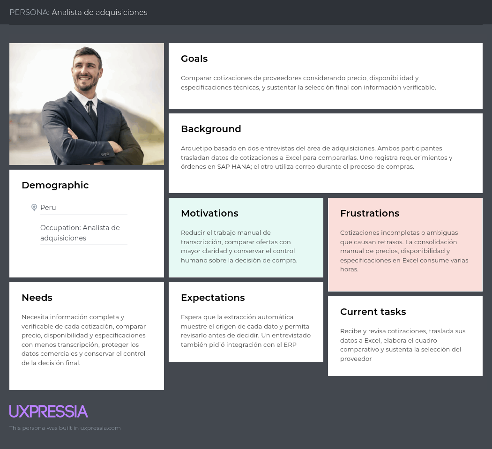

Los dos participantes tienen 24 y 27 años y residen en Santiago de Surco y San Borja, respectivamente. Estos datos describen la muestra disponible, no una edad o ubicación típica del segmento. La ficha no atribuye una cita textual, personalidad, ingresos ni tecnología preferida que los resúmenes no documenten; sus rasgos se contrastarán con más entrevistas.

### 2.3.2. User Task Matrix

La matriz compara al **analista de adquisiciones** y al **especialista de producción y sanidad** mediante tareas del proceso de trabajo actual, realizables aun si SmartQuote no existiera. Las columnas de frecuencia indican el momento en que ocurriría cada tarea dentro de un ciclo de compra (*por necesidad*, *por solicitud*, *por cotización* o *por decisión*), **no** una cantidad semanal o mensual medida. En adquisiciones, la importancia se infiere de las entrevistas N.º 1 y N.º 2; en producción y sanidad se incorpora como evidencia inicial la entrevista N.º 3 y se mantienen como propuestas las frecuencias o importancias que no fueron medidas. «No corresponde» significa que la tarea pertenece a otro rol.

| Tarea del proceso actual, sin SmartQuote | Adquisiciones: frecuencia | Adquisiciones: importancia | Producción y sanidad: frecuencia | Producción y sanidad: importancia |
|---|---|---|---|---|
| Identificar un insumo necesario para la operación. | No corresponde | No corresponde | Por necesidad (propuesta) | Alta (propuesta) |
| Definir cantidad, fecha requerida y especificaciones técnicas del insumo. | No corresponde | No corresponde | Por necesidad (propuesta) | Alta (propuesta) |
| Comunicar el requerimiento al área de adquisiciones. | No corresponde | No corresponde | Por solicitud (propuesta) | Alta (propuesta) |
| Revisar el requerimiento recibido y preparar la búsqueda de ofertas. | Por solicitud; frecuencia real no medida | Alta (inferida; N.º 1 registra requerimientos) | No corresponde | No corresponde |
| Recibir cotizaciones de proveedores. | Por cotización; frecuencia real no medida | Alta (inferida; N.º 1 y N.º 2) | No corresponde | No corresponde |
| Comprobar si las ofertas contienen los datos necesarios y solicitar aclaraciones. | Por cotización; frecuencia real no medida | Alta (inferida; N.º 1 y N.º 2 reportan información ambigua) | No corresponde | No corresponde |
| Trasladar precio, disponibilidad y especificaciones al cuadro comparativo. | Por cotización; frecuencia real no medida | Alta (inferida; N.º 1 y N.º 2 describen varias horas de trabajo) | No corresponde | No corresponde |
| Comparar alternativas técnicas y comerciales y sustentar una selección. | Por evaluación; frecuencia real no medida | Alta (inferida; N.º 1 y N.º 2) | No corresponde | No corresponde |
| Verificar que una alternativa cumpla los requisitos técnicos comunicados. | No documentada en adquisiciones | Por determinar | Por evaluación (propuesta) | Alta (propuesta) |
| Consultar el avance del requerimiento y coordinar la continuidad operativa. | No corresponde | No corresponde | Durante la atención de la solicitud (propuesta) | Alta (propuesta) |
| Formalizar la orden de compra autorizada. | Por decisión aprobada; frecuencia real no medida | Por determinar (solo N.º 1 menciona la orden en ERP) | No corresponde | No corresponde |

**Coincidencia:** ambos roles dependen de que el requerimiento y la oferta contengan información técnica comprensible. **Diferencia:** producción y sanidad definen la necesidad y sus condiciones; adquisiciones obtiene ofertas, las compara y formaliza la decisión comercial. En las dos entrevistas, las tareas con fricción más clara son completar información ambigua y consolidar el cuadro comparativo. La frecuencia por periodo, la importancia declarada por los participantes y todas las tareas atribuidas al segmento técnico deberán contrastarse en las entrevistas restantes antes de asignar valores empíricos.

### 2.3.3. User Journey Mapping

El recorrido *As-Is* describe cómo un analista pasa del requerimiento a la decisión de compra **sin SmartQuote**. Vincula sus pasos con el arquetipo de adquisiciones y no presupone que ambos entrevistados usen el mismo ERP.

| Fase del recorrido | Acción actual observada | Fricción o necesidad | Registro de origen |
|---|---|---|---|
| Requerimiento | Recibe la necesidad; en un caso se registra en SAP HANA. | Conservar continuidad entre la solicitud y la comparación posterior. | N.º 1. |
| Recepción de ofertas | Recibe cotizaciones de proveedores; un participante utiliza correo. | Verificar que cada oferta incluya los datos necesarios. | N.º 1 y N.º 2; uso de correo en N.º 2. |
| Consolidación | Traslada manualmente precio, disponibilidad y especificaciones a Excel. | La tarea consume varias horas y las ofertas incompletas generan retrasos. | N.º 1 y N.º 2. |
| Comparación y decisión | Contrasta las alternativas y mantiene la selección bajo supervisión humana; en un caso la orden se formaliza en el ERP. | Justificar la elección y resguardar los datos comerciales. | N.º 1 y N.º 2; formalización en ERP en N.º 1. |

**Pendiente:** validar secuencia, canales y emociones mediante nuevas entrevistas; elaborar y adjuntar la captura del User Journey Map en la herramienta indicada. **Journey As-Is de Producción y Sanidad:** primer flujo sustentado por N.º 3, pendiente de validación y ampliación con más entrevistas.

### 2.3.4. Empathy Mapping

Este mapa de empatía se refiere al arquetipo de adquisiciones. Se consigna lo que puede deducirse de los dos resúmenes; las demás casillas no se completan con supuestas citas o rasgos personales.

| Pregunta del mapa | Síntesis y procedencia |
|---|---|
| ¿Con quién empatizamos y qué necesita hacer? | Con el analista de adquisiciones que compara ofertas y sustenta una selección; N.º 1 y N.º 2. |
| ¿Qué ve y hace? | Revisa cotizaciones y traslada sus datos a Excel; uno también usa SAP HANA y el otro correo; N.º 1 y N.º 2. |
| ¿Qué dice? | Considera útil la extracción automática, siempre que se pueda ver el origen del dato y mantener la decisión humana; N.º 1 y N.º 2, según sus resúmenes, no como cita textual. |
| ¿Qué piensa y siente? | Los resúmenes identifican la ambigüedad de cotizaciones como su principal reto; **Pendiente** profundizar en sentimientos y motivaciones con preguntas abiertas. |
| ¿Qué escucha? | Pendiente; no está documentado en los resúmenes. |
| Pains | Horas de transcripción, ofertas incompletas o ambiguas y preocupación por confidencialidad; N.º 1 y N.º 2. |
| Gains esperados | Menos trabajo manual y errores, con datos verificables y supervisión final; son expectativas expresadas por N.º 1 y N.º 2, no resultados de uso. |

**Pendiente:** capturar el mapa elaborado en la herramienta indicada. **Empathy Map de Producción y Sanidad:** pendiente de elaborar y validar con la entrevista N.º 3 y registros adicionales.

### 2.3.5. As-is Scenario Mapping

El escenario *As-Is* se plantea desde el arquetipo de adquisiciones. Las columnas son fases del proceso actual y las filas siguen el modelo solicitado por la guía. Cuando los resúmenes no permiten atribuir un pensamiento o emoción específica se indica **Pendiente**.

| Fila / fase | 1. Requerimiento | 2. Cotizaciones | 3. Consolidación y comparación | 4. Decisión y orden |
|---|---|---|---|---|
| **Phases** | Se recibe la necesidad de compra. | Llegan ofertas de proveedores. | Se prepara y revisa el cuadro comparativo. | Se selecciona la alternativa y se formaliza la compra. |
| **Doing** | En un caso se registra el requerimiento en SAP HANA (N.º 1). | Se revisan ofertas; el correo figura en N.º 2. | Ambos trasladan datos a Excel y comparan precio, disponibilidad y especificaciones. | Ambos conservan la elección humana; N.º 1 menciona la orden en ERP. |
| **Thinking** | Pendiente: no se documenta el razonamiento en esta fase. | Se necesita información completa para comparar; inferencia a partir de N.º 1 y N.º 2. | Se necesita conocer el origen de cada dato; N.º 1 y N.º 2. | Se requiere justificar y controlar la selección; N.º 1 y N.º 2. |
| **Feeling** | Pendiente: no se documenta. | Frustración ante ofertas ambiguas; inferida del problema descrito por ambos. | Frustración por horas de trabajo manual; inferida del problema descrito por ambos. | Pendiente: no se documenta una emoción final. |

**Áreas negativas:** cotizaciones incompletas y transcripción prolongada (N.º 1 y N.º 2); comunicación jerárquica, solicitudes físicas extraviadas y falta de lenguaje común (N.º 3). **Área potencialmente positiva:** el registro de requerimiento y orden en el ERP ya existe en un caso, aunque queda separado de la comparación (N.º 1). **Blank areas:** frecuencia de cada fase, validación técnica detallada, coordinación con otras áreas y emociones no documentadas. **Pendiente:** revisar el escenario con entrevistados y adjuntar la captura del mapa en la herramienta indicada. **As-Is Scenario Map de Producción y Sanidad:** primer insumo basado en N.º 3, pendiente de completar con más entrevistas.

## 2.4. Ubiquitous Language

El Ubiquitous Language de SmartQuote reúne exclusivamente términos del dominio de adquisiciones y de la actividad pecuaria. Los términos canónicos se expresan en inglés y su equivalencia en español aparece entre paréntesis. Estas definiciones deberán emplearse sin ambigüedad por el equipo y los stakeholders.

| Término del dominio | Definición |
|---|---|
| **Procurement (Adquisiciones)** | Función empresarial responsable de obtener los bienes requeridos bajo condiciones técnicas y comerciales convenientes. |
| **Purchase Request (Solicitud de compra)** | Necesidad interna de adquisición registrada por producción, sanidad u otra área solicitante. |
| **Request for Quotation - RFQ (Solicitud de cotización)** | Invitación enviada a uno o más proveedores para que presenten una oferta bajo requisitos definidos. |
| **Quotation (Cotización)** | Oferta de un proveedor que detalla productos, cantidades, precios, plazos y condiciones. |
| **Supplier (Proveedor)** | Empresa o persona que ofrece los insumos solicitados. |
| **Requester (Solicitante)** | Colaborador que identifica una necesidad y origina una solicitud de compra. |
| **Buyer (Comprador)** | Responsable de conducir la evaluación comercial y coordinar la adquisición. |
| **Technical Evaluator (Evaluador técnico)** | Profesional de producción o sanidad que comprueba el cumplimiento de las especificaciones. |
| **Approver (Aprobador)** | Responsable autorizado para aceptar o rechazar la alternativa recomendada. |
| **Sourcing Process (Proceso de abastecimiento)** | Conjunto de actividades utilizadas para buscar, evaluar y seleccionar proveedores. |
| **Bidding Process (Proceso de ofertas)** | Etapa en la que distintos proveedores presentan cotizaciones para una misma necesidad. |
| **Bid Comparison (Comparación de ofertas)** | Contraste de las condiciones técnicas y comerciales presentadas por los proveedores. |
| **Evaluation Criterion (Criterio de evaluación)** | Regla utilizada para valorar una oferta. |
| **Technical Specification (Especificación técnica)** | Característica obligatoria que debe cumplir un insumo. |
| **Commercial Condition (Condición comercial)** | Condición de una oferta relacionada con precio, pago, cantidad, entrega o garantía. |
| **Weight (Peso)** | Importancia relativa asignada a un criterio dentro de la evaluación. |
| **Score (Puntaje)** | Resultado obtenido por una oferta al aplicarle los criterios y pesos definidos. |
| **Compliance (Cumplimiento)** | Condición en la que una oferta satisface un requisito establecido. |
| **Non-compliance (Incumplimiento)** | Condición en la que una oferta no satisface un requisito obligatorio. |
| **Recommendation (Recomendación)** | Alternativa sugerida como resultado de la evaluación técnica y comercial. |
| **Purchase Order Proposal (Orden de compra propuesta)** | Documento preliminar preparado a partir de la alternativa seleccionada. |
| **Purchase Order (Orden de compra)** | Documento aprobado que formaliza la adquisición al proveedor. |
| **Approved Supplier (Proveedor aprobado)** | Proveedor autorizado para abastecer una categoría de insumo. |
| **Unit Price (Precio unitario)** | Precio correspondiente a una unidad del insumo cotizado. |
| **Payment Terms (Condiciones de pago)** | Plazo, forma y acuerdos bajo los cuales se realizará el pago. |
| **Minimum Order Quantity - MOQ (Cantidad mínima de pedido)** | Cantidad mínima que el proveedor acepta vender en una operación. |
| **Stock Availability (Disponibilidad de stock)** | Existencia del insumo que el proveedor puede entregar. |
| **Delivery Lead Time (Plazo de entrega)** | Tiempo comprometido por el proveedor desde la orden hasta la entrega. |
| **Required Date (Fecha requerida)** | Fecha máxima en la que el área solicitante necesita recibir el insumo. |
| **Poultry Supply (Insumo avícola)** | Producto requerido para la producción, alimentación o sanidad de aves. |
| **Critical Supply (Insumo crítico)** | Insumo cuya ausencia puede interrumpir la producción o afectar la sanidad. |
| **Balanced Feed (Alimento balanceado)** | Alimento formulado para cubrir los requisitos nutricionales de las aves. |
| **Vaccine (Vacuna)** | Producto biológico empleado para prevenir una enfermedad. |
| **Veterinary Medicine (Medicamento veterinario)** | Producto utilizado para prevenir, controlar o tratar afecciones en animales. |
| **Active Ingredient (Principio activo)** | Sustancia responsable del efecto principal de un medicamento o producto sanitario. |
| **Nutritional Composition (Composición nutricional)** | Proporción declarada de nutrientes y componentes de un alimento. |
| **Concentration (Concentración)** | Cantidad de un componente o principio activo contenida por unidad. |
| **Dosage (Dosificación)** | Cantidad y frecuencia con la que debe administrarse un producto. |
| **Presentation (Presentación)** | Forma comercial del insumo, como frasco, bolsa, caja, peso o volumen. |
| **Batch (Lote)** | Código que identifica un conjunto de unidades producidas bajo condiciones comunes. |
| **Expiration Date (Fecha de vencimiento)** | Fecha límite declarada para utilizar el producto en condiciones adecuadas. |
| **Cold Chain (Cadena de frío)** | Conservación de una temperatura controlada durante almacenamiento y transporte. |
| **Storage Condition (Condición de almacenamiento)** | Requisito ambiental necesario para conservar correctamente un insumo. |
| **Health Registration (Registro sanitario)** | Autorización oficial que permite comercializar un producto sujeto a control sanitario. |

Para evitar ambigüedades, una **Purchase Request** representa la necesidad interna; una **Request for Quotation** es la invitación dirigida al proveedor; una **Quotation** es la respuesta del proveedor; y una **Purchase Order** formaliza la compra aprobada.

# Capítulo III: Requirements Specification

## 3.1. To-Be Scenario Mapping

Al igual que el As-Is, el escenario *To-Be* se presenta por segmento: uno para Adquisiciones y otro para Producción y Sanidad. Las filas siguen el mismo modelo (Phases, Doing, Thinking, Feeling) para permitir la comparación directa con el escenario actual.

### To-Be Scenario Map — Adquisiciones (Analista o jefe de compras)


### To-Be Scenario Map — Producción y Sanidad (Especialista)


[To-Be Scenaries](https://lucid.app/lucidchart/63eeb3ac-dccc-418e-b44e-39a3f170b394/edit?viewport_loc=158%2C-2009%2C7125%2C4056%2C0_0&invitationId=inv_9dda55b5-fe7d-4339-b4b2-62507b26eb4a)

## 3.2. User Stories

| **Story ID** | **User** | **Priority** | **Epic** |
| --- | --- | --- | --- |
| US01 | Visitante de una empresa avícola | Media | EP01 – Presencia digital |
| **Title** | Conocer la propuesta de valor de SmartQuote |  |  |
| **Description** | Como visitante de una empresa avícola, deseo conocer la propuesta de valor, las capacidades y el alcance de SmartQuote para determinar si la solución responde a las necesidades de adquisición de mi organización. |  |  |
| **Acceptance Criteria** | **Escenario 1: Consulta del contenido dirigido al segmento**<br>**Dado que** el visitante pertenece al sector avícola<br>**Cuando** consulta la información pública de SmartQuote<br>**Entonces** el sistema comunica el problema atendido, la propuesta de valor, las capacidades principales y los segmentos a los que se dirige.<br><br>**Escenario 2: Consulta en un idioma soportado**<br>**Dado que** el contenido público se encuentra disponible<br>**Cuando** el visitante establece inglés de Estados Unidos o español de Latinoamérica como idioma<br>**Entonces** el sistema entrega el contenido equivalente en el idioma seleccionado y mantiene el inglés como idioma predeterminado.<br><br>**Escenario 3: Continuidad hacia la experiencia web**<br>**Dado que** el visitante identifica interés en SmartQuote<br>**Cuando** solicita acceder a la experiencia web o iniciar contacto con la startup<br>**Entonces** el sistema lo dirige al destino correspondiente mediante un enlace válido. |  |  |


| **Story ID** | **User** | **Priority** | **Epic** |
| --- | --- | --- | --- |
| US02 | Especialista de producción y sanidad | Alta | EP03 – Solicitudes de compra |
| **Title** | Registrar una solicitud de insumos desde la operación |  |  |
| **Description** | Como especialista de producción y sanidad, deseo registrar una solicitud de insumos con sus requisitos técnicos para que el área de adquisiciones reciba una necesidad completa y trazable. |  |  |
| **Acceptance Criteria** | **Escenario 1: Registro completo de la solicitud**<br>**Dado que** el especialista identifica una necesidad de abastecimiento<br>**Cuando** registra el insumo, la cantidad, la fecha requerida, la prioridad y las especificaciones técnicas obligatorias<br>**Entonces** el sistema crea la solicitud con un identificador único, conserva al solicitante y registra su estado inicial.<br><br>**Escenario 2: Información obligatoria incompleta**<br>**Dado que** una solicitud carece de datos o requisitos obligatorios<br>**Cuando** el especialista intenta registrarla<br>**Entonces** el sistema no crea la solicitud e identifica la información que debe completarse.<br><br>**Escenario 3: Incorporación de sustento técnico**<br>**Dado que** la solicitud requiere documentación complementaria<br>**Cuando** el especialista adjunta un archivo permitido<br>**Entonces** el sistema lo asocia con la solicitud y conserva su nombre, tipo, fecha y autor. |  |  |

| **Story ID** | **User** | **Priority** | **Epic** |
| --- | --- | --- | --- |
| US03 | Especialista de producción y sanidad | Alta | EP03 – Solicitudes de compra |
| **Title** | Conocer el avance de una solicitud de compra |  |  |
| **Description** | Como especialista de producción y sanidad, deseo conocer el estado y el historial de mis solicitudes para anticipar riesgos de abastecimiento y coordinar las actividades operativas. |  |  |
| **Acceptance Criteria** | **Escenario 1: Consulta del estado vigente**<br>**Dado que** existe una solicitud registrada por el especialista<br>**Cuando** consulta su seguimiento<br>**Entonces** el sistema informa el estado vigente, la fecha de la última actualización y el área responsable de la siguiente acción.<br><br>**Escenario 2: Cambio de estado**<br>**Dado que** una solicitud se encuentra activa<br>**Cuando** un usuario autorizado modifica su estado<br>**Entonces** el sistema registra el cambio y notifica al solicitante con el nuevo estado y su motivo cuando corresponda.<br><br>**Escenario 3: Consulta del historial**<br>**Dado que** la solicitud posee cambios registrados<br>**Cuando** el especialista consulta su historial<br>**Entonces** el sistema entrega los eventos en orden cronológico con estado, fecha, responsable y justificación disponible. |  |  |

| **Story ID** | **User** | **Priority** | **Epic** |
| --- | --- | --- | --- |
| US04 | Analista de adquisiciones | Alta | EP04 – Gestión inteligente de cotizaciones |
| **Title** | Incorporar cotizaciones de proveedores |  |  |
| **Description** | Como analista de adquisiciones, deseo incorporar las cotizaciones recibidas para asociarlas con una solicitud y preparar su evaluación técnica y comercial. |  |  |
| **Acceptance Criteria** | **Escenario 1: Incorporación de cotizaciones válidas**<br>**Dado que** existe una solicitud activa<br>**Cuando** el analista incorpora uno o varios archivos PDF válidos e identifica al proveedor correspondiente<br>**Entonces** el sistema registra cada cotización y la vincula con la solicitud y el proveedor indicados.<br><br>**Escenario 2: Archivo no procesable**<br>**Dado que** un archivo posee un formato no permitido, está dañado o no contiene una cotización legible<br>**Cuando** el analista intenta incorporarlo<br>**Entonces** el sistema rechaza ese archivo, conserva los demás archivos válidos e informa la causa del rechazo.<br><br>**Escenario 3: Cotización duplicada**<br>**Dado que** una cotización ya se encuentra registrada para la misma solicitud<br>**Cuando** el analista incorpora nuevamente el mismo documento<br>**Entonces** el sistema evita el registro duplicado e identifica la cotización existente. |  |  |

| **Story ID** | **User** | **Priority** | **Epic** |
| --- | --- | --- | --- |
| TS01 | Developer | Alta | EP04 – Gestión inteligente de cotizaciones |
| **Title** | Procesar cotizaciones mediante un servicio RESTful de extracción |  |  |
| **Description** | Como Developer, deseo disponer de un servicio RESTful que procese cotizaciones PDF y devuelva información normalizada para integrar la extracción asistida por IA con los demás productos de SmartQuote. |  |  |
| **Acceptance Criteria** | **Escenario 1: Solicitud de procesamiento válida**<br>**Dado que** un consumidor autorizado envía una cotización PDF soportada y su identificador de solicitud<br>**Cuando** el servicio procesa el documento<br>**Entonces** responde con un estado HTTP exitoso y entrega proveedor, vigencia, moneda, partidas, cantidades, precios, plazo de entrega, especificaciones detectadas, nivel de confianza y referencia al origen de cada dato.<br><br>**Escenario 2: Información ausente o ambigua**<br>**Dado que** el documento no contiene un dato requerido o la extracción no alcanza la confianza mínima definida<br>**Cuando** el servicio genera el resultado<br>**Entonces** conserva el dato como no resuelto, informa su nivel de confianza y no inventa un valor.<br><br>**Escenario 3: Solicitud no procesable**<br>**Dado que** el consumidor envía un tipo de archivo no soportado o un documento que no puede interpretarse<br>**Cuando** el servicio valida la solicitud<br>**Entonces** responde con el estado HTTP correspondiente y un error estructurado que permite identificar la causa sin exponer datos sensibles. |  |  |

| **Story ID** | **User** | **Priority** | **Epic** |
| --- | --- | --- | --- |
| US05 | Analista de adquisiciones | Alta | EP04 – Gestión inteligente de cotizaciones |
| **Title** | Verificar la información extraída de una cotización |  |  |
| **Description** | Como analista de adquisiciones, deseo verificar y corregir los datos extraídos de cada cotización para asegurar que la evaluación utilice información confiable. |  |  |
| **Acceptance Criteria** | **Escenario 1: Confirmación de datos extraídos**<br>**Dado que** el agente de IA genera datos para una cotización<br>**Cuando** el analista confirma que los valores son correctos<br>**Entonces** el sistema los registra como verificados y conserva el responsable y la fecha de la confirmación.<br><br>**Escenario 2: Corrección de un dato**<br>**Dado que** un valor extraído difiere del documento de origen<br>**Cuando** el analista registra el valor correcto y su motivo<br>**Entonces** el sistema conserva el valor original, el valor corregido, el autor, la fecha y la justificación.<br><br>**Escenario 3: Datos críticos pendientes**<br>**Dado que** una cotización mantiene información obligatoria sin verificar<br>**Cuando** se intenta incluirla en una evaluación definitiva<br>**Entonces** el sistema impide la evaluación e identifica los datos pendientes. |  |  |

| **Story ID** | **User** | **Priority** | **Epic** |
| --- | --- | --- | --- |
| US06 | Analista de adquisiciones | Alta | EP05 – Evaluación y decisión de compra |
| **Title** | Definir los criterios de evaluación de cotizaciones |  |  |
| **Description** | Como analista de adquisiciones, deseo definir criterios comerciales y técnicos para que la comparación de cotizaciones responda a las prioridades de cada solicitud. |  |  |
| **Acceptance Criteria** | **Escenario 1: Configuración válida**<br>**Dado que** una solicitud se encuentra preparada para recibir ofertas<br>**Cuando** el analista define criterios obligatorios y criterios ponderados para precio, plazo de entrega y cumplimiento técnico<br>**Entonces** el sistema registra una versión identificable de la configuración aplicable a la evaluación.<br><br>**Escenario 2: Ponderación inválida**<br>**Dado que** los criterios ponderados no alcanzan el total requerido o contienen valores fuera del rango permitido<br>**Cuando** el analista intenta confirmar la configuración<br>**Entonces** el sistema rechaza la configuración e identifica las reglas incumplidas.<br><br>**Escenario 3: Modificación posterior a una simulación**<br>**Dado que** existe una simulación basada en una versión de criterios<br>**Cuando** un usuario autorizado modifica los criterios<br>**Entonces** el sistema conserva la versión anterior e identifica que la simulación debe ejecutarse nuevamente. |  |  |

| **Story ID** | **User** | **Priority** | **Epic** |
| --- | --- | --- | --- |
| US07 | Analista de adquisiciones | Alta | EP05 – Evaluación y decisión de compra |
| **Title** | Simular y comparar las cotizaciones elegibles |  |  |
| **Description** | Como analista de adquisiciones, deseo simular la evaluación de las cotizaciones elegibles para identificar la alternativa con mejor ajuste técnico y comercial. |  |  |
| **Acceptance Criteria** | **Escenario 1: Simulación con ofertas elegibles**<br>**Dado que** existen al menos dos cotizaciones verificadas y una versión vigente de los criterios<br>**Cuando** el analista solicita la simulación<br>**Entonces** el sistema calcula el resultado de cada oferta, entrega un orden de preferencia y explica la contribución de cada criterio al resultado.<br><br>**Escenario 2: Incumplimiento de un criterio obligatorio**<br>**Dado que** una cotización incumple un criterio obligatorio<br>**Cuando** el sistema ejecuta la simulación<br>**Entonces** excluye la cotización de la recomendación ordinaria y señala los criterios incumplidos, independientemente de su precio.<br><br>**Escenario 3: Repetibilidad del resultado**<br>**Dado que** las cotizaciones y la versión de criterios no cambian<br>**Cuando** la simulación se ejecuta nuevamente<br>**Entonces** el sistema produce el mismo resultado y lo asocia con la misma versión de datos y reglas. |  |  |

| **Story ID** | **User** | **Priority** | **Epic** |
| --- | --- | --- | --- |
| US08 | Analista o jefe de adquisiciones | Alta | EP06 – Orden y trazabilidad |
| **Title** | Aprobar la alternativa seleccionada y generar la orden de compra |  |  |
| **Description** | Como analista o jefe de adquisiciones autorizado, deseo aprobar una alternativa evaluada y generar su orden de compra para continuar el proceso con información consistente y trazable. |  |  |
| **Acceptance Criteria** | **Escenario 1: Generación autorizada**<br>**Dado que** una cotización se encuentra verificada, técnicamente conforme y seleccionada mediante una simulación vigente<br>**Cuando** un usuario con autorización aprueba la decisión<br>**Entonces** el sistema genera una orden con identificador único, proveedor, partidas, cantidades, precios, moneda, condiciones de entrega y referencia a la solicitud y evaluación de origen.<br><br>**Escenario 2: Datos modificados después de la simulación**<br>**Dado que** una cotización, un requisito o un criterio cambia después de la simulación<br>**Cuando** se intenta aprobar la alternativa anterior<br>**Entonces** el sistema impide la generación y exige una nueva evaluación con la información vigente.<br><br>**Escenario 3: Solicitud repetida de generación**<br>**Dado que** ya existe una orden para la misma aprobación<br>**Cuando** se recibe nuevamente la misma solicitud de generación<br>**Entonces** el sistema devuelve la orden existente y no crea un duplicado. |  |  |

| **Story ID** | **User** | **Priority** | **Epic** |
| --- | --- | --- | --- |
| SP01 | Developer | Alta | EP04 – Gestión inteligente de cotizaciones |
| **Title** | Evaluar la viabilidad de extraer datos de cotizaciones heterogéneas con IA |  |  |
| **Description** | Como Developer, deseo investigar y probar alternativas de extracción de información para determinar si el agente de IA puede procesar cotizaciones PDF heterogéneas con precisión, trazabilidad y límites de confianza adecuados. |  |  |
| **Acceptance Criteria** | **Escenario 1: Ejecución de la prueba de concepto**<br>**Dado que** se dispone de al menos quince cotizaciones anonimizadas correspondientes a tres o más estructuras documentales diferentes<br>**Cuando** se ejecuta la prueba de concepto sobre los campos priorizados<br>**Entonces** se obtiene una salida estructurada que conserva la referencia al documento de origen y señala los valores no resueltos.<br><br>**Escenario 2: Medición de resultados**<br>**Dado que** la prueba de concepto produce resultados de extracción<br>**Cuando** se comparan con los valores verificados manualmente<br>**Entonces** se documentan la precisión por campo, los casos fallidos, las causas observadas, el tiempo de procesamiento y los riesgos de uso.<br><br>**Escenario 3: Cierre de la investigación**<br>**Dado que** las alternativas seleccionadas cuentan con resultados de evaluación<br>**Cuando** concluye el spike<br>**Entonces** se entrega un informe con la alternativa recomendada, el prototipo mínimo, las limitaciones, el umbral de confianza propuesto y las medidas necesarias para proteger la información de los proveedores. |  |  |

## 3.3. Product Backlog

El Product Backlog se ordena según el valor para el negocio, la entrega de la presencia digital durante el primer sprint, la reducción temprana de incertidumbre técnica y la secuencia del proceso de adquisición avícola. Los Story Points representan esfuerzo relativo y utilizan únicamente la escala 1, 2, 3, 5 y 8.

| **# Orden** | **User Story Id** | **Título** | **Descripción** | **Story Points (1 / 2 / 3 / 5 / 8)** |
| ---: | --- | --- | --- | ---: |
| 1 | US01 | Conocer la propuesta de valor de SmartQuote | Como visitante de una empresa avícola, deseo conocer la propuesta de valor, las capacidades y el alcance de SmartQuote para determinar si la solución responde a las necesidades de adquisición de mi organización. | 3 |
| 2 | SP01 | Evaluar la viabilidad de extraer datos de cotizaciones heterogéneas con IA | Como Developer, deseo investigar y probar alternativas de extracción de información para determinar si el agente de IA puede procesar cotizaciones PDF heterogéneas con precisión, trazabilidad y límites de confianza adecuados. | 8 |
| 3 | US02 | Registrar una solicitud de insumos desde la operación | Como especialista de producción y sanidad, deseo registrar una solicitud de insumos con sus requisitos técnicos para que el área de adquisiciones reciba una necesidad completa y trazable. | 5 |
| 4 | US04 | Incorporar cotizaciones de proveedores | Como analista de adquisiciones, deseo incorporar las cotizaciones recibidas para asociarlas con una solicitud y preparar su evaluación técnica y comercial. | 5 |
| 5 | TS01 | Procesar cotizaciones mediante un servicio RESTful de extracción | Como Developer, deseo disponer de un servicio RESTful que procese cotizaciones PDF y devuelva información normalizada para integrar la extracción asistida por IA con los demás productos de SmartQuote. | 8 |
| 6 | US05 | Verificar la información extraída de una cotización | Como analista de adquisiciones, deseo verificar y corregir los datos extraídos de cada cotización para asegurar que la evaluación utilice información confiable. | 5 |
| 7 | US06 | Definir los criterios de evaluación de cotizaciones | Como analista de adquisiciones, deseo definir criterios comerciales y técnicos para que la comparación de cotizaciones responda a las prioridades de cada solicitud. | 5 |
| 8 | US07 | Simular y comparar las cotizaciones elegibles | Como analista de adquisiciones, deseo simular la evaluación de las cotizaciones elegibles para identificar la alternativa con mejor ajuste técnico y comercial. | 8 |
| 9 | US08 | Aprobar la alternativa seleccionada y generar la orden de compra | Como analista o jefe de adquisiciones autorizado, deseo aprobar una alternativa evaluada y generar su orden de compra para continuar el proceso con información consistente y trazable. | 8 |
| 10 | US03 | Conocer el avance de una solicitud de compra | Como especialista de producción y sanidad, deseo conocer el estado y el historial de mis solicitudes para anticipar riesgos de abastecimiento y coordinar las actividades operativas. | 5 |

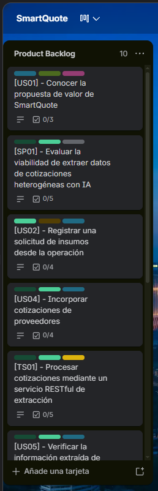

URL del Trello: [https://trello.com/invite/b/6aa85b3facd61f254c956e26/ATTI1ef2c79c2f57a6cfd64878a51236a769346419FD/smartquote](https://trello.com/invite/b/6aa85b3facd61f254c956e26/ATTI1ef2c79c2f57a6cfd64878a51236a769346419FD/smartquote)

## 3.4. Impact Mapping

El Impact Map conecta el objetivo de negocio definido en el Lean UX Canvas con los actores del dominio, el cambio de comportamiento que se espera provocar en cada uno (impactos) y las historias del Product Backlog que se comprometen para lograrlo. Los impactos se formulan como comportamientos deseados, no como resultados ya medidos: su validación depende de las hipótesis H1–H4 (sección 1.2.2.3), todavía pendientes de comprobación con usuarios reales.


[Impact Mapping](https://lucid.app/lucidchart/13a6f9fc-7c96-45e5-b767-2f3b6f50c81d/edit?viewport_loc=-3448%2C-421%2C8163%2C6048%2C0_0&invitationId=inv_3fc3599f-7fd4-49c3-9fa8-518b6b6af74b)

# Capítulo IV: Product Design

## 4.1. Style Guidelines

### 4.1.1. General Style Guidelines

El diseño de SmartQuote parte de una premisa distinta a la de un producto de consumo: quien lo usa no busca una experiencia agradable, busca poder sustentar una decisión de compra ante su organización. Por eso el sistema visual está construido para que la información sea legible bajo densidad, para que el estado de cada cotización se entienda sin interpretación y para que ningún recurso gráfico compita con el dato. Cada decisión visual responde a una sola pregunta: ¿ayuda al analista a entender por qué una cotización es preferible a otra?

#### Colores

La paleta de SmartQuote no es decorativa: está organizada en tres capas con funciones separadas, y esa separación es en sí misma una regla del sistema. Existe un único color de marca, una escala neutra que sostiene la lectura de datos, y tres colores semánticos reservados exclusivamente para comunicar el estado del dominio. El verde, el ámbar y el rojo significan conformidad, revisión y exclusión; si además aparecieran como adorno, el usuario dejaría de leerlos como información y el cuadro comparativo perdería su capacidad de comunicar de un vistazo.


- **Azul Petróleo Profundo — #093A5A:** transmite autoridad, seriedad y solidez institucional. Se emplea como fondo en las secciones de mayor peso comunicacional de la Landing Page —el encabezado principal y el llamado a la acción final— y en los bloques donde el producto afirma su propuesta. Su profundidad hace que el contenido claro colocado encima se lea como documento sobre una superficie estable.
- **Azul Institucional — #0F5B8C:** es el color base de la marca y el único color de acción del producto. Se reserva para botones primarios, el elemento activo de la navegación, el indicador de foco y el resaltado de la columna ganadora en una comparación. Al ser el único color que representa acción, el usuario aprende en una pantalla dónde puede pulsar.
- **Azul Bruma — #E7F0F6:** tono claro derivado del anterior, empleado para fondos de resaltado, filas seleccionadas y fichas de versión. Permite destacar sin recurrir a bordes adicionales ni a sombras, lo que mantiene limpia una tabla ya densa.

- **Grafito — #1F2933:** color del texto principal y de los titulares. Se eligió por encima del negro puro porque reduce el contraste extremo en pantallas de trabajo prolongado, sin sacrificar la relación mínima de 4.5:1 exigida por la norma de accesibilidad.
- **Gris Neutro — #64748B:** texto secundario, etiquetas de campo, descripciones y unidades. Su función es jerárquica: separa el dato de su rótulo sin necesidad de cambiar de tamaño ni de peso.
- **Gris Documento — #F5F7FA y #EDF1F5:** fondos del área de contenido y filas alternadas de tabla. Estos tonos permiten que las tarjetas y tablas blancas se perciban como documentos colocados sobre una superficie, metáfora coherente con un producto que trabaja con cotizaciones.
- **Gris Borde — #E1E5EA:** bordes y divisores. El sistema prefiere el borde a la sombra para separar contenido dentro de una misma superficie, porque la sombra sugiere elevación y en una tabla comparativa todos los elementos están al mismo nivel.

- **Verde Conformidad — #1E8E3E sobre #E6F4EA:** indica que una cotización *cumple* un criterio técnico, que un dato fue verificado, que el nivel de confianza es alto o que una orden fue emitida. Es el color de la certeza.
- **Ámbar Revisión — #E8A33D sobre #FDF3E3:** indica que una cotización *cumple parcialmente*, que un dato detectado tiene confianza baja o que un resultado de simulación quedó desactualizado. Es el color que reclama la atención de una persona, y por eso nunca se usa para decorar: cada aparición del ámbar en pantalla es una tarea pendiente.
- **Rojo Exclusión — #C5221F sobre #FBE9E9:** indica que una cotización *no cumple* un criterio obligatorio, que un dato quedó no resuelto, que un documento no es procesable o que una orden fue anulada. Es el color que detiene el proceso.


#### Tipografía

SmartQuote emplea dos familias tipográficas con roles claramente separados, ambas de licencia abierta y disponibles en Google Fonts.

Se seleccionó **Manrope** como fuente principal para los títulos de SmartQuote por su estilo geométrico moderno y por sus formas ligeramente estrechas, que le permiten sostener titulares extensos en español sin dividirse en demasiadas líneas. Se utiliza en pesos altos para asegurar que los encabezados sean sólidos, técnicos y de lectura inmediata, transmitiendo el carácter de una herramienta de decisión sin caer en la frialdad de una tipografía puramente industrial.


Se seleccionó **Inter** como fuente secundaria para el texto de cuerpo, la navegación, los formularios y, sobre todo, para las tablas de datos. La razón es funcional antes que estética: Inter dispone de **cifras tabulares**, es decir, todos sus dígitos ocupan el mismo ancho. En un producto cuya pantalla central compara precios por tonelada entre varios proveedores, esta característica hace que las cifras queden alineadas verticalmente en la columna y que la diferencia entre 1,980.00 y 1,890.00 se perciba de inmediato. Con una tipografía de cifras proporcionales, esa misma comparación exigiría un esfuerzo visual innecesario.


En cuanto al tamaño, se utiliza jerárquicamente en toda la plataforma para resaltar títulos principales, botones de acción y texto de soporte. Los tamaños más grandes en los encabezados guían al usuario rápidamente por los puntos clave del mensaje en la Landing Page, mientras que los más pequeños en párrafos, etiquetas y celdas aseguran la comprensión y la eficiencia en la lectura de detalles secundarios. Dentro de la aplicación web esta escala se comprime de forma deliberada, ya que cada píxel destinado a la tipografía es un píxel menos disponible para comparar cotizaciones. Los titulares emplean además un interletrado ligeramente negativo para compensar la apertura natural de la geometría de Manrope en tamaños grandes, y el texto de cuerpo mantiene líneas de menos de setenta caracteres para no fatigar la lectura en párrafos largos.

#### Branding

El branding de SmartQuote busca comunicar comparación y decisión, no tecnología genérica. El logo  y los iconos están formados por tres barras verticales de distinta altura, que representan las alternativas que se comparan, acompañadas de una marca de verificación sobre la barra seleccionada, que representa la decisión sustentada.


#### Espaciado

El espaciado se organiza en una escala de múltiplos de 4 px, aplicada de forma consistente en las tres superficies. Su función va más allá de la estética: en SmartQuote la densidad es una decisión de diseño que responde a la tarea, no a la plataforma. Una vista de comparación es densa por necesidad, porque el analista debe ver tres cotizaciones y cinco criterios simultáneamente; una sección de la Landing Page respira, porque el visitante está leyendo, no trabajando.

#### Dimensiones para el tono de comunicación y lenguaje aplicado

El tono de SmartQuote es **profesional, directo y verificable**. La plataforma asiste una decisión que el usuario deberá justificar ante su organización y, eventualmente, ante una auditoría; por lo tanto, el lenguaje nunca debe prometer más certeza de la que el sistema realmente posee.

De esa premisa se derivan seis reglas de redacción:

| Regla | Ejemplo correcto | Ejemplo incorrecto |
|---|---|---|
| El sistema se refiere a sí mismo en tercera persona, nunca en primera | "El análisis detectó 18.5 % de proteína cruda" | "Encontré 18.5 % de proteína cruda" |
| La incertidumbre se declara, no se oculta | "Plazo de entrega: no resuelto" | "Plazo de entrega: 7 días (estimado)" |
| Los errores indican causa y acción correctiva | "El archivo está dañado o no es una cotización legible. Cárgalo nuevamente o registra la cotización de forma manual" | "Error al procesar el archivo" |
| No se emplea lenguaje promocional sobre la inteligencia artificial | "Análisis automático" | "IA inteligente", "análisis mágico" |
| No se expone terminología de implementación | "Datos detectados", "Resultado de la simulación" | "Extracción del agente", "snapshot de la simulación" |
| Las acciones se nombran con verbo y objeto explícito | "Generar orden de compra" | "Continuar", "Enviar" |

Además, se consideraron tres aspectos transversales:

- **Consistencia.** Una acción conserva el mismo nombre a lo largo de todo el flujo: el botón que dice "Emitir orden" produce un estado que dice "Emitida". El vocabulario de la interfaz es la señalización con la que el usuario aprende a moverse por el producto, y cambiar el término a mitad del recorrido lo obliga a reaprender.
- **Navegación.** La estructura sigue las etapas reales del ciclo de adquisición, de modo que el usuario encuentra la información donde el proceso la produce. Los menús son mínimos y cada vista de detalle mantiene visible el camino recorrido, porque en este producto saber de dónde viene un dato forma parte del dato.
- **Accesibilidad.** La plataforma se diseña para ser operable por completo con teclado, legible con lector de pantalla y utilizable con el texto ampliado al 200 %.

#### Elementos de diseño

Junto a los lineamientos de color, tipografía y branding, el diseño visual de SmartQuote aplica de forma consciente los elementos fundamentales del diseño gráfico, siempre subordinados a la lectura del dato.

La **línea** cumple una función estructural y no ornamental: separa filas en las tablas de datos, delimita tarjetas y marca la columna congelada de criterios en el cuadro comparativo. Su presencia es deliberadamente discreta, de 1 px y en Gris Borde, porque en una pantalla con tres columnas de datos toda línea adicional compite con la información.

El **color** opera en dos registros simultáneos, ya descritos: identidad y estado. Su valor comunicativo depende por completo de mantenerlos separados, y es la razón por la cual el sistema renuncia a un color de acento decorativo.

El **tamaño** establece la jerarquía sin necesidad de recurrir a más recursos. Los titulares grandes conducen al visitante por los puntos clave de la Landing Page, mientras que dentro de la aplicación la escala se comprime deliberadamente: el título de página mide 24 px y el cuerpo 14 px, porque cada píxel destinado a la tipografía es un píxel menos disponible para comparar cotizaciones.

La **textura** es plana y limpia. El producto no emplea degradados, patrones ni sombras difusas como decoración; la única variación de superficie proviene del contraste entre el fondo Gris Documento y las tarjetas blancas, que produce la sensación de documentos sobre un escritorio, coherente con un sistema cuya materia prima son cotizaciones en PDF.

El **espacio** es el elemento que más trabaja en este sistema, precisamente porque escasea en las vistas de comparación. Se administra con la escala de 4 px y se distribuye de forma asimétrica entre superficies: generoso en la Landing Page, medido en la aplicación web.

El **brillo** o valor separa las capas de la interfaz. El fondo claro sostiene tarjetas blancas, y sobre ellas los elementos de acción concentran el mayor contraste. Esta gradación permite que el usuario identifique en menos de un segundo dónde puede actuar en una pantalla saturada de datos.

La **forma** utiliza geometrías de bordes redondeados con radios diferenciados por jerarquía. El redondeo suaviza una interfaz que de otro modo resultaría severa por su densidad, y el hecho de que el radio varíe según el tipo de elemento aporta una señal adicional sobre qué es un control y qué es un contenedor.

#### Principios de diseño

El **contraste** garantiza que los elementos críticos —el botón primario de cada vista, los distintivos de cumplimiento y la banda de advertencia de un resultado desactualizado— se distingan de inmediato sobre fondos neutros. En SmartQuote el contraste no es solo un recurso estético sino un requisito de accesibilidad verificable, con umbrales medidos antes de cerrar cada pantalla.

La **repetición** de la paleta, de los tres iconos de estado y de los patrones de tabla construye familiaridad a lo largo del producto. Un analista que aprendió a leer el cuadro comparativo puede leer el listado de órdenes sin instrucción adicional, porque ambos emplean el mismo vocabulario visual. Esta consistencia reduce la curva de aprendizaje en un producto que se usa a diario y bajo presión de tiempo.

La **alineación** aporta el orden que un documento de sustento exige. La grilla de 12 columnas, la alineación a la izquierda de las etiquetas y la alineación a la derecha de todas las cifras producen una lectura predecible; esta última es la que permite comparar precios recorriendo la columna con la vista, sin detenerse en cada celda.

La **proximidad** agrupa lo que pertenece junto: el dato detectado con su nivel de confianza, la cotización excluida con el criterio que incumplió, la orden de compra con los enlaces hacia la simulación que la originó. En un producto cuya propuesta de valor es la trazabilidad, la cercanía física entre un hecho y su justificación es la expresión visual del argumento.

### 4.1.2. Web Style Guidelines

El diseño web de SmartQuote traduce el sistema visual de 4.1.1 a dos superficies con propósitos distintos: la Landing Page, construida en HTML5, CSS3 y JavaScript, orientada a la lectura y al convencimiento del visitante; y la aplicación web, construida en Vue.js con PrimeVue y Material Design, orientada al trabajo diario del analista de adquisiciones. Ambas comparten los mismos valores de color, tipografía y espaciado, pero los expresan con ritmos diferentes: la Landing emplea contenedores amplios y separaciones generosas entre secciones para permitir descansos visuales, mientras que la aplicación web comprime deliberadamente esos mismos valores, porque su tarea central —comparar varias cotizaciones contra un conjunto de criterios— exige alta densidad de información en pantalla. La composición se resuelve con CSS Grid y Flexbox sobre una grilla de doce columnas, lo que mantiene la alineación entre bloques de distinta naturaleza y evita que la información se disperse al cambiar el tamaño de la ventana.

La estrategia responsiva es intencionalmente mixta. La Landing Page se diseña mobile-first, ya que el descubrimiento del producto ocurre con frecuencia desde el teléfono, y sus secciones de varias columnas se apilan progresivamente hasta los 360 px. La aplicación web se diseña desktop-first y define un comportamiento propio en cada punto de quiebre: la barra lateral pasa de expandida a iconos y finalmente a panel deslizante, mientras que el cuadro comparativo se desplaza horizontalmente conservando congelada la columna de criterios. Esta última decisión es deliberada: reducir el ancho ocultando las etiquetas de estado dejaría al color y al icono comunicando solos, lo que contradice la primera regla del sistema declarada en 4.1.1.

En cuanto a la interactividad, la plataforma utiliza una lógica de componentes claramente identificables, apoyada en la librería PrimeVue para el producto y en componentes propios equivalentes para la Landing. Los botones de acción emplean el azul institucional como único color de acción, con estados visuales de hover, focus, disabled y loading que ofrecen retroalimentación inmediata y enseñan al usuario dónde puede pulsar. La navegación se apoya en un marco persistente —barra lateral, barra superior con búsqueda global y selector de idioma, y migas de pan en cada vista de detalle— que mantiene siempre disponibles las herramientas principales, incluido el sistema de internacionalización con inglés como idioma predeterminado y español de Latinoamérica como alterno. Las transiciones son breves y siempre responden a una acción del usuario, nunca al desplazamiento de la página, y se anulan cuando el sistema declara preferencia de movimiento reducido.

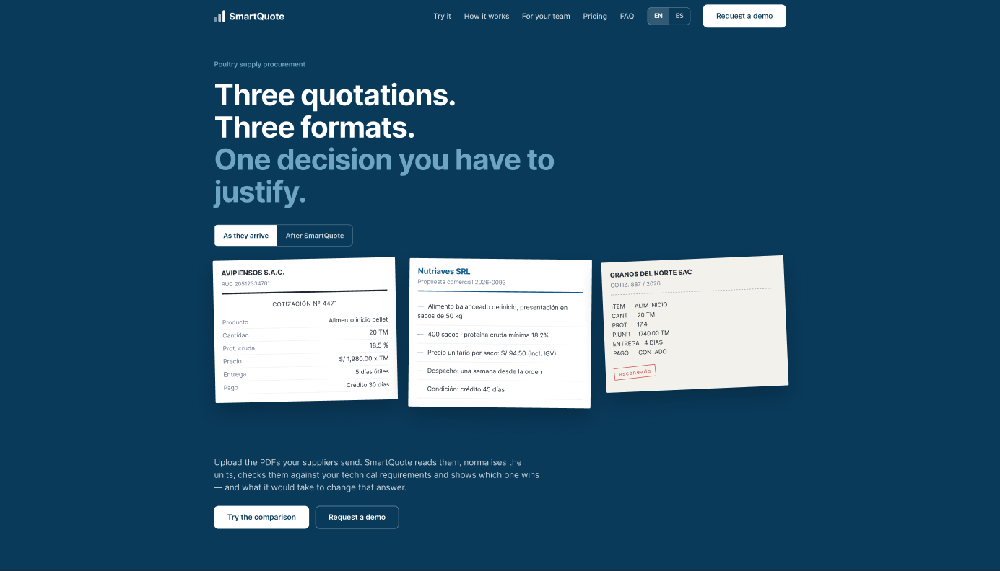
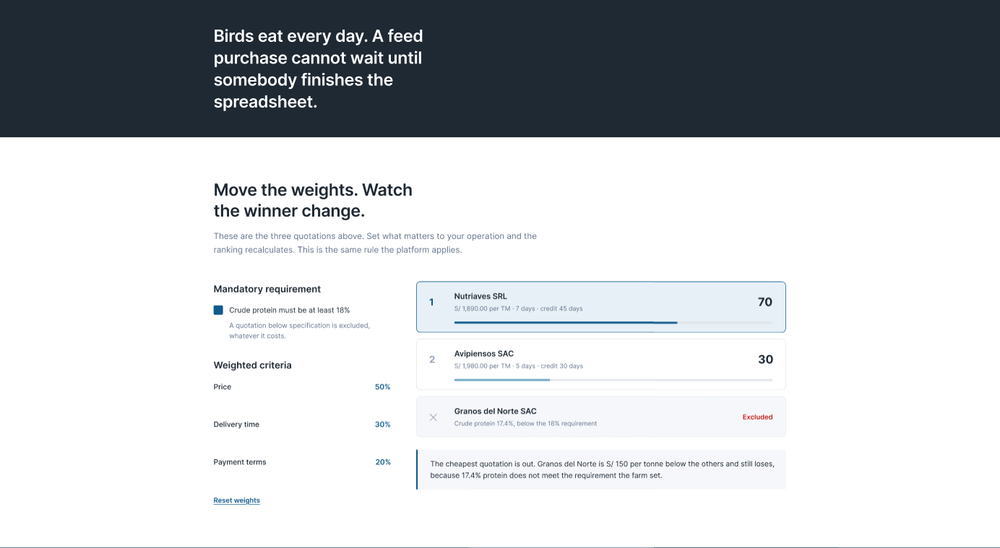
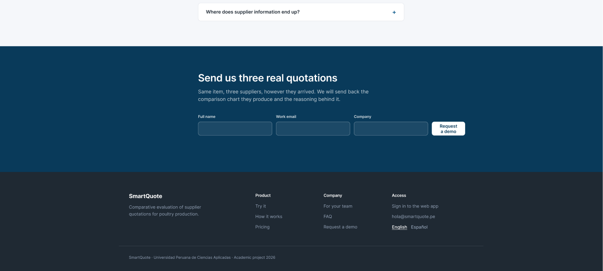

### 4.1.3. Mobile Style Guidelines

Esta sección define los principios visuales compartidos para la aplicación móvil, garantizando la consistencia de la marca en cualquier dispositivo.

**Branding y Colores**
* **Color Primario:** Azul corporativo, utilizado en cabeceras, botones de confirmación estándar y navegación.
* **Acción Principal (CTA):** Verde, reservado exclusivamente para el botón central de "Nueva Solicitud".
* **Colores Semánticos (Estados):** 
  * Verde: *Aprobada*
  * Rojo: *Desaprobada*
  * Amarillo: *En revisión*

**Contenedores y Layout**
* **Estructura:** Uso de fondos claros (blanco/gris claro) con tarjetas (*Cards*) de bordes redondeados para agrupar la información.
* **Objetivo:** Maximizar el contraste y la legibilidad del personal durante la operación en campo.


#### 4.1.3.1. iOS Mobile Style Guidelines

Para el desarrollo en dispositivos Apple, la interfaz se adapta respetando estrictamente las *Human Interface Guidelines* (HIG):

* **Tipografía:** Uso exclusivo de la familia tipográfica **San Francisco (SF Pro)**. Debe soportar *Dynamic Type* para que el usuario pueda escalar el tamaño de lectura de los requerimientos técnicos según sus necesidades operativas de accesibilidad en el campo.


* **Espaciado** y Layout: Respeto estricto por las **Safe Areas** para evitar que el contenido se superponga con el *Notch*, la *Dynamic Island* o el *Home Indicator* (barra inferior).


* **Componentes Nativos**: Implementación de *Action Sheets* inferiores para menús de selección (ej. opciones de adjuntar archivo) y *Date Pickers* nativos de iOS para los formularios.


#### 4.1.3.2. Android Mobile Style Guidelines

Lineamientos específicos basados en *Material Design 3 (MD3) de Google*.

* **Tipografía:** Uso de **Roboto**. Los tamaños de fuente deben definirse obligatoriamente en *sp (Scaleable Pixels)* para adaptarse a las configuraciones de accesibilidad del sistema.


* **Espaciado y Layout:** Aplicación de la grilla base de 8dp para márgenes y separación de elementos, asegurando áreas táctiles mínimas de 48x48dp.


* **Componentes Nativos:** Implementación de un *Floating Action Button (FAB)* anclado en la parte inferior para el botón de "Nueva Solicitud", y uso de Outlined Text Fields (campos con contorno) en los formularios de registro.


## 4.2. Information Architecture

### 4.2.1. Organization Systems

En SmartQuote se emplea una organización jerárquica (visual hierarchy) para destacar la información que sostiene la decisión de compra. En el cuadro comparativo, los criterios obligatorios y el puntaje total ocupan la posición de mayor peso visual, mientras que las condiciones comerciales secundarias descienden a niveles inferiores. Esta jerarquía permite que el analista identifique en segundos qué cotización queda excluida y por qué, sin recorrer el documento completo.

Asimismo, se aplica una organización secuencial (step-by-step) en los procesos que exigen una progresión lógica. En la Landing Page se evidencia en la sección "Cómo funciona", que recorre los cinco pasos del ciclo de adquisición. En la aplicación web se materializa en el asistente que acompaña el flujo Solicitud → Cotizaciones → Criterios → Simulación → Orden, impidiendo que se avance a una simulación mientras existan cotizaciones sin verificar.

Respecto a los esquemas de categorización, el contenido de la aplicación se agrupa por tópicos, reproduciendo los cuatro bounded contexts definidos en la arquitectura, de modo que la interfaz y el modelo de software compartan el mismo mapa mental: Solicitudes, Cotizaciones, Evaluación y Órdenes de compra. Dentro de cada módulo se emplea una organización cronológica para los listados, ordenados por fecha de creación descendente, y una organización por estado del proceso mediante pestañas de filtrado. Finalmente, el contenido se clasifica según audiencia, segmentando funcionalidades de acuerdo con los dos User Personas identificados: Analistas de Adquisiciones, enfocados en la evaluación y adjudicación, y Especialistas de Producción y Sanidad, orientados al registro y seguimiento de solicitudes desde la granja.

### 4.2.2. Labeling Systems

El sistema de etiquetado de SmartQuote se deriva del Ubiquitous Language del proyecto, buscando que cada término coincida con el vocabulario que el personal de adquisiciones ya emplea. Se evita deliberadamente exponer terminología de implementación: el usuario nunca lee "agente de IA" ni "extracción", sino Análisis automático y Datos detectados.

**Landing Page**

- **Pruébalo**: Conduce al simulador donde el visitante ajusta los pesos y observa cómo cambia la alternativa ganadora.
- **Cómo funciona**: Explica la ubicación de la plataforma dentro del proceso de compra existente.
- **Para tu equipo**: Diferencia los beneficios según el área que utilizará cada aplicación.
- **Planes**: Estructura la oferta comercial según el volumen de cotizaciones analizadas al mes.
- **Solicitar demostración**: Botón de acción principal, con texto idéntico en todas sus apariciones para reforzar el reconocimiento.

**Aplicación Web – Analistas de Adquisiciones**

- **Solicitudes**: Listado de necesidades registradas por las áreas operativas, con su estado y número de cotizaciones asociadas.
- **Cotizaciones**: Documentos cargados por proveedor, con el estado del análisis automático.
- **Datos detectados**: Campos extraídos de cada documento, acompañados de su nivel de confianza y de los valores marcados como No resuelto.
- **Criterios obligatorios / Criterios ponderados**: Distingue las condiciones que excluyen una oferta de las que solo aportan puntaje.
- **Ejecutar simulación**: Etiqueta de alta visibilidad que dispara la evaluación comparativa.
Generar orden de compra: Acción de cierre, deshabilitada mientras el resultado no esté vigente.

**Aplicación Móvil – Especialistas de Producción y Sanidad**

- **Nueva solicitud**: Registro del insumo, cantidad, fecha requerida y prioridad desde el entorno operativo.
- **Requisitos técnicos**: Condiciones que el insumo debe cumplir, como composición nutricional o concentración.
- **Mis solicitudes**: Relación de las necesidades registradas por el usuario con su estado vigente.
- **Seguimiento**: Historial cronológico de cada solicitud, indicando el área responsable de la siguiente acción.

### 4.2.3. SEO Tags and Meta Tags

1. **Landing Page**

**Charset**

<meta charset="UTF-8" />

Establece la codificación universal de caracteres. Su función es garantizar que el navegador interprete correctamente los textos del sistema i18n, asegurando que tildes, la letra "ñ" y símbolos técnicos como el de porcentaje o el de mayor o igual se visualicen sin errores en español e inglés.

**Viewport (Responsive)**

<meta name="viewport" content="width=device-width, initial-scale=1.0" />

Controla el escalado de la página en distintos dispositivos. Su función es ajustar el ancho del contenido al tamaño de la pantalla, algo crítico porque el descubrimiento del producto ocurre con frecuencia desde el teléfono del jefe de compras.

**Title (SEO)**

<title>SmartQuote — Compara cotizaciones y emite tu orden de compra</title>

Define el título que aparece en la pestaña del navegador y en los resultados de búsqueda. Su función es identificar de inmediato la marca y el problema que resuelve, siendo un factor determinante para el posicionamiento orgánico.

**Meta Description (SEO)**

<meta name="description" content="Plataforma SaaS que lee las cotizaciones de tus proveedores en PDF, las contrasta con tus criterios técnicos y comerciales, y entrega una recomendación trazable y la orden de compra lista para aprobar.">

Provee un resumen conciso del contenido del sitio. Su función es aparecer como fragmento en los resultados de Google, explicando cómo SmartQuote resuelve la evaluación manual de cotizaciones heterogéneas.

**Meta Keywords (SEO)**

<meta name="keywords" content="comparación de cotizaciones, software de compras, sector avícola, evaluación de proveedores, orden de compra, SaaS">

Especifica palabras clave relevantes para la temática. Su función es ayudar a los algoritmos de indexación a clasificar el sitio dentro del nicho de tecnología para abastecimiento y compras del sector pecuario.

**Meta Author**

<meta name="author" content="SmartQuote">

Identifica formalmente a los creadores de la plataforma, vinculando el desarrollo técnico con la startup responsable.

**Meta Copyright**

<meta name="copyright" content="SmartQuote 2026">

Establece la titularidad de la propiedad intelectual de la página y el año de vigencia, protegiendo el contenido y el diseño del sitio.

**Meta Robots**

<meta name="robots" content="index, follow">

Instruye a los motores de búsqueda para que incluyan la página en sus índices y sigan sus enlaces internos. Cabe precisar que la aplicación web declara lo contrario, noindex, nofollow, ya que su contenido es privado y su exposición revelaría rutas internas sin aportar valor.

**Meta Language**

<html lang="en">

Declara el idioma principal de la estructura del sitio. Su función es informar a navegadores y buscadores que el texto base está en inglés, coherente con el idioma predeterminado definido para la plataforma, mientras que el español de Latinoamérica se declara como alternativa mediante etiquetas hreflang.

### 4.2.4. Searching Systems

En esta sección se describen los mecanismos de recuperación de información diseñados para SmartQuote. El objetivo es que el analista localice una solicitud, una cotización o una orden sin recorrer listados extensos, especialmente cuando debe responder a una consulta sobre una compra realizada meses atrás.

**Vista del Analista de Adquisiciones**

**1. Medios de ayuda para la búsqueda de datos**

- Búsqueda global: Disponible en la barra superior desde cualquier vista, accesible además con el atajo de teclado Ctrl/Cmd + K.
- Autocompletado: Sugiere códigos de solicitud, razones sociales de proveedores y números de orden conforme el usuario escribe, a partir del tercer carácter.
- Tolerancia a la escritura: La búsqueda es insensible a mayúsculas y tildes y admite coincidencias parciales, evitando resultados vacíos por una letra acentuada.
- Mensajes contextuales: Cuando no hay coincidencias, el sistema confirma el término buscado y sugiere ampliar el rango de fechas o revisar los filtros activos.
- Historial reciente: Al abrir el campo vacío se muestran las últimas cinco búsquedas del usuario.

**2. Filtros y opciones**

- Por Estado: Filtrado de solicitudes entre "Abierta", "En evaluación", "Adjudicada" y "Cerrada".
- Por Proveedor: Localización de todas las cotizaciones remitidas por una misma empresa.
- Por Tipo de Insumo: Segmentación entre alimento balanceado, vacunas, medicamentos y material de empaque.
- Por Estado de Verificación: Filtrado de cotizaciones "Verificadas", "Requieren revisión" o "No procesables".
- Por Rango de Fechas y de Monto: Acotamiento de órdenes de compra por periodo de emisión o por importe.

**3. Visualización de resultados**

- Resultados agrupados: La búsqueda global presenta los hallazgos separados por tipo de entidad, con un máximo de cinco por grupo y un enlace "Ver todos".
- Tablas de datos: Los listados muestran encabezado fijo, ordenamiento por columna y filas alternadas para facilitar el recorrido horizontal.
- Indicadores de color, siempre acompañados de icono y texto:
- Verde: Cotización verificada o criterio cumplido.
- Ámbar: Nivel de confianza bajo o resultado desactualizado.
- Rojo: Criterio incumplido, dato no resuelto o documento no procesable. 
- Filtros como fichas removibles: Las condiciones aplicadas permanecen visibles sobre el listado, junto a una acción de "Limpiar filtros".

**Vista del Especialista de Producción y Sanidad**

**1. Medios de ayuda para la búsqueda de datos**

- Buscador de solicitudes: Permite localizar una necesidad registrada por código o por nombre del insumo.
- Sugerencias por fecha: Selector de periodo para consultar solicitudes de campañas anteriores.
- Acceso directo al seguimiento: Desde el resultado se llega al historial de estados sin pasos intermedios.

**2. Filtros y opciones**

- Por Estado de Atención: Filtrado entre solicitudes "En evaluación", "Adjudicadas" y "Con orden emitida".
- Por Prioridad: Separación de las necesidades críticas de abastecimiento respecto de las regulares.
- Por Tipo de Insumo: Distinción entre alimento, productos sanitarios y materiales.

**3. Visualización de resultados**

- Tarjetas de solicitud: Incluyen código, insumo, cantidad, fecha requerida y una etiqueta de estado de alta visibilidad.
- Línea de tiempo de eventos: Historial cronológico con la fecha de cada cambio de estado y el responsable de la siguiente acción.
- Colores de estado:
  - Verde: Orden emitida para la solicitud.
  - Ámbar: En evaluación, a la espera de una acción de adquisiciones.
  - Rojo: Solicitud observada o devuelta por información incompleta.

### 4.2.5. Navigation Systems

La navegación en SmartQuote se diseñó para que el usuario nunca pierda de vista el origen de un dato, ya que la trazabilidad es la propuesta de valor del producto. En la Landing Page se emplea un sistema de desplazamiento vertical (smooth scroll) que recorre de forma narrativa el problema, el simulador, el proceso y los planes, conduciendo al visitante hacia los llamados a la acción. Esta navegación se apoya en una barra superior persistente (Sticky Nav) que incluye el selector de idioma (i18n), permitiendo cambiar el contexto lingüístico en cualquier punto del recorrido sin perder la posición.

Dentro de la aplicación web, la navegación principal se organiza mediante una barra lateral fija (Sidebar) que otorga acceso inmediato a los módulos del dominio: Solicitudes, Cotizaciones, Evaluación, Órdenes de compra, Proveedores y Configuración. Esta estructura permite que el analista alterne entre la revisión de un documento y el cuadro comparativo sin abandonar el contexto de la solicitud que está atendiendo. La barra superior concentra las herramientas transversales —búsqueda global, idioma, notificaciones y menú de cuenta—, mientras que las migas de pan y las pestañas dentro de cada vista de detalle indican en todo momento la posición dentro del proceso.

Un rasgo distintivo del sistema es la navegación complementaria bidireccional: desde una orden de compra se alcanza la simulación que la originó, desde la simulación se llega a las cotizaciones evaluadas y desde estas a la solicitud inicial, y el recorrido funciona igualmente en sentido inverso. Esta capacidad es la expresión en interfaz de la trazabilidad que el sistema conserva internamente, y responde directamente al problema levantado en la sección 1.2.1 sobre la dificultad de justificar por qué se eligió a un proveedor determinado.

Finalmente, la experiencia se adapta según el perfil. Los Especialistas de Producción y Sanidad acceden desde la aplicación móvil a una vista simplificada, centrada en el registro y el seguimiento de sus solicitudes, mientras que los Analistas de Adquisiciones disponen en la web de controles operativos completos. El uso de un asistente por pasos dentro del flujo de evaluación asegura que el usuario conozca la etapa en que se encuentra y las que ya completó, garantizando un recorrido coherente con la naturaleza secuencial del proceso de compra.

## 4.3. Landing Page UI Design

### 4.3.1. Landing Page Wireframe

A continuación, se presentan los wireframes de las principales secciones de la landing page. Cada imagen ilustra el diseño propuesto para las distintas secciones, flujos de navegación y elementos de interacción de la plataforma. Se elaboraron en baja fidelidad y en escala de grises, con el fin de validar la estructura y la jerarquía del contenido antes de aplicar el sistema visual definido en 4.1.1.
 
**Principios Aplicados**
 
- **Jerarquía visual clara:** El contenido se ordena de modo que el visitante reconozca primero el problema y luego la solución. El encabezado principal presenta las tres cotizaciones tal como llegan del proveedor, y a partir de ahí se conduce al usuario por el simulador de criterios, el proceso completo, la cadena de trazabilidad, los beneficios por rol y los planes de membresía, cerrando con el llamado a la acción.
- **Demostración antes que enunciado:** Las dos piezas de mayor peso estructural no describen la propuesta de valor, la ejecutan. El conmutador del encabezado transforma los documentos heterogéneos en el cuadro comparativo normalizado, y el simulador permite que el visitante mueva los pesos y observe cómo cambia la cotización ganadora. La estructura reserva a ambas el espacio más amplio de la página.
- **Consistencia visual:** Se mantuvieron patrones uniformes en tarjetas, botones y listados, con un único botón primario por sección y con el llamado a la acción principal conservando la misma posición y etiqueta en todas sus apariciones.
- **Contraste y accesibilidad:** La estructura contempla un contorno de foco visible en todos los controles, objetivos táctiles de al menos 44 px y estados que combinan color, icono y texto, de modo que ningún resultado de comparación dependa únicamente del color para ser comprendido.
- **Optimización para dispositivos móviles:** Los wireframes contemplan una navegación móvil dedicada, con los enlaces colapsados en un menú desplegable mientras el botón principal permanece visible. Las cuadrículas de varias columnas se reorganizan en una sola columna y el cuadro comparativo se desplaza horizontalmente conservando la columna de criterios, en lugar de suprimir las etiquetas de estado.
- **Diseño inclusivo:** La estructura es compatible con el sistema i18n, reservando entre 25 % y 30 % de holgura horizontal en botones y etiquetas de navegación para absorber la mayor extensión de las traducciones al español respecto del inglés predeterminado.

##### Versión Desktop Web Browser
 
En esta primera sección se presenta la pantalla Home de la landing page, con el encabezado principal, el acceso al sistema de internacionalización (i18n) y el botón de llamada a la acción. Debajo del titular se ubica el conmutador de dos estados y los tres documentos de cotización tal como los remiten los proveedores, cada uno con una estructura interna distinta para evidenciar el problema que resuelve la plataforma.
 


A continuación, se muestra la franja de contexto operativo y la sección del simulador de criterios. En la columna izquierda se disponen el requisito obligatorio y los tres controles de ponderación; en la derecha, el ranking resultante con el puntaje de cada cotización y la advertencia de la oferta excluida por incumplir la especificación técnica.
 


Se presenta la sección "Dónde entra la plataforma en tu proceso", estructurada como un riel de cinco pasos numerados. Cada fila mantiene el título a la izquierda y la descripción a la derecha, lo que permite recorrer el proceso completo sin desplazamiento excesivo.
 


El siguiente frame corresponde a la sección de trazabilidad, donde la cadena solicitud, cotización, simulación y orden de compra se presenta como un grupo de eslabones seleccionables acompañados de un bloque de detalle. Debajo inicia la segmentación de beneficios por rol.
 


Se presenta la sección "Dos equipos, dos formas de entrar", donde se segmentan los beneficios específicos para cada usuario objetivo: los analistas de adquisiciones, orientados a la evaluación y adjudicación en la aplicación web, y los especialistas de producción y sanidad, orientados al registro y seguimiento desde la aplicación móvil. Cierra la franja de enfoque sectorial con los insumos cubiertos.
 


A continuación, se muestra la sección de Planes de membresía, con la estructura de precios en tres columnas y el plan intermedio destacado, diseñada de forma escaneable para facilitar la comparación comercial. Debajo inicia la sección de preguntas frecuentes.
 


Se presenta la sección de preguntas frecuentes, resuelta como un acordeón de seis filas colapsadas con un campo de filtrado por texto en la parte superior, que permite localizar una duda específica sin recorrer la lista completa.
 


Finalmente, se presenta el llamado a la acción de cierre, con un formulario de contacto de tres campos, seguido del footer con sus cuatro columnas de enlaces, el selector de idioma y la franja legal con los créditos del equipo.
 


##### Versión Mobile Web Browser
 
A continuación, se presenta la adaptación responsiva de SmartQuote para dispositivos móviles. En estas vistas se observa la reorganización de los elementos en una estructura vertical y el uso de componentes optimizados para la interacción táctil.
 
**Pantalla Home y navegación móvil:** Se muestra la adaptación del encabezado principal, con los enlaces de navegación colapsados en el botón hamburguesa mientras el llamado a la acción permanece visible. Los tres documentos de cotización pasan de una fila de tres columnas a una pila vertical y se enderezan, eliminando la rotación que en escritorio sugiere papeles sobre un escritorio.
 


**Simulador de criterios en móvil:** El simulador pasa de dos columnas a un flujo vertical. Primero se presentan el requisito obligatorio y los tres controles de ponderación con su porcentaje visible, y a continuación el ranking resultante con el puntaje de cada cotización y la nota explicativa de la exclusión. Esta separación asegura que el usuario complete la configuración antes de ver el resultado, reforzando la relación causa-efecto que la sección busca comunicar.
 


**Proceso y trazabilidad en móvil:** El riel de cinco pasos conserva su numeración y apila el título sobre la descripción, alineando el texto respecto del título y no del número. La cadena de trazabilidad reorganiza sus cuatro eslabones en dos filas, manteniendo el bloque de detalle inmediatamente debajo para que la relación entre el eslabón seleccionado y su información no se pierda.
 


**Roles del sistema en móvil:** Se adapta la segmentación de beneficios mediante un flujo vertical, presentando primero el bloque de adquisiciones y luego el de producción y sanidad. Cada rol se muestra de forma independiente, con su fragmento de interfaz debajo del texto, para que el impacto de los beneficios específicos no se pierda en pantallas reducidas.
 


**Enfoque sectorial y planes en móvil:** La franja de insumos cubiertos pasa de una disposición horizontal a una lista de etiquetas envolventes. Las tres columnas de planes se transforman en tarjetas apiladas, ubicando primero el plan destacado para que la alternativa recomendada sea la primera que el visitante encuentra al desplazarse.
 


**Preguntas frecuentes, cierre y footer en móvil:** El acordeón conserva el campo de filtrado y ocupa el ancho completo. El formulario de contacto pasa a un solo campo por fila para facilitar el ingreso táctil, y el footer transforma sus cuatro columnas en bloques verticales que incluyen los enlaces, el selector de idioma y los créditos del equipo de forma compacta al final del recorrido.
 


### 4.3.2. Landing Page Mock-up

A continuación, se presentan los mock-ups de las principales secciones de la landing page. Cada imagen aplica sobre la estructura validada en 4.3.1 el sistema visual definido en 4.1.1 y sus reglas de aplicación web establecidas en 4.1.2, incorporando datos representativos del rubro avícola en lugar de contenido de relleno.
 
##### Versión Desktop Web Browser
 
En esta primera sección se presenta la pantalla Home con el sistema visual aplicado. El encabezado emplea el azul petróleo profundo como fondo para anclar la percepción de solidez, y los tres documentos de cotización se diferencian deliberadamente entre sí mediante tipografías distintas, una con remates, una moderna y una monoespaciada con apariencia de escaneo, ya que la heterogeneidad de los formatos es el problema que la landing comunica.
 


A continuación, se muestra la franja de contexto operativo y el simulador de criterios. El ranking aplica la codificación semántica de la paleta: la cotización recomendada se destaca con el azul institucional y la excluida se presenta atenuada con el rojo de exclusión, acompañada del criterio obligatorio que incumplió, cumpliendo la regla de que ningún estado se comunique únicamente mediante color.
 


Se presenta la sección del proceso, resuelta sobre fondo azul profundo con la numeración en el azul claro de la paleta. La disposición de tres columnas por fila mantiene el título junto a su descripción y aprovecha el ancho disponible, evitando el espacio vacío que produciría una sola columna de texto.
 


El siguiente frame corresponde a la sección de trazabilidad. El eslabón seleccionado se marca con el azul institucional y los anteriores con el azul bruma, comunicando visualmente que el recorrido hacia atrás permanece disponible, que es la expresión en interfaz de la trazabilidad descrita en 4.2.5.
 


Se presenta la segmentación de beneficios por rol, donde cada bloque se acompaña de un fragmento real de interfaz en lugar de una fotografía: los datos detectados con sus niveles de confianza para adquisiciones, y las solicitudes con su estado para producción y sanidad. Cierra la franja de enfoque sectorial sobre el azul institucional.
 


A continuación, se muestran los planes de membresía. El plan intermedio se destaca mediante un borde en el color de marca y un rótulo de recomendación, reservando el único botón primario de la sección para esa alternativa y manteniendo los demás como botones de contorno.
 


Se presenta la sección de preguntas frecuentes con el sistema visual aplicado, sobre fondo gris documento para separarla de las secciones contiguas sin recurrir a divisores, conforme a la regla de espaciado establecida en 4.1.1.
 


Finalmente, se presenta el llamado a la acción de cierre y el footer. El cierre retoma el azul petróleo profundo del encabezado, de modo que el mayor contraste de la página quede reservado para los dos puntos de conversión, mientras que el footer emplea el grafito de la escala neutra para diferenciarse de ambos.
 


##### Versión Mobile Web Browser
 
A continuación, se presentan los mock-ups de la versión móvil. Cada imagen muestra la adaptación responsiva de las secciones principales conservando los mismos tokens de color, tipografía y espaciado declarados para escritorio.
 
**Pantalla Home y navegación móvil:** Se muestra el encabezado con los enlaces colapsados en el botón hamburguesa y el llamado a la acción siempre visible. Los documentos de cotización se apilan y se enderezan, y el conmutador de dos estados conserva su tamaño de objetivo táctil.
 


**Simulador de criterios en móvil:** Los controles y el resultado se presentan en secuencia vertical. Los porcentajes de ponderación mantienen las cifras tabulares para que el usuario perciba el cambio al desplazar cada control, y el ranking conserva la barra de progreso y el distintivo de exclusión.
 


**Proceso y trazabilidad en móvil:** El riel conserva la numeración en azul claro sobre fondo profundo y reduce el tamaño tipográfico sin comprometer la relación mínima de contraste. La cadena de trazabilidad distribuye sus eslabones en dos filas manteniendo visible el estado seleccionado.
 


**Roles del sistema en móvil:** Cada rol se presenta de forma independiente con su fragmento de interfaz debajo del texto, conservando los distintivos de nivel de confianza y los estados de solicitud con su codificación semántica completa de color, icono y texto.
 


**Enfoque sectorial y planes en móvil:** La franja de insumos conserva el azul institucional de fondo con las etiquetas envolviendo en varias líneas. Los planes se apilan ubicando primero el destacado, que mantiene su borde en el color de marca y su botón primario.
 


**Preguntas frecuentes, cierre y footer en móvil:** El acordeón ocupa el ancho completo conservando el campo de filtrado. El formulario de contacto pasa a un campo por fila, con las etiquetas siempre visibles sobre cada campo y no como texto de sugerencia, y el footer presenta los enlaces, el selector de idioma y los créditos del equipo de manera compacta y accesible al final del recorrido.
 


## 4.4. Mobile Applications UX/UI Design

### 4.4.1. Mobile Applications Wireframes

La presente sección detalla los wireframes (esquemas visuales de baja y media fidelidad) diseñados para la aplicación móvil de **SmartQuote**. La conceptualización de esta interfaz se ha desarrollado bajo un enfoque centrado en el usuario (*User-Centered Design*), orientándose exclusivamente al **Segmento 2: Área de Producción y Sanidad** (médicos veterinarios, nutricionistas y jefes de granja).

**Enfoque de Diseño y Contexto Operativo**

Dado que estos usuarios operan principalmente en entornos productivos e instalaciones avícolas, la arquitectura de la información y el diseño visual de la aplicación móvil priorizan:

* **Accesibilidad:** Lectura de alto contraste adaptada para entornos de campo.
* **Eficiencia:** Captura rápida de datos directamente desde el terreno.
* **Simplicidad:** Las funcionalidades complejas de evaluación, procesamiento de Inteligencia Artificial y gestión comercial se han delegado a la aplicación web, manteniendo la aplicación móvil como una herramienta ágil y transaccional.

**Pantallas Clave y Flujos de Usuario**

Los wireframes presentados a continuación materializan las historias de usuario de mayor prioridad para el entorno operativo, estructurándose en las siguientes pantallas:

* **Pantalla de Inicio (Dashboard):** Actúa como el punto de entrada principal, proporcionando un resumen inmediato del estado operativo y albergando el llamado a la acción (CTA) principal: un botón de acceso rápido para la creación de nuevas solicitudes.
* **Registro de Solicitud de Insumos (US02):** Representa el flujo de captura de necesidades operativas. El diseño minimiza la carga cognitiva mediante campos estructurados, selectores rápidos de prioridad y accesos directos para la integración de sustento técnico (captura fotográfica o carga de documentos).
* **Seguimiento y Trazabilidad (US03):** Pantallas destinadas al monitoreo del ciclo de vida de la compra. Incluye:
  * *Vista de lista:* Con filtros rápidos (Pendientes, En Evaluación, Aprobadas).
  * *Vista de detalle:* Expone la línea de tiempo cronológica de los cambios de estado, garantizando la visibilidad del proceso de abastecimiento para el personal de campo.

---


### 4.4.2. Mobile Applications Wireflow Diagrams

Los siguientes wireflows ilustran los flujos de interacción clave de la app móvil de **SmartQuote** para el personal de Producción y Sanidad, asegurando una navegación rápida e intuitiva desde el campo.

Se detallan dos recorridos críticos para la operación:

* **Flujo de Autenticación y Panel de Inicio:** Muestra la secuencia de acceso seguro (*Login*, recuperación y registro), que desemboca en un tablero central para monitorear y filtrar el estado de los requerimientos (US03).
* **Flujo de Nueva Solicitud:** Ilustra el recorrido desde el menú inferior hacia el formulario de registro de insumos y sustento técnico (US02), culminando en una pantalla de confirmación de éxito.

Estos esquemas garantizan una experiencia ágil que **minimiza los clics necesarios** para reportar las necesidades operativas directamente desde las instalaciones avícolas.


### 4.4.3. Mobile Applications Mock-ups

Los presentes mock-ups exhiben el diseño visual de alta fidelidad (UI) de la aplicación móvil, definiendo la paleta de colores, tipografía y componentes definitivos para el personal de campo.

**Componentes y Estilos Visuales**

* **Autenticación:** Interfaz limpia que utiliza el azul corporativo para jerarquizar las acciones principales de acceso, recuperación y registro de usuarios.


* **Operación en Campo (US02 y US03):** Prioriza el alto contraste y el uso de etiquetas de estado por color (verde, rojo, amarillo) para una lectura rápida. El botón de **"Nueva Solicitud"** destaca en verde sobre la barra inferior, agilizando el registro operativo junto con la visualización del sustento técnico.


**Especificación Gráfica**
Estos diseños constituyen la especificación gráfica final para la implementación de la capa de presentación en el *frontend* móvil.

### 4.4.4. Mobile Applications User Flow Diagrams

Los presentes diagramas de *user flow* integran los diseños de alta fidelidad con las rutas lógicas de navegación (señalizadas mediante conectores rojos), ilustrando paso a paso la interacción del usuario final con el sistema.

Se representan dos secuencias de interacción principales:

* **Flujo de Autenticación y Acceso:** Mapea las transiciones directas entre la pantalla de inicio de sesión (*Login*), la recuperación de credenciales mediante validación (vía código OTP) y el registro de nuevos usuarios.


* **Flujo Operativo (US02 y US03):** Detalla la navegación *intra-app*, mostrando cómo el usuario se desplaza desde el panel de inicio hacia el detalle de una solicitud específica. Asimismo, ilustra la ruta transaccional para crear un nuevo requerimiento, desde la pulsación del botón central (CTA) hasta llegar a la confirmación exitosa del sistema.


Estos esquemas validan la ergonomía de la interfaz, asegurando que las secuencias de pantallas fluyan de manera lógica y permitan al personal de campo completar sus tareas con un **número mínimo de interacciones**.


## 4.5. Mobile Applications Prototyping

### 4.5.1. Android Mobile Applications Prototyping

Prototipo móvil para Android que permite gestionar solicitudes, consultar cotizaciones y evaluar alternativas de compra.

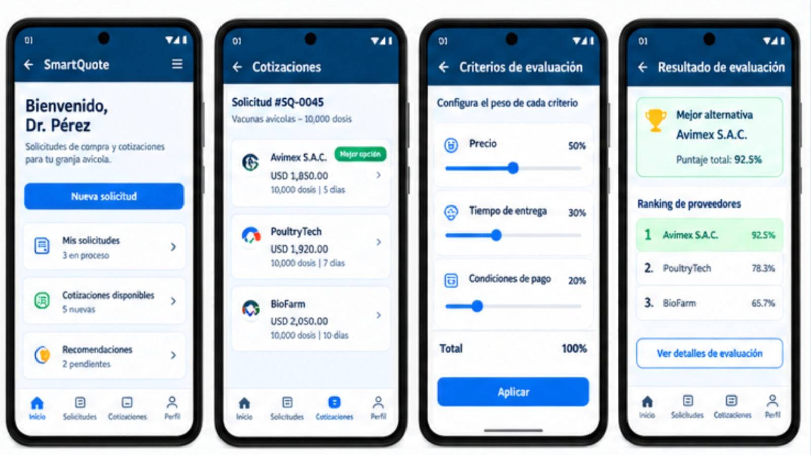

### 4.5.2. iOS Mobile Applications Prototyping

Prototipo móvil para iOS que mantiene las funcionalidades principales de SmartQuote, adaptadas a dispositivos Apple.

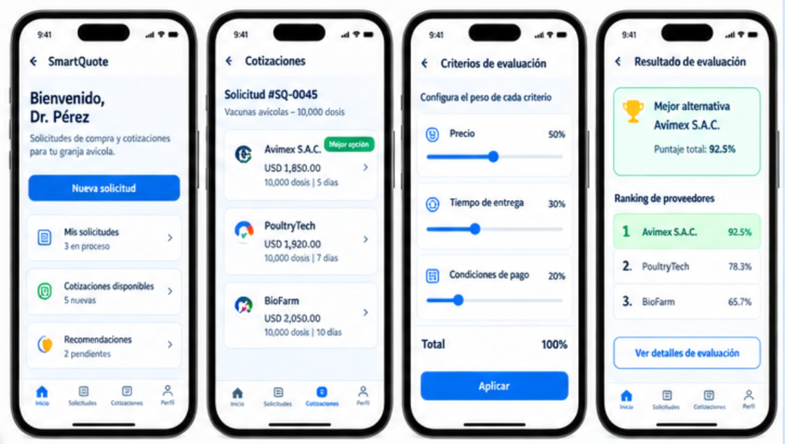

## 4.6. Web Applications UX/UI Design

### 4.6.1. Web Applications Wireframes

#### Acceso y Configuración (Universal)

##### Autenticación y Acceso

Inicio de Sesión (Login)
Boceto de baja fidelidad de la pantalla de acceso: panel izquierdo de presentación y formulario de email/contraseña a la derecha.

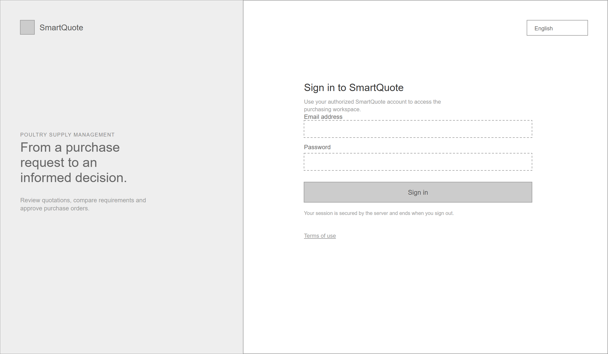

#### Production Specialist

##### Gestión de Solicitudes de Compra

Listado de Solicitudes
Estructura base de navegación lateral, buscador, tabla de solicitudes y acción principal "New request".

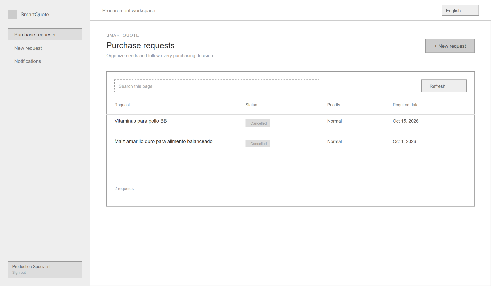

Creación de Solicitud
Distribución del formulario: fecha/prioridad, datos del ítem y bloque de requisito técnico obligatorio.

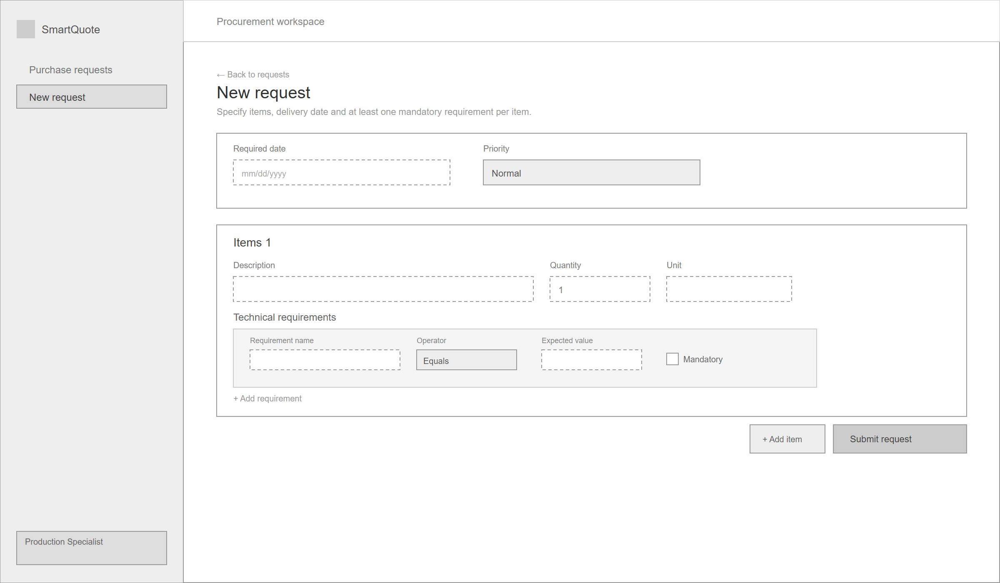

#### Purchase Analyst / Purchase Manager (Purchasing Staff)

##### Revisión y Avance de Estado

Cambio de Estado de Solicitud
Boceto del modal de transición de estado con selector de siguiente estado y campo de razón obligatorio.

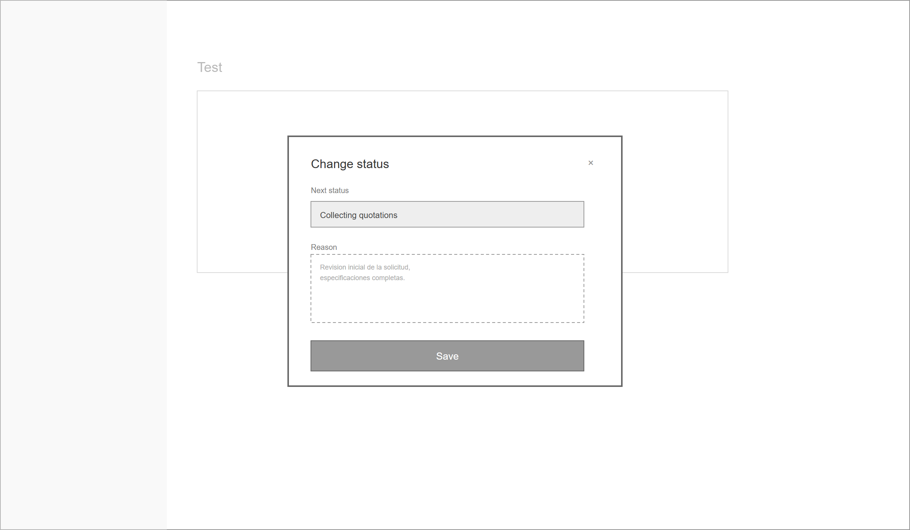

##### Gestión de Cotizaciones

Carga de Cotización
Boceto del modal de carga: datos del proveedor y selector de archivos PDF.

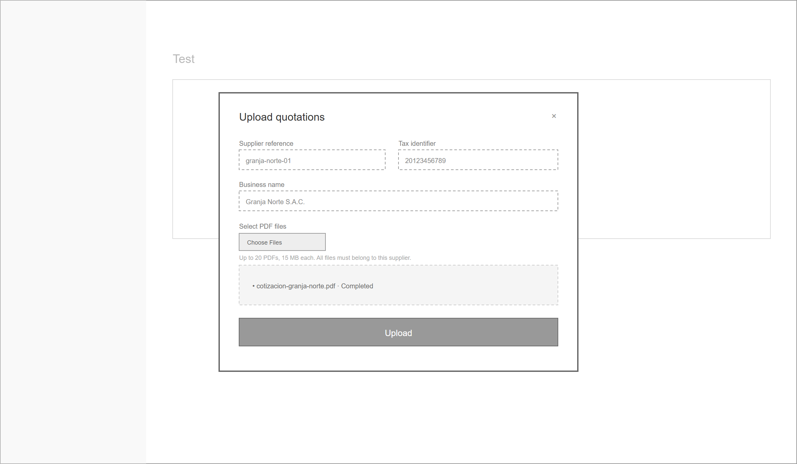

Extracción y Verificación de Cotización
Distribución de la tabla de cotizaciones junto con la grilla de campos extraídos por IA y el botón de verificación.

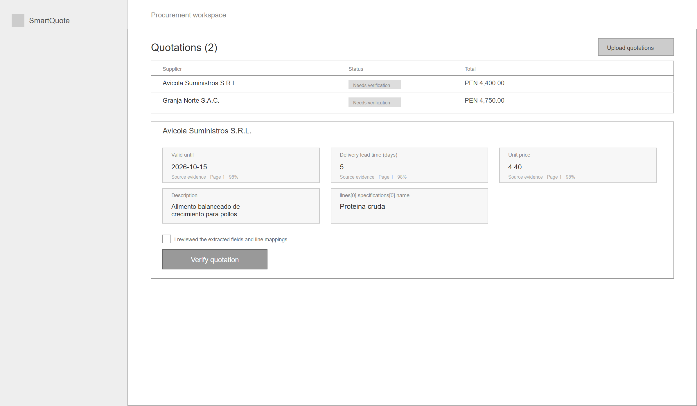

##### Evaluación Comparativa

Comparación de Cotizaciones
Boceto de la configuración de criterios ponderados, el banner de proveedor recomendado y la tabla de resultados.

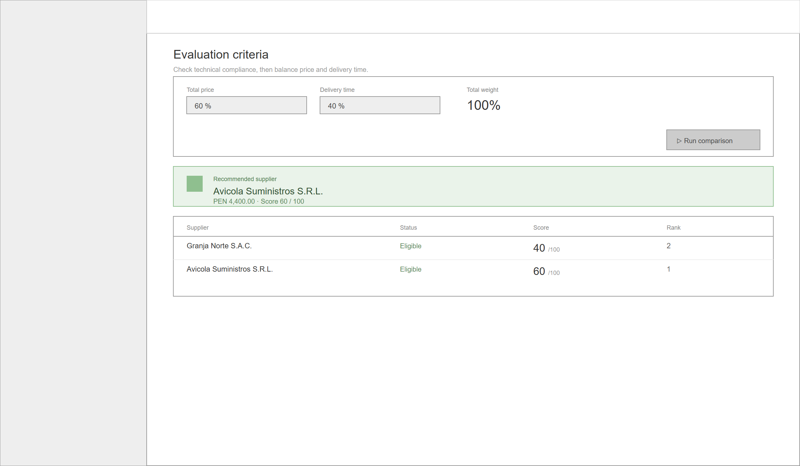

Caso Límite: Ninguna Cotización Califica
Mismo layout de comparación, mostrando el estado "Excluded" cuando ningún proveedor satisface un requisito obligatorio.

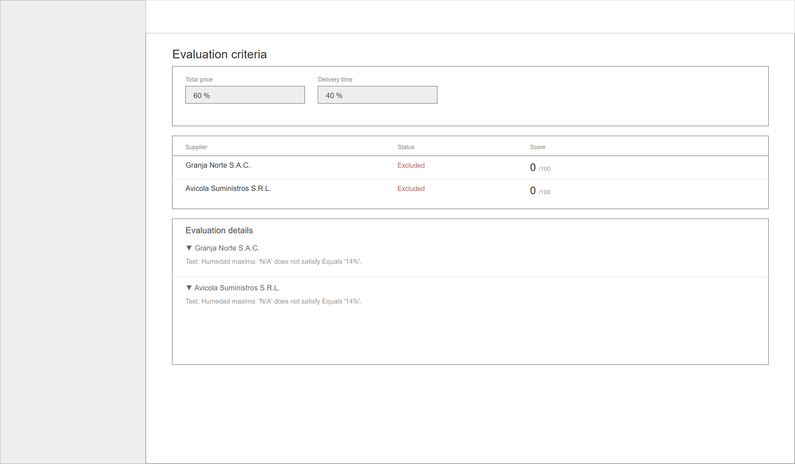

#### Purchase Manager (Exclusivo)

##### Aprobación y Orden de Compra

Orden de Compra Generada
Boceto del documento final: encabezado, proveedor/destino, tabla de ítems y total.

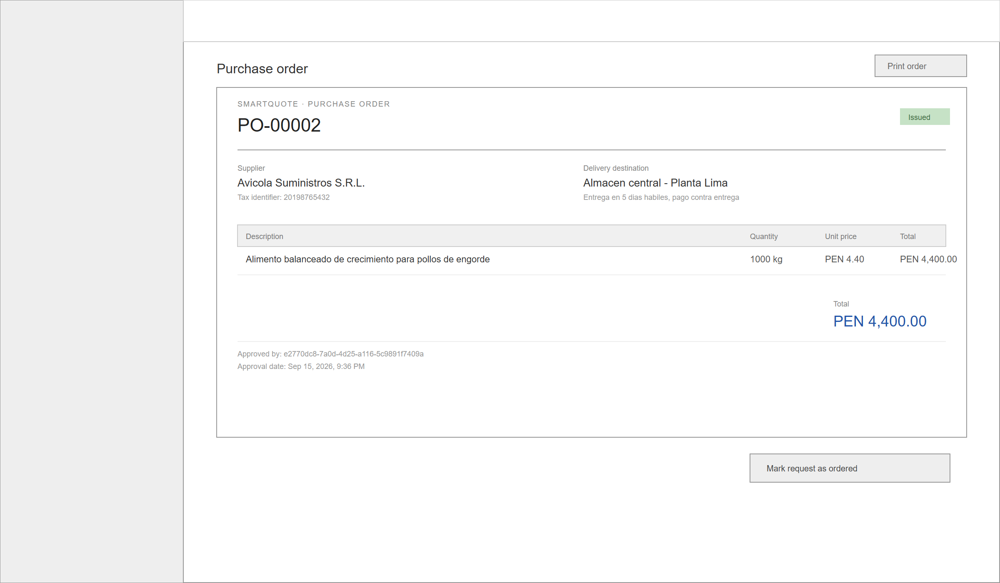

Solicitud Completada (Ordered)
Boceto del stepper de 6 estados con el último paso resaltado, junto a los paneles de ítems e información general.

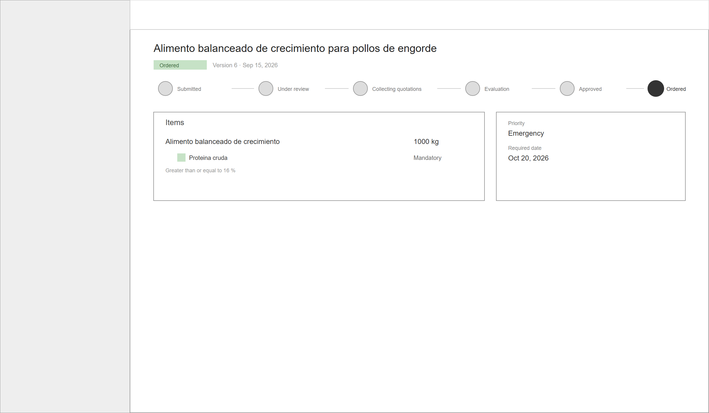

### 4.6.2. Web Applications Wireflow Diagrams

#### Task Flow 1: Registro y Seguimiento de Solicitudes de Compra

Objetivo del usuario: Registrar una necesidad de insumos desde la operación y dar seguimiento a su avance a través del flujo de aprobación.

#### Pasos del Task Flow:

1. Iniciar sesión en la sección "Ingresar con usuario".
2. Acceder a "Purchase requests" para ver el listado de solicitudes existentes.
3. Seleccionar "+ New request" y completar los ítems junto con al menos un requisito técnico obligatorio.
4. Enviar la solicitud ("Submit request"), quedando en estado Submitted.
5. Consultar el detalle de la solicitud para conocer su avance a través del stepper de 6 estados.

##### User Goal 1 (US02): Como Production Specialist, quiero registrar una solicitud de insumos desde la operación.

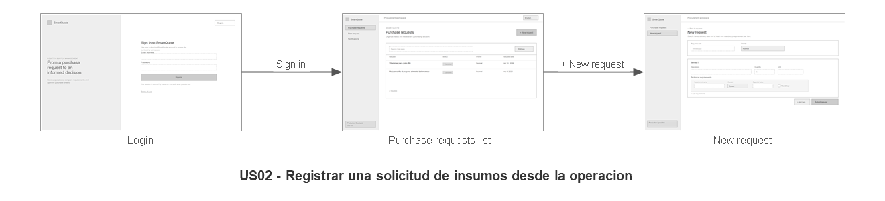

##### User Goal 2 (US03): Como Production Specialist, quiero conocer el avance de una solicitud de compra.

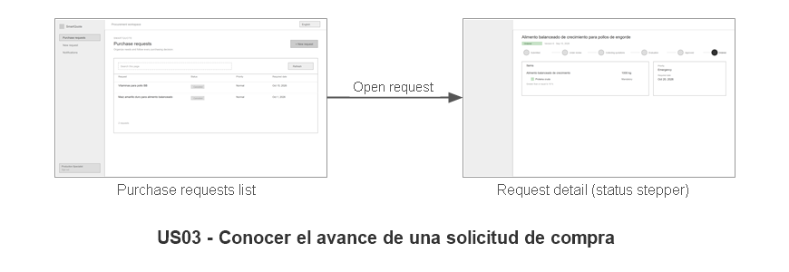

#### Segmento: Purchasing Staff (Analyst / Manager)

#### Task Flow 2: Incorporación y Verificación de Cotizaciones

Objetivo: Recopilar cotizaciones reales de proveedores y validar la información extraída automáticamente antes de evaluarlas.

#### Pasos del Task Flow:

1. Cambiar el estado de la solicitud a "Collecting quotations" desde "Change status".
2. Subir el documento PDF de la cotización junto con los datos del proveedor en "Upload quotation".
3. El sistema procesa el PDF con IA (OpenAI vía Semantic Kernel) y extrae los campos estructurados.
4. Revisar cada campo extraído junto a su nivel de confianza y evidencia de origen.
5. Corregir manualmente cualquier valor incorrecto y confirmar con "Verify quotation".

##### User Goal 3 (US04): Como Purchasing Staff, quiero incorporar cotizaciones de proveedores.

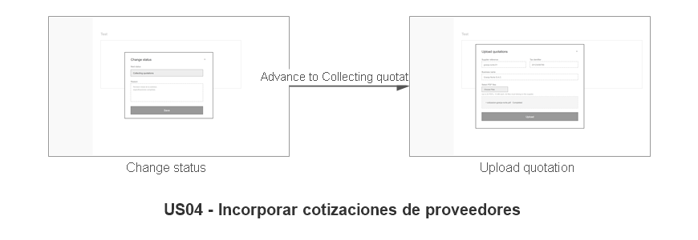

##### User Goal 4 (US05): Como Purchasing Staff, quiero verificar la información extraída de una cotización.

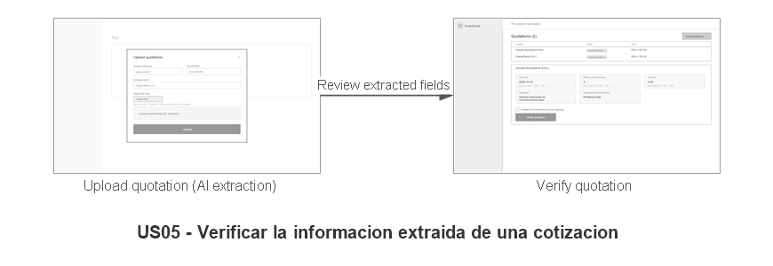

#### Task Flow 3: Evaluación Comparativa de Proveedores

Objetivo: Definir criterios de decisión y obtener una recomendación objetiva del proveedor más conveniente.

#### Pasos del Task Flow:

1. Definir los criterios ponderados (ej. Precio 60%, Tiempo de entrega 40%) y los requisitos técnicos obligatorios.
2. Ejecutar "Run comparison" para simular el puntaje de cada cotización verificada.
3. El sistema excluye automáticamente cualquier cotización que no cumpla un requisito obligatorio.
4. Revisar el resultado: proveedor recomendado y ranking, o el detalle de exclusión si ninguna calificó.

##### User Goal 5 (US06): Como Purchasing Staff, quiero definir los criterios de evaluación de cotizaciones.

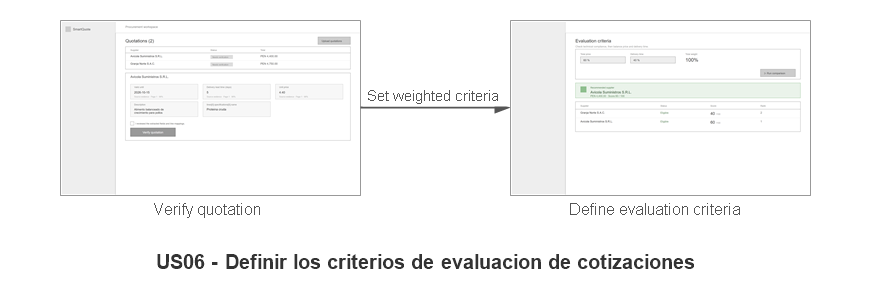

##### User Goal 6 (US07): Como Purchasing Staff, quiero simular y comparar las cotizaciones elegibles.

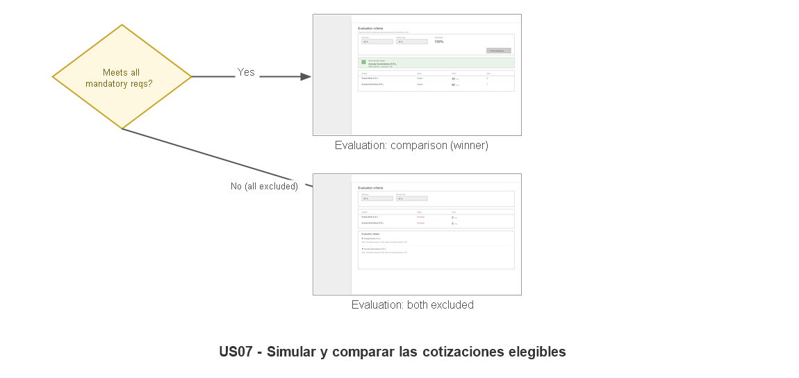

#### Segmento: Purchase Manager

#### Task Flow 4: Aprobación y Cierre de Compra

Objetivo: Formalizar la decisión de compra generando la orden correspondiente y cerrando el ciclo de vida de la solicitud.

#### Pasos del Task Flow:

1. Revisar la cotización recomendada por el motor de evaluación.
2. Completar las condiciones de entrega y el destino en "Approve and generate order".
3. El sistema genera la orden de compra (PO) con los datos consolidados.
4. Marcar la solicitud como "Ordered", cerrando el ciclo de vida completo.

##### User Goal 7 (US08): Como Purchase Manager, quiero aprobar la alternativa seleccionada y generar la orden de compra.

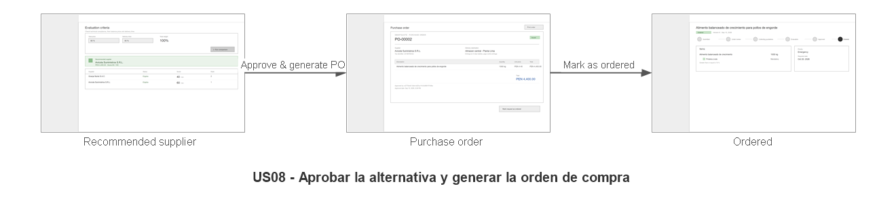


### 4.6.3. Web Applications Mock-ups

#### Acceso y Configuración (Universal)

##### Autenticación y Acceso

Inicio de Sesión (Login)
Pantalla unificada de acceso donde el usuario ingresa su email y contraseña. El sistema valida las credenciales contra el backend (JWT) y determina el rol (Production Specialist, Purchase Analyst o Purchase Manager) que define qué acciones puede realizar en el resto de la aplicación.

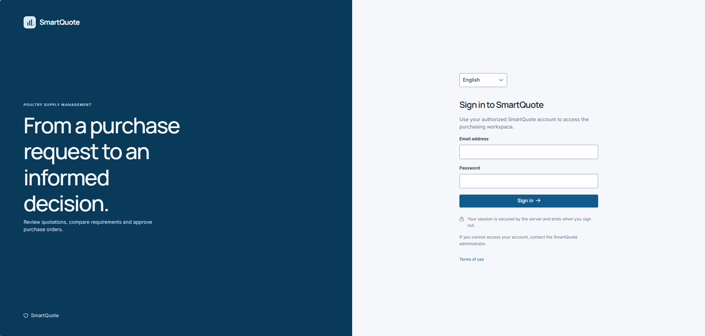

#### Production Specialist

##### Gestión de Solicitudes de Compra

Listado de Solicitudes
Vista principal del workspace donde el Production Specialist consulta todas las solicitudes de compra creadas, su estado actual dentro del flujo (Submitted, Under Review, Collecting Quotations, Evaluation, Approved, Ordered) y prioridad.

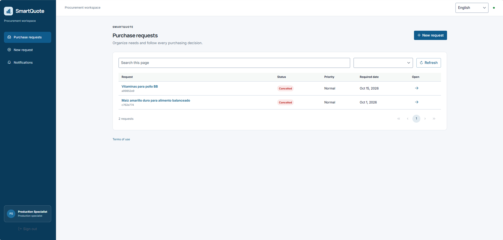

Creación de Solicitud
Formulario donde se especifican los ítems requeridos (descripción, cantidad, unidad) y al menos un requisito técnico obligatorio por ítem, garantizando que ninguna solicitud avance sin especificaciones claras para los proveedores.

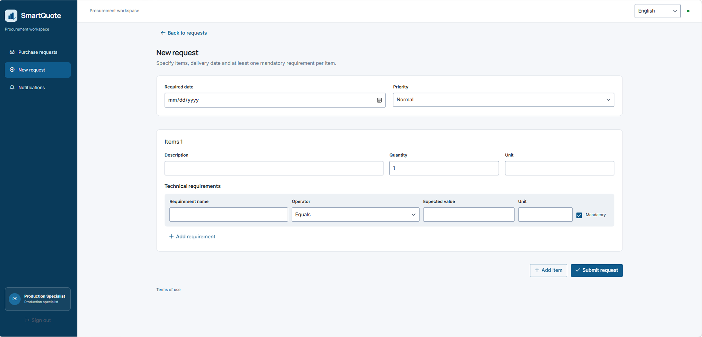

#### Purchase Analyst / Purchase Manager (Purchasing Staff)

Ambos roles comparten exactamente los mismos permisos y pantallas en esta sección del flujo (revisión, cotizaciones y evaluación) — la única diferencia entre ellos aparece más adelante, en la aprobación final de la orden de compra, exclusiva del Purchase Manager.

##### Revisión y Avance de Estado

Cambio de Estado de Solicitud
Modal que permite avanzar la solicitud a través del flujo de aprobación (Submitted → Under Review → Collecting Quotations → Evaluation), registrando una razón obligatoria por cada transición para mantener trazabilidad completa en el historial.

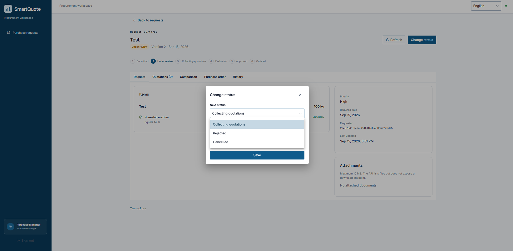

##### Gestión de Cotizaciones

Carga de Cotización
Interfaz para subir el documento PDF de la cotización de un proveedor, junto con sus datos de identificación (razón social, RUC). El backend valida que el archivo sea un PDF legible antes de aceptarlo.

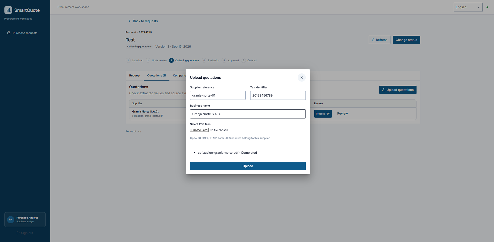

Extracción y Verificación de Cotización
Vista de revisión donde un agente de IA (OpenAI vía Semantic Kernel) muestra los campos extraídos del PDF (proveedor, moneda, vigencia, precios, especificaciones técnicas), cada uno con su nivel de confianza y evidencia de origen (página y porcentaje). El Purchasing Staff corrige valores si hace falta, mapea las líneas a los ítems solicitados y confirma con "Verify quotation".

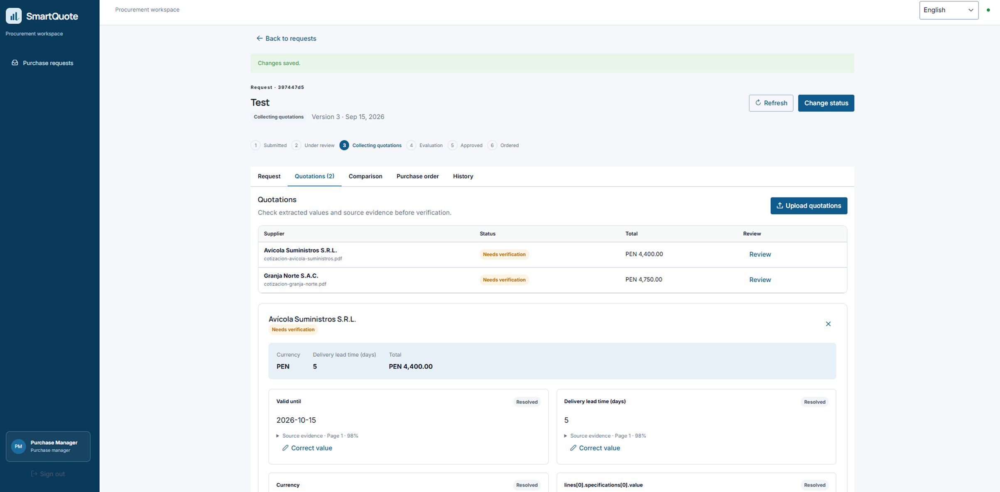

##### Evaluación Comparativa

Comparación de Cotizaciones
Resultado de la simulación que define criterios ponderados (ej. Precio 60%, Tiempo de entrega 40%), normaliza cada cotización verificada y calcula un puntaje final (0-100) con la recomendación de proveedor ganador.

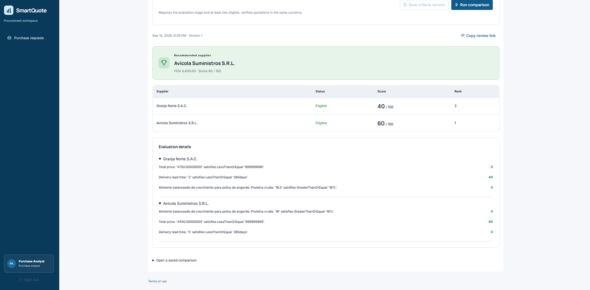

Caso Límite: Ninguna Cotización Califica
Cuando ninguna cotización satisface un requisito técnico obligatorio de la solicitud, el sistema excluye automáticamente a todos los candidatos (puntaje 0/100) en lugar de forzar una recomendación inválida — evidenciando el control de calidad del motor de evaluación.

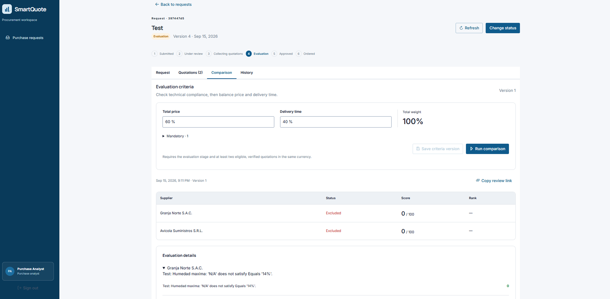

#### Purchase Manager (Exclusivo)

##### Aprobación y Orden de Compra

Orden de Compra Generada
Documento final generado tras la aprobación del Purchase Manager, con los datos consolidados de la negociación: proveedor ganador, ítems, precios, condiciones de entrega y destino.

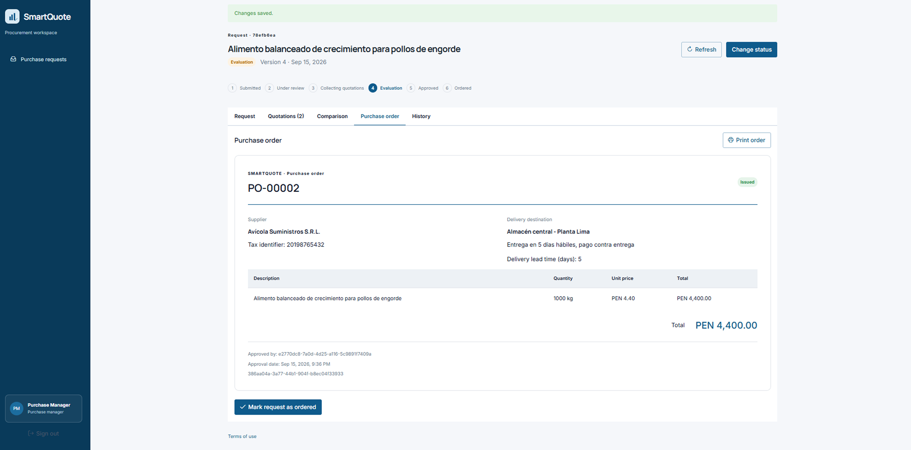

Solicitud Completada (Ordered)
Estado final del ciclo de vida de la solicitud, confirmando que el proceso de principio a fin —desde la solicitud del Production Specialist hasta la orden de compra del Purchase Manager— se completó exitosamente.

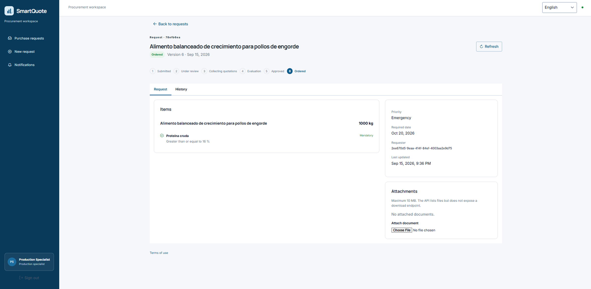

### 4.6.4. Web Applications User Flow Diagrams

### User Flows

#### User Flow 1:

Relacionado con User Goal 1 (US02):
Como Production Specialist, quiero registrar una solicitud de insumos desde la operación.

El usuario inicia sesión y accede al listado de "Purchase requests". Selecciona "+ New request" y completa los datos del ítem (descripción, cantidad, unidad) junto con al menos un requisito técnico marcado como obligatorio. Al enviar la solicitud, el sistema la registra en estado "Submitted" y la refleja en el listado principal.

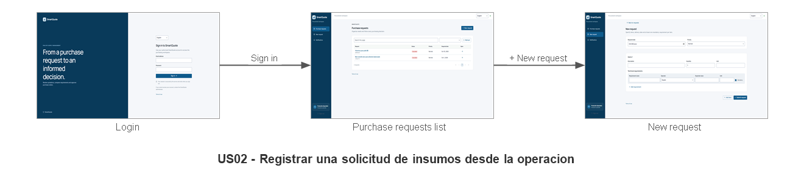

#### User Flow 2:

Relacionado con User Goal 2 (US03):
Como Production Specialist, quiero conocer el avance de una solicitud de compra.

Desde el listado de solicitudes, el usuario abre el detalle de una solicitud específica. El sistema muestra un stepper de seis estados (Submitted, Under review, Collecting quotations, Evaluation, Approved, Ordered) que le permite identificar en qué etapa exacta del proceso de compra se encuentra, sin necesidad de contactar al equipo de compras.

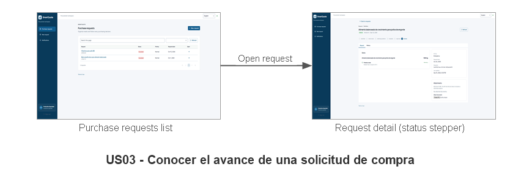

#### User Flow 3:

Relacionado con User Goal 3 (US04):
Como Purchasing Staff, quiero incorporar cotizaciones de proveedores.

El Purchasing Staff cambia el estado de la solicitud a "Collecting quotations" y accede al formulario de carga de cotización, donde ingresa los datos del proveedor (razón social, RUC) y selecciona el archivo PDF correspondiente. El sistema valida que el documento sea un PDF legible antes de aceptarlo y lo asocia a la solicitud.

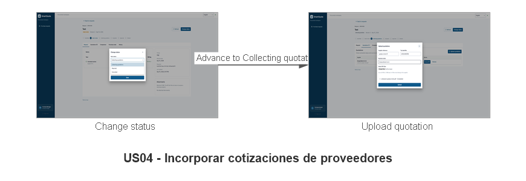

#### User Flow 4:

Relacionado con User Goal 4 (US05):
Como Purchasing Staff, quiero verificar la información extraída de una cotización.

Tras la carga, un agente de IA procesa el PDF y extrae automáticamente los campos estructurados (proveedor, moneda, vigencia, precios, especificaciones técnicas), cada uno con su nivel de confianza y evidencia de origen. El Purchasing Staff revisa estos valores, corrige cualquier campo incorrecto y confirma la cotización como verificada para que quede disponible en la evaluación comparativa.

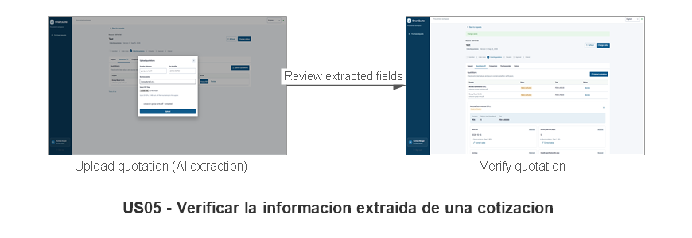

#### User Flow 5:

Relacionado con User Goal 5 (US06):
Como Purchasing Staff, quiero definir los criterios de evaluación de cotizaciones.

El usuario accede a la pestaña de comparación y define los criterios ponderados que se usarán para evaluar a los proveedores (por ejemplo, Precio 60% y Tiempo de entrega 40%), además de los requisitos técnicos obligatorios heredados de la solicitud original.

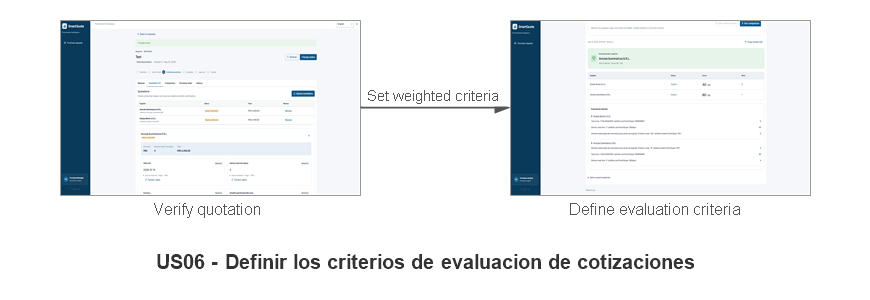

#### User Flow 6:

Relacionado con User Goal 6 (US07):
Como Purchasing Staff, quiero simular y comparar las cotizaciones elegibles.

Al ejecutar "Run comparison", el sistema normaliza cada criterio ponderado entre las cotizaciones verificadas y calcula un puntaje final de 0 a 100. Si alguna cotización no satisface un requisito técnico obligatorio, queda excluida automáticamente con puntaje 0, evitando que el sistema recomiende una alternativa inválida.

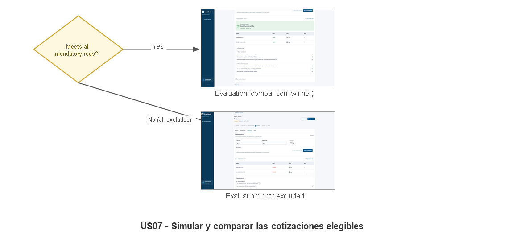

#### User Flow 7:

Relacionado con User Goal 7 (US08):
Como Purchase Manager, quiero aprobar la alternativa seleccionada y generar la orden de compra.

El Purchase Manager revisa la cotización recomendada por el motor de evaluación y completa las condiciones de entrega y el destino final. Al confirmar, el sistema genera la orden de compra (PO) con los datos consolidados de la negociación y permite marcar la solicitud como "Ordered", cerrando su ciclo de vida completo.

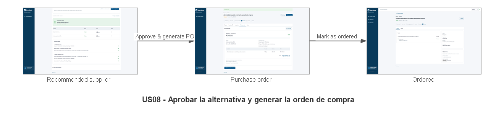

## 4.7. Web Applications Prototyping

Las decisiones de interacción se basaron en principios fundamentales de diseño como el contraste para resaltar elementos críticos como el estado "Excluida" de una cotización y el botón "Ejecutar simulación", la repetición para garantizar consistencia visual entre las vistas del Analista de Adquisiciones y del Jefe de Adquisiciones (Purchase Manager), la alineación para lograr una navegación clara entre los módulos Solicitudes, Cotizaciones, Evaluación y Órdenes de compra, y la proximidad para mejorar la agrupación lógica de contenidos relacionados, como los ítems de una solicitud junto con sus requisitos técnicos, o cada cotización junto con sus campos extraídos y su nivel de confianza. Estos principios se aplicaron de forma integral en toda la aplicación web, priorizando una experiencia funcional y consistente que respalde una decisión de compra verificable.

Desde el punto de vista de arquitectura de información, la aplicación web de SmartQuote utiliza una navegación jerárquica en su dashboard, combinada con un organizador secuencial en el flujo de evaluación (Solicitud → Cotizaciones → Criterios → Simulación → Orden), que impide avanzar a una simulación mientras existan cotizaciones sin verificar. Además, se establecieron sistemas de etiquetado derivados del Ubiquitous Language del proyecto, categorización del contenido por bounded context (Solicitudes, Cotizaciones, Evaluación, Órdenes), y filtros por estado del proceso que permiten una interacción eficiente y dirigida a la tarea del analista.

En cada caso, se han implementado interacciones responsivas (hover, focus, estados deshabilitados), validaciones visuales en formularios, retroalimentaciones de acción (confirmaciones y mensajes de error), y patrones de navegación adaptados al perfil de usuario autenticado (Analista de Adquisiciones o Jefe de Adquisiciones), de modo que solo este último puede aprobar una alternativa y generar la orden de compra. Esto garantiza que tanto el acceso a la información como la ejecución de tareas sea coherente, accesible y orientada a sustentar cada decisión de compra con evidencia trazable. A continuación, se incluye un screenshot extraído de un video de la aplicación web, en donde se demuestran y explican los principales flujos de interacción que cubre el prototipo desarrollado.

[WebApp Prototype](https://upcedupe-my.sharepoint.com/:v:/g/personal/u202424059_upc_edu_pe/IQAcC97wx3i_QpIJfEWrR3D7AfYPYAkXvNQRmb0vAu84Y_o?e=k0UWGe)


## 4.8. Domain-Driven Software Architecture

### Architecture Overview Diagram

La arquitectura de **SmartQuote** adopta un **monolito modular** basado en *Domain-Driven Design* (DDD) y *Clean Architecture*. El backend se despliega como una sola aplicación ASP.NET Core, pero organiza el modelo y los casos de uso en módulos con límites de negocio explícitos. Esta decisión permite mantener consistencia transaccional durante la primera etapa del producto sin perder la separación necesaria para que cada módulo pueda evolucionar de forma independiente.

La solución se divide en los siguientes *bounded contexts*:

| Bounded Context | Clasificación | Responsabilidad principal |
| --- | --- | --- |
| **Supply Requests Context** | Supporting Domain | Registra las solicitudes de insumos provenientes de la granja, sus requerimientos técnicos y biológicos, prioridad, archivos adjuntos y estado de atención. |
| **Quotation Intake Context** | Supporting Domain | Recibe cotizaciones en formatos heterogéneos, coordina la extracción mediante IA, conserva el nivel de confianza y permite verificar o corregir los datos obtenidos. |
| **Evaluation & Simulation Context** | Core Domain | Define escenarios de evaluación, aplica primero las reglas técnicas obligatorias y después pondera criterios como precio y plazo de entrega para producir un ranking y una recomendación trazable. |
| **Purchase Ordering Context** | Supporting Domain | Autoriza el resultado seleccionado y genera una orden de compra idempotente a partir de una simulación aprobada, preservando la trazabilidad de la decisión. |

El flujo principal del dominio avanza desde la solicitud del insumo hasta la emisión de la orden de compra: **Supply Requests → Quotation Intake → Evaluation & Simulation → Purchase Ordering**. Los contextos no acceden directamente a los modelos internos de otros módulos; intercambian identificadores, contratos de aplicación y *snapshots* inmutables. De esta manera, una simulación conserva los datos con los que fue ejecutada y una orden de compra mantiene la evidencia de la recomendación que le dio origen.

En el backend, cada contexto contiene las capas **Domain**, **Application**, **Infrastructure** e **Interfaces**. En la aplicación web se emplean **Domain**, **Application**, **Infrastructure** y **Presentation**. Las dependencias apuntan hacia el dominio: la presentación ejecuta casos de uso, la infraestructura implementa los puertos definidos por la aplicación y el dominio permanece independiente de frameworks, bases de datos y servicios externos.

Aunque el backend utiliza un único contenedor PostgreSQL, cada contexto es propietario de sus datos y los accede mediante adaptadores de persistencia específicos. Del mismo modo, la comunicación con OpenAI queda encapsulada dentro de la infraestructura de **Quotation Intake**, evitando que el proveedor de IA se convierta en una dependencia del dominio.

### 4.8.1. Software Architecture Context Diagram

El diagrama de contexto presenta a **SmartQuote** como una caja negra y delimita las interacciones que determinan el alcance del sistema. El **Poultry Purchase Analyst** carga y verifica cotizaciones, configura simulaciones, analiza resultados y gestiona la emisión de órdenes de compra. El **Poultry Production Specialist / Veterinarian** registra desde la granja las solicitudes de alimentos, medicamentos o vacunas con sus especificaciones técnicas, y consulta su estado de atención.

La **OpenAI Platform / LLM Service** es el único sistema externo representado. SmartQuote la consume mediante HTTPS para interpretar cotizaciones no estructuradas y obtener una salida estructurada. La decisión de aceptación, corrección, evaluación y compra permanece bajo el control de SmartQuote y sus usuarios; el servicio externo no accede directamente a la base de datos ni ejecuta reglas del negocio.


### 4.8.2. Software Architecture Container Diagrams

El diagrama de contenedores descompone SmartQuote en las aplicaciones ejecutables y almacenes de datos que participan en la solución. La separación responde a los canales de interacción de cada actor y concentra las reglas de negocio en el backend.

| Contenedor | Tecnología | Responsabilidad |
| --- | --- | --- |
| **Landing Page** | HTML5, CSS3 y JavaScript | Comunica la propuesta de valor de SmartQuote, presenta el servicio SaaS y permite a los visitantes conocer el producto. |
| **Web Application** | Vue.js, PrimeVue y Material Design | Permite al analista consultar solicitudes, cargar y verificar cotizaciones, configurar simulaciones, revisar resultados y gestionar órdenes de compra. |
| **Native Mobile Application** | Flutter y Dart para Android | Permite al especialista de producción o veterinario registrar solicitudes de insumos desde la granja y consultar su estado e historial. |
| **Web Services RESTful API** | ASP.NET Core y C# | Expone los casos de uso, aplica las reglas del dominio, controla la seguridad, coordina la persistencia y orquesta la extracción de cotizaciones mediante Semantic Kernel y OpenAI. |
| **Database** | PostgreSQL | Almacena la información estructurada de los cuatro contextos mediante esquemas y adaptadores de persistencia lógicamente separados. |

Las aplicaciones web y móvil consumen el API mediante HTTPS/JSON. El API es el único contenedor con acceso a PostgreSQL y con autorización para invocar el servicio de OpenAI; por ello, las credenciales, reglas de negocio y transacciones no se exponen en los clientes. La Landing Page es estática e independiente de las operaciones internas del sistema.


### 4.8.3. Software Architecture Components Diagrams

Los diagramas de componentes detallan la organización interna del API REST, la aplicación web y la aplicación móvil. En el backend y la aplicación web se conserva la misma división por *bounded contexts*, mientras que cada módulo aplica las responsabilidades de *Clean Architecture* correspondientes a su plataforma.

#### Web Services RESTful API (`smartquote-web-services`)

El API se implementa como un monolito modular en ASP.NET Core. Los controladores de la capa **Interfaces** reciben las solicitudes HTTP; la capa **Application** coordina casos de uso y contratos; la capa **Domain** contiene agregados, objetos de valor y servicios de dominio; y **Infrastructure** implementa persistencia e integraciones externas. Un despachador de eventos en proceso permite comunicar hechos de negocio sin crear dependencias directas entre los modelos internos de los contextos.


##### Supply Requests Context

Este contexto es propietario del agregado `PurchaseRequest`, de los requerimientos técnicos y de las transiciones de estado de una solicitud. `PurchaseRequestsController` expone el registro, la consulta de estado y el historial; **Purchase Request Application** ejecuta los casos de uso y publica contratos de consulta; y el adaptador de persistencia implementa los puertos del módulo mediante Entity Framework Core y un esquema PostgreSQL propio.


##### Quotation Intake Context

Este contexto administra el ciclo de recepción, extracción, verificación y corrección de las cotizaciones. `PoultryQuotesController` recibe los documentos y las acciones del analista, mientras `QuoteExtractionService` coordina el procesamiento y conserva los valores extraídos, niveles de confianza y correcciones. `SemanticKernelAgentConnector` implementa el puerto de extracción con IA, valida la salida estructurada y conserva como no resueltos los datos que no puede determinar con suficiente certeza, sin inventar información comercial.


##### Evaluation & Simulation Context — Core Domain

Este es el **Core Domain** de SmartQuote porque transforma solicitudes y cotizaciones verificadas en una decisión comparable y trazable. `SimulationsController` expone la configuración de criterios, la ejecución y la consulta de resultados; **Simulation Application** obtiene *snapshots* inmutables de las entradas y versiona los escenarios; y `SimulationEngine` descarta primero las ofertas que incumplen requisitos técnicos obligatorios antes de aplicar ponderaciones de precio y tiempo de entrega. El resultado contiene exclusiones, puntajes, ranking y recomendación, de modo que distintos escenarios no alteran la evidencia de ejecuciones anteriores.


##### Purchase Ordering Context

Este contexto convierte una simulación aprobada en una orden de compra. `PurchaseOrdersController` expone la aprobación y generación; **Purchase Order Application** comprueba la autorización y vigencia del resultado; y `PurchaseOrderGenerator` construye el agregado `PurchaseOrder` a partir de un *snapshot* de la decisión. El adaptador de persistencia aplica idempotencia para impedir que una misma aprobación genere órdenes duplicadas y conserva la referencia hacia la simulación de origen.


#### Web Application (`smartquote-frontend-web`)

La aplicación web se implementa como un monolito modular de cliente con Vue.js, PrimeVue, Pinia y JavaScript. Cada contexto contiene componentes de **Presentation**, casos de uso y estado en **Application**, modelos del lado cliente en **Domain** y un repositorio HTTP en **Infrastructure**. El **Application Shell**, Vue Router, el cliente HTTP común y los tipos verdaderamente genéricos residen en `Shared`; las reglas y modelos particulares permanecen dentro del contexto que los posee.


##### Supply Requests Context

La presentación permite al analista consultar las solicitudes y seleccionar la que será atendida con cotizaciones. La capa de aplicación coordina estas consultas y mantiene únicamente el estado necesario del módulo en Pinia. El repositorio del contexto implementa el contrato de acceso al API, mientras el dominio del cliente representa solicitudes, requerimientos técnicos, prioridad y estado sin reutilizar directamente las entidades del backend.


##### Quotation Intake Context

Este módulo reúne las vistas para cargar documentos, observar el estado de extracción, verificar la información obtenida y registrar correcciones. Su capa de aplicación coordina esas operaciones y mantiene el estado de las cotizaciones pendientes. El repositorio HTTP traduce las acciones del cliente a los endpoints del API y el modelo de dominio del frontend representa cotizaciones, líneas, niveles de confianza y estado de verificación.


##### Evaluation & Simulation Context — Core Domain

El módulo de simulación contiene el tablero donde el analista configura escenarios, ejecuta comparaciones y revisa exclusiones, puntajes, rankings y recomendaciones. La capa de aplicación controla el estado de cada escenario y ejecución, y el repositorio consume las operaciones de simulación del API. Los modelos del cliente permiten presentar criterios, reglas de elegibilidad y resultados sin trasladar al navegador el algoritmo de decisión, que permanece en el backend.


##### Purchase Ordering Context

Este módulo presenta el resultado aprobado, permite solicitar la generación de la orden y consultar su detalle. La capa de aplicación coordina la aprobación y conserva su estado, mientras el repositorio del contexto consume los endpoints correspondientes. El dominio del cliente representa la orden, sus líneas, el estado de aprobación y la referencia a la simulación, pero la validación definitiva y la generación idempotente se ejecutan exclusivamente en el backend.


#### Native Mobile Application (`smartquote-native-mobile`)

La aplicación Flutter se concentra inicialmente en **Supply Requests Context**, porque el especialista de producción o veterinario necesita registrar desde el campo los insumos y requerimientos biológicos, además de consultar el estado e historial de sus solicitudes. `RequestFormWidget` y `RequestTrackingList` conforman la presentación; `RequestStateController` administra los estados de carga, éxito y error; y los casos de uso de registro y seguimiento dependen de un repositorio REST, no de una implementación de red concreta.

El cliente HTTP, el almacenamiento seguro de credenciales y los tipos genéricos se mantienen en **Shared**. Esta carpeta brinda capacidades técnicas comunes, pero no contiene reglas del negocio ni constituye otro *bounded context*. Si el alcance móvil crece en iteraciones posteriores, los nuevos módulos deberán incorporarse respetando los mismos límites del dominio.


## 4.9. Software Object-Oriented Design

### 4.9.1. Class Diagrams

Los diagramas de clases representan el modelo interno del backend para cada *bounded context*. Se mantiene la separación de **Clean Architecture**: las interfaces reciben las solicitudes REST, la aplicación coordina los casos de uso, el dominio concentra las reglas de negocio y la infraestructura implementa persistencia o integraciones externas. Cada contexto posee su propio agregado raíz y sus objetos de valor; la comunicación entre contextos se realiza mediante contratos de aplicación y snapshots, no mediante referencias directas a entidades ajenas.

#### 4.9.1.1. Supply Requests Context

El agregado raíz `PurchaseRequest` representa la necesidad de abastecimiento registrada por el especialista de producción o sanidad. El agregado contiene los ítems solicitados, sus requisitos técnicos, los archivos de sustento y el historial de estados. `PurchaseRequestCommandService` coordina el registro, los adjuntos y las transiciones, mientras `PurchaseRequestQueryService` atiende las consultas y publica un `PurchaseRequestSnapshot` de solo lectura para los contextos que necesitan evaluar la solicitud. La persistencia se implementa mediante un repositorio PostgreSQL y los cambios de estado generan eventos de dominio que pueden activar la notificación al solicitante.


#### 4.9.1.2. Quotation Intake Context

El agregado `PoultryQuote` encapsula una cotización asociada a una solicitud, su proveedor, documento de origen, líneas y campos extraídos. `QuoteExtractionService` coordina la carga, el procesamiento, la confirmación y la corrección de datos. El puerto `IQuoteExtractionAgent` permite conectar `SemanticKernelAgentConnector` con OpenAI sin introducir esa dependencia en el dominio. Cada campo conserva su nivel de confianza, referencia al documento y registro de correcciones; por ello, una cotización no puede marcarse como verificada si mantiene datos críticos sin resolver. Las cotizaciones verificadas se exponen como `VerifiedQuotationSnapshot` para el contexto de evaluación.


#### 4.9.1.3. Evaluation & Simulation Context — Core Domain

`EvaluationScenario` es el agregado que versiona los criterios de una evaluación. Sus criterios pueden ser obligatorios o ponderados y pertenecen a las categorías de cumplimiento técnico, precio y plazo de entrega. `SimulationEngine` es el servicio de dominio central: recibe un conjunto local de datos, aplica primero las reglas obligatorias, excluye las ofertas no elegibles y calcula el puntaje ponderado de las restantes. `SimulationRun` conserva las evaluaciones, exclusiones, ranking, recomendación y la `InputFingerprint` formada por las versiones de la solicitud, cotizaciones y criterios. Esta huella permite comprobar que una ejecución sigue vigente y que el mismo conjunto de entradas produce un resultado determinista. El contexto publica un `ApprovedSimulationSnapshot` para Purchase Ordering.


#### 4.9.1.4. Purchase Ordering Context

El agregado raíz `PurchaseOrder` representa la orden emitida a partir de una decisión de simulación aprobada. `PurchaseOrderApplicationService` valida la autorización, solicita al contexto de evaluación un `ApprovedSimulationSnapshot`, lo transforma mediante `ApprovedDecisionMapper` y delega la construcción a `PurchaseOrderGenerator`. La orden conserva el proveedor, las partidas, las condiciones de entrega y la referencia a la solicitud, cotización y simulación de origen. `Approval` incluye una clave idempotente; junto con las restricciones únicas del repositorio PostgreSQL, evita que una solicitud repetida genere órdenes duplicadas.


#### 4.9.1.5. Identity & Access Management Context

El contexto **Identity & Access Management (IAM)** concentra la autenticación y la identidad transversal de SmartQuote. `UserAccount` es el agregado raíz y conserva el correo normalizado, el nombre, el hash de contraseña, el estado de la cuenta y las relaciones con `UserRole` y `RefreshSession`. `AuthenticationService` coordina el inicio de sesión, la renovación y revocación de sesiones y la consulta del usuario autenticado mediante puertos de aplicación, sin acoplar el dominio a ASP.NET Core, JWT, Entity Framework Core o PostgreSQL.

`AuthController` expone los endpoints REST de login, refresh, logout y consulta del usuario actual. Los adaptadores `AspNetPasswordHasher`, `JwtAccessTokenIssuer` y `RefreshTokenGenerator` implementan las políticas técnicas detrás de sus interfaces. Las demás áreas del sistema reciben la identidad mediante los claims del usuario actual y no acceden directamente a la persistencia de IAM.

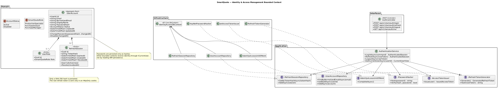

### 4.9.2. Class Dictionary

El diccionario de clases especifica las clases, interfaces, objetos de valor, enumeraciones y eventos que aparecen en los diagramas de clases del backend. La nomenclatura conserva el idioma inglés definido para el código C# y cada ficha identifica el *bounded context*, la responsabilidad, los atributos y las operaciones visibles en el diagrama. Los tipos `UUID` representados en PlantUML se implementan como `Guid` en .NET; las colecciones `IReadOnlyList` representan listas de solo lectura cuyo tipo de elemento está definido por el contrato correspondiente.

Las clases genéricas de **Shared** se reutilizan en los cinco contextos y se documentan una sola vez. Las demás clases se agrupan por *bounded context*.

#### Shared (tipos genéricos)

##### `AggregateRoot<TId>`

- **Bounded Context:** Shared (reutilizado por todos los contextos).
- **Descripción / propósito:** Clase abstracta base para los agregados del dominio. Define el concepto común de una raíz de agregado identificada por un tipo de identificador `TId` y sirve como punto de consistencia transaccional.

**Atributos**

| Visibilidad | Atributo | Tipo | Descripción |
|---|---|---|---|
| — | — | — | El diagrama no declara atributos explícitos. |

**Operaciones**

| Visibilidad | Operación | Retorno | Descripción |
|---|---|---|---|
| — | — | — | El diagrama no declara operaciones explícitas. |

##### `IDomainEvent`

- **Bounded Context:** Shared (reutilizado por todos los contextos).
- **Descripción / propósito:** Contrato marcador para los eventos de dominio publicados por los agregados cuando ocurre un cambio relevante.

**Atributos**

| Visibilidad | Atributo | Tipo | Descripción |
|---|---|---|---|
| — | — | — | Una interfaz no declara atributos en el diagrama. |

**Operaciones**

| Visibilidad | Operación | Retorno | Descripción |
|---|---|---|---|
| — | — | — | Una interfaz marcadora no declara operaciones en el diagrama. |

##### `UserId`

- **Bounded Context:** Shared (reutilizado por todos los contextos).
- **Descripción / propósito:** Objeto de valor que representa de forma tipada e inmutable al usuario que origina o autoriza una operación.

**Atributos**

| Visibilidad | Atributo | Tipo | Descripción |
|---|---|---|---|
| `+` | `Value` | `Guid` | Identificador único del usuario. |

**Operaciones**

| Visibilidad | Operación | Retorno | Descripción |
|---|---|---|---|
| — | — | — | No se muestran operaciones propias. |

##### `Money`

- **Bounded Context:** Shared (reutilizado por Quotation Intake, Evaluation & Simulation y Purchase Ordering).
- **Descripción / propósito:** Objeto de valor que mantiene un importe junto con su moneda para impedir cálculos monetarios ambiguos entre contextos.

**Atributos**

| Visibilidad | Atributo | Tipo | Descripción |
|---|---|---|---|
| `+` | `Amount` | `decimal` | Importe monetario. |
| `+` | `Currency` | `string` | Código o denominación de la moneda. |

**Operaciones**

| Visibilidad | Operación | Retorno | Descripción |
|---|---|---|---|
| — | — | — | No se muestran operaciones propias. |

#### 4.9.2.1. Supply Requests Context

##### `PurchaseRequestsController`

- **Bounded Context:** Supply Requests — Interfaces.
- **Descripción / propósito:** Punto de entrada HTTP de ASP.NET Core para registrar solicitudes de abastecimiento, consultar su información e historial y cambiar su estado.

**Atributos**

| Visibilidad | Atributo | Tipo | Descripción |
|---|---|---|---|
| — | — | — | El controlador no declara atributos en el diagrama. |

**Operaciones**

| Visibilidad | Operación | Retorno | Descripción |
|---|---|---|---|
| `+` | `Register(request)` | `ActionResult` | Registra una nueva solicitud de insumos. |
| `+` | `GetById(requestId)` | `ActionResult` | Obtiene una solicitud por su identificador. |
| `+` | `GetHistory(requestId)` | `ActionResult` | Devuelve el historial de estados de una solicitud. |
| `+` | `ChangeStatus(requestId, request)` | `ActionResult` | Solicita la transición de estado de la solicitud. |

##### `PurchaseRequestCommandService`

- **Bounded Context:** Supply Requests — Application.
- **Descripción / propósito:** Servicio de aplicación que coordina los casos de uso que modifican el agregado `PurchaseRequest` y delega la persistencia a un puerto.

**Atributos**

| Visibilidad | Atributo | Tipo | Descripción |
|---|---|---|---|
| — | — | — | No se muestran atributos propios. |

**Operaciones**

| Visibilidad | Operación | Retorno | Descripción |
|---|---|---|---|
| `+` | `Register(command)` | `PurchaseRequestId` | Crea y registra una solicitud. |
| `+` | `AddAttachment(command)` | `void` | Asocia un adjunto a una solicitud existente. |
| `+` | `ChangeStatus(command)` | `void` | Ejecuta una transición de estado validada. |

##### `PurchaseRequestQueryService`

- **Bounded Context:** Supply Requests — Application.
- **Descripción / propósito:** Servicio de aplicación de solo lectura para consultar solicitudes, su historial y el contrato publicado a otros contextos.

**Atributos**

| Visibilidad | Atributo | Tipo | Descripción |
|---|---|---|---|
| — | — | — | No se muestran atributos propios. |

**Operaciones**

| Visibilidad | Operación | Retorno | Descripción |
|---|---|---|---|
| `+` | `GetById(requestId)` | `PurchaseRequestView` | Obtiene la vista de una solicitud. |
| `+` | `GetHistory(requestId)` | `RequestHistoryView` | Obtiene los cambios de estado registrados. |
| `+` | `GetSnapshot(requestId)` | `PurchaseRequestSnapshot` | Publica una copia versionada de solo lectura. |

##### `IPurchaseRequestRepository`

- **Bounded Context:** Supply Requests — Application (puerto).
- **Descripción / propósito:** Abstracción de persistencia requerida por la aplicación para mantener el agregado sin depender de Entity Framework Core ni de PostgreSQL.

**Atributos**

| Visibilidad | Atributo | Tipo | Descripción |
|---|---|---|---|
| — | — | — | Una interfaz de puerto no declara atributos. |

**Operaciones**

| Visibilidad | Operación | Retorno | Descripción |
|---|---|---|---|
| `+` | `GetByIdAsync(requestId)` | `PurchaseRequest` | Recupera el agregado solicitado. |
| `+` | `AddAsync(request)` | `void` | Persiste una nueva solicitud. |
| `+` | `UpdateAsync(request)` | `void` | Persiste cambios de una solicitud. |

##### `IRequestNotificationPort`

- **Bounded Context:** Supply Requests — Application (puerto).
- **Descripción / propósito:** Puerto que desacopla la notificación de cambios de estado de la implementación concreta de mensajería o notificaciones internas.

**Atributos**

| Visibilidad | Atributo | Tipo | Descripción |
|---|---|---|---|
| — | — | — | Una interfaz de puerto no declara atributos. |

**Operaciones**

| Visibilidad | Operación | Retorno | Descripción |
|---|---|---|---|
| `+` | `NotifyStatusChanged(event)` | `void` | Notifica que cambió el estado de una solicitud. |

##### `IPurchaseRequestSnapshotProvider`

- **Bounded Context:** Supply Requests — Application (contrato publicado).
- **Descripción / propósito:** Contrato de lectura que permite a otros contextos obtener una copia inmutable y versionada de una solicitud sin acceder a su agregado interno.

**Atributos**

| Visibilidad | Atributo | Tipo | Descripción |
|---|---|---|---|
| — | — | — | Una interfaz de contrato no declara atributos. |

**Operaciones**

| Visibilidad | Operación | Retorno | Descripción |
|---|---|---|---|
| `+` | `GetSnapshot(requestId)` | `PurchaseRequestSnapshot` | Obtiene el snapshot publicado de la solicitud. |

##### `PurchaseRequestSnapshot`

- **Bounded Context:** Supply Requests — Application (DTO inmutable publicado).
- **Descripción / propósito:** Representación de solo lectura de una solicitud para integraciones con Quotation Intake y Evaluation & Simulation. Incluye la versión utilizada para trazabilidad.

**Atributos**

| Visibilidad | Atributo | Tipo | Descripción |
|---|---|---|---|
| `+` | `RequestId` | `string` | Identificador público de la solicitud. |
| `+` | `Version` | `long` | Versión del agregado al momento de publicar el snapshot. |
| `+` | `Status` | `string` | Estado actual serializado. |
| `+` | `RequesterId` | `string` | Identificador del solicitante. |
| `+` | `RequiredDate` | `DateOnly` | Fecha en la que se necesita el abastecimiento. |
| `+` | `Priority` | `string` | Prioridad de la solicitud. |
| `+` | `Items` | `IReadOnlyList` | Ítems y requisitos técnicos solicitados. |

**Operaciones**

| Visibilidad | Operación | Retorno | Descripción |
|---|---|---|---|
| — | — | — | DTO sin operaciones de dominio. |

##### `RequestStatusChangedNotificationHandler`

- **Bounded Context:** Supply Requests — Application.
- **Descripción / propósito:** Manejador que reacciona al evento `PurchaseRequestStatusChanged` y envía la notificación mediante `IRequestNotificationPort`.

**Atributos**

| Visibilidad | Atributo | Tipo | Descripción |
|---|---|---|---|
| — | — | — | No se muestran atributos propios. |

**Operaciones**

| Visibilidad | Operación | Retorno | Descripción |
|---|---|---|---|
| `+` | `Handle(event)` | `void` | Procesa el evento de cambio de estado. |

##### `PurchaseRequest`

- **Bounded Context:** Supply Requests — Domain.
- **Descripción / propósito:** Raíz de agregado que representa la solicitud de insumos originada por producción o sanidad. Protege las invariantes de ítems, requisitos, adjuntos, estados y versionado.

**Atributos**

| Visibilidad | Atributo | Tipo | Descripción |
|---|---|---|---|
| `-` | `Id` | `PurchaseRequestId` | Identificador de la solicitud. |
| `-` | `RequesterId` | `UserId` | Usuario que registra la solicitud. |
| `-` | `RequiredDate` | `DateOnly` | Fecha requerida para el abastecimiento. |
| `-` | `Priority` | `RequestPriority` | Nivel de prioridad operacional. |
| `-` | `Status` | `RequestStatus` | Estado actual del ciclo de vida. |
| `-` | `Version` | `long` | Versión para concurrencia y trazabilidad. |
| `-` | `CreatedAt` | `DateTimeOffset` | Fecha y hora de creación. |

**Operaciones**

| Visibilidad | Operación | Retorno | Descripción |
|---|---|---|---|
| `+` | `Create(requesterId, requiredDate, priority)` | `PurchaseRequest` | Crea una solicitud válida. |
| `+` | `AddItem(item)` | `void` | Agrega un insumo solicitado. |
| `+` | `AddAttachment(attachment)` | `void` | Agrega un documento de sustento. |
| `+` | `ChangeStatus(nextStatus, changedBy, reason)` | `void` | Cambia el estado y registra la justificación. |

##### `RequestedItem`

- **Bounded Context:** Supply Requests — Domain.
- **Descripción / propósito:** Entidad hija que describe un insumo requerido, su cantidad y unidad de medida.

**Atributos**

| Visibilidad | Atributo | Tipo | Descripción |
|---|---|---|---|
| `-` | `Id` | `RequestedItemId` | Identificador del ítem. |
| `-` | `Description` | `string` | Descripción del insumo. |
| `-` | `Quantity` | `decimal` | Cantidad requerida. |
| `-` | `UnitOfMeasure` | `string` | Unidad en la que se expresa la cantidad. |

**Operaciones**

| Visibilidad | Operación | Retorno | Descripción |
|---|---|---|---|
| `+` | `AddRequirement(requirement)` | `void` | Agrega una condición técnica al ítem. |

##### `TechnicalRequirement`

- **Bounded Context:** Supply Requests — Domain.
- **Descripción / propósito:** Entidad que formaliza una especificación técnica que debe cumplir el insumo, por ejemplo una concentración, porcentaje o cepa veterinaria.

**Atributos**

| Visibilidad | Atributo | Tipo | Descripción |
|---|---|---|---|
| `-` | `Id` | `TechnicalRequirementId` | Identificador del requisito. |
| `+` | `Name` | `string` | Nombre de la especificación. |
| `+` | `Operator` | `ComparisonOperator` | Operador para evaluar el valor. |
| `+` | `ExpectedValue` | `string` | Valor esperado. |
| `+` | `UnitOfMeasure` | `string` | Unidad del valor esperado. |
| `+` | `IsMandatory` | `bool` | Indica si el requisito excluye una oferta cuando no se cumple. |

**Operaciones**

| Visibilidad | Operación | Retorno | Descripción |
|---|---|---|---|
| — | — | — | No se muestran operaciones propias. |

##### `RequestAttachment`

- **Bounded Context:** Supply Requests — Domain.
- **Descripción / propósito:** Entidad que registra un archivo adjunto asociado a una solicitud y los datos necesarios para localizarlo y auditar su carga.

**Atributos**

| Visibilidad | Atributo | Tipo | Descripción |
|---|---|---|---|
| `-` | `Id` | `RequestAttachmentId` | Identificador del adjunto. |
| `-` | `FileName` | `string` | Nombre original del archivo. |
| `-` | `ContentType` | `string` | Tipo MIME del contenido. |
| `-` | `StorageKey` | `string` | Clave de almacenamiento del archivo. |
| `-` | `UploadedBy` | `UserId` | Usuario que cargó el archivo. |
| `-` | `UploadedAt` | `DateTimeOffset` | Fecha y hora de carga. |

**Operaciones**

| Visibilidad | Operación | Retorno | Descripción |
|---|---|---|---|
| — | — | — | No se muestran operaciones propias. |

##### `RequestStatusEntry`

- **Bounded Context:** Supply Requests — Domain.
- **Descripción / propósito:** Entidad de historial que conserva cada transición de estado, quién la realizó, cuándo ocurrió y por qué.

**Atributos**

| Visibilidad | Atributo | Tipo | Descripción |
|---|---|---|---|
| `-` | `FromStatus` | `RequestStatus` | Estado anterior. |
| `-` | `ToStatus` | `RequestStatus` | Nuevo estado. |
| `-` | `ChangedBy` | `UserId` | Usuario que realizó el cambio. |
| `-` | `ChangedAt` | `DateTimeOffset` | Fecha y hora de la transición. |
| `-` | `Reason` | `string` | Justificación del cambio. |

**Operaciones**

| Visibilidad | Operación | Retorno | Descripción |
|---|---|---|---|
| — | — | — | No se muestran operaciones propias. |

##### `RequestPriority`

- **Bounded Context:** Supply Requests — Domain.
- **Descripción / propósito:** Enumeración que clasifica la urgencia de una solicitud de abastecimiento.

**Valores**

| Valor | Descripción |
|---|---|
| `Normal` | Solicitud sin urgencia extraordinaria. |
| `High` | Solicitud prioritaria para la operación. |
| `Emergency` | Solicitud crítica que requiere atención inmediata. |

**Operaciones:** No aplica.

##### `RequestStatus`

- **Bounded Context:** Supply Requests — Domain.
- **Descripción / propósito:** Enumeración del ciclo de vida de una solicitud desde su preparación hasta su resolución.

**Valores**

| Valor | Descripción |
|---|---|
| `Draft` | Solicitud en preparación. |
| `Submitted` | Solicitud enviada para atención. |
| `UnderReview` | Solicitud en revisión. |
| `QuotationCollection` | Se están recopilando cotizaciones. |
| `Evaluation` | Las cotizaciones están siendo evaluadas. |
| `Approved` | Solicitud aprobada. |
| `Ordered` | Se generó la orden de compra. |
| `Rejected` | Solicitud rechazada. |
| `Cancelled` | Solicitud cancelada. |

**Operaciones:** No aplica.

##### `ComparisonOperator`

- **Bounded Context:** Supply Requests — Domain.
- **Descripción / propósito:** Enumeración de operadores disponibles para comparar un valor extraído con un requisito técnico.

**Valores**

| Valor | Descripción |
|---|---|
| `Equals` | El valor debe coincidir. |
| `GreaterThanOrEqual` | El valor debe ser mayor o igual. |
| `LessThanOrEqual` | El valor debe ser menor o igual. |
| `Contains` | El texto debe contener el valor esperado. |

**Operaciones:** No aplica.

##### `PurchaseRequestSubmitted`

- **Bounded Context:** Supply Requests — Domain.
- **Descripción / propósito:** Evento publicado cuando una solicitud queda enviada y disponible para el flujo de adquisiciones.

**Atributos**

| Visibilidad | Atributo | Tipo | Descripción |
|---|---|---|---|
| `+` | `RequestId` | `PurchaseRequestId` | Solicitud que originó el evento. |
| `+` | `OccurredAt` | `DateTimeOffset` | Instante en que ocurrió el evento. |

**Operaciones:** No se muestran operaciones.

##### `PurchaseRequestStatusChanged`

- **Bounded Context:** Supply Requests — Domain.
- **Descripción / propósito:** Evento que informa una transición de estado para activar notificaciones y mantener la trazabilidad.

**Atributos**

| Visibilidad | Atributo | Tipo | Descripción |
|---|---|---|---|
| `+` | `RequestId` | `PurchaseRequestId` | Solicitud afectada. |
| `+` | `RequesterId` | `UserId` | Solicitante al que corresponde la notificación. |
| `+` | `PreviousStatus` | `RequestStatus` | Estado anterior. |
| `+` | `NewStatus` | `RequestStatus` | Estado nuevo. |
| `+` | `Reason` | `string` | Motivo del cambio. |
| `+` | `OccurredAt` | `DateTimeOffset` | Instante en que ocurrió. |

**Operaciones:** No se muestran operaciones.

##### `PostgreSqlPurchaseRequestRepository`

- **Bounded Context:** Supply Requests — Infrastructure.
- **Descripción / propósito:** Adaptador que implementa `IPurchaseRequestRepository` utilizando Entity Framework Core y PostgreSQL.

**Atributos**

| Visibilidad | Atributo | Tipo | Descripción |
|---|---|---|---|
| — | — | — | No se muestran atributos propios. |

**Operaciones**

| Visibilidad | Operación | Retorno | Descripción |
|---|---|---|---|
| `+` | `GetByIdAsync(requestId)` | `PurchaseRequest` | Recupera el agregado desde PostgreSQL. |
| `+` | `AddAsync(request)` | `void` | Inserta la solicitud y sus entidades dependientes. |
| `+` | `UpdateAsync(request)` | `void` | Actualiza el agregado persistido. |

##### `InAppRequestNotificationAdapter`

- **Bounded Context:** Supply Requests — Infrastructure.
- **Descripción / propósito:** Implementación interna del puerto de notificaciones para distribuir cambios de estado dentro de la aplicación modular.

**Atributos**

| Visibilidad | Atributo | Tipo | Descripción |
|---|---|---|---|
| — | — | — | No se muestran atributos propios. |

**Operaciones**

| Visibilidad | Operación | Retorno | Descripción |
|---|---|---|---|
| `+` | `NotifyStatusChanged(event)` | `void` | Publica la notificación interna del cambio. |

#### 4.9.2.2. Quotation Intake Context

##### `PoultryQuotesController`

- **Bounded Context:** Quotation Intake — Interfaces.
- **Descripción / propósito:** Controlador REST que recibe cotizaciones de proveedores, inicia su procesamiento, expone el resultado de extracción y permite confirmar o corregir campos.

**Atributos**

| Visibilidad | Atributo | Tipo | Descripción |
|---|---|---|---|
| — | — | — | El controlador no declara atributos en el diagrama. |

**Operaciones**

| Visibilidad | Operación | Retorno | Descripción |
|---|---|---|---|
| `+` | `Upload(requestId, supplier, files)` | `ActionResult` | Registra los documentos de una cotización para una solicitud. |
| `+` | `Process(quotationId)` | `ActionResult` | Inicia la extracción de información del documento. |
| `+` | `GetExtraction(quotationId)` | `ActionResult` | Consulta los campos extraídos y su confianza. |
| `+` | `Confirm(quotationId)` | `ActionResult` | Confirma la información verificada por el usuario. |
| `+` | `CorrectField(quotationId, fieldId, request)` | `ActionResult` | Registra una corrección manual trazable. |

##### `QuoteExtractionService`

- **Bounded Context:** Quotation Intake — Application.
- **Descripción / propósito:** Orquesta el ciclo de vida de una cotización: carga, extracción asistida por IA, corrección, confirmación y publicación del snapshot verificado.

**Atributos**

| Visibilidad | Atributo | Tipo | Descripción |
|---|---|---|---|
| — | — | — | No se muestran atributos propios. |

**Operaciones**

| Visibilidad | Operación | Retorno | Descripción |
|---|---|---|---|
| `+` | `Upload(command)` | `PoultryQuoteId` | Crea una cotización a partir de un documento fuente. |
| `+` | `Process(quotationId)` | `void` | Ejecuta la extracción estructurada. |
| `+` | `Confirm(quotationId, confirmedBy)` | `void` | Confirma los datos revisados. |
| `+` | `CorrectField(command)` | `void` | Aplica y registra una corrección de campo. |
| `+` | `GetVerifiedSnapshots(requestId)` | `IReadOnlyList` | Devuelve las cotizaciones verificadas de una solicitud. |

##### `IPoultryQuoteRepository`

- **Bounded Context:** Quotation Intake — Application (puerto).
- **Descripción / propósito:** Puerto de persistencia del agregado `PoultryQuote`, incluyendo la comprobación de documentos duplicados.

**Atributos**

| Visibilidad | Atributo | Tipo | Descripción |
|---|---|---|---|
| — | — | — | Una interfaz de puerto no declara atributos. |

**Operaciones**

| Visibilidad | Operación | Retorno | Descripción |
|---|---|---|---|
| `+` | `GetByIdAsync(quotationId)` | `PoultryQuote` | Recupera una cotización. |
| `+` | `ExistsByRequestAndHashAsync(requestId, hash)` | `bool` | Comprueba si el mismo documento ya fue cargado para la solicitud. |
| `+` | `AddAsync(quotation)` | `void` | Persiste una cotización nueva. |
| `+` | `UpdateAsync(quotation)` | `void` | Persiste cambios de una cotización. |

##### `IQuoteExtractionAgent`

- **Bounded Context:** Quotation Intake — Application (puerto).
- **Descripción / propósito:** Abstracción del agente de IA que transforma un documento no estructurado en datos de cotización estructurados.

**Atributos**

| Visibilidad | Atributo | Tipo | Descripción |
|---|---|---|---|
| — | — | — | Una interfaz de puerto no declara atributos. |

**Operaciones**

| Visibilidad | Operación | Retorno | Descripción |
|---|---|---|---|
| `+` | `Extract(document)` | `ExtractionResult` | Extrae campos, líneas y referencias del documento. |

##### `IPurchaseRequestReferenceReader`

- **Bounded Context:** Quotation Intake — Application (puerto anticorrupción).
- **Descripción / propósito:** Permite comprobar que la solicitud de abastecimiento referenciada sigue activa sin acoplar el contexto a su modelo interno.

**Atributos**

| Visibilidad | Atributo | Tipo | Descripción |
|---|---|---|---|
| — | — | — | Una interfaz de puerto no declara atributos. |

**Operaciones**

| Visibilidad | Operación | Retorno | Descripción |
|---|---|---|---|
| `+` | `IsActive(requestId)` | `bool` | Indica si la solicitud asociada puede recibir cotizaciones. |

##### `IVerifiedQuotationSnapshotProvider`

- **Bounded Context:** Quotation Intake — Application (contrato publicado).
- **Descripción / propósito:** Contrato de consulta que expone a Evaluation & Simulation únicamente cotizaciones verificadas e inmutables.

**Atributos**

| Visibilidad | Atributo | Tipo | Descripción |
|---|---|---|---|
| — | — | — | Una interfaz de contrato no declara atributos. |

**Operaciones**

| Visibilidad | Operación | Retorno | Descripción |
|---|---|---|---|
| `+` | `GetVerifiedForRequest(requestId)` | `IReadOnlyList` | Obtiene las cotizaciones verificadas de una solicitud. |

##### `ExtractionResult`

- **Bounded Context:** Quotation Intake — Application (DTO del agente).
- **Descripción / propósito:** Resultado estructurado que devuelve el agente de IA antes de mapearlo al agregado de dominio.

**Atributos**

| Visibilidad | Atributo | Tipo | Descripción |
|---|---|---|---|
| `+` | `Supplier` | `string` | Proveedor identificado. |
| `+` | `ValidUntil` | `DateOnly` | Fecha de vigencia detectada. |
| `+` | `Currency` | `string` | Moneda de la cotización. |
| `+` | `DeliveryLeadTimeDays` | `int` | Plazo de entrega en días. |
| `+` | `Lines` | `IReadOnlyList` | Líneas de productos extraídas. |
| `+` | `Fields` | `IReadOnlyList` | Campos y referencias extraídos. |

**Operaciones:** No se muestran operaciones propias.

##### `ExtractedFieldResult`

- **Bounded Context:** Quotation Intake — Application (DTO del agente).
- **Descripción / propósito:** Resultado de un campo individual, incluyendo confianza y evidencia textual para facilitar la verificación humana.

**Atributos**

| Visibilidad | Atributo | Tipo | Descripción |
|---|---|---|---|
| `+` | `FieldPath` | `string` | Ruta del campo dentro del documento. |
| `+` | `Value` | `string` | Valor extraído. |
| `+` | `Confidence` | `decimal` | Confianza asignada por el agente. |
| `+` | `PageNumber` | `int` | Página donde se encontró el dato. |
| `+` | `TextReference` | `string` | Fragmento o referencia textual de respaldo. |
| `+` | `IsResolved` | `bool` | Indica si el campo quedó resuelto. |

**Operaciones:** No se muestran operaciones propias.

##### `VerifiedQuotationSnapshot`

- **Bounded Context:** Quotation Intake — Application (DTO inmutable publicado).
- **Descripción / propósito:** Copia versionada de una cotización que ya superó la verificación y puede ser consumida por el motor de simulación.

**Atributos**

| Visibilidad | Atributo | Tipo | Descripción |
|---|---|---|---|
| `+` | `QuotationId` | `string` | Identificador de la cotización. |
| `+` | `Version` | `long` | Versión verificada. |
| `+` | `PurchaseRequestId` | `string` | Solicitud a la que pertenece. |
| `+` | `Supplier` | `string` | Nombre del proveedor. |
| `+` | `Currency` | `string` | Moneda de los importes. |
| `+` | `Lines` | `IReadOnlyList` | Líneas verificadas. |
| `+` | `DeliveryLeadTimeDays` | `int` | Plazo de entrega verificado. |
| `+` | `VerifiedAt` | `DateTimeOffset` | Fecha y hora de confirmación. |

**Operaciones:** No se muestran operaciones propias.

##### `PoultryQuote`

- **Bounded Context:** Quotation Intake — Domain.
- **Descripción / propósito:** Raíz de agregado que representa una oferta de proveedor para una solicitud avícola. Mantiene el documento fuente, la extracción, las correcciones, la verificación y el estado de la cotización.

**Atributos**

| Visibilidad | Atributo | Tipo | Descripción |
|---|---|---|---|
| `-` | `Id` | `PoultryQuoteId` | Identificador de la cotización. |
| `-` | `RequestReference` | `PurchaseRequestReference` | Referencia a la solicitud de origen. |
| `-` | `Supplier` | `SupplierReference` | Identidad y datos fiscales del proveedor. |
| `-` | `SourceDocument` | `SourceDocument` | Metadatos y hash del documento cargado. |
| `-` | `ValidUntil` | `DateOnly` | Fecha hasta la que es válida la oferta. |
| `-` | `Currency` | `string` | Moneda de la oferta. |
| `-` | `DeliveryLeadTimeDays` | `int` | Plazo de entrega ofrecido. |
| `-` | `Status` | `QuotationStatus` | Estado del procesamiento y verificación. |
| `-` | `Version` | `long` | Versión del agregado. |

**Operaciones**

| Visibilidad | Operación | Retorno | Descripción |
|---|---|---|---|
| `+` | `Create(requestReference, supplier, document)` | `PoultryQuote` | Crea una cotización asociada a una solicitud activa. |
| `+` | `BeginExtraction()` | `void` | Marca el inicio de la extracción. |
| `+` | `ApplyExtraction(data)` | `void` | Aplica datos estructurados al agregado. |
| `+` | `CorrectField(fieldId, value, author, reason)` | `void` | Corrige un dato y conserva su trazabilidad. |
| `+` | `Confirm(confirmedBy)` | `void` | Confirma la cotización verificada. |
| `+` | `Reject(reason)` | `void` | Rechaza la cotización con un motivo. |
| `+` | `HasUnresolvedRequiredFields()` | `bool` | Comprueba si quedan campos obligatorios sin resolver. |

##### `QuotationLine`

- **Bounded Context:** Quotation Intake — Domain.
- **Descripción / propósito:** Entidad hija que representa una línea de la oferta del proveedor y permite calcular sus importes.

**Atributos**

| Visibilidad | Atributo | Tipo | Descripción |
|---|---|---|---|
| `-` | `Id` | `QuotationLineId` | Identificador de la línea. |
| `-` | `RequestedItemId` | `string?` | Identificador del ítem solicitado, si pudo asociarse. |
| `-` | `LineNumber` | `int` | Número de línea del documento. |
| `-` | `Description` | `string` | Descripción ofertada. |
| `-` | `Quantity` | `decimal` | Cantidad ofertada. |
| `-` | `UnitOfMeasure` | `string` | Unidad de medida. |
| `-` | `UnitPrice` | `decimal?` | Precio unitario, si fue extraído. |

**Operaciones**

| Visibilidad | Operación | Retorno | Descripción |
|---|---|---|---|
| `+` | `AsMoney(currency)` | `Money` | Convierte el precio unitario a un objeto monetario. |
| `+` | `CalculateSubtotal(currency)` | `Money` | Calcula cantidad por precio unitario. |
| `+` | `AddSpecification(specification)` | `void` | Agrega una especificación ofertada. |

##### `QuotedSpecification`

- **Bounded Context:** Quotation Intake — Domain.
- **Descripción / propósito:** Objeto de valor con la especificación técnica de un producto tal como fue ofertada.

**Atributos**

| Visibilidad | Atributo | Tipo | Descripción |
|---|---|---|---|
| `+` | `Name` | `string` | Nombre de la especificación. |
| `+` | `Value` | `string` | Valor ofertado. |
| `+` | `UnitOfMeasure` | `string` | Unidad del valor. |

**Operaciones:** No se muestran operaciones propias.

##### `ExtractedField`

- **Bounded Context:** Quotation Intake — Domain.
- **Descripción / propósito:** Entidad que conserva el valor original extraído, su valor vigente, la confianza, la fuente y el estado de resolución.

**Atributos**

| Visibilidad | Atributo | Tipo | Descripción |
|---|---|---|---|
| `-` | `Id` | `ExtractedFieldId` | Identificador del campo. |
| `-` | `FieldPath` | `string` | Ruta lógica del campo. |
| `-` | `OriginalValue` | `string` | Valor entregado originalmente por la IA. |
| `-` | `CurrentValue` | `string` | Valor actualmente considerado válido. |
| `-` | `IsRequired` | `bool` | Indica si el campo es obligatorio. |
| `-` | `Confidence` | `ConfidenceScore` | Nivel de confianza de la extracción. |
| `-` | `Source` | `SourceReference` | Evidencia de ubicación en el documento. |
| `-` | `Status` | `FieldResolutionStatus` | Estado de resolución del campo. |

**Operaciones**

| Visibilidad | Operación | Retorno | Descripción |
|---|---|---|---|
| `+` | `MarkUnresolved()` | `void` | Marca el campo como no resuelto. |
| `+` | `Confirm()` | `void` | Confirma el valor vigente. |
| `+` | `Correct(value, author, reason)` | `void` | Corrige el valor y registra la justificación. |

##### `FieldCorrection`

- **Bounded Context:** Quotation Intake — Domain.
- **Descripción / propósito:** Entidad de auditoría de una corrección aplicada a un campo extraído.

**Atributos**

| Visibilidad | Atributo | Tipo | Descripción |
|---|---|---|---|
| `-` | `PreviousValue` | `string` | Valor anterior. |
| `-` | `CorrectedValue` | `string` | Valor corregido. |
| `-` | `CorrectedBy` | `UserId` | Usuario que corrigió. |
| `-` | `CorrectedAt` | `DateTimeOffset` | Fecha y hora de la corrección. |
| `-` | `Reason` | `string` | Motivo de la corrección. |

**Operaciones:** No se muestran operaciones propias.

##### `PurchaseRequestReference`

- **Bounded Context:** Quotation Intake — Domain.
- **Descripción / propósito:** Objeto de valor que referencia la solicitud de abastecimiento sin importar su agregado ni su representación interna.

**Atributos**

| Visibilidad | Atributo | Tipo | Descripción |
|---|---|---|---|
| `+` | `RequestId` | `string` | Identificador externo de la solicitud. |

**Operaciones:** No se muestran operaciones propias.

##### `SupplierReference`

- **Bounded Context:** Quotation Intake — Domain.
- **Descripción / propósito:** Objeto de valor con la identidad mínima del proveedor necesaria para comparar y trazabilizar una oferta.

**Atributos**

| Visibilidad | Atributo | Tipo | Descripción |
|---|---|---|---|
| `+` | `SupplierId` | `string` | Identificador del proveedor. |
| `+` | `BusinessName` | `string` | Razón social o nombre comercial. |
| `+` | `TaxIdentifier` | `string` | Identificador tributario. |

**Operaciones:** No se muestran operaciones propias.

##### `SourceDocument`

- **Bounded Context:** Quotation Intake — Domain.
- **Descripción / propósito:** Objeto de valor que identifica el documento cargado y permite detectar duplicados mediante su hash SHA-256.

**Atributos**

| Visibilidad | Atributo | Tipo | Descripción |
|---|---|---|---|
| `+` | `FileName` | `string` | Nombre del archivo. |
| `+` | `ContentType` | `string` | Tipo MIME. |
| `+` | `StorageKey` | `string` | Clave de almacenamiento. |
| `+` | `SHA256Hash` | `string` | Huella del contenido del documento. |

**Operaciones:** No se muestran operaciones propias.

##### `ConfidenceScore`

- **Bounded Context:** Quotation Intake — Domain.
- **Descripción / propósito:** Objeto de valor que normaliza la confianza calculada para un campo extraído.

**Atributos**

| Visibilidad | Atributo | Tipo | Descripción |
|---|---|---|---|
| `+` | `Value` | `decimal` | Confianza expresada como valor decimal. |

**Operaciones**

| Visibilidad | Operación | Retorno | Descripción |
|---|---|---|---|
| `+` | `IsAbove(threshold)` | `bool` | Indica si supera el umbral de confianza. |

##### `SourceReference`

- **Bounded Context:** Quotation Intake — Domain.
- **Descripción / propósito:** Objeto de valor que ubica la evidencia utilizada para verificar un dato extraído.

**Atributos**

| Visibilidad | Atributo | Tipo | Descripción |
|---|---|---|---|
| `+` | `PageNumber` | `int` | Número de página. |
| `+` | `TextReference` | `string` | Texto o referencia dentro de la página. |

**Operaciones:** No se muestran operaciones propias.

##### `ExtractedQuotationData`

- **Bounded Context:** Quotation Intake — Domain.
- **Descripción / propósito:** Objeto de valor que agrupa los datos estructurados que el agregado recibe tras la extracción.

**Atributos**

| Visibilidad | Atributo | Tipo | Descripción |
|---|---|---|---|
| `+` | `Supplier` | `SupplierReference` | Proveedor extraído. |
| `+` | `ValidUntil` | `DateOnly` | Vigencia extraída. |
| `+` | `Currency` | `string` | Moneda detectada. |
| `+` | `DeliveryLeadTimeDays` | `int` | Plazo de entrega. |
| `+` | `Lines` | `IReadOnlyList` | Líneas de la oferta. |
| `+` | `Fields` | `IReadOnlyList` | Campos extraídos. |

**Operaciones:** No se muestran operaciones propias.

##### `QuotationStatus`

- **Bounded Context:** Quotation Intake — Domain.
- **Descripción / propósito:** Enumeración del ciclo de procesamiento y verificación de una cotización.

**Valores**

| Valor | Descripción |
|---|---|
| `Uploaded` | Documento cargado. |
| `Processing` | Extracción en ejecución. |
| `RequiresVerification` | Requiere revisión o corrección humana. |
| `Verified` | Datos confirmados y publicados. |
| `Rejected` | Oferta descartada. |

**Operaciones:** No aplica.

##### `FieldResolutionStatus`

- **Bounded Context:** Quotation Intake — Domain.
- **Descripción / propósito:** Enumeración del estado de resolución de un campo extraído.

**Valores**

| Valor | Descripción |
|---|---|
| `Resolved` | El agente obtuvo un valor utilizable. |
| `Unresolved` | El valor no pudo resolverse. |
| `Corrected` | Un usuario modificó el valor. |
| `Confirmed` | El usuario confirmó el valor. |

**Operaciones:** No aplica.

##### `QuotationUploaded`

- **Bounded Context:** Quotation Intake — Domain.
- **Descripción / propósito:** Evento que anuncia la creación de una cotización y habilita su procesamiento.

**Atributos**

| Visibilidad | Atributo | Tipo | Descripción |
|---|---|---|---|
| `+` | `QuotationId` | `PoultryQuoteId` | Cotización cargada. |
| `+` | `RequestId` | `string` | Solicitud relacionada. |
| `+` | `OccurredAt` | `DateTimeOffset` | Instante de publicación. |

**Operaciones:** No se muestran operaciones.

##### `QuotationVerified`

- **Bounded Context:** Quotation Intake — Domain.
- **Descripción / propósito:** Evento que comunica que una cotización fue verificada y ya puede participar en simulaciones.

**Atributos**

| Visibilidad | Atributo | Tipo | Descripción |
|---|---|---|---|
| `+` | `QuotationId` | `PoultryQuoteId` | Cotización verificada. |
| `+` | `RequestId` | `string` | Solicitud relacionada. |
| `+` | `Version` | `long` | Versión verificada. |
| `+` | `OccurredAt` | `DateTimeOffset` | Instante de publicación. |

**Operaciones:** No se muestran operaciones.

##### `PostgreSqlPoultryQuoteRepository`

- **Bounded Context:** Quotation Intake — Infrastructure.
- **Descripción / propósito:** Adaptador de persistencia para `PoultryQuote`, implementado con Entity Framework Core sobre PostgreSQL.

**Atributos**

| Visibilidad | Atributo | Tipo | Descripción |
|---|---|---|---|
| — | — | — | No se muestran atributos propios. |

**Operaciones**

| Visibilidad | Operación | Retorno | Descripción |
|---|---|---|---|
| `+` | `GetByIdAsync(quotationId)` | `PoultryQuote` | Recupera una cotización. |
| `+` | `ExistsByRequestAndHashAsync(requestId, hash)` | `bool` | Verifica duplicidad por solicitud y hash. |
| `+` | `AddAsync(quotation)` | `void` | Inserta una cotización. |
| `+` | `UpdateAsync(quotation)` | `void` | Actualiza una cotización. |

##### `SemanticKernelAgentConnector`

- **Bounded Context:** Quotation Intake — Infrastructure.
- **Descripción / propósito:** Adaptador de IA que encapsula Semantic Kernel/OpenAI, prepara el prompt estructurado y valida la respuesta JSON antes de entregarla a la aplicación.

**Atributos**

| Visibilidad | Atributo | Tipo | Descripción |
|---|---|---|---|
| — | — | — | No se muestran atributos propios. |

**Operaciones**

| Visibilidad | Operación | Retorno | Descripción |
|---|---|---|---|
| `+` | `Extract(document)` | `ExtractionResult` | Solicita y devuelve la extracción estructurada. |
| `-` | `BuildStructuredPrompt(document)` | `string` | Construye el prompt con el esquema esperado. |
| `-` | `ValidateStructuredOutput(response)` | `ExtractionResult` | Valida y convierte la respuesta estructurada. |

##### `SupplyRequestReferenceAdapter`

- **Bounded Context:** Quotation Intake — Infrastructure.
- **Descripción / propósito:** Adaptador en proceso que implementa la lectura de referencia de solicitudes mediante el contrato público de Supply Requests.

**Atributos**

| Visibilidad | Atributo | Tipo | Descripción |
|---|---|---|---|
| — | — | — | No se muestran atributos propios. |

**Operaciones**

| Visibilidad | Operación | Retorno | Descripción |
|---|---|---|---|
| `+` | `IsActive(requestId)` | `bool` | Comprueba la vigencia de una solicitud. |

##### `OpenAIPlatform`

- **Bounded Context:** Quotation Intake — Infrastructure (sistema externo).
- **Descripción / propósito:** Plataforma externa consumida por HTTPS para procesar documentos mediante un modelo de lenguaje y devolver datos estructurados.

**Atributos**

| Visibilidad | Atributo | Tipo | Descripción |
|---|---|---|---|
| — | — | — | Sistema externo sin atributos del dominio local. |

**Operaciones:** No se modelan operaciones locales.

##### `SupplyRequestsPublicContract`

- **Bounded Context:** Quotation Intake — Infrastructure (contrato externo).
- **Descripción / propósito:** Representación del contrato público publicado por Supply Requests para consultar si una solicitud permanece activa.

**Atributos**

| Visibilidad | Atributo | Tipo | Descripción |
|---|---|---|---|
| — | — | — | El contrato se consume como interfaz/puerto. |

**Operaciones:** No se muestran operaciones propias.

#### 4.9.2.3. Evaluation & Simulation Context

##### `SimulationsController`

- **Bounded Context:** Evaluation & Simulation — Interfaces.
- **Descripción / propósito:** Controlador REST que crea escenarios versionados, ejecuta simulaciones y devuelve resultados o snapshots de decisiones aprobadas.

**Atributos**

| Visibilidad | Atributo | Tipo | Descripción |
|---|---|---|---|
| — | — | — | El controlador no declara atributos en el diagrama. |

**Operaciones**

| Visibilidad | Operación | Retorno | Descripción |
|---|---|---|---|
| `+` | `CreateScenario(request)` | `ActionResult` | Crea el escenario inicial de una solicitud. |
| `+` | `CreateScenarioVersion(scenarioId, request)` | `ActionResult` | Crea una nueva versión sin sobrescribir la utilizada. |
| `+` | `RunSimulation(scenarioId)` | `ActionResult` | Ejecuta la comparación con las cotizaciones verificadas. |
| `+` | `GetResult(simulationRunId)` | `ActionResult` | Consulta el resultado de una ejecución. |

##### `ScenarioApplicationService`

- **Bounded Context:** Evaluation & Simulation — Application.
- **Descripción / propósito:** Servicio de aplicación que administra el ciclo de vida de escenarios y sus versiones para una solicitud.

**Atributos**

| Visibilidad | Atributo | Tipo | Descripción |
|---|---|---|---|
| — | — | — | No se muestran atributos propios. |

**Operaciones**

| Visibilidad | Operación | Retorno | Descripción |
|---|---|---|---|
| `+` | `Create(command)` | `EvaluationScenarioId` | Registra un escenario con sus criterios. |
| `+` | `CreateNextVersion(command)` | `EvaluationScenarioId` | Genera una versión posterior del escenario. |
| `+` | `GetCurrentForRequest(requestId)` | `EvaluationScenarioView` | Obtiene el escenario vigente de una solicitud. |

##### `SimulationApplicationService`

- **Bounded Context:** Evaluation & Simulation — Application.
- **Descripción / propósito:** Orquesta la ejecución del motor de simulación, la validación de vigencia y la publicación de una decisión aprobada.

**Atributos**

| Visibilidad | Atributo | Tipo | Descripción |
|---|---|---|---|
| — | — | — | No se muestran atributos propios. |

**Operaciones**

| Visibilidad | Operación | Retorno | Descripción |
|---|---|---|---|
| `+` | `Run(command)` | `SimulationRunId` | Ejecuta y persiste una simulación. |
| `+` | `GetResult(simulationRunId)` | `SimulationResultView` | Obtiene el resultado calculado. |
| `+` | `GetApprovedSnapshot(runId, quotationId)` | `ApprovedSimulationSnapshot` | Publica la decisión aprobada para Purchase Ordering. |

##### `SimulationValidityService`

- **Bounded Context:** Evaluation & Simulation — Application.
- **Descripción / propósito:** Servicio que comprueba que una ejecución sigue basada en las versiones actuales de solicitud y cotizaciones.

**Atributos**

| Visibilidad | Atributo | Tipo | Descripción |
|---|---|---|---|
| — | — | — | No se muestran atributos propios. |

**Operaciones**

| Visibilidad | Operación | Retorno | Descripción |
|---|---|---|---|
| `+` | `EnsureCurrent(simulationRun)` | `void` | Rechaza el uso de una ejecución obsoleta. |
| `+` | `CalculateCurrentFingerprint(run)` | `InputFingerprint` | Calcula la huella actual de entradas. |

##### `EvaluationInputAssembler`

- **Bounded Context:** Evaluation & Simulation — Application (mapeador anticorrupción).
- **Descripción / propósito:** Convierte snapshots publicados de Supply Requests y Quotation Intake en el conjunto de datos propio del motor.

**Atributos**

| Visibilidad | Atributo | Tipo | Descripción |
|---|---|---|---|
| — | — | — | No se muestran atributos propios. |

**Operaciones**

| Visibilidad | Operación | Retorno | Descripción |
|---|---|---|---|
| `+` | `Assemble(request, quotations)` | `EvaluationDataset` | Ensambla la entrada coherente y versionada de la simulación. |

##### `IEvaluationScenarioRepository`

- **Bounded Context:** Evaluation & Simulation — Application (puerto).
- **Descripción / propósito:** Abstracción para guardar y consultar escenarios y sus versiones.

**Atributos**

| Visibilidad | Atributo | Tipo | Descripción |
|---|---|---|---|
| — | — | — | Una interfaz de puerto no declara atributos. |

**Operaciones**

| Visibilidad | Operación | Retorno | Descripción |
|---|---|---|---|
| `+` | `GetByIdAsync(scenarioId)` | `EvaluationScenario` | Recupera un escenario por identificador. |
| `+` | `GetCurrentForRequestAsync(requestId)` | `EvaluationScenario` | Obtiene la versión vigente de una solicitud. |
| `+` | `AddAsync(scenario)` | `void` | Persiste un escenario. |

##### `ISimulationRunRepository`

- **Bounded Context:** Evaluation & Simulation — Application (puerto).
- **Descripción / propósito:** Abstracción de persistencia de ejecuciones, resultados y búsqueda por huella de entradas.

**Atributos**

| Visibilidad | Atributo | Tipo | Descripción |
|---|---|---|---|
| — | — | — | Una interfaz de puerto no declara atributos. |

**Operaciones**

| Visibilidad | Operación | Retorno | Descripción |
|---|---|---|---|
| `+` | `GetByIdAsync(runId)` | `SimulationRun` | Recupera una ejecución. |
| `+` | `FindByFingerprintAsync(fingerprint)` | `SimulationRun` | Busca una ejecución con las mismas entradas. |
| `+` | `AddAsync(run)` | `void` | Persiste una ejecución nueva. |

##### `IPurchaseRequestSnapshotReader`

- **Bounded Context:** Evaluation & Simulation — Application (puerto).
- **Descripción / propósito:** Puerto para leer la solicitud publicada por Supply Requests.

**Atributos**

| Visibilidad | Atributo | Tipo | Descripción |
|---|---|---|---|
| — | — | — | Una interfaz de puerto no declara atributos. |

**Operaciones**

| Visibilidad | Operación | Retorno | Descripción |
|---|---|---|---|
| `+` | `GetCurrent(requestId)` | `PurchaseRequestSnapshot` | Obtiene el snapshot vigente. |

##### `IVerifiedQuotationSnapshotReader`

- **Bounded Context:** Evaluation & Simulation — Application (puerto).
- **Descripción / propósito:** Puerto para leer las cotizaciones verificadas publicadas por Quotation Intake.

**Atributos**

| Visibilidad | Atributo | Tipo | Descripción |
|---|---|---|---|
| — | — | — | Una interfaz de puerto no declara atributos. |

**Operaciones**

| Visibilidad | Operación | Retorno | Descripción |
|---|---|---|---|
| `+` | `GetCurrentForRequest(requestId)` | `IReadOnlyList` | Obtiene las cotizaciones vigentes. |

##### `ISimulationDecisionReader`

- **Bounded Context:** Evaluation & Simulation — Application (contrato publicado).
- **Descripción / propósito:** Contrato de lectura utilizado por Purchase Ordering para obtener la decisión aprobada de una cotización.

**Atributos**

| Visibilidad | Atributo | Tipo | Descripción |
|---|---|---|---|
| — | — | — | Una interfaz de contrato no declara atributos. |

**Operaciones**

| Visibilidad | Operación | Retorno | Descripción |
|---|---|---|---|
| `+` | `GetApprovedSnapshot(runId, quotationId)` | `ApprovedSimulationSnapshot` | Obtiene una decisión vigente e inmutable. |

##### `PurchaseRequestSnapshot`

- **Bounded Context:** Evaluation & Simulation — Application (DTO importado).
- **Descripción / propósito:** Copia local de los datos de la solicitud necesarios para evaluar requisitos y fechas, sin importar el agregado de Supply Requests.

**Atributos**

| Visibilidad | Atributo | Tipo | Descripción |
|---|---|---|---|
| `+` | `RequestId` | `string` | Solicitud evaluada. |
| `+` | `Version` | `long` | Versión utilizada. |
| `+` | `RequiredDate` | `DateOnly` | Fecha de abastecimiento. |
| `+` | `Priority` | `string` | Prioridad de la solicitud. |
| `+` | `Items` | `IReadOnlyList` | Ítems y requisitos importados. |

**Operaciones:** No se muestran operaciones propias.

##### `VerifiedQuotationSnapshot`

- **Bounded Context:** Evaluation & Simulation — Application (DTO importado).
- **Descripción / propósito:** Copia local de una cotización verificada, utilizada como entrada inmutable de una simulación.

**Atributos**

| Visibilidad | Atributo | Tipo | Descripción |
|---|---|---|---|
| `+` | `QuotationId` | `string` | Cotización evaluada. |
| `+` | `Version` | `long` | Versión verificada. |
| `+` | `Supplier` | `string` | Proveedor. |
| `+` | `Currency` | `string` | Moneda. |
| `+` | `Lines` | `IReadOnlyList` | Líneas ofertadas. |
| `+` | `DeliveryLeadTimeDays` | `int` | Plazo de entrega. |

**Operaciones:** No se muestran operaciones propias.

##### `ApprovedSimulationSnapshot`

- **Bounded Context:** Evaluation & Simulation — Application (DTO inmutable publicado).
- **Descripción / propósito:** Contrato de salida que conserva la cotización recomendada, sus líneas, condiciones y huella de entradas para generar una orden trazable.

**Atributos**

| Visibilidad | Atributo | Tipo | Descripción |
|---|---|---|---|
| `+` | `SimulationRunId` | `string` | Ejecución que produjo la decisión. |
| `+` | `RequestId` | `string` | Solicitud de origen. |
| `+` | `SelectedQuotationId` | `string` | Cotización seleccionada. |
| `+` | `Supplier` | `string` | Proveedor seleccionado. |
| `+` | `Currency` | `string` | Moneda. |
| `+` | `OrderLines` | `IReadOnlyList` | Líneas que podrán convertirse en orden. |
| `+` | `DeliveryTerms` | `string` | Condiciones de entrega. |
| `+` | `InputFingerprint` | `string` | Huella de solicitud, cotizaciones y criterios. |
| `+` | `IsCurrent` | `bool` | Indica si la decisión sigue vigente. |

**Operaciones:** No se muestran operaciones propias.

##### `EvaluationScenario`

- **Bounded Context:** Evaluation & Simulation — Domain.
- **Descripción / propósito:** Raíz de agregado que define cómo se ponderan y comparan las cotizaciones de una solicitud. Sus versiones permiten simular prioridades financieras, urgencias de entrega o cumplimiento técnico sin alterar resultados históricos.

**Atributos**

| Visibilidad | Atributo | Tipo | Descripción |
|---|---|---|---|
| `-` | `Id` | `EvaluationScenarioId` | Identificador del escenario. |
| `-` | `RequestId` | `string` | Solicitud a la que aplica. |
| `-` | `Version` | `int` | Número de versión. |
| `-` | `Status` | `ScenarioStatus` | Estado del escenario. |
| `-` | `CreatedBy` | `UserId` | Usuario que lo creó. |
| `-` | `CreatedAt` | `DateTimeOffset` | Fecha y hora de creación. |

**Operaciones**

| Visibilidad | Operación | Retorno | Descripción |
|---|---|---|---|
| `+` | `Create(requestId, createdBy)` | `EvaluationScenario` | Crea un escenario inicial. |
| `+` | `AddCriterion(criterion)` | `void` | Agrega una regla de evaluación. |
| `+` | `Activate()` | `void` | Activa un escenario validado. |
| `+` | `CreateNextVersion()` | `EvaluationScenario` | Genera una versión independiente. |
| `+` | `ValidateWeights()` | `void` | Comprueba pesos no negativos y suma válida. |

##### `EvaluationCriterion`

- **Bounded Context:** Evaluation & Simulation — Domain.
- **Descripción / propósito:** Entidad que define una regla obligatoria o ponderada para evaluar precio, plazo de entrega o cumplimiento técnico.

**Atributos**

| Visibilidad | Atributo | Tipo | Descripción |
|---|---|---|---|
| `-` | `Id` | `EvaluationCriterionId` | Identificador del criterio. |
| `-` | `Name` | `string` | Nombre legible de la regla. |
| `-` | `TargetField` | `string` | Campo del conjunto de datos que se evalúa. |
| `-` | `Category` | `CriterionCategory` | Categoría de negocio. |
| `-` | `Mode` | `CriterionMode` | Modalidad obligatoria o ponderada. |
| `-` | `Operator` | `ComparisonOperator` | Operador de comparación. |
| `-` | `ExpectedValue` | `string` | Valor esperado. |
| `-` | `UnitOfMeasure` | `string` | Unidad del valor. |
| `-` | `Weight` | `decimal` | Peso relativo del criterio. |

**Operaciones**

| Visibilidad | Operación | Retorno | Descripción |
|---|---|---|---|
| `+` | `Evaluate(input)` | `CriterionResult` | Evalúa una entrada y devuelve el resultado normalizado. |

##### `SimulationRun`

- **Bounded Context:** Evaluation & Simulation — Domain.
- **Descripción / propósito:** Raíz de agregado que registra una ejecución reproducible del escenario sobre un conjunto versionado de cotizaciones.

**Atributos**

| Visibilidad | Atributo | Tipo | Descripción |
|---|---|---|---|
| `-` | `Id` | `SimulationRunId` | Identificador de la ejecución. |
| `-` | `ScenarioId` | `EvaluationScenarioId` | Escenario utilizado. |
| `-` | `CriteriaVersion` | `int` | Versión de criterios aplicada. |
| `-` | `InputFingerprint` | `InputFingerprint` | Huella de todas las entradas. |
| `-` | `ExecutedAt` | `DateTimeOffset` | Fecha y hora de ejecución. |

**Operaciones**

| Visibilidad | Operación | Retorno | Descripción |
|---|---|---|---|
| `+` | `AddEvaluation(evaluation)` | `void` | Agrega el resultado de una cotización. |
| `+` | `DefineRecommendation()` | `void` | Define la recomendación a partir del ranking. |
| `+` | `GetEvaluation(quotationId)` | `QuotationEvaluation` | Obtiene la evaluación de una cotización. |
| `+` | `IsBasedOn(fingerprint)` | `bool` | Comprueba si usa una huella determinada. |

##### `QuotationEvaluation`

- **Bounded Context:** Evaluation & Simulation — Domain.
- **Descripción / propósito:** Entidad que conserva elegibilidad, puntaje, posición y resultados de criterios de una cotización.

**Atributos**

| Visibilidad | Atributo | Tipo | Descripción |
|---|---|---|---|
| `-` | `QuotationId` | `string` | Cotización evaluada. |
| `-` | `IsEligible` | `bool` | Indica si cumple los criterios obligatorios. |
| `-` | `TotalScore` | `Score` | Puntaje total. |
| `-` | `Rank` | `int` | Posición en el ranking. |

**Operaciones**

| Visibilidad | Operación | Retorno | Descripción |
|---|---|---|---|
| `+` | `Exclude(reason)` | `void` | Excluye la oferta y registra el motivo. |
| `+` | `AddCriterionResult(result)` | `void` | Agrega un resultado de criterio. |
| `+` | `CalculateTotalScore()` | `void` | Calcula el puntaje acumulado. |

##### `CriterionResult`

- **Bounded Context:** Evaluation & Simulation — Domain.
- **Descripción / propósito:** Objeto de valor que explica el resultado y la contribución ponderada de un criterio.

**Atributos**

| Visibilidad | Atributo | Tipo | Descripción |
|---|---|---|---|
| `+` | `CriterionId` | `EvaluationCriterionId` | Criterio aplicado. |
| `+` | `Passed` | `bool` | Indica si la condición se cumple. |
| `+` | `NormalizedScore` | `decimal` | Puntaje normalizado. |
| `+` | `WeightedContribution` | `decimal` | Aporte después del peso. |
| `+` | `Explanation` | `string` | Explicación comprobable del resultado. |

**Operaciones:** No se muestran operaciones propias.

##### `ExclusionReason`

- **Bounded Context:** Evaluation & Simulation — Domain.
- **Descripción / propósito:** Objeto de valor que documenta por qué una cotización no es elegible.

**Atributos**

| Visibilidad | Atributo | Tipo | Descripción |
|---|---|---|---|
| `+` | `CriterionId` | `EvaluationCriterionId` | Criterio que provocó la exclusión. |
| `+` | `Code` | `string` | Código de la causa. |
| `+` | `Explanation` | `string` | Detalle legible de la causa. |

**Operaciones:** No se muestran operaciones propias.

##### `Recommendation`

- **Bounded Context:** Evaluation & Simulation — Domain.
- **Descripción / propósito:** Objeto de valor con la cotización elegida por el ranking y la explicación de la recomendación.

**Atributos**

| Visibilidad | Atributo | Tipo | Descripción |
|---|---|---|---|
| `+` | `QuotationId` | `string` | Cotización recomendada. |
| `+` | `Score` | `Score` | Puntaje obtenido. |
| `+` | `Explanation` | `string` | Justificación de la selección. |

**Operaciones:** No se muestran operaciones propias.

##### `Score`

- **Bounded Context:** Evaluation & Simulation — Domain.
- **Descripción / propósito:** Objeto de valor que representa un puntaje normalizado para comparar cotizaciones.

**Atributos**

| Visibilidad | Atributo | Tipo | Descripción |
|---|---|---|---|
| `+` | `Value` | `decimal` | Valor del puntaje. |

**Operaciones:** No se muestran operaciones propias.

##### `InputFingerprint`

- **Bounded Context:** Evaluation & Simulation — Domain.
- **Descripción / propósito:** Objeto de valor que identifica las versiones de solicitud, cotizaciones y criterios utilizadas en una ejecución determinista.

**Atributos**

| Visibilidad | Atributo | Tipo | Descripción |
|---|---|---|---|
| `+` | `Value` | `string` | Huella calculada de las entradas. |

**Operaciones**

| Visibilidad | Operación | Retorno | Descripción |
|---|---|---|---|
| `+` | `Matches(other)` | `bool` | Comprueba igualdad con otra huella. |

##### `EvaluationDataset`

- **Bounded Context:** Evaluation & Simulation — Domain.
- **Descripción / propósito:** Objeto de valor que agrupa la solicitud y todas las cotizaciones verificadas que alimentan el motor.

**Atributos**

| Visibilidad | Atributo | Tipo | Descripción |
|---|---|---|---|
| `+` | `Request` | `RequestEvaluationSnapshot` | Datos de la solicitud. |
| `+` | `Quotations` | `IReadOnlyList` | Cotizaciones evaluables. |

**Operaciones**

| Visibilidad | Operación | Retorno | Descripción |
|---|---|---|---|
| `+` | `CalculateFingerprint()` | `InputFingerprint` | Calcula una huella reproducible del conjunto. |

##### `RequestEvaluationSnapshot`

- **Bounded Context:** Evaluation & Simulation — Domain.
- **Descripción / propósito:** Snapshot de solo lectura con los datos de la solicitud relevantes para la evaluación.

**Atributos**

| Visibilidad | Atributo | Tipo | Descripción |
|---|---|---|---|
| `+` | `RequestId` | `string` | Identificador de la solicitud. |
| `+` | `Version` | `long` | Versión utilizada. |
| `+` | `RequiredDate` | `DateOnly` | Fecha requerida. |
| `+` | `Priority` | `string` | Prioridad. |
| `+` | `Requirements` | `IReadOnlyList` | Requisitos técnicos. |

**Operaciones:** No se muestran operaciones propias.

##### `QuotationEvaluationSnapshot`

- **Bounded Context:** Evaluation & Simulation — Domain.
- **Descripción / propósito:** Snapshot de una cotización verificada preparado para comparar precio, plazo y especificaciones.

**Atributos**

| Visibilidad | Atributo | Tipo | Descripción |
|---|---|---|---|
| `+` | `QuotationId` | `string` | Identificador de la cotización. |
| `+` | `Version` | `long` | Versión de datos utilizada. |
| `+` | `Supplier` | `string` | Proveedor. |
| `+` | `Lines` | `IReadOnlyList` | Líneas de la cotización. |
| `+` | `DeliveryLeadTimeDays` | `int` | Plazo de entrega. |
| `+` | `Specifications` | `IReadOnlyList` | Especificaciones ofertadas. |

**Operaciones**

| Visibilidad | Operación | Retorno | Descripción |
|---|---|---|---|
| `+` | `TotalPrice()` | `Money` | Calcula el precio total en la moneda de la cotización. |

##### `SimulationEngine`

- **Bounded Context:** Evaluation & Simulation — Domain (servicio de dominio y núcleo del producto).
- **Descripción / propósito:** Ejecuta el algoritmo de evaluación: aplica criterios obligatorios, excluye ofertas no elegibles, normaliza pesos, calcula puntajes y genera el ranking recomendado.

**Atributos**

| Visibilidad | Atributo | Tipo | Descripción |
|---|---|---|---|
| — | — | — | No se muestran atributos propios. |

**Operaciones**

| Visibilidad | Operación | Retorno | Descripción |
|---|---|---|---|
| `+` | `Run(scenario, dataset)` | `SimulationRun` | Ejecuta la simulación completa. |
| `-` | `ApplyMandatoryCriteria(scenario, dataset)` | `IReadOnlyList` | Aplica reglas de cumplimiento obligatorio. |
| `-` | `ScoreEligibleQuotations(scenario, dataset)` | `IReadOnlyList` | Calcula contribuciones de ofertas elegibles. |
| `-` | `Rank(evaluations)` | `Recommendation` | Ordena resultados y obtiene la recomendación. |

##### `CriterionCategory`

- **Bounded Context:** Evaluation & Simulation — Domain.
- **Descripción / propósito:** Clasifica el aspecto de negocio que se evalúa.

**Valores**

| Valor | Descripción |
|---|---|
| `Price` | Precio o costo total. |
| `DeliveryTime` | Plazo de entrega. |
| `TechnicalCompliance` | Cumplimiento de especificaciones técnicas. |

**Operaciones:** No aplica.

##### `CriterionMode`

- **Bounded Context:** Evaluation & Simulation — Domain.
- **Descripción / propósito:** Indica si un criterio es una condición de exclusión o una ponderación.

**Valores**

| Valor | Descripción |
|---|---|
| `Mandatory` | Debe cumplirse para ser elegible. |
| `Weighted` | Aporta un peso al puntaje final. |

**Operaciones:** No aplica.

##### `ComparisonOperator`

- **Bounded Context:** Evaluation & Simulation — Domain.
- **Descripción / propósito:** Enumeración de operadores para comparar una oferta con el valor esperado.

**Valores**

| Valor | Descripción |
|---|---|
| `Equals` | Coincidencia exacta. |
| `GreaterThanOrEqual` | Mayor o igual que el valor esperado. |
| `LessThanOrEqual` | Menor o igual que el valor esperado. |
| `Contains` | Contiene el texto esperado. |

**Operaciones:** No aplica.

##### `ScenarioStatus`

- **Bounded Context:** Evaluation & Simulation — Domain.
- **Descripción / propósito:** Estado de una versión de escenario de evaluación.

**Valores**

| Valor | Descripción |
|---|---|
| `Draft` | Versión en construcción. |
| `Active` | Versión vigente para simular. |
| `Superseded` | Versión reemplazada por otra. |

**Operaciones:** No aplica.

##### `SimulationCompleted`

- **Bounded Context:** Evaluation & Simulation — Domain.
- **Descripción / propósito:** Evento publicado cuando termina una simulación y queda definida la cotización recomendada.

**Atributos**

| Visibilidad | Atributo | Tipo | Descripción |
|---|---|---|---|
| `+` | `SimulationRunId` | `SimulationRunId` | Ejecución finalizada. |
| `+` | `ScenarioId` | `EvaluationScenarioId` | Escenario aplicado. |
| `+` | `RecommendedQuotationId` | `string` | Cotización recomendada. |
| `+` | `InputFingerprint` | `string` | Huella de entradas. |
| `+` | `OccurredAt` | `DateTimeOffset` | Instante de finalización. |

**Operaciones:** No se muestran operaciones.

##### `PostgreSqlEvaluationScenarioRepository`

- **Bounded Context:** Evaluation & Simulation — Infrastructure.
- **Descripción / propósito:** Adaptador Entity Framework Core/PostgreSQL para la persistencia de escenarios y sus criterios.

**Atributos**

| Visibilidad | Atributo | Tipo | Descripción |
|---|---|---|---|
| — | — | — | El diagrama no declara atributos. |

**Operaciones:** No se muestran operaciones propias en el diagrama.

##### `PostgreSqlSimulationRunRepository`

- **Bounded Context:** Evaluation & Simulation — Infrastructure.
- **Descripción / propósito:** Adaptador Entity Framework Core/PostgreSQL para persistir ejecuciones, evaluaciones y recomendaciones.

**Atributos**

| Visibilidad | Atributo | Tipo | Descripción |
|---|---|---|---|
| — | — | — | El diagrama no declara atributos. |

**Operaciones:** No se muestran operaciones propias en el diagrama.

##### `SupplyRequestSnapshotAdapter`

- **Bounded Context:** Evaluation & Simulation — Infrastructure.
- **Descripción / propósito:** Adaptador en proceso que implementa `IPurchaseRequestSnapshotReader` consumiendo el contrato público de Supply Requests.

**Atributos**

| Visibilidad | Atributo | Tipo | Descripción |
|---|---|---|---|
| — | — | — | No se muestran atributos propios. |

**Operaciones**

| Visibilidad | Operación | Retorno | Descripción |
|---|---|---|---|
| `+` | `GetCurrent(requestId)` | `PurchaseRequestSnapshot` | Obtiene la solicitud publicada vigente. |

##### `VerifiedQuotationSnapshotAdapter`

- **Bounded Context:** Evaluation & Simulation — Infrastructure.
- **Descripción / propósito:** Adaptador en proceso que implementa `IVerifiedQuotationSnapshotReader` mediante el contrato público de Quotation Intake.

**Atributos**

| Visibilidad | Atributo | Tipo | Descripción |
|---|---|---|---|
| — | — | — | No se muestran atributos propios. |

**Operaciones**

| Visibilidad | Operación | Retorno | Descripción |
|---|---|---|---|
| `+` | `GetCurrentForRequest(requestId)` | `IReadOnlyList` | Obtiene cotizaciones verificadas vigentes. |

##### `SupplyRequestsPublicContract`

- **Bounded Context:** Evaluation & Simulation — Infrastructure (contrato externo).
- **Descripción / propósito:** Referencia al contrato publicado por Supply Requests que entrega snapshots de solicitudes.

**Atributos**

| Visibilidad | Atributo | Tipo | Descripción |
|---|---|---|---|
| — | — | — | Contrato sin atributos locales. |

**Operaciones:** No se muestran operaciones propias.

##### `QuotationIntakePublicContract`

- **Bounded Context:** Evaluation & Simulation — Infrastructure (contrato externo).
- **Descripción / propósito:** Referencia al contrato publicado por Quotation Intake que entrega cotizaciones verificadas.

**Atributos**

| Visibilidad | Atributo | Tipo | Descripción |
|---|---|---|---|
| — | — | — | Contrato sin atributos locales. |

**Operaciones:** No se muestran operaciones propias.

#### 4.9.2.4. Purchase Ordering Context

##### `PurchaseOrdersController`

- **Bounded Context:** Purchase Ordering — Interfaces.
- **Descripción / propósito:** Controlador REST que autoriza y genera órdenes a partir de decisiones aprobadas, y permite consultar órdenes por identificador o simulación.

**Atributos**

| Visibilidad | Atributo | Tipo | Descripción |
|---|---|---|---|
| — | — | — | El controlador no declara atributos en el diagrama. |

**Operaciones**

| Visibilidad | Operación | Retorno | Descripción |
|---|---|---|---|
| `+` | `ApproveAndGenerate(runId, quotationId, request)` | `ActionResult` | Autoriza la decisión y genera la orden idempotentemente. |
| `+` | `GetById(purchaseOrderId)` | `ActionResult` | Obtiene una orden por su identificador. |
| `+` | `GetBySimulation(runId)` | `ActionResult` | Obtiene la orden originada por una simulación. |

##### `PurchaseOrderApplicationService`

- **Bounded Context:** Purchase Ordering — Application.
- **Descripción / propósito:** Coordina la aprobación y generación de la orden, comprueba idempotencia, consulta la decisión publicada y persiste el agregado resultante.

**Atributos**

| Visibilidad | Atributo | Tipo | Descripción |
|---|---|---|---|
| — | — | — | No se muestran atributos propios. |

**Operaciones**

| Visibilidad | Operación | Retorno | Descripción |
|---|---|---|---|
| `+` | `ApproveAndGenerate(command)` | `PurchaseOrder` | Produce o recupera la orden asociada a una decisión aprobada. |
| `+` | `GetById(purchaseOrderId)` | `PurchaseOrderView` | Consulta una orden. |
| `+` | `GetBySimulation(runId)` | `PurchaseOrderView` | Consulta la orden de una ejecución. |

##### `ApprovedDecisionMapper`

- **Bounded Context:** Purchase Ordering — Application (mapeador anticorrupción).
- **Descripción / propósito:** Traduce el contrato de Evaluation & Simulation al objeto de valor local `ApprovedPurchaseDecision`, evitando compartir modelos internos entre contextos.

**Atributos**

| Visibilidad | Atributo | Tipo | Descripción |
|---|---|---|---|
| — | — | — | No se muestran atributos propios. |

**Operaciones**

| Visibilidad | Operación | Retorno | Descripción |
|---|---|---|---|
| `+` | `Map(snapshot)` | `ApprovedPurchaseDecision` | Convierte una decisión aprobada al modelo local. |

##### `IPurchaseOrderRepository`

- **Bounded Context:** Purchase Ordering — Application (puerto).
- **Descripción / propósito:** Abstracción de persistencia de órdenes que también permite garantizar una orden única por simulación y clave idempotente.

**Atributos**

| Visibilidad | Atributo | Tipo | Descripción |
|---|---|---|---|
| — | — | — | Una interfaz de puerto no declara atributos. |

**Operaciones**

| Visibilidad | Operación | Retorno | Descripción |
|---|---|---|---|
| `+` | `GetByIdAsync(purchaseOrderId)` | `PurchaseOrder` | Recupera una orden. |
| `+` | `FindBySimulationAsync(simulationRunId)` | `PurchaseOrder` | Busca la orden de una simulación. |
| `+` | `FindByIdempotencyKeyAsync(key)` | `PurchaseOrder` | Busca una orden ya creada para la misma solicitud. |
| `+` | `AddAsync(purchaseOrder)` | `void` | Persiste una orden nueva. |

##### `IOrderNumberGenerator`

- **Bounded Context:** Purchase Ordering — Application (puerto).
- **Descripción / propósito:** Abstracción de generación de números de orden para que la aplicación no dependa de una estrategia concreta de secuenciación.

**Atributos**

| Visibilidad | Atributo | Tipo | Descripción |
|---|---|---|---|
| — | — | — | Una interfaz de puerto no declara atributos. |

**Operaciones**

| Visibilidad | Operación | Retorno | Descripción |
|---|---|---|---|
| `+` | `NextAsync()` | `OrderNumber` | Obtiene el siguiente número de orden. |

##### `ISimulationDecisionReader`

- **Bounded Context:** Purchase Ordering — Contract from Evaluation & Simulation.
- **Descripción / propósito:** Contrato importado que permite consultar la decisión aprobada de una simulación sin acceder al modelo del contexto de evaluación.

**Atributos**

| Visibilidad | Atributo | Tipo | Descripción |
|---|---|---|---|
| — | — | — | Una interfaz de contrato no declara atributos. |

**Operaciones**

| Visibilidad | Operación | Retorno | Descripción |
|---|---|---|---|
| `+` | `GetApprovedSnapshot(runId, quotationId)` | `ApprovedSimulationSnapshot` | Obtiene la decisión vigente. |

##### `ApprovedSimulationSnapshot`

- **Bounded Context:** Purchase Ordering — Contract from Evaluation & Simulation.
- **Descripción / propósito:** DTO inmutable que contiene la decisión de simulación necesaria para construir la orden.

**Atributos**

| Visibilidad | Atributo | Tipo | Descripción |
|---|---|---|---|
| `+` | `SimulationRunId` | `string` | Ejecución de origen. |
| `+` | `RequestId` | `string` | Solicitud de origen. |
| `+` | `SelectedQuotationId` | `string` | Cotización seleccionada. |
| `+` | `SupplierId` | `string` | Identificador del proveedor. |
| `+` | `SupplierName` | `string` | Nombre del proveedor. |
| `+` | `Currency` | `string` | Moneda de la orden. |
| `+` | `OrderLines` | `IReadOnlyList` | Líneas aprobadas. |
| `+` | `DeliveryTerms` | `string` | Condiciones de entrega. |
| `+` | `InputFingerprint` | `string` | Huella de las entradas evaluadas. |
| `+` | `IsCurrent` | `bool` | Indica si la decisión es vigente. |

**Operaciones:** No se muestran operaciones propias.

##### `PurchaseOrder`

- **Bounded Context:** Purchase Ordering — Domain.
- **Descripción / propósito:** Raíz de agregado que representa la orden de compra emitida. Conserva la decisión aprobada, el proveedor, la aprobación, las líneas, las condiciones de entrega y el estado final.

**Atributos**

| Visibilidad | Atributo | Tipo | Descripción |
|---|---|---|---|
| `-` | `Id` | `PurchaseOrderId` | Identificador de la orden. |
| `-` | `OrderNumber` | `OrderNumber` | Número legible de la orden. |
| `-` | `SourceDecision` | `SourceSimulationReference` | Referencia de la decisión que la originó. |
| `-` | `Supplier` | `SupplierSnapshot` | Copia inmutable del proveedor. |
| `-` | `Approval` | `Approval` | Datos de autorización e idempotencia. |
| `-` | `Status` | `PurchaseOrderStatus` | Estado de la orden. |
| `-` | `Currency` | `string` | Moneda común de las líneas. |
| `-` | `DeliveryTerms` | `DeliveryTerms` | Condiciones y destino de entrega. |
| `-` | `CreatedAt` | `DateTimeOffset` | Fecha y hora de creación. |

**Operaciones**

| Visibilidad | Operación | Retorno | Descripción |
|---|---|---|---|
| `+` | `Create(number, decision, approval)` | `PurchaseOrder` | Crea la orden a partir de una decisión autorizada. |
| `+` | `AddLine(line)` | `void` | Agrega una línea de compra. |
| `+` | `Issue()` | `void` | Emite la orden y publica el evento correspondiente. |
| `+` | `CalculateTotal()` | `Money` | Calcula el total de la orden. |

##### `PurchaseOrderLine`

- **Bounded Context:** Purchase Ordering — Domain.
- **Descripción / propósito:** Entidad hija que representa un producto o insumo incluido en la orden de compra.

**Atributos**

| Visibilidad | Atributo | Tipo | Descripción |
|---|---|---|---|
| `-` | `Id` | `PurchaseOrderLineId` | Identificador de línea. |
| `-` | `Description` | `string` | Descripción del producto. |
| `-` | `Quantity` | `decimal` | Cantidad comprada. |
| `-` | `UnitOfMeasure` | `string` | Unidad de medida. |
| `-` | `UnitPrice` | `Money` | Precio unitario y moneda. |

**Operaciones**

| Visibilidad | Operación | Retorno | Descripción |
|---|---|---|---|
| `+` | `CalculateSubtotal()` | `Money` | Calcula el subtotal de la línea. |

##### `ApprovedPurchaseDecision`

- **Bounded Context:** Purchase Ordering — Domain.
- **Descripción / propósito:** Objeto de valor local que representa la decisión de simulación validada y lista para convertirse en orden.

**Atributos**

| Visibilidad | Atributo | Tipo | Descripción |
|---|---|---|---|
| `+` | `SimulationRunId` | `string` | Ejecución de origen. |
| `+` | `PurchaseRequestId` | `string` | Solicitud de origen. |
| `+` | `QuotationId` | `string` | Cotización seleccionada. |
| `+` | `Supplier` | `SupplierSnapshot` | Proveedor seleccionado. |
| `+` | `Currency` | `string` | Moneda común. |
| `+` | `Lines` | `IReadOnlyList` | Líneas aprobadas. |
| `+` | `DeliveryTerms` | `DeliveryTerms` | Condiciones de entrega. |
| `+` | `InputFingerprint` | `string` | Huella de trazabilidad. |

**Operaciones:** No se muestran operaciones propias.

##### `ApprovedPurchaseLine`

- **Bounded Context:** Purchase Ordering — Domain.
- **Descripción / propósito:** Objeto de valor con los datos de una línea autorizada en la decisión de compra.

**Atributos**

| Visibilidad | Atributo | Tipo | Descripción |
|---|---|---|---|
| `+` | `Description` | `string` | Producto autorizado. |
| `+` | `Quantity` | `decimal` | Cantidad autorizada. |
| `+` | `UnitOfMeasure` | `string` | Unidad de medida. |
| `+` | `UnitPrice` | `Money` | Precio unitario autorizado. |

**Operaciones:** No se muestran operaciones propias.

##### `SupplierSnapshot`

- **Bounded Context:** Purchase Ordering — Domain.
- **Descripción / propósito:** Copia inmutable de la identidad del proveedor al momento de emitir la orden.

**Atributos**

| Visibilidad | Atributo | Tipo | Descripción |
|---|---|---|---|
| `+` | `SupplierId` | `string` | Identificador del proveedor. |
| `+` | `BusinessName` | `string` | Razón social o nombre comercial. |
| `+` | `TaxIdentifier` | `string` | Identificador tributario. |

**Operaciones:** No se muestran operaciones propias.

##### `Approval`

- **Bounded Context:** Purchase Ordering — Domain.
- **Descripción / propósito:** Objeto de valor que registra quién autorizó la compra, cuándo lo hizo y qué clave protege la idempotencia.

**Atributos**

| Visibilidad | Atributo | Tipo | Descripción |
|---|---|---|---|
| `+` | `ApprovedBy` | `UserId` | Usuario que aprobó. |
| `+` | `ApprovedAt` | `DateTimeOffset` | Fecha y hora de aprobación. |
| `+` | `IdempotencyKey` | `string` | Clave única de la operación. |

**Operaciones:** No se muestran operaciones propias.

##### `SourceSimulationReference`

- **Bounded Context:** Purchase Ordering — Domain.
- **Descripción / propósito:** Objeto de valor que enlaza la orden con la simulación, solicitud y cotización exactas que la originaron.

**Atributos**

| Visibilidad | Atributo | Tipo | Descripción |
|---|---|---|---|
| `+` | `SimulationRunId` | `string` | Ejecución de simulación. |
| `+` | `PurchaseRequestId` | `string` | Solicitud de abastecimiento. |
| `+` | `QuotationId` | `string` | Cotización seleccionada. |
| `+` | `InputFingerprint` | `string` | Huella de las entradas. |

**Operaciones:** No se muestran operaciones propias.

##### `DeliveryTerms`

- **Bounded Context:** Purchase Ordering — Domain.
- **Descripción / propósito:** Objeto de valor con las condiciones logísticas de la orden.

**Atributos**

| Visibilidad | Atributo | Tipo | Descripción |
|---|---|---|---|
| `+` | `LeadTimeDays` | `int` | Plazo de entrega en días. |
| `+` | `Conditions` | `string` | Condiciones acordadas. |
| `+` | `Destination` | `string` | Destino del abastecimiento. |

**Operaciones:** No se muestran operaciones propias.

##### `OrderNumber`

- **Bounded Context:** Purchase Ordering — Domain.
- **Descripción / propósito:** Objeto de valor que encapsula el número único y legible de una orden.

**Atributos**

| Visibilidad | Atributo | Tipo | Descripción |
|---|---|---|---|
| `+` | `Value` | `string` | Número de orden. |

**Operaciones:** No se muestran operaciones propias.

##### `PurchaseOrderStatus`

- **Bounded Context:** Purchase Ordering — Domain.
- **Descripción / propósito:** Enumeración del estado de una orden emitida.

**Valores**

| Valor | Descripción |
|---|---|
| `Issued` | Orden emitida. |
| `Cancelled` | Orden cancelada. |

**Operaciones:** No aplica.

##### `PurchaseOrderGenerator`

- **Bounded Context:** Purchase Ordering — Domain (servicio de dominio).
- **Descripción / propósito:** Construye una orden válida a partir de una decisión aprobada, los datos de autorización y el número generado.

**Atributos**

| Visibilidad | Atributo | Tipo | Descripción |
|---|---|---|---|
| — | — | — | No se muestran atributos propios. |

**Operaciones**

| Visibilidad | Operación | Retorno | Descripción |
|---|---|---|---|
| `+` | `Generate(decision, approval, orderNumber)` | `PurchaseOrder` | Genera una orden de compra consistente. |

##### `PurchaseOrderIssued`

- **Bounded Context:** Purchase Ordering — Domain.
- **Descripción / propósito:** Evento publicado cuando la orden queda emitida para permitir integraciones y auditoría.

**Atributos**

| Visibilidad | Atributo | Tipo | Descripción |
|---|---|---|---|
| `+` | `PurchaseOrderId` | `PurchaseOrderId` | Orden emitida. |
| `+` | `SimulationRunId` | `string` | Simulación de origen. |
| `+` | `PurchaseRequestId` | `string` | Solicitud de origen. |
| `+` | `OccurredAt` | `DateTimeOffset` | Instante de emisión. |

**Operaciones:** No se muestran operaciones.

##### `PostgreSqlPurchaseOrderRepository`

- **Bounded Context:** Purchase Ordering — Infrastructure.
- **Descripción / propósito:** Adaptador Entity Framework Core/PostgreSQL para persistir órdenes y consultar sus restricciones de unicidad.

**Atributos**

| Visibilidad | Atributo | Tipo | Descripción |
|---|---|---|---|
| — | — | — | No se muestran atributos propios. |

**Operaciones**

| Visibilidad | Operación | Retorno | Descripción |
|---|---|---|---|
| `+` | `GetByIdAsync(purchaseOrderId)` | `PurchaseOrder` | Recupera una orden. |
| `+` | `FindBySimulationAsync(simulationRunId)` | `PurchaseOrder` | Consulta por simulación. |
| `+` | `FindByIdempotencyKeyAsync(key)` | `PurchaseOrder` | Consulta por clave idempotente. |
| `+` | `AddAsync(purchaseOrder)` | `void` | Persiste una orden nueva. |

##### `SequentialOrderNumberGenerator`

- **Bounded Context:** Purchase Ordering — Infrastructure.
- **Descripción / propósito:** Implementación concreta del puerto `IOrderNumberGenerator` que obtiene números de orden secuenciales.

**Atributos**

| Visibilidad | Atributo | Tipo | Descripción |
|---|---|---|---|
| — | — | — | No se muestran atributos propios. |

**Operaciones**

| Visibilidad | Operación | Retorno | Descripción |
|---|---|---|---|
| `+` | `NextAsync()` | `OrderNumber` | Genera el siguiente número disponible. |

#### 4.9.2.5. Identity & Access Management Context

##### `AccountStatus`

- **Bounded Context:** Identity & Access Management — Domain.
- **Descripción / propósito:** Enumeración que indica si una cuenta puede autenticarse y utilizar los servicios protegidos.

**Valores**

| Valor | Descripción |
|---|---|
| `Active` | La cuenta puede iniciar sesión y emitir sesiones. |
| `Disabled` | La cuenta no puede autenticarse; sus sesiones activas se revocan. |

**Operaciones:** No aplica.

##### `SmartQuoteRole`

- **Bounded Context:** Identity & Access Management — Domain.
- **Descripción / propósito:** Enumeración de los roles que determinan las capacidades de cada usuario en los productos de SmartQuote.

**Valores**

| Valor | Descripción |
|---|---|
| `ProductionSpecialist` | Especialista de producción o sanidad que registra y consulta solicitudes desde la aplicación móvil. |
| `PurchaseAnalyst` | Analista que carga, procesa y verifica cotizaciones. |
| `PurchaseManager` | Responsable de aprobar la alternativa y generar la orden de compra. |

**Operaciones:** No aplica.

##### `UserAccount`

- **Bounded Context:** Identity & Access Management — Domain (agregado raíz).
- **Descripción / propósito:** Representa la cuenta autenticable de una persona del sistema y mantiene sus roles y sesiones de renovación. La contraseña se persiste únicamente como hash.

**Atributos**

| Visibilidad | Atributo | Tipo | Descripción |
|---|---|---|---|
| `+` | `Id` | `UserId` | Identificador único del usuario. |
| `+` | `Email` | `string` | Correo electrónico original de la cuenta. |
| `+` | `NormalizedEmail` | `string` | Correo normalizado utilizado para búsquedas sin diferencias de mayúsculas. |
| `+` | `DisplayName` | `string` | Nombre que se muestra en las aplicaciones. |
| `+` | `PasswordHash` | `string` | Hash de la contraseña; nunca contiene la contraseña en texto plano. |
| `+` | `Status` | `AccountStatus` | Estado actual de la cuenta. |
| `+` | `CreatedAt` | `DateTimeOffset` | Fecha y hora de creación. |
| `+` | `UpdatedAt` | `DateTimeOffset` | Fecha y hora del último cambio. |

**Operaciones**

| Visibilidad | Operación | Retorno | Descripción |
|---|---|---|---|
| `+` | `ChangePassword(passwordHash, changedAt)` | `void` | Reemplaza el hash y actualiza la fecha de modificación. |
| `+` | `Disable(changedAt)` | `void` | Deshabilita la cuenta y revoca sus sesiones de renovación. |

##### `UserRole`

- **Bounded Context:** Identity & Access Management — Domain (entidad).
- **Descripción / propósito:** Entidad hija que asocia un rol autorizado con una cuenta de usuario.

**Atributos**

| Visibilidad | Atributo | Tipo | Descripción |
|---|---|---|---|
| `+` | `Id` | `Guid` | Identificador de la asignación. |
| `+` | `Role` | `SmartQuoteRole` | Rol concedido al usuario. |

**Operaciones:** No se muestran operaciones propias.

##### `RefreshSession`

- **Bounded Context:** Identity & Access Management — Domain (entidad).
- **Descripción / propósito:** Registra una sesión de renovación asociada a una cuenta. Solo se persiste el hash SHA-256 del token; el token original se entrega mediante una cookie HttpOnly.

**Atributos**

| Visibilidad | Atributo | Tipo | Descripción |
|---|---|---|---|
| `+` | `Id` | `Guid` | Identificador de la sesión. |
| `+` | `TokenHash` | `string` | Hash del refresh token persistido. |
| `+` | `ExpiresAt` | `DateTimeOffset` | Fecha y hora de expiración. |
| `+` | `CreatedAt` | `DateTimeOffset` | Fecha y hora de creación. |
| `+` | `RevokedAt` | `DateTimeOffset?` | Fecha de revocación, si la sesión fue invalidada. |

**Operaciones**

| Visibilidad | Operación | Retorno | Descripción |
|---|---|---|---|
| `+` | `IsActive(now)` | `bool` | Comprueba que la sesión no esté revocada y no haya expirado. |
| `+` | `Revoke(revokedAt)` | `void` | Revoca la sesión de forma idempotente. |

##### `AuthenticationService`

- **Bounded Context:** Identity & Access Management — Application.
- **Descripción / propósito:** Orquesta los casos de uso de autenticación, emisión de tokens, renovación, cierre de sesión y consulta de la identidad autenticada mediante puertos.

**Atributos**

| Visibilidad | Atributo | Tipo | Descripción |
|---|---|---|---|
| — | — | — | Las dependencias se reciben mediante el constructor y no se muestran como atributos del diagrama. |

**Operaciones**

| Visibilidad | Operación | Retorno | Descripción |
|---|---|---|---|
| `+` | `LoginAsync(command)` | `AuthenticatedSession` | Valida las credenciales de una cuenta activa y emite una sesión. |
| `+` | `RefreshAsync(rawToken)` | `AuthenticatedSession` | Valida, revoca y reemplaza una sesión de renovación. |
| `+` | `LogoutAsync(rawToken)` | `void` | Revoca la sesión asociada al token recibido. |
| `+` | `GetCurrentUserAsync(userId)` | `CurrentUserView` | Obtiene la identidad y roles del usuario autenticado. |

##### `IUserAccountRepository`

- **Bounded Context:** Identity & Access Management — Application (puerto).
- **Descripción / propósito:** Abstracción para consultar y persistir cuentas sin acoplar la aplicación a Entity Framework Core.

**Atributos**

| Visibilidad | Atributo | Tipo | Descripción |
|---|---|---|---|
| — | — | — | Una interfaz de puerto no declara atributos. |

**Operaciones**

| Visibilidad | Operación | Retorno | Descripción |
|---|---|---|---|
| `+` | `FindByNormalizedEmailAsync(email)` | `UserAccount?` | Busca una cuenta por correo normalizado. |
| `+` | `GetByIdAsync(userId)` | `UserAccount?` | Recupera una cuenta por identificador. |
| `+` | `AddAsync(account)` | `void` | Registra una nueva cuenta. |

##### `IRefreshSessionRepository`

- **Bounded Context:** Identity & Access Management — Application (puerto).
- **Descripción / propósito:** Abstracción para localizar sesiones mediante el hash del refresh token.

**Atributos**

| Visibilidad | Atributo | Tipo | Descripción |
|---|---|---|---|
| — | — | — | Una interfaz de puerto no declara atributos. |

**Operaciones**

| Visibilidad | Operación | Retorno | Descripción |
|---|---|---|---|
| `+` | `GetByTokenHashAsync(tokenHash)` | `(UserAccount, RefreshSession)?` | Obtiene la cuenta y la sesión asociada al hash. |

##### `IPasswordHasher`

- **Bounded Context:** Identity & Access Management — Application (puerto).
- **Descripción / propósito:** Contrato para generar y verificar hashes de contraseñas sin exponer una biblioteca concreta al dominio.

**Atributos**

| Visibilidad | Atributo | Tipo | Descripción |
|---|---|---|---|
| — | — | — | Una interfaz de puerto no declara atributos. |

**Operaciones**

| Visibilidad | Operación | Retorno | Descripción |
|---|---|---|---|
| `+` | `Hash(password)` | `string` | Genera el hash de una contraseña. |
| `+` | `Verify(passwordHash, password)` | `bool` | Comprueba una contraseña contra su hash. |

##### `IAccessTokenIssuer`

- **Bounded Context:** Identity & Access Management — Application (puerto).
- **Descripción / propósito:** Contrato para emitir el token de acceso con los claims del usuario y su fecha de expiración.

**Atributos**

| Visibilidad | Atributo | Tipo | Descripción |
|---|---|---|---|
| — | — | — | Una interfaz de puerto no declara atributos. |

**Operaciones**

| Visibilidad | Operación | Retorno | Descripción |
|---|---|---|---|
| `+` | `Issue(user)` | `(string Token, DateTimeOffset ExpiresAt)` | Emite un access token para la cuenta. |

##### `IRefreshTokenGenerator`

- **Bounded Context:** Identity & Access Management — Application (puerto).
- **Descripción / propósito:** Contrato para generar tokens de renovación aleatorios y obtener su hash persistible.

**Atributos**

| Visibilidad | Atributo | Tipo | Descripción |
|---|---|---|---|
| — | — | — | Una interfaz de puerto no declara atributos. |

**Operaciones**

| Visibilidad | Operación | Retorno | Descripción |
|---|---|---|---|
| `+` | `Generate()` | `string` | Genera el token de renovación de un solo uso. |
| `+` | `Hash(rawToken)` | `string` | Calcula el hash que se almacena en la base de datos. |

##### `IIdentityAccessUnitOfWork`

- **Bounded Context:** Identity & Access Management — Application (puerto).
- **Descripción / propósito:** Abstracción transaccional para confirmar los cambios de cuentas y sesiones.

**Atributos**

| Visibilidad | Atributo | Tipo | Descripción |
|---|---|---|---|
| — | — | — | Una interfaz de puerto no declara atributos. |

**Operaciones**

| Visibilidad | Operación | Retorno | Descripción |
|---|---|---|---|
| `+` | `CompleteAsync()` | `void` | Confirma los cambios pendientes de la unidad de trabajo. |

##### `IdentityAccessDbContext`

- **Bounded Context:** Identity & Access Management — Infrastructure.
- **Descripción / propósito:** `DbContext` de Entity Framework Core que configura la persistencia relacional de cuentas, roles y sesiones de renovación.

**Atributos**

| Visibilidad | Atributo | Tipo | Descripción |
|---|---|---|---|
| — | — | — | El diagrama no declara atributos propios. |

**Operaciones:** No se muestran operaciones propias.

##### `UserAccountRepository`

- **Bounded Context:** Identity & Access Management — Infrastructure.
- **Descripción / propósito:** Adaptador PostgreSQL/Entity Framework Core que implementa `IUserAccountRepository` e incluye los roles al recuperar una cuenta.

**Atributos**

| Visibilidad | Atributo | Tipo | Descripción |
|---|---|---|---|
| — | — | — | La dependencia del contexto se recibe mediante el constructor. |

**Operaciones**

| Visibilidad | Operación | Retorno | Descripción |
|---|---|---|---|
| `+` | `FindByNormalizedEmailAsync(email)` | `UserAccount?` | Busca una cuenta por su correo normalizado. |
| `+` | `GetByIdAsync(userId)` | `UserAccount?` | Recupera una cuenta por su identificador. |
| `+` | `AddAsync(account)` | `void` | Agrega una cuenta al contexto de persistencia. |

##### `RefreshSessionRepository`

- **Bounded Context:** Identity & Access Management — Infrastructure.
- **Descripción / propósito:** Adaptador que localiza una sesión activa por el hash del token e incluye la cuenta y sus roles.

**Atributos**

| Visibilidad | Atributo | Tipo | Descripción |
|---|---|---|---|
| — | — | — | La dependencia del contexto se recibe mediante el constructor. |

**Operaciones**

| Visibilidad | Operación | Retorno | Descripción |
|---|---|---|---|
| `+` | `GetByTokenHashAsync(tokenHash)` | `(UserAccount, RefreshSession)?` | Recupera una sesión asociada al hash recibido. |

##### `AspNetPasswordHasher`

- **Bounded Context:** Identity & Access Management — Infrastructure.
- **Descripción / propósito:** Adaptador basado en ASP.NET Core Identity que implementa el hash y la verificación de contraseñas.

**Atributos**

| Visibilidad | Atributo | Tipo | Descripción |
|---|---|---|---|
| — | — | — | El hasher concreto se encapsula en la implementación. |

**Operaciones**

| Visibilidad | Operación | Retorno | Descripción |
|---|---|---|---|
| `+` | `Hash(password)` | `string` | Genera un hash compatible con ASP.NET Core Identity. |
| `+` | `Verify(passwordHash, password)` | `bool` | Verifica la contraseña y admite una revalidación necesaria. |

##### `JwtAccessTokenIssuer`

- **Bounded Context:** Identity & Access Management — Infrastructure.
- **Descripción / propósito:** Adaptador que emite JWT firmados con el issuer, audience, claims de usuario y roles configurados.

**Atributos**

| Visibilidad | Atributo | Tipo | Descripción |
|---|---|---|---|
| — | — | — | Las opciones JWT se reciben mediante el constructor. |

**Operaciones**

| Visibilidad | Operación | Retorno | Descripción |
|---|---|---|---|
| `+` | `Issue(user, now)` | `(string Token, DateTimeOffset ExpiresAt)` | Genera el JWT de acceso firmado. |

##### `RefreshTokenGenerator`

- **Bounded Context:** Identity & Access Management — Infrastructure.
- **Descripción / propósito:** Adaptador criptográfico que genera tokens aleatorios y calcula el hash SHA-256 persistido.

**Atributos**

| Visibilidad | Atributo | Tipo | Descripción |
|---|---|---|---|
| — | — | — | No se muestran atributos propios. |

**Operaciones**

| Visibilidad | Operación | Retorno | Descripción |
|---|---|---|---|
| `+` | `Generate()` | `string` | Genera un token aleatorio de renovación. |
| `+` | `Hash(rawToken)` | `string` | Calcula el hash SHA-256 del token. |

##### `IdentityAccessUnitOfWork`

- **Bounded Context:** Identity & Access Management — Infrastructure.
- **Descripción / propósito:** Implementación de `IIdentityAccessUnitOfWork` que confirma los cambios del `IdentityAccessDbContext`.

**Atributos**

| Visibilidad | Atributo | Tipo | Descripción |
|---|---|---|---|
| — | — | — | La dependencia del contexto se recibe mediante el constructor. |

**Operaciones**

| Visibilidad | Operación | Retorno | Descripción |
|---|---|---|---|
| `+` | `CompleteAsync()` | `void` | Persiste los cambios pendientes. |

##### `AuthController`

- **Bounded Context:** Identity & Access Management — Interfaces.
- **Descripción / propósito:** Controlador REST que expone el ciclo de autenticación y entrega el access token junto con una cookie HttpOnly de renovación.

**Atributos**

| Visibilidad | Atributo | Tipo | Descripción |
|---|---|---|---|
| — | — | — | El controlador no declara atributos de dominio propios. |

**Operaciones**

| Visibilidad | Operación | Retorno | Descripción |
|---|---|---|---|
| `+` | `POST /api/v1/iam/auth/login` | `AuthenticatedSessionResource` | Autentica las credenciales y crea una sesión. |
| `+` | `POST /api/v1/iam/auth/refresh` | `AuthenticatedSessionResource` | Renueva el access token usando la cookie HttpOnly. |
| `+` | `POST /api/v1/iam/auth/logout` | `void` | Revoca la sesión y elimina la cookie de renovación. |
| `+` | `GET /api/v1/iam/auth/me` | `CurrentUserResource` | Devuelve la identidad y roles del usuario autenticado. |

## 4.10. Database Design

### 4.10.1. Relational/Non-Relational Database Diagram

El diseño de datos de SmartQuote utiliza una base de datos relacional PostgreSQL. El modelo se organiza de acuerdo con los cuatro *bounded contexts* definidos en la arquitectura: **Supply Requests**, **Quotation Intake**, **Evaluation & Simulation** y **Purchase Ordering**. Las tablas que pertenecen a un mismo contexto mantienen relaciones mediante claves foráneas internas, mientras que las referencias entre contextos se conservan mediante identificadores y copias versionadas de los datos utilizados en cada decisión.

El modelo completo integra las entidades necesarias para registrar solicitudes de insumos, almacenar sus requisitos técnicos y adjuntos, recibir cotizaciones, conservar la extracción asistida por IA, verificar y corregir datos, versionar escenarios de evaluación, guardar los snapshots de cada simulación, registrar resultados y exclusiones, conservar la recomendación y generar órdenes de compra trazables e idempotentes.

El diagrama fue elaborado utilizando **Lucidchart**.


#### 4.10.1.1. Supply Requests Context

Este contexto contiene la información originada en la operación de la granja. `purchase_requests` representa la solicitud de abastecimiento y se relaciona con `requested_items`, que contiene los insumos requeridos. Cada ítem puede tener múltiples `technical_requirements`, donde se registran condiciones como porcentajes nutricionales, concentraciones o características sanitarias. `request_attachments` conserva los documentos de sustento, `request_status_history` permite reconstruir la evolución de la solicitud y `request_notifications` registra los avisos dirigidos al solicitante.


#### 4.10.1.2. Quotation Intake Context

Este contexto administra las cotizaciones recibidas de los proveedores. `poultry_quotes` conserva la solicitud asociada, la referencia del proveedor, los metadatos y hash del documento de origen, el plazo de entrega, la moneda, la versión y el estado de verificación. Sus partidas se almacenan en `quotation_lines` y sus especificaciones en `quoted_specifications`. La tabla `extracted_fields` conserva el valor original, el valor vigente, el nivel de confianza y la referencia al documento; `field_corrections` mantiene el historial de correcciones realizadas por el analista.


#### 4.10.1.3. Evaluation & Simulation Context — Core Domain

Este contexto conserva la configuración y la evidencia de las evaluaciones. `evaluation_scenarios` permite versionar los escenarios y `evaluation_criteria` almacena sus criterios obligatorios o ponderados. Cada ejecución se registra en `simulation_runs` junto con su `input_fingerprint`. Las tablas `simulation_request_snapshots` y `simulation_quotation_snapshots`, junto con sus tablas de ítems, requisitos, líneas y especificaciones, conservan copias de solo lectura de los datos utilizados en la ejecución. Finalmente, `quotation_evaluations`, `criterion_results`, `exclusion_reasons` y `simulation_recommendations` guardan la elegibilidad, los puntajes, las causas de exclusión y la recomendación resultante.


#### 4.10.1.4. Purchase Ordering Context

Este contexto registra la decisión de compra convertida en una orden. `purchase_orders` conserva el número de orden, las referencias de la simulación, solicitud y cotización de origen, la huella de entrada, los datos del proveedor, la autorización, la clave de idempotencia, el estado y las condiciones de entrega. `purchase_order_lines` almacena las partidas emitidas y sus referencias de trazabilidad hacia los datos evaluados. Las restricciones únicas sobre `order_number`, `source_simulation_run_id` e `idempotency_key` evitan la generación de órdenes duplicadas.


# Capítulo V: Product Implementation

## 5.1. Software Configuration Management

Esta sección define las herramientas, convenciones y controles que permiten al equipo desarrollar SmartQuote de forma consistente. La configuración abarca desde la gestión de requisitos y diseño hasta la construcción, prueba, documentación, publicación y recuperación local del producto. Las decisiones se aplican a los cinco repositorios del proyecto y deben mantenerse alineadas durante todo el ciclo de vida.

### 5.1.1. Software Development Environment Configuration

El equipo utilizará un entorno de trabajo homogéneo. Cada integrante deberá instalar las herramientas indicadas, usar las versiones de SDK y dependencias fijadas por los archivos de configuración de cada repositorio, y evitar cambios globales de versión no coordinados. Las credenciales, claves de API y cadenas de conexión no se almacenarán en el código fuente; se usarán archivos locales `.env` no versionados y secretos configurados en GitHub y Azure.

| Actividad del Ciclo de Vida | Nombre del Producto | Propósito Específico en el Proyecto |
| --- | --- | --- |
| Project Management | Jira Software | Gestionar el Product Backlog, épicas, User Stories, tareas, sprints, responsables y avance del equipo. Cada User Story conservará su identificador en Jira y en las ramas y registros de modificación asociados. |
| Requirements Management | UXPressia | Elaborar y mantener User Personas, Empathy Maps, Journey Maps e Impact Maps a partir de la investigación con los segmentos objetivo. |
| Product UX/UI Design | Figma | Diseñar wireframes, mock-ups, prototipos y componentes visuales para la aplicación web, la aplicación móvil y la Landing Page. |
| Scenario, Wireflow and User Flow Design | Lucidchart | Elaborar los As-Is y To-Be Scenario Maps, Wireflows y User Flows que documenten la experiencia y navegación del producto. |
| Software Architecture | Structurizr DSL y PlantUML | Modelar los diagramas C4 mediante Structurizr DSL y los diagramas de clases mediante PlantUML, conservando su código fuente versionado junto con el informe. |
| Database Design | Lucidchart | Diseñar y mantener el modelo relacional PostgreSQL, sus tablas, claves, relaciones y restricciones por bounded context. |
| Landing Page and Web Frontend Development | WebStorm | Desarrollar la Landing Page con HTML5, CSS3 y JavaScript, y la aplicación web con Vue.js, PrimeVue y Material Design. |
| Backend Development | JetBrains Rider | Desarrollar el monolito modular RESTful con ASP.NET Core, C#, Entity Framework Core y la estructura Clean Architecture + DDD. |
| Mobile Development | Flutter SDK y Android Studio | Desarrollar, ejecutar y depurar la aplicación Android en Flutter/Dart, incluyendo la prueba en emulador o dispositivo físico. |
| Report Documentation | Visual Studio Code | Redactar el informe en Markdown, administrar los assets versionados y previsualizar la documentación antes de integrarla al repositorio del informe. |
| Source Code Management | Git y GitHub | Controlar versiones, administrar Pull Requests, proteger ramas, almacenar código y centralizar la revisión colaborativa. |
| Software Testing | Reqnroll, xUnit y Smartsheet | Automatizar escenarios BDD en Gherkin para los Web Services mediante Reqnroll y xUnit; planificar, registrar evidencias y dar seguimiento a pruebas manuales en Smartsheet. |
| Software Documentation | OpenAPI Specification y Swagger UI | Documentar y probar los endpoints RESTful del backend mediante una especificación OpenAPI publicada con Swagger UI. |
| Continuous Integration and Deployment | GitHub Actions y Azure Portal | Ejecutar compilación, análisis, pruebas y despliegues controlados desde GitHub hacia los servicios de Azure. |
| Local Deployment and Contingency | Docker Desktop y Docker Compose | Levantar PostgreSQL y los servicios web en localhost para desarrollo, integración y demostraciones sin depender de Azure. |


### 5.1.2. Source Code Management

SmartQuote empleará Git como sistema de control de versiones y GitHub como plataforma central de almacenamiento, revisión y colaboración. Cada producto mantiene un repositorio independiente para reducir acoplamiento entre entregables, permitir pipelines específicos y administrar versiones de manera autónoma.

| Producto | Repositorio | URL | Estado al redactar este informe |
| --- | --- | --- | --- |
| Informe | `smartquote-report` | [https://github.com/upc-pre-202620-1asi0732-9108-smartquote/smartquote-report](https://github.com/upc-pre-202620-1asi0732-9108-smartquote/smartquote-report) | Confirmado |
| Landing Page | `smartquote-landing-page` | [https://github.com/upc-pre-202620-1asi0732-9108-smartquote/smartquote-landing-page](https://github.com/upc-pre-202620-1asi0732-9108-smartquote/smartquote-landing-page) | URL objetivo; pendiente de crear o confirmar antes del primer despliegue |
| Frontend Web | `smartquote-frontend-web` | [https://github.com/upc-pre-202620-1asi0732-9108-smartquote/smartquote-frontend-web](https://github.com/upc-pre-202620-1asi0732-9108-smartquote/smartquote-frontend-web) | URL objetivo; pendiente de crear o confirmar antes del primer despliegue |
| Aplicación móvil | `smartquote-native-mobile` | [https://github.com/upc-pre-202620-1asi0732-9108-smartquote/smartquote-native-mobile](https://github.com/upc-pre-202620-1asi0732-9108-smartquote/smartquote-native-mobile) | URL objetivo; pendiente de crear o confirmar antes del primer despliegue |
| Web Services | `smartquote-web-services` | [https://github.com/upc-pre-202620-1asi0732-9108-smartquote/smartquote-web-services](https://github.com/upc-pre-202620-1asi0732-9108-smartquote/smartquote-web-services) | URL objetivo; pendiente de crear o confirmar antes del primer despliegue |

Antes de la entrega pública, el equipo deberá crear o verificar los cuatro repositorios marcados como pendientes y reemplazar su estado por una URL pública comprobada. No se deberá modificar la URL del repositorio del informe sin actualizar esta tabla.

#### GitFlow Workflow

La estrategia de ramificación se basa en GitFlow. No se permiten registros de modificación directos sobre `main` ni `develop`; toda integración se realizará mediante Pull Request, con las comprobaciones automáticas correspondientes y revisión de al menos un integrante distinto del autor cuando el cambio afecte código de producto.

| Rama | Propósito | Nomenclatura y regla de uso |
| --- | --- | --- |
| `main` | Contiene versiones estables, demostrables y listas para producción. | Es inmutable mediante protección de rama. Solo recibe merges desde `release/` o `hotfix/` y se etiqueta con una versión SemVer. |
| `develop` | Integra las funcionalidades aprobadas para la siguiente versión. | Es la rama base de las ramas `feature/` y del siguiente `release/`. |
| `feature/` | Desarrolla una User Story o una mejora acotada. | `feature/US##-ShortTitle`, por ejemplo: `feature/US07-SimulateQuotations`. Nace de `develop` y retorna a `develop` por Pull Request. |
| `release/` | Prepara una versión para pruebas finales, documentación, configuración y corrección de defectos menores. | `release/V{Major}.{Minor}.{Patch}`, por ejemplo: `release/V1.0.0`. Nace de `develop` y se integra en `main` y `develop`. |
| `hotfix/` | Corrige un defecto crítico detectado en producción. | `hotfix/V{Major}.{Minor}.{Patch}-ShortTitle`, por ejemplo: `hotfix/V1.0.1-CorrectOrderDuplication`. Nace de `main` y se integra en `main` y `develop`. |

El repositorio del informe puede emple  | ar ramas documentales con la forma `feature/chapter-##`, porque sus cambios no implementan una User Story de producto. Estas ramas siguen las mismas reglas de Pull Request hacia `develop`.

#### Conventional Commits

Cada registro de modificación seguirá Conventional Commits y utilizará el identificador de la User Story como *scope*. El formato obligatorio será:

```text
<type>(<scope>): <short imperative description in English>
```

Ejemplos:

```text
feat(US07): simulate eligible quotations
fix(US08): prevent duplicate purchase orders
test(US05): verify quotation correction scenarios
docs(US01): update landing page content evidence
ci(US07): add simulation test workflow
```

| Tipo | Uso en SmartQuote |
| --- | --- |
| `feat` | Incorpora una funcionalidad de producto. |
| `fix` | Corrige un defecto. |
| `docs` | Actualiza documentación o evidencias. |
| `style` | Ajusta formato sin modificar el comportamiento. |
| `refactor` | Mejora la estructura interna sin cambiar el comportamiento observable. |
| `test` | Agrega o actualiza pruebas automatizadas o sus datos. |
| `chore` | Modifica tareas de mantenimiento, dependencias o configuración no funcional. |
| `ci` | Ajusta GitHub Actions, validaciones o automatización de integración y despliegue. |

Los títulos deben ser breves, estar en inglés, usar modo imperativo y no terminar con punto. La especificación de referencia se incorporará en la bibliografía del informe.

#### Semantic Versioning

Cada producto desplegable utilizará Semantic Versioning 2.0.0 con el formato `V{Major}.{Minor}.{Patch}` y etiquetas anotadas sobre `main`.

| Componente | Cuándo se incrementa | Ejemplo |
| --- | --- | --- |
| `Major` | Se introduce una incompatibilidad con contratos públicos, API REST, esquema de datos o comportamiento de cliente ya publicado. | `V1.4.2` → `V2.0.0` |
| `Minor` | Se agrega una funcionalidad compatible hacia atrás, como una nueva User Story terminada o endpoint no disruptivo. | `V1.4.2` → `V1.5.0` |
| `Patch` | Se corrige un defecto compatible, una vulnerabilidad o una configuración de producción sin añadir funcionalidad. | `V1.4.2` → `V1.4.3` |

El informe se etiqueta junto con la versión de producto cuya evidencia describe. Los cambios exclusivamente editoriales no modifican la versión funcional del sistema, salvo que se publique una nueva evidencia asociada a una entrega formal.

### 5.1.3. Source Code Style Guide & Conventions

El equipo aplicará guías oficiales y herramientas de formato para mantener un código legible, consistente y fácil de revisar. Las reglas se aplicarán automáticamente cuando sea posible y se revisarán en los Pull Requests antes de integrar una rama.

| Tecnología o artefacto | Estándar de referencia | Convenciones aplicadas en SmartQuote |
| --- | --- | --- |
| HTML5 y CSS3 | Google HTML/CSS Style Guide | HTML semántico, atributos en minúsculas, CSS en archivos o módulos con nombres en kebab-case, diseño responsivo y cumplimiento básico de accesibilidad. |
| JavaScript | Google JavaScript Style Guide y MDN JavaScript Guide | `const` por defecto, `let` solo cuando se reasigna, funciones pequeñas, manejo explícito de errores, módulos sin código muerto y formato aplicado por Prettier y ESLint. |
| Vue.js y PrimeVue | Vue Style Guide | Componentes en PascalCase, composables con prefijo `use`, vistas sin reglas de negocio y estado limitado al bounded context correspondiente mediante Pinia. |
| C# y ASP.NET Core | C# Coding Conventions y ASP.NET Core Guidelines | Cuatro espacios de indentación, tipos y métodos en PascalCase, variables y parámetros en camelCase, interfaces con prefijo `I`, métodos asíncronos con sufijo `Async`, `CancellationToken` en operaciones de E/S y reglas centralizadas en `.editorconfig`. |
| PostgreSQL | PostgreSQL Documentation | Esquemas y tablas en `snake_case` plural, columnas y restricciones en `snake_case` inglés, claves primarias UUID y nombres explícitos para índices, claves foráneas y restricciones únicas. |
| Gherkin y BDD | Gherkin Reference y Reqnroll Documentation | Archivos `.feature` en inglés, escenarios independientes y comprobables, una intención por escenario y estructura Given-When-Then. Los criterios académicos del informe pueden estar en español, pero las especificaciones ejecutables y sus *step definitions* permanecen en inglés. |
| Markdown del informe | CommonMark | Encabezados jerárquicos, enlaces relativos para assets del repositorio, tablas legibles y previsualización en Visual Studio Code antes de integrar cambios. |

#### Regla de idioma para código y contratos técnicos

Todo el código fuente se escribe estrictamente en inglés: variables, métodos, clases, interfaces, namespaces, rutas, endpoints, contratos JSON, archivos de prueba, tablas, columnas, restricciones de base de datos y componentes de OpenAPI/Swagger. La interfaz pública del producto se internacionaliza mediante recursos de idioma para atender los idiomas definidos en las User Stories; esto no modifica la regla de inglés para identificadores técnicos.

### 5.1.4. Software Deployment Configuration

La publicación de SmartQuote se realiza mediante servicios administrados de Azure y automatización en GitHub Actions. La separación de destinos permite desplegar cada producto con el mecanismo que corresponde a su naturaleza, mantener el backend aislado de los clientes y utilizar PostgreSQL como almacén relacional central.

| Componente | Destino de despliegue | Configuración y justificación |
| --- | --- | --- |
| Landing Page | GitHub Pages | Publica los archivos estáticos HTML5, CSS3 y JavaScript desde la rama o artefacto de producción. Es apropiado para contenido informativo, versionado con Git y sin lógica de negocio en servidor. |
| Aplicación web Vue.js | Azure Static Web Apps | Compila y publica los assets de Vue.js y PrimeVue desde GitHub Actions. Ofrece distribución global de contenido estático, HTTPS y entornos de vista previa asociados a Pull Requests. |
| Web Services ASP.NET Core | Azure App Service | Ejecuta el monolito modular RESTful en C#. App Service proporciona un entorno PaaS administrado que permite configurar variables, comprobar salud y escalar la aplicación sin administrar servidores. |
| Base de datos | Azure Database for PostgreSQL Flexible Server | Aloja la base de datos relacional PostgreSQL, sus esquemas por bounded context, copias de seguridad y controles de acceso. El backend es el único componente con acceso directo a la cadena de conexión. |
| Aplicación móvil Android | GitHub Actions y GitHub Releases | Compila el APK de Flutter, ejecuta sus pruebas y publica artefactos versionados para distribución interna y demostraciones. La aplicación móvil consume el API desplegado en Azure App Service. |

#### Pipeline de integración y despliegue

1. Un Pull Request hacia `develop` activa GitHub Actions para restaurar dependencias, ejecutar análisis de estilo, compilar y ejecutar pruebas automatizadas. No se publica producción desde un Pull Request.
2. Al integrar una funcionalidad en `develop`, los repositorios pueden desplegar un entorno de validación o generar artefactos de prueba. Azure Static Web Apps puede generar vistas previas para Pull Requests de la aplicación web.
3. Una rama `release/` consolida la versión candidata, actualiza la documentación y ejecuta las pruebas de regresión.
4. Al integrar un `release/` o `hotfix/` en `main` y crear una etiqueta `V{Major}.{Minor}.{Patch}`, el pipeline genera los artefactos de producción: publicación de GitHub Pages, compilación de Vue.js hacia Azure Static Web Apps, publicación del API en Azure App Service y construcción del APK Android.
5. Antes de aplicar migraciones de Entity Framework Core sobre Azure Database for PostgreSQL, el pipeline realiza una copia de seguridad y exige aprobación del responsable. Las migraciones se ejecutan de manera controlada para no introducir cambios destructivos sobre datos existentes.
6. Las claves de Azure, la cadena de conexión PostgreSQL, `OPENAI_API_KEY` y demás secretos se administran mediante GitHub Secrets y la configuración de Azure App Service. Nunca se registran en Git ni se colocan en archivos de ejemplo con valores reales.
7. Tras el despliegue, el pipeline comprueba el endpoint de salud del API y registra el resultado de la versión publicada. La aplicación web solo puede consumir los dominios autorizados mediante la configuración CORS del backend.

#### Configuración local de contingencia

El equipo mantendrá una configuración local síncrona mediante Docker Compose para las demostraciones. El archivo `docker-compose.yml` levantará, como mínimo, los siguientes servicios dentro de una red local:

| Servicio local | Puerto de referencia | Responsabilidad |
| --- | --- | --- |
| `postgres` | `5432` | Ejecuta PostgreSQL con un volumen persistente para el modelo relacional de SmartQuote. |
| `api` | `8080` | Ejecuta los Web Services ASP.NET Core, aplica migraciones controladas y se conecta a la base de datos local. |
| `web` | `5173` | Sirve la aplicación Vue.js para la demostración y consume el API local. |
| `landing` | `8081` | Sirve la Landing Page estática cuando se requiera mostrar el recorrido completo. |

La demostración local se iniciará con un comando documentado equivalente a `docker compose up --build`. Las credenciales de desarrollo se cargarán desde `.env`, mientras que `.env.example` contendrá únicamente nombres de variables y valores ficticios. La aplicación móvil Android apuntará a `http://10.0.2.2:8080` desde el emulador o a la dirección IP local del equipo anfitrión desde un dispositivo físico.

La extracción real con OpenAI requiere conectividad. Por ello, el backend incluirá una configuración de demostración `AI_PROVIDER=stub` que reemplaza el adaptador externo por resultados estructurados previamente validados para PDFs de prueba. Esta alternativa permite demostrar el flujo completo de carga, verificación, simulación y orden de compra sin Internet, sin afirmar que la IA externa está disponible localmente.

El plan de contingencia se prueba antes de cada demostración: se descarga previamente la imagen de PostgreSQL, se construyen los contenedores, se ejecutan migraciones y datos de ejemplo, se verifica el acceso desde la aplicación web y móvil, y se confirma que el modo `stub` funciona sin conexión a Azure ni a OpenAI.

## 5.2. Product Implementation & Deployment

### 5.2.1. Sprint Backlogs

#### 5.2.1.1. Sprint 1

El Sprint 1 comprende todo el alcance funcional priorizado para la primera versión de SmartQuote. Durante esta iteración se desarrollará un incremento integrado y demostrable que cubra el descubrimiento público del producto, el registro y seguimiento de solicitudes de insumos, la incorporación y análisis de cotizaciones, la evaluación técnica y comercial de las alternativas y la generación trazable de una orden de compra.

##### Sprint Planning 1

La reunión de planificación establece el objetivo común, el periodo de trabajo, la capacidad inicial y los ítems que permitirán obtener el primer incremento de SmartQuote. El equipo acuerda desarrollar el flujo de extremo a extremo y validar tempranamente la incertidumbre de la extracción asistida por IA, sin perder la supervisión humana ni la trazabilidad de la decisión de compra.

| Sprint # | Sprint 1 |
| --- | --- |
| **Sprint Planning Background** | Primera planificación orientada a entregar y demostrar el flujo integral de SmartQuote para una adquisición avícola. |
| Date | 2026-09-07 |
| Time | 07:00 PM – 08:00 PM (GMT-5) |
| Location | Reunión virtual mediante Google Meet |
| Prepared By | Vallejo Trujillo, Fabio Cesar |
| Attendees (to planning meeting) | Bardales Tejada, Luis Alexis / De La Cruz De Los Santos, Mathias Marcelo / Guerrero Vasquez, Jhon Danny / Vallejo Trujillo, Fabio Cesar |
| Sprint 0 Review Summary |  |
| Sprint 0 Retrospective Summary |  |
| **Sprint Goal & User Stories** | US01, US02, US03, US04, TS01, US05, US06, US07, US08 y SP01. |
| Sprint 1 Goal | **Nuestro enfoque está en** entregar un incremento demostrable de SmartQuote que permita conocer la propuesta de valor, registrar y seguir una solicitud avícola, incorporar y verificar cotizaciones PDF, compararlas mediante criterios técnicos y comerciales y generar una orden de compra trazable.<br><br>**Nosotros creemos que cumple** una decisión de compra más ágil, consistente y justificable a los analistas y jefes de adquisiciones, así como visibilidad y control de los requisitos técnicos a los especialistas de producción y sanidad.<br><br>**Esto sera confirmado cuando** un visitante consulte la Landing Page en inglés y español; un especialista registre una solicitud y consulte su historial; un analista procese al menos dos cotizaciones verificadas, obtenga un ranking repetible con explicación de criterios y genere una única orden ante solicitudes repetidas; y el Spike documente los resultados de extracción sobre al menos quince cotizaciones anonimizadas de tres estructuras diferentes, con una meta inicial de 90 % de precisión en los campos obligatorios. |
| Sprint 1 Velocity | 60 Story Points de capacidad planificada. Por ser la primera iteración, este valor constituye una línea base y no una velocidad histórica. |
| Sum of Story Points | 60 Story Points |

El Sprint Goal es específico respecto del flujo que se entregará, medible mediante eventos observables de extremo a extremo, relevante para ambos segmentos objetivo y limitado al periodo del Sprint. Los criterios de aceptación de cada ítem complementan estas medidas y determinan cuándo el trabajo puede considerarse terminado.

##### Aspect Leaders and Collaborators

La Leadership-and-Collaboration Matrix (LACX) organiza el trabajo en cuatro aspectos que corresponden a las superficies y capacidades principales del incremento. Cada aspecto cuenta con un líder responsable de facilitar las decisiones y la integración, mientras los demás integrantes participan como colaboradores. Esta responsabilidad se refleja posteriormente en la asignación de los Work-items del Sprint Backlog.

| Team Member (Last Name, First Name) | GitHub Username | Presencia digital (US01) (L/C) | Solicitudes y experiencia móvil (US02, US03) (L/C) | Cotizaciones y extracción asistida por IA (SP01, US04, TS01, US05) (L/C) | Evaluación, decisión y orden de compra (US06, US07, US08) (L/C) |
| --- | --- | :---: | :---: | :---: | :---: |
| Bardales Tejada, Luis Alexis | AlexisBardales | L | C | C | C |
| De La Cruz De Los Santos, Mathias Marcelo | Dela050406 | C | C | L | C |
| Guerrero Vasquez, Jhon Danny | Feli386 | C | L | C | C |
| Vallejo Trujillo, Fabio Cesar | fabiovallejo | C | C | C | L |

La designación de líder no concentra todo el trabajo de un aspecto en una sola persona. El liderazgo implica coordinar las decisiones, verificar que las tareas contribuyan al Sprint Goal y solicitar la colaboración necesaria para mantener integrado el incremento.

##### Sprint Backlog 1

El Sprint Backlog descompone los 10 ítems seleccionados en Work-items verificables y asigna responsables de manera equitativa. Los Story Points expresan complejidad y esfuerzo relativos a nivel de Product Backlog; las horas corresponden a estimaciones operativas de las tareas y no deben interpretarse como una conversión directa de puntos a tiempo. Al representar la línea base acordada durante el Sprint Planning, todos los Work-items comienzan en estado `To-do` y deberán actualizarse en el Board conforme avance la iteración.

**Duración:** 4 semanas

**Board del Sprint 1:** al momento de consolidar esta planificación, el repositorio no contiene una URL pública verificable del Board de Jira ni una captura de su estado inicial. Para evitar registrar evidencia ficticia, ambos elementos quedan pendientes de incorporar antes de la entrega en `assets/product-implementation/sprint-1/sprint-board.png` y en este apartado.

| Sprint # | Sprint 1 |  |  |  |  |  |  |
| --- | --- | --- | --- | --- | ---: | --- | --- |
| **User Story** |  | **Work-item / Task** |  |  |  |  |  |
| **Id** | **Title** | **Id** | **Title** | **Description** | **Estimation (Hours)** | **Assigned To** | **Status** |
| US01 | Conocer la propuesta de valor de SmartQuote | TK01 | Estructurar el contenido bilingüe | Redactar y organizar la propuesta de valor, capacidades, segmentos y llamados a la acción equivalentes en inglés y español. | 2 | Luis Alexis Bardales Tejada | To-do |
| US01 | Conocer la propuesta de valor de SmartQuote | TK02 | Implementar la Landing Page responsiva | Construir las secciones públicas y su adaptación a desktop y mobile conforme a los mock-ups y Style Guidelines. | 2 | Mathias Marcelo de La Cruz de Los Santos | To-do |
| US01 | Conocer la propuesta de valor de SmartQuote | TK03 | Validar i18n, accesibilidad y enlaces | Configurar el idioma inglés predeterminado y español alterno, comprobar navegación por teclado y verificar los enlaces hacia contacto y experiencia web. | 2 | Luis Alexis Bardales Tejada | To-do |
| SP01 | Evaluar la viabilidad de extraer datos de cotizaciones heterogéneas con IA | TK04 | Preparar el corpus anonimizado | Seleccionar, anonimizar y clasificar al menos quince cotizaciones correspondientes a tres o más estructuras documentales. | 4 | Jhon Danny Guerrero Vasquez | To-do |
| SP01 | Evaluar la viabilidad de extraer datos de cotizaciones heterogéneas con IA | TK05 | Implementar la prueba de concepto | Probar alternativas de extracción y producir una salida estructurada con referencias al documento y valores no resueltos. | 4 | Jhon Danny Guerrero Vasquez | To-do |
| SP01 | Evaluar la viabilidad de extraer datos de cotizaciones heterogéneas con IA | TK06 | Medir precisión y rendimiento | Construir la referencia verificada y calcular precisión por campo, fallos y tiempo de procesamiento de la prueba de concepto. | 4 | Luis Alexis Bardales Tejada | To-do |
| SP01 | Evaluar la viabilidad de extraer datos de cotizaciones heterogéneas con IA | TK07 | Documentar resultados y umbral | Elaborar el informe del Spike con alternativa recomendada, limitaciones, riesgos y umbral de confianza propuesto. | 2 | Luis Alexis Bardales Tejada | To-do |
| SP01 | Evaluar la viabilidad de extraer datos de cotizaciones heterogéneas con IA | TK08 | Revisar privacidad de los documentos | Verificar la anonimización, el manejo de credenciales y las medidas de protección aplicables a la información de proveedores. | 2 | Mathias Marcelo De La Cruz De Los Santos | To-do |
| US02 | Registrar una solicitud de insumos desde la operación | TK09 | Implementar el formulario móvil | Construir el registro del insumo, cantidad, fecha requerida, prioridad y requisitos técnicos en Flutter. | 4 | Mathias Marcelo De La Cruz De Los Santos | To-do |
| US02 | Registrar una solicitud de insumos desde la operación | TK10 | Implementar el caso de uso de registro | Desarrollar el agregado, endpoint y persistencia de Purchase Request con identificador, solicitante y estado inicial. | 2 | Jhon Danny Guerrero Vasquez | To-do |
| US02 | Registrar una solicitud de insumos desde la operación | TK11 | Integrar archivos de sustento | Permitir adjuntar archivos autorizados desde la aplicación móvil y conservar sus metadatos en la solicitud. | 2 | Mathias Marcelo De La Cruz De Los Santos | To-do |
| US02 | Registrar una solicitud de insumos desde la operación | TK12 | Probar validaciones de la solicitud | Automatizar los escenarios de creación completa, rechazo por datos faltantes y asociación de documentos. | 2 | Luis Alexis Bardales Tejada | To-do |
| US04 | Incorporar cotizaciones de proveedores | TK13 | Construir la carga web de cotizaciones | Implementar la selección de PDFs, proveedor y solicitud de destino en la aplicación web. | 2 | Mathias Marcelo De La Cruz De Los Santos | To-do |
| US04 | Incorporar cotizaciones de proveedores | TK14 | Implementar recepción y persistencia | Recibir los archivos válidos, registrar metadatos y asociar cada cotización con su solicitud y proveedor. | 4 | Jhon Danny Guerrero Vasquez | To-do |
| US04 | Incorporar cotizaciones de proveedores | TK15 | Controlar archivos inválidos y duplicados | Validar formato y legibilidad, calcular el hash del documento y evitar registros duplicados sin descartar los archivos válidos del lote. | 2 | Jhon Danny Guerrero Vasquez | To-do |
| US04 | Incorporar cotizaciones de proveedores | TK16 | Probar la incorporación de cotizaciones | Verificar mediante pruebas de integración los casos válidos, inválidos, dañados y duplicados. | 2 | Fabio Cesar Vallejo Trujillo | To-do |
| TS01 | Procesar cotizaciones mediante un servicio RESTful de extracción | TK17 | Definir el contrato OpenAPI | Especificar la solicitud, respuesta normalizada, niveles de confianza, referencias de origen y errores del servicio RESTful. | 2 | Luis Alexis Bardales Tejada | To-do |
| TS01 | Procesar cotizaciones mediante un servicio RESTful de extracción | TK18 | Orquestar el procesamiento autorizado | Implementar el endpoint, autorización y coordinación asíncrona del procesamiento de una cotización soportada. | 4 | Jhon Danny Guerrero Vasquez | To-do |
| TS01 | Procesar cotizaciones mediante un servicio RESTful de extracción | TK19 | Normalizar el resultado de extracción | Mapear proveedor, vigencia, moneda, partidas, cantidades, precios, entrega y especificaciones sin inventar datos ausentes. | 2 | Jhon Danny Guerrero Vasquez | To-do |
| TS01 | Procesar cotizaciones mediante un servicio RESTful de extracción | TK20 | Implementar el adaptador de extracción | Integrar Semantic Kernel y OpenAI detrás de un puerto de infraestructura, validar la salida estructurada y proveer el modo `stub` para contingencia. | 6 | Fabio Cesar Vallejo Trujillo | To-do |
| TS01 | Procesar cotizaciones mediante un servicio RESTful de extracción | TK21 | Probar el contrato y los errores REST | Automatizar respuestas exitosas, datos ambiguos, formatos no soportados y errores estructurados sin exposición de información sensible. | 2 | Mathias Marcelo De La Cruz De Los Santos | To-do |
| US05 | Verificar la información extraída de una cotización | TK22 | Construir la interfaz de verificación | Mostrar los datos detectados, niveles de confianza, origen y acciones para confirmar o corregir valores. | 4 | Jhon Danny Guerrero Vasquez | To-do |
| US05 | Verificar la información extraída de una cotización | TK23 | Implementar la auditoría de correcciones | Conservar el valor original y vigente, autor, fecha y justificación, e impedir la verificación con datos críticos pendientes. | 4 | Fabio Cesar Vallejo Trujillo | To-do |
| US05 | Verificar la información extraída de una cotización | TK24 | Probar confirmaciones y correcciones | Automatizar los escenarios de confirmación, corrección trazable y bloqueo por campos obligatorios no verificados. | 2 | Luis Alexis Bardales Tejada | To-do |
| US06 | Definir los criterios de evaluación de cotizaciones | TK25 | Construir la configuración de criterios | Implementar la interfaz para criterios obligatorios y ponderados de cumplimiento técnico, precio y plazo de entrega. | 2 | Mathias Marcelo De La Cruz De Los Santos | To-do |
| US06 | Definir los criterios de evaluación de cotizaciones | TK26 | Modelar escenarios versionados | Implementar Evaluation Scenario, sus versiones y la validación del rango y suma de ponderaciones. | 4 | Fabio Cesar Vallejo Trujillo | To-do |
| US06 | Definir los criterios de evaluación de cotizaciones | TK27 | Invalidar resultados desactualizados | Marcar las simulaciones que deben repetirse cuando cambie la versión vigente de los criterios. | 2 | Fabio Cesar Vallejo Trujillo | To-do |
| US06 | Definir los criterios de evaluación de cotizaciones | TK28 | Probar ponderación y versionado | Automatizar configuraciones válidas, ponderaciones inválidas y conservación de versiones anteriores. | 2 | Luis Alexis Bardales Tejada | To-do |
| US07 | Simular y comparar las cotizaciones elegibles | TK29 | Implementar el motor de simulación | Aplicar requisitos obligatorios, excluir ofertas no elegibles, calcular puntajes ponderados y generar el ranking. | 6 | Fabio Cesar Vallejo Trujillo | To-do |
| US07 | Simular y comparar las cotizaciones elegibles | TK30 | Construir el cuadro comparativo | Presentar ofertas, contribución por criterio, exclusiones, puntajes y recomendación en la aplicación web. | 2 | Jhon Danny Guerrero Vasquez | To-do |
| US07 | Simular y comparar las cotizaciones elegibles | TK31 | Conservar snapshots y huella de entrada | Registrar versiones inmutables de solicitud, cotizaciones y criterios para garantizar la repetibilidad del resultado. | 2 | Fabio Cesar Vallejo Trujillo | To-do |
| US07 | Simular y comparar las cotizaciones elegibles | TK32 | Probar elegibilidad y repetibilidad | Automatizar la exclusión por criterios obligatorios y la igualdad de resultados con entradas sin cambios. | 2 | Luis Alexis Bardales Tejada | To-do |
| US07 | Simular y comparar las cotizaciones elegibles | TK33 | Integrar ejecución y consulta de resultados | Conectar la aplicación web con los endpoints de configuración, ejecución y consulta de simulaciones. | 2 | Luis Alexis Bardales Tejada | To-do |
| US07 | Simular y comparar las cotizaciones elegibles | TK34 | Ejecutar prueba de extremo a extremo | Comprobar el ranking explicable utilizando al menos dos cotizaciones verificadas y una versión vigente de criterios. | 2 | Mathias Marcelo De La Cruz De Los Santos | To-do |
| US08 | Aprobar la alternativa seleccionada y generar la orden de compra | TK35 | Implementar generación idempotente | Crear el agregado y la persistencia de Purchase Order a partir de una aprobación autorizada, con restricciones contra duplicados. | 4 | Fabio Cesar Vallejo Trujillo | To-do |
| US08 | Aprobar la alternativa seleccionada y generar la orden de compra | TK36 | Construir el detalle de la orden | Presentar proveedor, partidas, cantidades, precios, moneda, entrega y referencias de origen en la aplicación web. | 2 | Jhon Danny Guerrero Vasquez | To-do |
| US08 | Aprobar la alternativa seleccionada y generar la orden de compra | TK37 | Validar vigencia y trazabilidad | Comprobar que solicitud, cotización, criterios y simulación continúan vigentes antes de aprobar y conservar sus referencias. | 4 | Luis Alexis Bardales Tejada | To-do |
| US08 | Aprobar la alternativa seleccionada y generar la orden de compra | TK38 | Integrar aprobación y generación | Conectar las acciones de aprobación y generación de la aplicación web con los endpoints del API. | 2 | Mathias Marcelo De La Cruz De Los Santos | To-do |
| US08 | Aprobar la alternativa seleccionada y generar la orden de compra | TK39 | Probar duplicados y datos desactualizados | Automatizar el rechazo de simulaciones obsoletas y la devolución de la orden existente ante una solicitud repetida. | 2 | Luis Alexis Bardales Tejada | To-do |
| US08 | Aprobar la alternativa seleccionada y generar la orden de compra | TK40 | Ejecutar prueba de generación completa | Validar de extremo a extremo que una decisión aprobada produce una orden consistente y que la repetición no crea otra orden. | 2 | Mathias Marcelo De La Cruz De Los Santos | To-do |
| US03 | Conocer el avance de una solicitud de compra | TK41 | Construir seguimiento móvil | Implementar la lista de solicitudes y la vista de detalle con estado, última actualización y siguiente área responsable. | 4 | Mathias Marcelo De La Cruz De Los Santos | To-do |
| US03 | Conocer el avance de una solicitud de compra | TK42 | Implementar historial y notificaciones | Exponer el historial cronológico, registrar cambios con responsable y motivo y notificar al solicitante. | 4 | Mathias Marcelo De La Cruz De Los Santos | To-do |
| US03 | Conocer el avance de una solicitud de compra | TK43 | Probar seguimiento e historial | Verificar la consulta del estado, el orden cronológico de eventos y la notificación de cambios autorizados. | 2 | Luis Alexis Bardales Tejada | To-do |

La distribución de horas mantiene una carga inicial equivalente entre los integrantes, al mismo tiempo que asigna la mayor participación de cada aspecto a su líder correspondiente.

| Integrante | Horas estimadas | Porcentaje de la capacidad del equipo |
| --- | ---: | ---: |
| Luis Alexis Bardales Tejada | 30 | 25 % |
| Mathias Marcelo De La Cruz De Los Santos | 30 | 25 % |
| Jhon Danny Guerrero Vasquez | 30 | 25 % |
| Fabio Cesar Vallejo Trujillo | 30 | 25 % |
| **Total** | **120** | **100 %** |

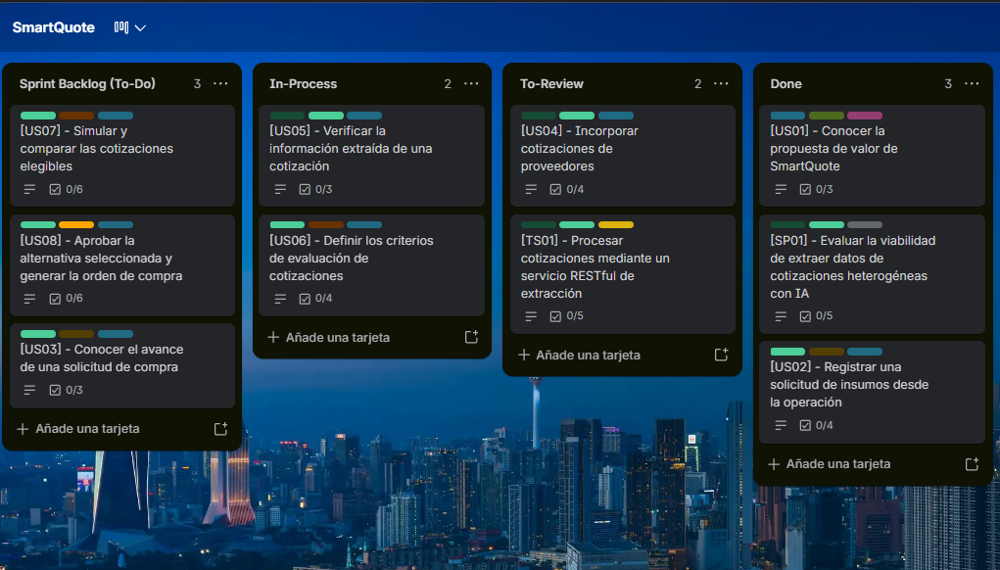

URL del Trello: [https://trello.com/invite/b/6aa85b3facd61f254c956e26/ATTI1ef2c79c2f57a6cfd64878a51236a769346419FD/smartquote](https://trello.com/invite/b/6aa85b3facd61f254c956e26/ATTI1ef2c79c2f57a6cfd64878a51236a769346419FD/smartquote)

### 5.2.2. Implemented Landing Page Evidence

La Landing Page de SmartQuote se implementó como un sitio estático en HTML5, CSS3 y JavaScript vainilla, sin frameworks ni dependencias de build, orientado a comunicar la propuesta de valor a los segmentos de Adquisiciones y de Producción y Sanidad. Incluye soporte bilingüe (español e inglés) mediante `i18n.js`, un simulador interactivo que recalcula en tiempo real el ranking de tres cotizaciones de ejemplo según criterios ponderados por el usuario (precio, plazo de entrega, etc.), y un formulario de contacto con validación de campos en el cliente (nombre, correo corporativo y empresa).

#### Repositorio de código fuente

El código fuente de la Landing Page se encuentra en el repositorio público:

[smartquote-landing-page](https://github.com/upc-pre-202620-1asi0732-9108-smartquote/smartquote-landing-page)

Al ser un sitio completamente estático, no realiza llamadas a servicios externos ni requiere claves o variables de entorno.

#### Despliegue

El sitio se publica automáticamente mediante **GitHub Pages**, a partir del flujo integrado `pages build and deployment` de GitHub Actions, que se dispara con cada cambio en la rama del sitio. La versión publicada está disponible en:

[https://upc-pre-202620-1asi0732-9108-smartquote.github.io/smartquote-landing-page/](https://upc-pre-202620-1asi0732-9108-smartquote.github.io/smartquote-landing-page/)

#### Evidencias principales

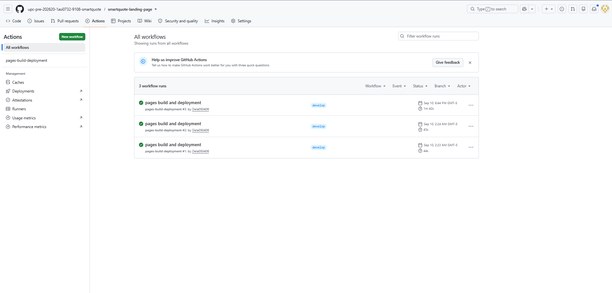

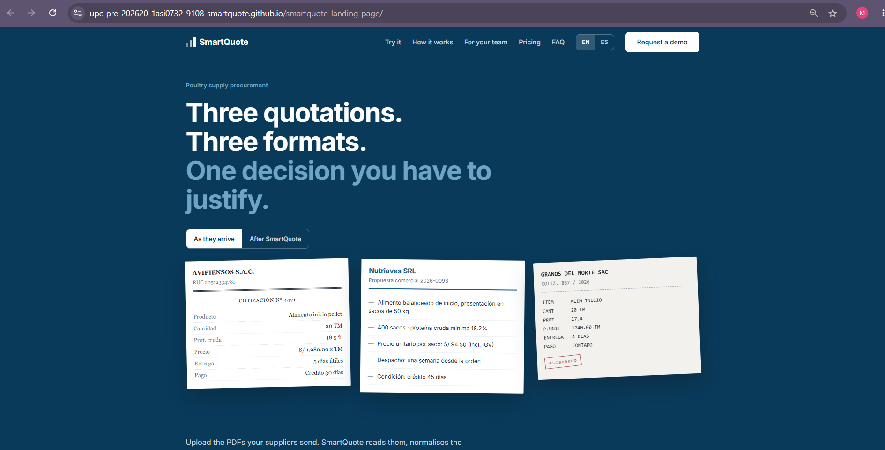

#### Tabla de commits de implementación

| Repository | Branch | Commit Id | Commit Message | Committed on (Date) |
| --- | --- | --- | --- | --- |
| `smartquote-landing-page` | `feature/LandingPage` | `a0143d6` | `docs: update landing page readme` | 2026-09-10 |
| `smartquote-landing-page` | `feature/LandingPage` | `17132fd` | `docs: add landing page readme` | 2026-09-10 |
| `smartquote-landing-page` | `feature/LandingPage` | `ec287f2` | `feat: add language switch, simulator and form validation` | 2026-09-10 |
| `smartquote-landing-page` | `feature/LandingPage` | `328f0f0` | `feat: add language switch, simulator and form validation` | 2026-09-10 |
| `smartquote-landing-page` | `feature/LandingPage` | `4bdcc3f` | `feat: add English and Spanish language resources` | 2026-09-10 |
| `smartquote-landing-page` | `feature/LandingPage` | `e71e2de` | `feat: add landing page styles` | 2026-09-10 |
| `smartquote-landing-page` | `feature/LandingPage` | `d737a5e` | `feat: add landing page structure` | 2026-09-10 |
| `main` / `develop` | — | `55a1e71` | `Initial commit` | 2026-09-06 |

### 5.2.3. Implemented Frontend-Web Application Evidence

La aplicación web de SmartQuote se implementó con Vue 3, Vue Router y PrimeVue, siguiendo una arquitectura orientada a dominio alineada con los *bounded contexts* del backend (identidad y acceso, solicitudes de compra, cotizaciones, evaluación y órdenes de compra). Cubre el flujo completo del área de Adquisiciones: inicio de sesión con cuenta autorizada, listado y seguimiento de solicitudes de compra, comparación de cotizaciones y emisión de órdenes de compra aprobadas, todo consumiendo en tiempo real los servicios RESTful publicados en Azure.

#### Repositorio de código fuente

El código fuente de la aplicación web se encuentra en el repositorio público:

[smartquote-frontend-web](https://github.com/upc-pre-202620-1asi0732-9108-smartquote/smartquote-frontend-web)

La URL base de la API se inyecta en tiempo de build mediante la variable `VITE_API_BASE_URL`, por lo que no se incluyen contraseñas, tokens ni claves en el repositorio.

#### Despliegue

El frontend se publica mediante **Azure Static Web Apps**, con integración continua desde GitHub Actions (`azure-static-web-apps-agreeable-bush-0f1889d10.yml`), que compila y despliega automáticamente con cada cambio en la rama `develop`, apuntando al backend desplegado en Azure App Service. La versión publicada está disponible en:

[https://agreeable-bush-0f1889d10.5.azurestaticapps.net](https://agreeable-bush-0f1889d10.5.azurestaticapps.net)

#### Evidencias principales

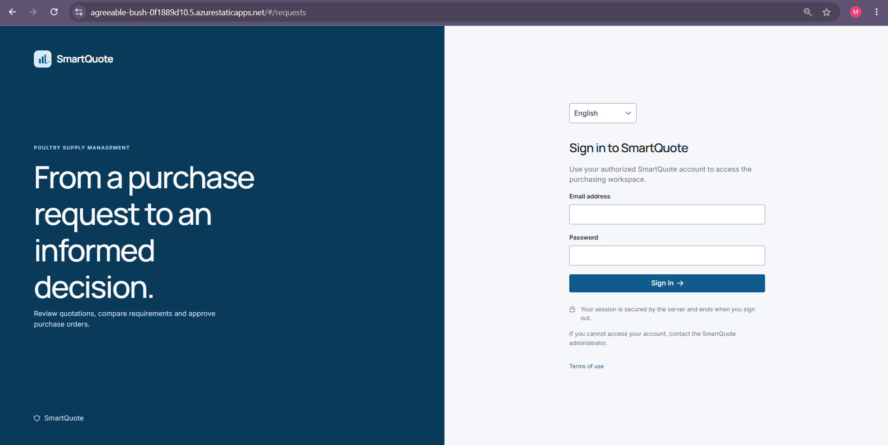

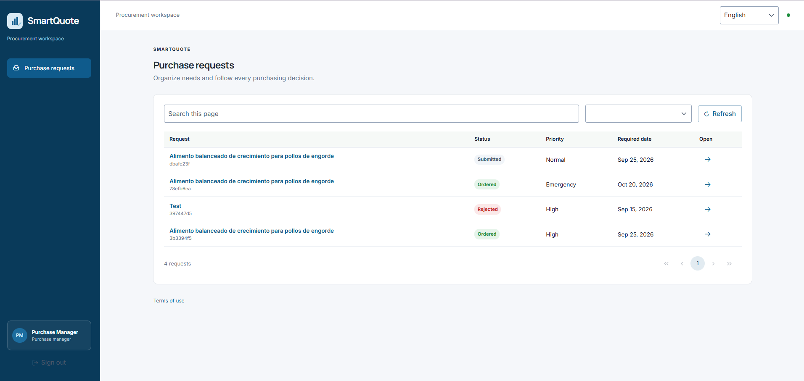

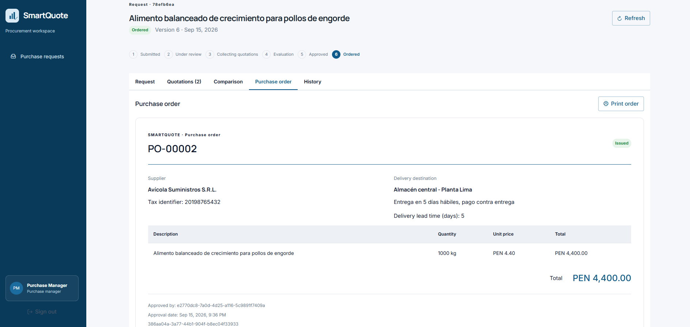

#### Tabla de commits de implementación

| Repository | Branch | Commit Id | Commit Message | Committed on (Date) |
| --- | --- | --- | --- | --- |
| `smartquote-frontend-web` | `develop` | `6c5a49f` | `Update azure-static-web-apps-agreeable-bush-0f1889d10.yml` | 2026-09-15 |
| `smartquote-frontend-web` | `develop` | `e9e2df8` | `Update azure-static-web-apps-agreeable-bush-0f1889d10.yml` | 2026-09-15 |
| `smartquote-frontend-web` | `develop` | `da64faf` | `ci: add Azure Static Web Apps workflow file` | 2026-09-15 |
| `smartquote-frontend-web` | `feature/styles` | `d251840` | `fix: fixed frontend styles` | 2026-09-15 |
| `smartquote-frontend-web` | `feature/iam` | `f00bbb0` | `feat: added identity and access context` | 2026-09-15 |
| `smartquote-frontend-web` | `main` | `f7d18cc` | `chore: clean up unused configuration and build artifacts` | 2026-09-14 |
| `smartquote-frontend-web` | `main` | `919aaa2` | `feat(web): migrate to Vue and domain-driven architecture` | 2026-09-14 |
| `smartquote-frontend-web` | `main` | `bbfdbda` | `Build SmartQuote web frontend integrated with backend API` | 2026-09-14 |
| `smartquote-frontend-web` | `main` | `dc72f19` | `Initial commit` | 2026-09-06 |

### 5.2.4. Implemented Native-Mobile Application Evidence

La aplicación móvil nativa de SmartQuote se implementó con Flutter y Dart para el segmento de especialistas de producción y sanidad que opera desde la granja. El alcance de esta iteración cubre el registro móvil de solicitudes de insumos (`US02`) y el seguimiento del avance de una solicitud (`US03`). La solución permite iniciar sesión con una cuenta autorizada, registrar la fecha requerida, prioridad, ítems y requisitos técnicos biológicos, adjuntar un sustento opcional y consultar el estado, el área responsable, el historial cronológico y las notificaciones asociadas.

La interfaz sigue los lineamientos móviles del proyecto: Material 3, tipografía Roboto, tarjetas de lectura rápida, colores semánticos para estados y una acción principal visible para crear una nueva solicitud. El cliente valida los datos antes del envío y consume los recursos RESTful del contexto `SupplyRequests` y de notificaciones del backend.

#### Repositorio de código fuente

El código fuente independiente de la aplicación móvil se encuentra en el repositorio público:

[smartquote-native-mobile](https://github.com/upc-pre-202620-1asi0732-9108-smartquote/smartquote-native-mobile)

El proyecto se ejecuta desde `SmartQuote_app/smart_quote`, conserva la sesión mediante almacenamiento seguro del dispositivo y recibe la URL de la API mediante `API_BASE_URL`, por lo que no se incluyen contraseñas, tokens ni claves en el repositorio.

#### Evidencias principales de la aplicación

Las siguientes capturas deben reemplazarse con imágenes tomadas durante la ejecución de la aplicación. Se incluyen únicamente las evidencias principales del flujo móvil:

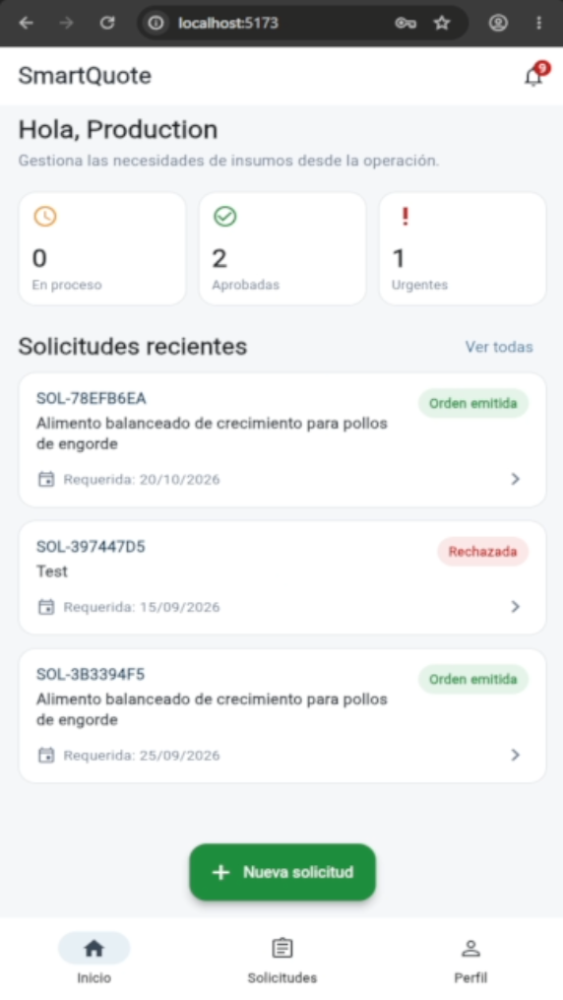

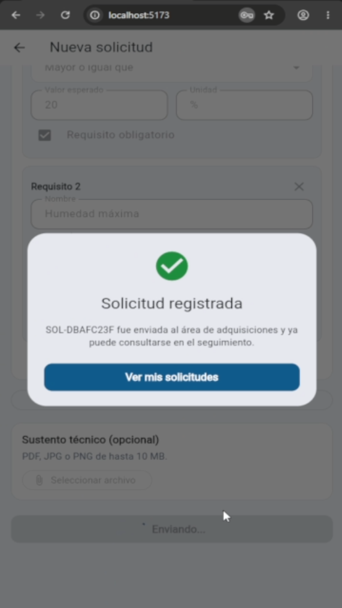

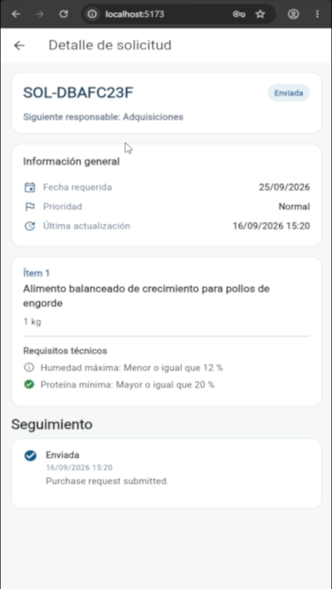

#### Tabla de commits de implementación

La tabla resume los commits disponibles en el repositorio móvil y conserva la trazabilidad de la implementación bajo GitFlow y Conventional Commits. El cuerpo se muestra como `—` cuando el commit no contiene una descripción adicional.

| Repository | Commit Id | Commit Message | Commit Message Body | Committed on (Date) |
| --- | --- | --- | --- | --- |
| `smartquote-native-mobile` | `0f02343` | `feat: added views for app` | — | 2026-09-16 |
| `smartquote-native-mobile` | `b0cbb97` | `add: login view mobile smartquote` | Esqueleto funcional mobile | 2026-09-15 |
| `smartquote-native-mobile` | `576b509` | `Initial commit` | — | 2026-09-06 |

Los cambios locales posteriores utilizados para completar la integración RESTful deben registrarse en el repositorio mediante nuevos commits `feat`, `fix`, `test` o `docs` antes de publicar una versión evaluable. Esta tabla debe actualizarse con esos identificadores reales una vez que el equipo sincronice la implementación.

#### Conexión con los servicios web

La aplicación móvil consume los servicios RESTful publicados en Azure App Service mediante HTTPS. La URL se configura sin modificar el código fuente:

```bash
flutter run -d chrome --web-port 5173 --dart-define=API_BASE_URL=https://<azure-app-service>/
```

#### Video de demostración

El siguiente video muestra el flujo principal de la aplicación móvil: autenticación del especialista de producción, registro de una solicitud de insumos y consulta de su seguimiento.

[Video de demostración de la aplicación móvil — OneDrive / Microsoft Stream](https://upcedupe-my.sharepoint.com/:v:/g/personal/u20211d989_upc_edu_pe/IQB9HilKlndFSLYzkIT6mKY0AW6sMWsIdmg3he0IIRiUt2s?nav=eyJyZWZlcnJhbEluZm8iOnsicmVmZXJyYWxBcHAiOiJPbmVEcml2ZUZvckJ1c2luZXNzIiwicmVmZXJyYWxBcHBQbGF0Zm9ybSI6IldlYiIsInJlZmVycmFsTW9kZSI6InZpZXciLCJyZWZlcnJhbFZpZXciOiJNeUZpbGVzTGlua0NvcHkifX0&e=6gBegE)

**Duración:** `00:02:07`

### 5.2.5. Implemented RESTful API and/or Serverless Backend Evidence

Está construido como un monolito modular en ASP.NET Core con C#, Clean Architecture y Domain-Driven Design. Cada *bounded context* conserva sus capas `Domain`, `Application`, `Infrastructure` e `Interfaces`, mientras que `SmartQuote.Shared` concentra las abstracciones genéricas y `SmartQuote.API` actúa como composición y punto de ejecución.

#### Estructura implementada

```text
smartquote-web-services/
├── SmartQuote.sln
├── docker-compose.yml
└── src/
    ├── SmartQuote.API/                         # composición, JWT, Swagger y middleware
    ├── SmartQuote.Shared/                      # kernel compartido y contratos técnicos
    ├── SmartQuote.Modules.SupplyRequests/      # solicitudes y seguimiento
    ├── SmartQuote.Modules.QuotationIntake/     # carga, extracción y verificación
    ├── SmartQuote.Modules.EvaluationSimulation/# escenarios y simulación
    └── SmartQuote.Modules.PurchaseOrdering/    # aprobación y órdenes de compra
```

La solución registra los cuatro módulos mediante `AddSupplyRequestsModule`, `AddQuotationIntakeModule`, `AddEvaluationSimulationModule` y `AddPurchaseOrderingModule`. Los controladores dependen de servicios de aplicación; los servicios dependen de puertos; y los adaptadores de Entity Framework Core, PostgreSQL, almacenamiento local y OpenAI se registran en infraestructura. Esta composición mantiene la inversión de dependencias y evita que el dominio dependa de ASP.NET Core o de PostgreSQL.

#### Ejecución local y persistencia

La ejecución de demostración utiliza Docker Compose. El servicio `postgres` levanta PostgreSQL 16 y el servicio `api` ejecuta la imagen construida desde `src/SmartQuote.API/Dockerfile`. La variable `Database__ApplyMigrations=true` aplica las migraciones de los cuatro `DbContext` al iniciar la API. El contenedor `pgadmin` permite inspeccionar las tablas y los datos persistidos.

```powershell
Copy-Item .env.example .env
# Completar .env con PostgreSQL, JWT y, si corresponde, OpenAI.
docker compose up --build -d
docker compose ps
```

Las direcciones locales de la demostración son `http://localhost:8080` para la API, `http://localhost:8080/swagger` para Swagger UI, `http://localhost:8080/health/live` para la comprobación de vida, `http://localhost:8080/health` para la comprobación de dependencias y `http://localhost:5050` para pgAdmin. Cuando se ejecuta desde Rider, los perfiles de `launchSettings.json` utilizan `http://localhost:5023` o `https://localhost:7177`.

La API exige un JWT Bearer válido para los endpoints funcionales. Los roles se asignan según el flujo: `ProductionSpecialist` registra solicitudes y consulta notificaciones, `PurchasingStaff` procesa cotizaciones, configura simulaciones y consulta información, y `PurchaseManager` autoriza la generación de órdenes. Las rutas de salud son operativas y no sustituyen la autenticación funcional.

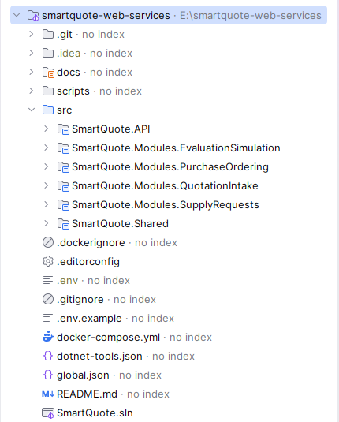

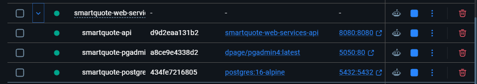

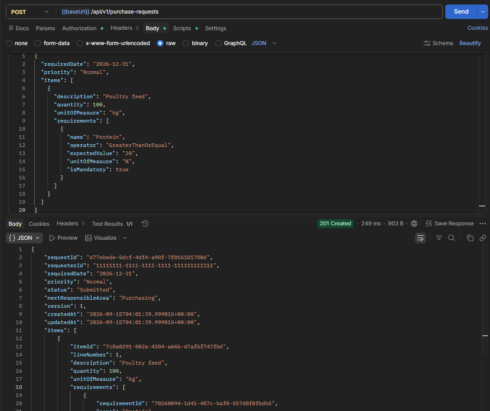

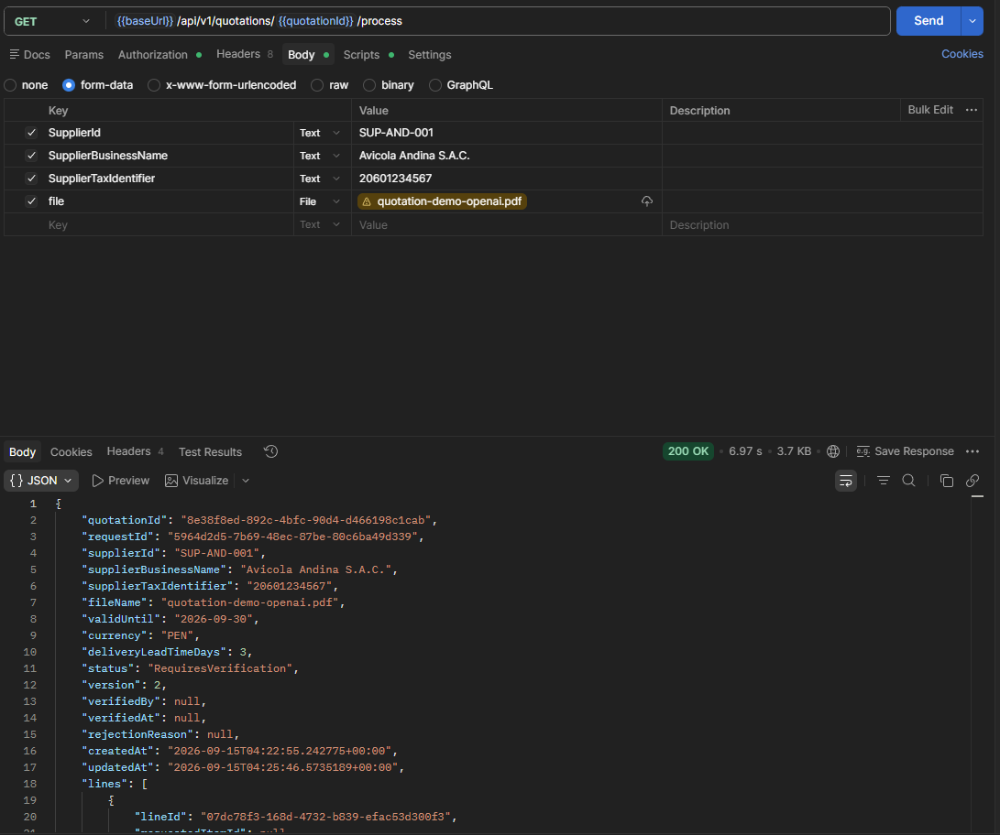

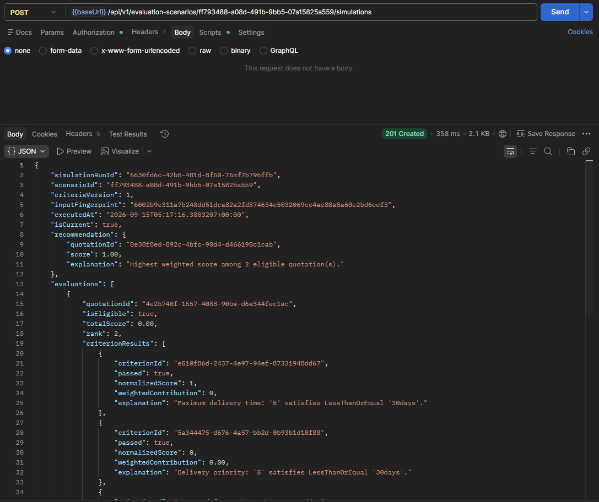

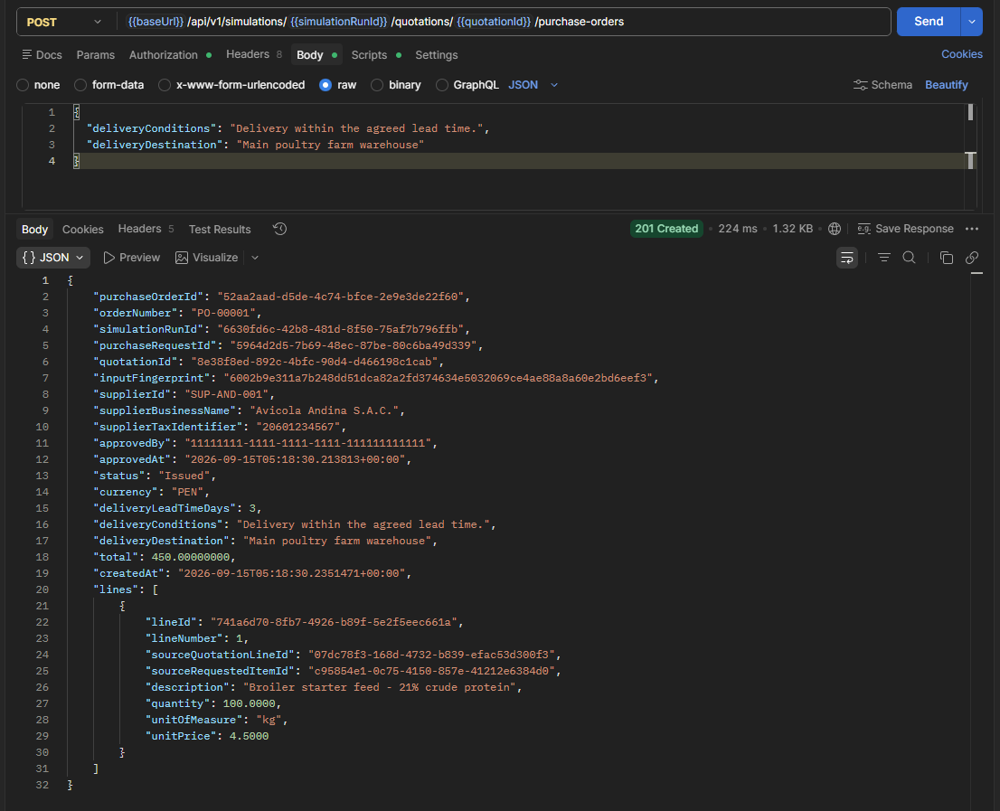

#### Despliegue en la nube (Azure)

Además de la ejecución local, el backend está desplegado en producción sobre **Azure App Service**...

[https://smartquote-api-h8czffe5b4dtg6d7.chilecentral-01.azurewebsites.net](https://smartquote-api-h8czffe5b4dtg6d7.chilecentral-01.azurewebsites.net)

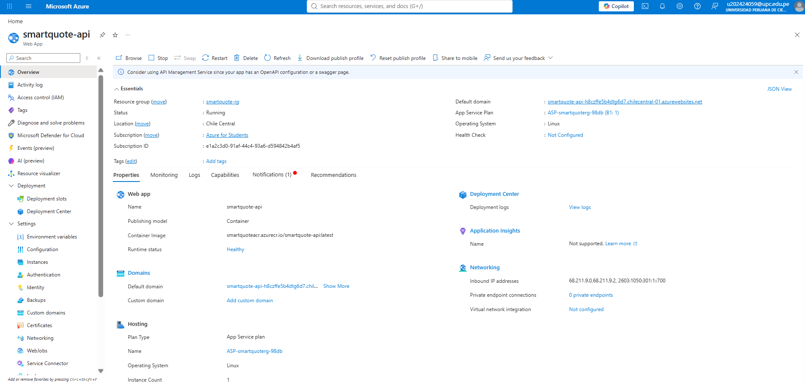


#### Comprobación local observada

Durante la documentación, el entorno Docker respondió correctamente en las siguientes rutas:

| Comprobación | Resultado observado |
|---|---|
| `GET http://localhost:8080/health/live` | `200 OK` con estado `Healthy`. |
| `GET http://localhost:8080/health` | `200 OK`; los cuatro registros de salud de base de datos están disponibles. |
| `GET http://localhost:8080/swagger/index.html` | `200 OK`; Swagger UI se sirve en modo Development. |
| `GET http://localhost:8080/swagger/v1/swagger.json` | `200 OK`; contrato OpenAPI generado por la API. |

Estas comprobaciones demuestran disponibilidad del entorno, pero las capturas de Postman y pgAdmin deben realizarse con datos de prueba controlados para completar la evidencia académica.

#### Registro de modificaciones del backend

La siguiente tabla resume los registros de modificación relevantes observados en el repositorio `smartquote-web-services`. La rama `develop` integra el trabajo; las ramas de funcionalidad conservan el desarrollo específico antes de su integración. El equipo debe actualizar esta tabla cuando se registren nuevas modificaciones.

| Branch | Commit Id | Commit Message | Date |
|---|---|---|---|
| `develop` | `e0b4d92` | `fix: fixed local deploy problems` | 2026-09-14 |
| `develop` | `56503e5` | `feat: added app setings and Dockerfile` | 2026-09-13 |
| `develop` | `4c53553` | `fix: fixed Purchase Ordering context dependencies` | 2026-09-13 |
| `develop` | `25b8fa5` | `feat: added controller for Evaluation Simulation context` | 2026-09-13 |
| `develop` | `25c987e5` | `feat: added REST interfaces for Evaluation Simulation context` | 2026-09-13 |
| `develop` | `92a4ad5` | `feat: added infrastructure persistence and reference readers for Evaluation Simulation context` | 2026-09-13 |
| `develop` | `c20b37b` | `feat: added application views and services for Evaluation Simulation context` | 2026-09-13 |
| `develop` | `64ebce6` | `feat: added ports for Evaluation Simulation context` | 2026-09-13 |
| `develop` | `a43740f` | `feat: add domain model for Evaluation Simulation context` | 2026-09-13 |
| `develop` | `edce04a` | `feat(purchase-ordering): add rest controllers and resources` | 2026-09-13 |
| `develop` | `5ce99c1` | `feat(purchase-ordering): add persistence and repositories` | 2026-09-13 |
| `develop` | `6a81aa9` | `feat(purchase-ordering): add application layer` | 2026-09-13 |
| `develop` | `bd2341a` | `feat(purchase-ordering): add domain model layer` | 2026-09-13 |
| `feature/QuotationIntake` | `9de0b4c` | `feat: added controller for Quotation Intake context` | 2026-09-12 |
| `feature/QuotationIntake` | `429e91e` | `feat: added AI infrastructure for Quotation Intake context` | 2026-09-12 |
| `feature/QuotationIntake` | `eaf148f` | `feat: added infrastructure persistence for Quotation Intake context` | 2026-09-12 |
| `feature/Supply-Requests` | `37f98dc` | `feat(Supply-Requests): add SupplyRequest Module` | 2026-09-12 |
| `feature/Supply-Requests` | `64750b0` | `feat(Supply-Requests): add rest controllers and resources` | 2026-09-12 |
| `feature/Supply-Requests` | `bf276dd` | `feat(Supply-Requests): add persistence and repositories` | 2026-09-12 |
| `main` | `60ca718` | `chore: initial structure` | 2026-09-12 |

### 5.2.6. RESTful API documentation

La API RESTful está documentada mediante OpenAPI 3 y se genera a partir de los controladores ASP.NET Core. En Docker, la documentación interactiva se encuentra en [Swagger UI local](http://localhost:8080/swagger/index.html) y el contrato JSON en [swagger/v1/swagger.json](http://localhost:8080/swagger/v1/swagger.json). Desde Rider, se utiliza el mismo sufijo `/swagger` sobre el puerto configurado por el perfil (`5023` para HTTP o `7177` para HTTPS).

#### Acceso y autenticación

Swagger incorpora el esquema `Bearer` como autenticación HTTP. Para probar las rutas protegidas, se debe pulsar **Authorize** y proporcionar un JWT válido con el rol requerido. El token, las claves y las contraseñas no deben incluirse en el README, en capturas ni en el repositorio.

| Base URL | Swagger UI | OpenAPI JSON |
|---|---|---|
| `http://localhost:8080` (Docker) | `http://localhost:8080/swagger/index.html` | `http://localhost:8080/swagger/v1/swagger.json` |
| `http://localhost:5023` (Rider HTTP) | `http://localhost:5023/swagger` | `http://localhost:5023/swagger/v1/swagger.json` |
| `https://localhost:7177` (Rider HTTPS) | `https://localhost:7177/swagger` | `https://localhost:7177/swagger/v1/swagger.json` |

#### Evidencias de Swagger y OpenAPI

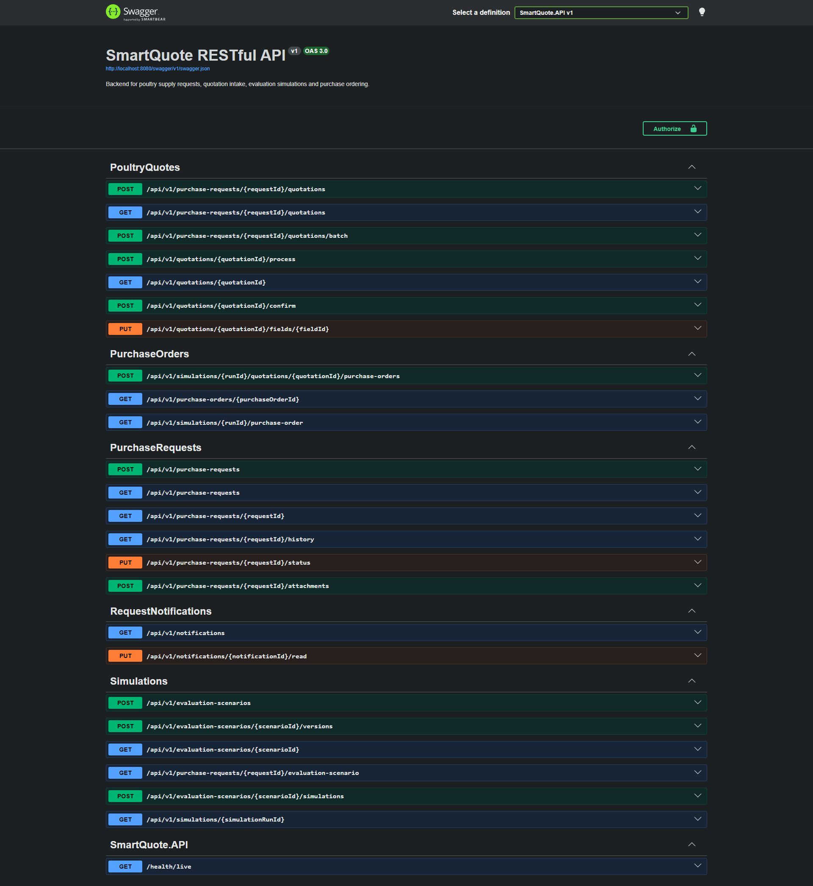

#### Convención de respuestas y errores

Las respuestas exitosas utilizan los recursos definidos en `Interfaces/REST/Resources` o `Interfaces/REST/Resource`. Los errores gestionados por `ExceptionHandlingMiddleware` se devuelven como `application/problem+json` con la siguiente estructura:

```json
{
  "status": 422,
  "title": "Business rule violation",
  "detail": "Descripción de la regla que no se pudo cumplir",
  "type": "https://smartquote.app/problems/domain_rule_violation",
  "instance": "/api/v1/...",
  "code": "domain_rule_violation",
  "traceId": "..."
}
```

Los códigos comunes son `400` (solicitud o parámetros inválidos), `401` (JWT ausente o inválido), `403` (rol insuficiente), `404` (recurso inexistente), `409` (conflicto de estado, concurrencia o duplicidad), `413` (archivo demasiado grande), `415` (tipo de archivo no soportado), `422` (regla de negocio o documento no procesable), `503` (servicio externo de IA no disponible) y `500` (error no controlado).

#### Endpoints — Supply Requests Context

| Verbo | Ruta | Parámetros y cuerpo de solicitud | Respuesta exitosa | Errores esperados | Referencia local |
|---|---|---|---|---|---|
| `POST` | `/api/v1/purchase-requests` | JWT `ProductionSpecialist`.<br>JSON `CreatePurchaseRequestResource`: `requiredDate`, `priority`, `items[]`; cada ítem contiene `description`, `quantity`, `unitOfMeasure` y `requirements[]` (`name`, `operator`, `expectedValue`, `unitOfMeasure`, `isMandatory`). | `201 Created` + `PurchaseRequestResource` y encabezado `Location`. | `400`, `401`, `403`, `409`, `422`. | [Swagger local](http://localhost:8080/swagger/index.html) |
| `GET` | `/api/v1/purchase-requests` | JWT.<br>Query opcional: `status`, `page` (predeterminado `1`), `pageSize` (predeterminado `20`). | `200 OK` + `PagedPurchaseRequestsResource`. | `400`, `401`, `403`. | [Swagger local](http://localhost:8080/swagger/index.html) |
| `GET` | `/api/v1/purchase-requests/{requestId}` | JWT.<br>Path `requestId` con formato `Guid`. | `200 OK` + `PurchaseRequestResource`. | `401`, `403`, `404`. | [Swagger local](http://localhost:8080/swagger/index.html) |
| `GET` | `/api/v1/purchase-requests/{requestId}/history` | JWT.<br>Path `requestId` con formato `Guid`. | `200 OK` + `RequestHistoryResource`. | `401`, `403`, `404`. | [Swagger local](http://localhost:8080/swagger/index.html) |
| `PUT` | `/api/v1/purchase-requests/{requestId}/status` | JWT `PurchasingStaff`.<br>JSON `ChangeRequestStatusResource`: `nextStatus`, `reason`, `expectedVersion`. | `204 No Content`. | `400`, `401`, `403`, `404`, `409`, `422`. | [Swagger local](http://localhost:8080/swagger/index.html) |
| `POST` | `/api/v1/purchase-requests/{requestId}/attachments` | JWT `ProductionSpecialist`.<br>`multipart/form-data`: `file` y `expectedVersion`; tamaño máximo `10 MB`. | `204 No Content`. | `400`, `401`, `403`, `404`, `409`, `413`, `415`. | [Swagger local](http://localhost:8080/swagger/index.html) |
| `GET` | `/api/v1/notifications` | JWT `ProductionSpecialist`.<br>Query opcional `unreadOnly` (`false` por defecto). | `200 OK` + `IReadOnlyList<RequestNotificationResource>`. | `401`, `403`. | [Swagger local](http://localhost:8080/swagger/index.html) |
| `PUT` | `/api/v1/notifications/{notificationId}/read` | JWT `ProductionSpecialist`.<br>Path `notificationId` con formato `Guid`. | `204 No Content`. | `401`, `403`, `404`. | [Swagger local](http://localhost:8080/swagger/index.html) |

#### Endpoints — Quotation Intake Context

| Verbo | Ruta | Parámetros y cuerpo de solicitud | Respuesta exitosa | Errores esperados | Referencia local |
|---|---|---|---|---|---|
| `POST` | `/api/v1/purchase-requests/{requestId}/quotations` | JWT `PurchasingStaff`.<br>`multipart/form-data`: `SupplierId`, `SupplierBusinessName`, `SupplierTaxIdentifier` y `file`; tamaño máximo `15 MB`. | `201 Created` + `PoultryQuoteResource` cuando se crea; `200 OK` + el recurso existente si el hash identifica un duplicado. | `400`, `401`, `403`, `404`, `409`, `413`, `415`, `422`. | [Swagger local](http://localhost:8080/swagger/index.html) |
| `POST` | `/api/v1/purchase-requests/{requestId}/quotations/batch` | JWT `PurchasingStaff`.<br>`multipart/form-data`: datos del proveedor y `files[]`; entre `1` y `20` documentos, máximo `15 MB` por archivo. | `207 Multi-Status` + `IReadOnlyList<BatchQuotationUploadItemResource>` con resultado individual por archivo. | `400`, `401`, `403`, `404`, `413`, `415`, `422`, `503` por elemento o lote. | [Swagger local](http://localhost:8080/swagger/index.html) |
| `GET` | `/api/v1/purchase-requests/{requestId}/quotations` | JWT `PurchasingStaff`.<br>Path `requestId` con formato `Guid`. | `200 OK` + `IReadOnlyList<PoultryQuoteResource>`. | `401`, `403`, `404`. | [Swagger local](http://localhost:8080/swagger/index.html) |
| `POST` | `/api/v1/quotations/{quotationId}/process` | JWT `PurchasingStaff`.<br>Path `quotationId` con formato `Guid`; sin cuerpo. | `200 OK` + `PoultryQuoteResource` con el estado de extracción. | `401`, `403`, `404`, `409`, `422`, `503`. | [Swagger local](http://localhost:8080/swagger/index.html) |
| `GET` | `/api/v1/quotations/{quotationId}` | JWT `PurchasingStaff`.<br>Path `quotationId` con formato `Guid`. | `200 OK` + `PoultryQuoteResource`, incluidos campos, confianza y correcciones. | `401`, `403`, `404`. | [Swagger local](http://localhost:8080/swagger/index.html) |
| `POST` | `/api/v1/quotations/{quotationId}/confirm` | JWT `PurchasingStaff`.<br>JSON `ConfirmQuotationResource`: `lineMappings[]` (`lineId`, `requestedItemId`) y `expectedVersion`. | `204 No Content`. | `400`, `401`, `403`, `404`, `409`, `422`. | [Swagger local](http://localhost:8080/swagger/index.html) |
| `PUT` | `/api/v1/quotations/{quotationId}/fields/{fieldId}` | JWT `PurchasingStaff`.<br>JSON `CorrectFieldResource`: `value`, `reason`, `expectedVersion`. | `204 No Content`. | `400`, `401`, `403`, `404`, `409`, `422`. | [Swagger local](http://localhost:8080/swagger/index.html) |

#### Endpoints — Evaluation & Simulation Context

| Verbo | Ruta | Parámetros y cuerpo de solicitud | Respuesta exitosa | Errores esperados | Referencia local |
|---|---|---|---|---|---|
| `POST` | `/api/v1/evaluation-scenarios` | JWT `PurchasingStaff`.<br>JSON `CreateScenarioResource`: `requestId` y `criteria[]`; cada criterio contiene `name`, `targetField`, `category`, `mode`, `operator`, `expectedValue`, `unitOfMeasure`, `weight` y `displayOrder`. | `201 Created` + `EvaluationScenarioResource` y `Location`. | `400`, `401`, `403`, `404`, `422`. | [Swagger local](http://localhost:8080/swagger/index.html) |
| `POST` | `/api/v1/evaluation-scenarios/{scenarioId}/versions` | JWT `PurchasingStaff`.<br>Path `scenarioId` con formato `Guid`.<br>JSON `CreateScenarioVersionResource`: `criteria[]` con la misma estructura de criterios. | `201 Created` + `EvaluationScenarioResource` y `Location`. | `400`, `401`, `403`, `404`, `422`. | [Swagger local](http://localhost:8080/swagger/index.html) |
| `GET` | `/api/v1/evaluation-scenarios/{scenarioId}` | JWT `PurchasingStaff`.<br>Path `scenarioId` con formato `Guid`. | `200 OK` + `EvaluationScenarioResource`. | `401`, `403`, `404`. | [Swagger local](http://localhost:8080/swagger/index.html) |
| `GET` | `/api/v1/purchase-requests/{requestId}/evaluation-scenario` | JWT `PurchasingStaff`.<br>Path `requestId` con formato `Guid`. | `200 OK` + `EvaluationScenarioResource` vigente. | `401`, `403`, `404`. | [Swagger local](http://localhost:8080/swagger/index.html) |
| `POST` | `/api/v1/evaluation-scenarios/{scenarioId}/simulations` | JWT `PurchasingStaff`.<br>Path `scenarioId` con formato `Guid`; no requiere cuerpo. | `201 Created` + `SimulationResultResource` para una ejecución nueva; `200 OK` si se reutiliza una ejecución con la misma huella de entradas. | `401`, `403`, `404`, `422`. | [Swagger local](http://localhost:8080/swagger/index.html) |
| `GET` | `/api/v1/simulations/{simulationRunId}` | JWT `PurchasingStaff`.<br>Path `simulationRunId` con formato `Guid`. | `200 OK` + `SimulationResultResource` con evaluaciones, exclusiones y recomendación; `isCurrent` identifica si continúa vigente. | `401`, `403`, `404`, `422`. | [Swagger local](http://localhost:8080/swagger/index.html) |

#### Endpoints — Purchase Ordering Context

| Verbo | Ruta | Parámetros y cuerpo de solicitud | Respuesta exitosa | Errores esperados | Referencia local |
|---|---|---|---|---|---|
| `POST` | `/api/v1/simulations/{runId}/quotations/{quotationId}/purchase-orders` | JWT `PurchaseManager`.<br>Path `runId` y `quotationId` con formato `Guid`.<br>JSON `ApproveAndGenerateResource`: `deliveryConditions` y `deliveryDestination`. | `201 Created` + `PurchaseOrderResource` cuando se emite; `200 OK` + la orden existente ante una repetición idempotente. | `400`, `401`, `403`, `404`, `409`, `422`. | [Swagger local](http://localhost:8080/swagger/index.html) |
| `GET` | `/api/v1/purchase-orders/{purchaseOrderId}` | JWT `PurchasingStaff`.<br>Path `purchaseOrderId` con formato `Guid`. | `200 OK` + `PurchaseOrderResource`. | `401`, `403`, `404`. | [Swagger local](http://localhost:8080/swagger/index.html) |
| `GET` | `/api/v1/simulations/{runId}/purchase-order` | JWT `PurchasingStaff`.<br>Path `runId` con formato `Guid`. | `200 OK` + `PurchaseOrderResource`. | `401`, `403`, `404`. | [Swagger local](http://localhost:8080/swagger/index.html) |

#### Rutas operativas y de documentación

| Verbo | Ruta | Propósito | Respuesta |
|---|---|---|---|
| `GET` | `/health/live` | Comprobar que el proceso de la API está activo. | `200 OK` con `{ "status": "Healthy" }`; acceso anónimo. |
| `GET` | `/health` | Comprobar la disponibilidad de los cuatro contextos de base de datos registrados en health checks. | `200 OK` cuando las dependencias están saludables; de lo contrario, estado de health check correspondiente. |
| `GET` | `/swagger/index.html` | Servir la interfaz interactiva de Swagger en entorno Development. | `200 OK` con la interfaz HTML. |
| `GET` | `/swagger/v1/swagger.json` | Servir el contrato OpenAPI de la API. | `200 OK` con el documento JSON. |

#### Principales esquemas de respuesta

| Esquema | Campos representativos documentados |
|---|---|
| `PurchaseRequestResource` | `requestId`, `requesterId`, `requiredDate`, `priority`, `status`, `nextResponsibleArea`, `version`, `createdAt`, `updatedAt`, `items[]`, `attachments[]`. |
| `PagedPurchaseRequestsResource` | `items[]`, `page`, `pageSize`, `totalItems`, `totalPages`. |
| `PoultryQuoteResource` | `quotationId`, `requestId`, datos del proveedor, documento, `validUntil`, `currency`, `deliveryLeadTimeDays`, `status`, `version`, `verifiedBy`, `verifiedAt`, `lines[]`, `fields[]`. |
| `BatchQuotationUploadItemResource` | `fileName`, `quotationId`, `wasCreated`, `errorCode`, `error`. |
| `EvaluationScenarioResource` | `scenarioId`, `requestId`, `version`, `status`, `createdBy`, `createdAt`, `supersedesScenarioId`, `criteria[]`. |
| `SimulationResultResource` | `simulationRunId`, `scenarioId`, `criteriaVersion`, `inputFingerprint`, `executedAt`, `isCurrent`, `recommendation`, `evaluations[]`. |
| `PurchaseOrderResource` | `purchaseOrderId`, `orderNumber`, referencias de simulación/solicitud/cotización, proveedor, aprobación, `status`, moneda, términos de entrega, `total`, `createdAt`, `lines[]`. |
| `RequestHistoryResource` | `requestId` y `entries[]` con estado anterior, estado nuevo, usuario, fecha y motivo. |

Los nombres y tipos completos de estos esquemas se mantienen en los recursos C# del backend y son publicados automáticamente en el documento OpenAPI, por lo que cualquier cambio de contrato debe reflejarse en esta tabla y en las capturas de Swagger.

### 5.2.7. Team Collaboration Insights

Esta sección documenta la colaboración técnica de cada entregable mediante sus repositorios públicos de GitHub.

#### Landing Page

**Entregable:** Landing Page estática en HTML5, CSS3 y JavaScript.  
**Repositorio:** [smartquote-landing-page](https://github.com/upc-pre-202620-1asi0732-9108-smartquote/smartquote-landing-page)


#### Frontend Web Application

**Entregable:** Aplicación web en Vue.js, PrimeVue y Material Design.  
**Repositorio:** [smartquote-frontend-web](https://github.com/upc-pre-202620-1asi0732-9108-smartquote/smartquote-frontend-web)


#### Native Mobile Application

**Entregable:** Aplicación móvil nativa multiplataforma desarrollada con Flutter y Dart.  
**Repositorio:** [smartquote-native-mobile](https://github.com/upc-pre-202620-1asi0732-9108-smartquote/smartquote-native-mobile)


#### Web Services

**Entregable:** Web Services RESTful en ASP.NET Core y C#.  
**Repositorio:** [smartquote-web-services](https://github.com/upc-pre-202620-1asi0732-9108-smartquote/smartquote-web-services)


## 5.3. Video About-the-Product

El video *About-the-Product* presenta de forma promocional la propuesta de valor de SmartQuote y el flujo principal de la solución para el sector avícola. En una demostración breve se expone la problemática de revisar manualmente cotizaciones heterogéneas y validar requisitos técnicos sin suficiente expertise especializado; luego se muestra cómo SmartQuote integra las solicitudes de insumos, la carga de cotizaciones, la extracción asistida por inteligencia artificial, la simulación comparativa y la generación de órdenes de compra. El recorrido contempla las experiencias del especialista de producción o sanidad y del analista de adquisiciones, destacando la reducción del tiempo de atención, la trazabilidad y la toma de decisiones basada en criterios configurables.


### Enlaces de publicación

| Publicación | Enlace |
|---|---|
| YouTube | [Ver video en YouTube](https://youtu.be/LdcyPcPV8VY) |
| Microsoft Stream / OneDrive | [Ver video en Microsoft Stream](https://upcedupe-my.sharepoint.com/:v:/g/personal/u20211d989_upc_edu_pe/IQC_UgK0aEsxQoJU6a_AlO-cATwIHkuO41EIbBiz3SsICLc) |

Duración: **00:02:45**

# Conclusiones

## Conclusiones y recomendaciones

El desarrollo documental de SmartQuote permite establecer las siguientes conclusiones y recomendaciones para el avance del proyecto:

1. SmartQuote atiende un problema concreto de las empresas avícolas: la revisión manual y dispersa de cotizaciones con requisitos técnicos y condiciones comerciales heterogéneas. La propuesta articula en un solo flujo la solicitud de insumos, la recepción de ofertas, su comparación, la aprobación y la generación de la orden de compra, manteniendo la participación de adquisiciones, producción y sanidad.

2. El análisis de usuarios, entrevistas, competencia, Lean UX y Needfinding orientó una propuesta especializada en el sector avícola, en lugar de replicar el alcance generalista de una suite de procurement. Esta definición aporta una base coherente para el producto, aunque las hipótesis y metas de adopción, tiempo, precisión y satisfacción todavía deben contrastarse con un piloto y usuarios reales.

3. La arquitectura monolítica modular basada en DDD y Clean Architecture separa los contextos de solicitudes, cotizaciones, evaluación y órdenes de compra, y centraliza las reglas de negocio en el API RESTful. El uso de contratos, snapshots versionados, huellas de entrada e idempotencia proporciona una base técnica adecuada para la trazabilidad y para evitar que una modificación posterior altere la evidencia de una decisión ya evaluada.

4. La extracción asistida por IA puede reducir el esfuerzo de estructurar cotizaciones PDF, pero no elimina la responsabilidad del analista ni garantiza por sí misma resultados confiables. El diseño reconoce esta limitación mediante niveles de confianza, valores no resueltos, correcciones auditables, aprobación humana y un proveedor alterno `stub`; por ello, la viabilidad de la solución depende de medir la precisión y controlar los casos de baja confianza antes de automatizar decisiones.

**Recomendaciones**

1. Ejecutar un piloto controlado con empresas avícolas y representantes de ambos segmentos, utilizando cotizaciones autorizadas y anonimizadas. El piloto debe medir el tiempo de elaboración del cuadro comparativo, la precisión de los campos obligatorios, las correcciones por documento, la trazabilidad, la satisfacción y la adopción, y usar esos resultados para reordenar el Product Backlog y ajustar el alcance de las siguientes iteraciones.

2. Acompañar el despliegue con un plan de adopción y gobierno del producto: definir responsables por rol, capacitar a analistas y especialistas, documentar el tratamiento de información confidencial, obtener consentimiento para las entrevistas y pruebas, y establecer un canal para reportar errores o sugerir mejoras. La expansión a nuevas categorías de insumos debe realizarse progresivamente, después de demostrar valor en el flujo avícola inicial.

3. Priorizar la construcción de un vertical slice integrado —solicitud, carga, extracción, verificación, simulación y orden— antes de ampliar funcionalidades. Cada contexto debe contar con pruebas unitarias, escenarios BDD, pruebas de contrato del API y una prueba de extremo a extremo; el pipeline de GitHub Actions debe bloquear la integración cuando fallen compilación, análisis, pruebas o validaciones de seguridad.

4. Formalizar la evaluación técnica del componente de IA con un corpus mínimo de quince cotizaciones anonimizadas de al menos tres estructuras, una referencia verificada por campo y umbrales de confianza configurables. Los datos bajo el umbral deben pasar a revisión manual, conservar el origen y la corrección, y alimentar métricas de calidad; además, se deben proteger documentos y credenciales mediante secretos administrados, control de acceso, registros de auditoría, monitoreo de errores y el modo `stub` para demostraciones sin conectividad.

# Bibliografía

- Coupa. (s. f.). *Coupa for suppliers*. Recuperado el 9 de septiembre de 2026, de https://docs.coupa.com/en/supplier-documentation/coupa-for-suppliers
- Fowler, M. (2006, 12 de diciembre). *Ubiquitous language*. MartinFowler.com. https://martinfowler.com/bliki/UbiquitousLanguage.html
- Odoo. (s. f.). *Calls for tenders*. Recuperado el 9 de septiembre de 2026, de https://www.odoo.com/documentation/18.0/applications/inventory_and_mrp/purchase/manage_deals/calls_for_tenders.html
- Open Practice Library. (s. f.). *Ubiquitous language*. Recuperado el 9 de septiembre de 2026, de https://openpracticelibrary.com/practice/ubiquitous-language/
- Oracle. (s. f.). *About Oracle Fusion Cloud Procurement*. Recuperado el 9 de septiembre de 2026, de https://docs.oracle.com/en/cloud/saas/procurement/25c/fainp/about-oracle-fusion-cloud-procurement.html
- SAP. (s. f.). *SAP Ariba Sourcing software*. Recuperado el 9 de septiembre de 2026, de https://www.sap.com/products/spend-management/ariba-sourcing.html

# Anexos

## Anexo A. Videos de Exposiciones
