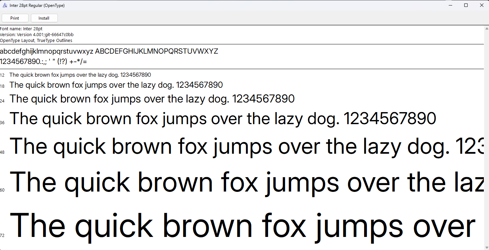

Universidad Peruana de Ciencias Aplicadas
Carrera de Ingeniería de Software

##### ASI0732

##### Diseño de Experimentos de Ingeniería de Software

NRC

##### 9108

#### Informe del Trabajo Final

Docente

##### Julio Manuel Noriega Melendez

Proyecto

##### SmartQuote

##### Integrantes

<table align="center">
  <thead>
    <tr>
      <th>Código</th>
      <th>Apellidos y nombres</th>
    </tr>
  </thead>
  <tbody>
    <tr>
      <td>u201819276</td>
      <td>Luis Alexis Bardales Tejada</td>
    </tr>
    <tr>
      <td>u202424059</td>
      <td>Mathias Marcelo De La Cruz De Los Santos</td>
    </tr>
    <tr>
      <td>u202116246</td>
      <td>Jhon Danny Guerrero Vasquez</td>
    </tr>
    <tr>
      <td>u20211d989</td>
      <td>Fabio Cesar Vallejo Trujillo</td>
    </tr>
  </tbody>
</table>

##### Periodo 202620

##### Septiembre 2026

## Registro de Versiones del Informe

## Project Report Collaboration Insights

## Contenido

- [Student Outcome](#student-outcome)
  - [ABET – EAC - Student Outcome 4](#abet--eac---student-outcome-4)
- [Capítulo I: Introducción](#capítulo-i-introducción)
  - [1.1. Startup Profile](#11-startup-profile)
    - [1.1.1. Descripción de la Startup](#111-descripción-de-la-startup)
    - [1.1.2. Perfiles de integrantes del equipo](#112-perfiles-de-integrantes-del-equipo)
  - [1.2. Solution Profile](#12-solution-profile)
    - [1.2.1. Antecedentes y problemática](#121-antecedentes-y-problemática)
      - [Análisis 5W2H](#análisis-5w2h)
    - [1.2.2. Lean UX Process](#122-lean-ux-process)
      - [1.2.2.1. Lean UX Problem Statements](#1221-lean-ux-problem-statements)
      - [1.2.2.2. Lean UX Assumptions](#1222-lean-ux-assumptions)
      - [1.2.2.3. Lean UX Hypothesis Statements](#1223-lean-ux-hypothesis-statements)
      - [1.2.2.4. Lean UX Canvas](#1224-lean-ux-canvas)
  - [1.3. Segmentos objetivo](#13-segmentos-objetivo)
    - [Segmento 1: Área de Adquisiciones — Analistas y jefes de compras](#segmento-1-área-de-adquisiciones--analistas-y-jefes-de-compras)
    - [Segmento 2: Área de Producción y Sanidad — Médicos veterinarios, nutricionistas y jefes de granja](#segmento-2-área-de-producción-y-sanidad--médicos-veterinarios-nutricionistas-y-jefes-de-granja)
- [Capítulo II: Requirements Elicitation \& Analysis](#capítulo-ii-requirements-elicitation--analysis)
  - [2.1. Competidores](#21-competidores)
    - [2.1.1. Análisis competitivo](#211-análisis-competitivo)
    - [2.1.2. Estrategias y tácticas frente a competidores](#212-estrategias-y-tácticas-frente-a-competidores)
  - [2.2. Entrevistas](#22-entrevistas)
    - [2.2.1. Diseño de entrevistas](#221-diseño-de-entrevistas)
    - [2.2.2. Registro de entrevistas](#222-registro-de-entrevistas)
    - [2.2.3. Análisis de entrevistas](#223-análisis-de-entrevistas)
  - [2.3. Needfinding](#23-needfinding)
    - [2.3.1. User Personas](#231-user-personas)
    - [2.3.2. User Task Matrix](#232-user-task-matrix)
    - [2.3.3. User Journey Mapping](#233-user-journey-mapping)
    - [2.3.4. Empathy Mapping](#234-empathy-mapping)
    - [2.3.5. As-is Scenario Mapping](#235-as-is-scenario-mapping)
  - [2.4. Ubiquitous Language](#24-ubiquitous-language)
- [Capítulo III: Requirements Specification](#capítulo-iii-requirements-specification)
  - [3.1. To-Be Scenario Mapping](#31-to-be-scenario-mapping)
  - [3.2. User Stories](#32-user-stories)
  - [3.3. Product Backlog](#33-product-backlog)
  - [3.4. Impact Mapping](#34-impact-mapping)
- [Capítulo IV: Product Design](#capítulo-iv-product-design)
  - [4.1. Style Guidelines](#41-style-guidelines)
    - [4.1.1. General Style Guidelines](#411-general-style-guidelines)
    - [4.1.2. Web Style Guidelines](#412-web-style-guidelines)
    - [4.1.3. Mobile Style Guidelines](#413-mobile-style-guidelines)
      - [4.1.3.1. iOS Mobile Style Guidelines](#4131-ios-mobile-style-guidelines)
      - [4.1.3.2. Android Mobile Style Guidelines](#4132-android-mobile-style-guidelines)
  - [4.2. Information Architecture](#42-information-architecture)
    - [4.2.1. Organization Systems](#421-organization-systems)
    - [4.2.2. Labeling Systems](#422-labeling-systems)
    - [4.2.3. SEO Tags and Meta Tags](#423-seo-tags-and-meta-tags)
    - [4.2.4. Searching Systems](#424-searching-systems)
    - [4.2.5. Navigation Systems](#425-navigation-systems)
  - [4.3. Landing Page UI Design](#43-landing-page-ui-design)
    - [4.3.1. Landing Page Wireframe](#431-landing-page-wireframe)
    - [4.3.2. Landing Page Mock-up](#432-landing-page-mock-up)
  - [4.4. Mobile Applications UX/UI Design](#44-mobile-applications-uxui-design)
    - [4.4.1. Mobile Applications Wireframes](#441-mobile-applications-wireframes)
    - [4.4.2. Mobile Applications Wireflow Diagrams](#442-mobile-applications-wireflow-diagrams)
    - [4.4.3. Mobile Applications Mock-ups](#443-mobile-applications-mock-ups)
    - [4.4.4. Mobile Applications User Flow Diagrams](#444-mobile-applications-user-flow-diagrams)
  - [4.5. Mobile Applications Prototyping](#45-mobile-applications-prototyping)
    - [4.5.1. Android Mobile Applications Prototyping](#451-android-mobile-applications-prototyping)
    - [4.5.2. iOS Mobile Applications Prototyping](#452-ios-mobile-applications-prototyping)
  - [4.6. Web Applications UX/UI Design](#46-web-applications-uxui-design)
    - [4.6.1. Web Applications Wireframes](#461-web-applications-wireframes)
    - [4.6.2. Web Applications Wireflow Diagrams](#462-web-applications-wireflow-diagrams)
    - [4.6.3. Web Applications Mock-ups](#463-web-applications-mock-ups)
    - [4.6.4. Web Applications User Flow Diagrams](#464-web-applications-user-flow-diagrams)
  - [4.7. Web Applications Prototyping](#47-web-applications-prototyping)
  - [4.8. Domain-Driven Software Architecture](#48-domain-driven-software-architecture)
    - [Architecture Overview Diagram](#architecture-overview-diagram)
    - [4.8.1. Software Architecture Context Diagram](#481-software-architecture-context-diagram)
    - [4.8.2. Software Architecture Container Diagrams](#482-software-architecture-container-diagrams)
    - [4.8.3. Software Architecture Components Diagrams](#483-software-architecture-components-diagrams)
      - [Web Services RESTful API (`smartquote-web-services`)](#web-services-restful-api-smartquote-web-services)
        - [Supply Requests Context](#supply-requests-context)
        - [Quotation Intake Context](#quotation-intake-context)
        - [Evaluation \& Simulation Context — Core Domain](#evaluation--simulation-context--core-domain)
        - [Purchase Ordering Context](#purchase-ordering-context)
      - [Web Application (`smartquote-frontend-web`)](#web-application-smartquote-frontend-web)
        - [Supply Requests Context](#supply-requests-context-1)
        - [Quotation Intake Context](#quotation-intake-context-1)
        - [Evaluation \& Simulation Context — Core Domain](#evaluation--simulation-context--core-domain-1)
        - [Purchase Ordering Context](#purchase-ordering-context-1)
      - [Native Mobile Application (`smartquote-native-mobile`)](#native-mobile-application-smartquote-native-mobile)
  - [4.9. Software Object-Oriented Design](#49-software-object-oriented-design)
    - [4.9.1. Class Diagrams](#491-class-diagrams)
      - [4.9.1.1. Supply Requests Context](#4911-supply-requests-context)
      - [4.9.1.2. Quotation Intake Context](#4912-quotation-intake-context)
      - [4.9.1.3. Evaluation \& Simulation Context — Core Domain](#4913-evaluation--simulation-context--core-domain)
      - [4.9.1.4. Purchase Ordering Context](#4914-purchase-ordering-context)
    - [4.9.2. Class Dictionary](#492-class-dictionary)
  - [4.10. Database Design](#410-database-design)
    - [4.10.1. Relational/Non-Relational Database Diagram](#4101-relationalnon-relational-database-diagram)
- [Capítulo V: Product Implementation](#capítulo-v-product-implementation)
  - [5.1. Software Configuration Management](#51-software-configuration-management)
    - [5.1.1. Software Development Environment Configuration](#511-software-development-environment-configuration)
    - [5.1.2. Source Code Management](#512-source-code-management)
    - [5.1.3. Source Code Style Guide \& Conventions](#513-source-code-style-guide--conventions)
    - [5.1.4. Software Deployment Configuration](#514-software-deployment-configuration)
  - [5.2. Product Implementation \& Deployment](#52-product-implementation--deployment)
    - [5.2.1. Sprint Backlogs](#521-sprint-backlogs)
    - [5.2.2. Implemented Landing Page Evidence](#522-implemented-landing-page-evidence)
    - [5.2.3. Implemented Frontend-Web Application Evidence](#523-implemented-frontend-web-application-evidence)
    - [5.2.4. Implemented Native-Mobile Application Evidence](#524-implemented-native-mobile-application-evidence)
    - [5.2.5. Implemented RESTful API and/or Serverless Backend Evidence](#525-implemented-restful-api-andor-serverless-backend-evidence)
    - [5.2.6. RESTful API documentation](#526-restful-api-documentation)
    - [5.2.7. Team Collaboration Insights](#527-team-collaboration-insights)
  - [5.3. Video About-the-Product](#53-video-about-the-product)
- [Conclusiones](#conclusiones)
  - [Conclusiones y recomendaciones](#conclusiones-y-recomendaciones)
- [Bibliografía](#bibliografía)
- [Anexos](#anexos)
  - [Anexo A. Videos de Exposiciones](#anexo-a-videos-de-exposiciones)

# Student Outcome

## ABET – EAC - Student Outcome 4

**Criterio:** La capacidad de reconocer responsabilidades éticas y profesionales en situaciones de ingeniería y hacer juicios informados, que deben considerar el impacto de las soluciones de ingeniería en contextos globales, económicos, ambientales y sociales.

| Criterio específico | Acciones realizadas | Conclusiones |
|---|---|---|
| 4.c.1 Reconoce responsabilidad ética y profesional en situaciones de ingeniería de software | **[Apellidos y nombres]** _AV1_   | |
| 4.c.2 Emite juicios informados considerando el impacto de las soluciones de ingeniería de software en contextos globales, económicos, ambientales y sociales | **[Apellidos y nombres]** _AV1_   | |

# Capítulo I: Introducción

## 1.1. Startup Profile

### 1.1.1. Descripción de la Startup

SmartQuote es una startup tecnológica orientada a digitalizar y fortalecer la toma de decisiones en los procesos de adquisición de empresas del sector productivo pecuario. Su primera propuesta se dirige al rubro avícola, donde la disponibilidad oportuna y la conformidad técnica de los insumos son factores relevantes para la continuidad de las operaciones.

El modelo de negocio de SmartQuote es Software como Servicio (SaaS), con acceso mediante membresías periódicas. La plataforma concentra el registro de solicitudes de compra, el tratamiento de cotizaciones de proveedores y la evaluación comparativa de las alternativas recibidas. A partir de criterios técnicos definidos por el personal especializado y de criterios comerciales establecidos por el área de adquisiciones, el sistema busca generar una recomendación trazable para la selección de la mejor alternativa y la preparación de la orden de compra.

El núcleo tecnológico propuesto es un Agente de Inteligencia Artificial (IA) que combina procesamiento de lenguaje natural y extracción de información no estructurada. Este componente permitirá interpretar cotizaciones digitales con formatos distintos, incluidos archivos PDF, identificar los datos relevantes de cada oferta y estructurarlos para su comparación. Entre los atributos que se evaluarán se encuentran las especificaciones técnicas de los insumos, como la composición nutricional de un alimento balanceado o las características de una vacuna veterinaria, además de variables comerciales como precio, cantidad y plazo de entrega.

La solución está concebida como una herramienta de apoyo a la decisión, no como sustituto de la responsabilidad profesional de las áreas involucradas. El Agente de IA contrastará la información extraída con los criterios técnicos y comerciales configurados para cada solicitud, y la plataforma presentará una recomendación y una orden de compra propuesta. El área de adquisiciones conservará la revisión y aprobación de la decisión, mientras que producción y sanidad podrán validar las condiciones técnicas. La viabilidad, precisión y límites de esta capacidad de IA deberán comprobarse durante el desarrollo y la validación con usuarios.

### 1.1.2. Perfiles de integrantes del equipo

<table align="center">
  <thead>
    <tr>
      <th>Foto</th>
      <th>Apellidos y nombres</th>
      <th>Código</th>
      <th>Carrera</th>
      <th>Resumen</th>
    </tr>
  </thead>
  <tbody>
    <tr>
      <td style="text-align: center; vertical-align: top;">Foto pendiente</td>
      <td style="vertical-align: top;">Luis Alexis Bardales Tejada</td>
      <td style="vertical-align: top;">u201819276</td>
      <td style="vertical-align: top;">Ingeniería de Software</td>
      <td style="vertical-align: top;">Resumen pendiente de completar por el integrante.</td>
    </tr>
    <tr>
      <td style="text-align: center; vertical-align: top;"></td>
      <td style="vertical-align: top;">Mathias Marcelo De La Cruz De Los Santos</td>
      <td style="vertical-align: top;">u202424059</td>
      <td style="vertical-align: top;">Ingeniería de Software</td>
      <td style="vertical-align: top;">Soy estudiante de la carrera de Ingeniería de Software y actualmente me encuentro cursando el 7to ciclo de la carrera en la Universidad Peruana de Ciencias Aplicadas. Me considero un fanático de la programación, del futbol y los videojuegos. Considero que puedo aportar al equipo y al proyecto mis conocimientos técnicos, además de considerarme una persona disciplinada, responsable y que valora el trabajo en equipo.</td>
    </tr>
    <tr>
      <td style="text-align: center; vertical-align: top;">" alt="El domador salvaje" width="120"></td>
      <td style="vertical-align: top;">Jhon Danny Guerrero Vasquez</td>
      <td style="vertical-align: top;">u202116246</td>
      <td style="vertical-align: top;">Ingeniería de Software</td>
      <td style="vertical-align: top;">Soy estudiante de noveno ciclo de la carrera de Ingeniería de Software. Me encanta los proyectos innovadores y diseñar arquitecturas de sistemas. Estoy capacitado en diferentes areas de conocimientos tales como programación(C++, Python, etc), manejo de bases de datos (relacionales y no relacionales) para apoyar al equipo y organizar adecuadamente el desarrollo del proyecto. Me caracterizo por </td>
    </tr>
    <tr>
      <td style="text-align: center; vertical-align: top;"></td>
      <td style="vertical-align: top;">Fabio Cesar Vallejo Trujillo</td>
      <td style="vertical-align: top;">u20211d989</td>
      <td style="vertical-align: top;">Ingeniería de Software</td>
      <td style="vertical-align: top;">Soy estudiante de séptimo ciclo de Ingeniería de Software. Me caracterizo por tener conocimientos técnicos en múltiples áreas del desarrollo de software y por mantener organizados los equipos de trabajo para asegurar entregables de alta calidad. Puedo aportar al proyecto mis conocimientos de arquitectura limpia, programación y organización del equipo.</td>
    </tr>
  </tbody>
</table>

## 1.2. Solution Profile

### 1.2.1. Antecedentes y problemática

En una empresa avícola, el proceso de adquisición debe articular las necesidades operativas de producción y sanidad con la gestión administrativa y comercial de las compras. Insumos como alimento balanceado, vacunas, medicamentos, material de empaque y otros suministros especializados deben satisfacer condiciones técnicas definidas por profesionales del área de producción, además de criterios como precio, cantidad, disponibilidad y plazo de entrega.

El problema inicial identificado es la dependencia de actividades manuales y dispersas para revisar cotizaciones recibidas en formatos heterogéneos. Esta situación obliga al personal de adquisiciones a trasladar y contrastar información de distintos documentos, coordinar aclaraciones con especialistas técnicos y elaborar cuadros comparativos antes de emitir una orden de compra. Cuando no existe una trazabilidad clara entre la solicitud técnica, las ofertas evaluadas y la decisión final, aumenta el tiempo de atención del proceso y se dificulta justificar por qué se eligió una alternativa determinada.

Además, el personal de adquisiciones no necesariamente dispone del conocimiento especializado para interpretar, por sí solo, especificaciones de sanidad o nutrición animal. A la vez, los responsables de producción y sanidad requieren visibilidad sobre el avance de sus solicitudes para anticipar posibles riesgos de abastecimiento. Por ello, la problemática no se limita al procesamiento de documentos: comprende la coordinación entre áreas, la evaluación consistente de criterios técnicos y comerciales, y la trazabilidad de la decisión de compra.

#### Análisis 5W2H

La técnica 5W2H permite ordenar el problema inicial y explicitar los aspectos que deberán validarse con los segmentos objetivo durante el proceso de investigación.

| Pregunta | Análisis inicial |
|---|---|
| **Who — ¿Quién está afectado?** | Los analistas y jefes de adquisiciones que evalúan cotizaciones, así como los responsables de producción y sanidad que definen las condiciones técnicas de los insumos y dependen de su disponibilidad oportuna. |
| **What — ¿Cuál es el problema?** | La evaluación manual de cotizaciones con formatos y especificaciones distintas puede convertirse en un cuello de botella para comparar alternativas y sustentar la decisión de compra. |
| **Where — ¿Dónde ocurre?** | En la interacción entre el área corporativa de adquisiciones y las áreas operativas de producción y sanidad de las empresas avícolas. |
| **When — ¿Cuándo ocurre?** | Cuando se generan solicitudes de insumos esenciales y se reciben cotizaciones de diversos proveedores que requieren validación técnica y comercial antes de emitir una orden de compra. |
| **Why — ¿Por qué ocurre?** | Porque la información de las cotizaciones suele estar distribuida en documentos con estructuras diferentes y la evaluación exige combinar conocimiento comercial con criterios técnicos propios de la operación avícola. |
| **How — ¿Cómo se atiende actualmente?** | De forma preliminar, se identifica un proceso basado en la revisión manual de documentos, el uso de hojas de cálculo y la coordinación mediante canales de comunicación entre adquisiciones y especialistas técnicos. Esta práctica deberá confirmarse mediante entrevistas. |
| **How Much — ¿Cuál es el impacto?** | Las demoras o una evaluación insuficiente pueden afectar la planificación de abastecimiento y generar costos operativos. La magnitud económica, los tiempos actuales y los insumos más críticos deberán medirse con información de las empresas entrevistadas. |

SmartQuote propone centralizar este flujo mediante una plataforma que permita registrar solicitudes con criterios técnicos, cargar cotizaciones digitales, estructurar la información relevante mediante un Agente de IA y comparar las alternativas conforme a criterios configurables. El resultado esperado es una recomendación de compra que sirva como base para la revisión, aprobación y generación de la orden de compra. La validación con usuarios permitirá precisar el alcance funcional, los criterios de evaluación prioritarios y los indicadores de mejora del proceso.

### 1.2.2. Lean UX Process

#### 1.2.2.1. Lean UX Problem Statements

#### 1.2.2.2. Lean UX Assumptions

#### 1.2.2.3. Lean UX Hypothesis Statements

#### 1.2.2.4. Lean UX Canvas

## 1.3. Segmentos objetivo

SmartQuote se dirige inicialmente a dos segmentos que participan de forma directa en el ciclo de adquisición de insumos para la producción avícola. Las siguientes caracterizaciones constituyen perfiles preliminares; deberán contrastarse y ajustarse con las entrevistas y los artefactos de *needfinding* del proyecto.

### Segmento 1: Área de Adquisiciones — Analistas y jefes de compras

Este segmento reúne a los usuarios administrativos que gestionan las compras corporativas y que, en determinados casos, también influyen o deciden sobre la selección final del proveedor. Por su intervención directa en la evaluación de cotizaciones, constituye un segmento *Buyer/User Persona*.

| Aspecto | Caracterización preliminar |
|---|---|
| Perfil profesional | Profesionales de administración, ingeniería industrial, comercio exterior o carreras afines, generalmente entre 25 y 50 años, que trabajan en las oficinas administrativas de empresas avícolas medianas. |
| Objetivos | Reducir el tiempo de atención de las solicitudes, comparar propuestas con criterios consistentes, sustentar la elección de un proveedor y disminuir el trabajo manual de consolidación de datos. |
| Necesidades y dificultades | Requieren revisar un volumen considerable de cotizaciones y contrastarlas con condiciones técnicas que no siempre dominan. La revisión manual de documentos y la falta de información estructurada pueden generar retrabajo, demoras y una trazabilidad limitada de la decisión. |
| Relación con SmartQuote | Utilizan la aplicación web para cargar cotizaciones digitales, consultar la información extraída, configurar o aplicar criterios de priorización —como precio, plazo de entrega y cumplimiento técnico—, revisar el cuadro comparativo y generar una orden de compra propuesta. |

### Segmento 2: Área de Producción y Sanidad — Médicos veterinarios, nutricionistas y jefes de granja

Este segmento representa a los usuarios internos que definen o validan las condiciones técnicas de los insumos necesarios para la operación productiva. Constituye un segmento *User Persona*, pues su interacción con la plataforma está centrada en formular y monitorear solicitudes, más que en la negociación comercial con los proveedores.

| Aspecto | Caracterización preliminar |
|---|---|
| Perfil profesional | Médicos veterinarios, zootecnistas, ingenieros agrónomos, nutricionistas o jefes de granja, generalmente entre 28 y 60 años, vinculados a la operación de granjas y centros de producción avícola. |
| Objetivos | Mantener la disponibilidad de insumos adecuados, asegurar que las compras cumplan las especificaciones técnicas y conocer el estado de las solicitudes que respaldan la producción y la sanidad de las aves. |
| Necesidades y dificultades | Necesitan expresar requisitos técnicos de manera precisa —por ejemplo, composición nutricional, presentación, concentración o características sanitarias— y contar con visibilidad del avance de la compra. Las demoras administrativas pueden dificultar la planificación operativa y la atención oportuna de necesidades críticas. |
| Relación con SmartQuote | Utilizan la aplicación móvil para registrar solicitudes desde el entorno operativo, especificar condiciones técnicas, adjuntar información cuando corresponda y monitorear el estado de atención de cada solicitud. También validan que la alternativa seleccionada cumpla las condiciones definidas para el insumo. |

# Capítulo II: Requirements Elicitation & Analysis

## 2.1. Competidores

### 2.1.1. Análisis competitivo

### 2.1.2. Estrategias y tácticas frente a competidores

## 2.2. Entrevistas

### 2.2.1. Diseño de entrevistas

### 2.2.2. Registro de entrevistas

### 2.2.3. Análisis de entrevistas

## 2.3. Needfinding

### 2.3.1. User Personas

### 2.3.2. User Task Matrix

### 2.3.3. User Journey Mapping

### 2.3.4. Empathy Mapping

### 2.3.5. As-is Scenario Mapping

## 2.4. Ubiquitous Language

# Capítulo III: Requirements Specification

## 3.1. To-Be Scenario Mapping

## 3.2. User Stories

| **Story ID** | **User** | **Priority** | **Epic** |
| --- | --- | --- | --- |
| US01 | Visitante de una empresa avícola | Media | EP01 – Presencia digital |
| **Title** | Conocer la propuesta de valor de SmartQuote |  |  |
| **Description** | Como visitante de una empresa avícola, deseo conocer la propuesta de valor, las capacidades y el alcance de SmartQuote para determinar si la solución responde a las necesidades de adquisición de mi organización. |  |  |
| **Acceptance Criteria** | **Escenario 1: Consulta del contenido dirigido al segmento** **Dado que** el visitante pertenece al sector avícola **Cuando** consulta la información pública de SmartQuote **Entonces** el sistema comunica el problema atendido, la propuesta de valor, las capacidades principales y los segmentos a los que se dirige.  **Escenario 2: Consulta en un idioma soportado** **Dado que** el contenido público se encuentra disponible **Cuando** el visitante establece inglés de Estados Unidos o español de Latinoamérica como idioma **Entonces** el sistema entrega el contenido equivalente en el idioma seleccionado y mantiene el inglés como idioma predeterminado.  **Escenario 3: Continuidad hacia la experiencia web** **Dado que** el visitante identifica interés en SmartQuote **Cuando** solicita acceder a la experiencia web o iniciar contacto con la startup **Entonces** el sistema lo dirige al destino correspondiente mediante un enlace válido. |  |  |

| **Story ID** | **User** | **Priority** | **Epic** |
| --- | --- | --- | --- |
| US02 | Especialista de producción y sanidad | Alta | EP03 – Solicitudes de compra |
| **Title** | Registrar una solicitud de insumos desde la operación |  |  |
| **Description** | Como especialista de producción y sanidad, deseo registrar una solicitud de insumos con sus requisitos técnicos para que el área de adquisiciones reciba una necesidad completa y trazable. |  |  |
| **Acceptance Criteria** | **Escenario 1: Registro completo de la solicitud** **Dado que** el especialista identifica una necesidad de abastecimiento **Cuando** registra el insumo, la cantidad, la fecha requerida, la prioridad y las especificaciones técnicas obligatorias **Entonces** el sistema crea la solicitud con un identificador único, conserva al solicitante y registra su estado inicial.  **Escenario 2: Información obligatoria incompleta** **Dado que** una solicitud carece de datos o requisitos obligatorios **Cuando** el especialista intenta registrarla **Entonces** el sistema no crea la solicitud e identifica la información que debe completarse.  **Escenario 3: Incorporación de sustento técnico** **Dado que** la solicitud requiere documentación complementaria **Cuando** el especialista adjunta un archivo permitido **Entonces** el sistema lo asocia con la solicitud y conserva su nombre, tipo, fecha y autor. |  |  |

| **Story ID** | **User** | **Priority** | **Epic** |
| --- | --- | --- | --- |
| US03 | Especialista de producción y sanidad | Alta | EP03 – Solicitudes de compra |
| **Title** | Conocer el avance de una solicitud de compra |  |  |
| **Description** | Como especialista de producción y sanidad, deseo conocer el estado y el historial de mis solicitudes para anticipar riesgos de abastecimiento y coordinar las actividades operativas. |  |  |
| **Acceptance Criteria** | **Escenario 1: Consulta del estado vigente** **Dado que** existe una solicitud registrada por el especialista **Cuando** consulta su seguimiento **Entonces** el sistema informa el estado vigente, la fecha de la última actualización y el área responsable de la siguiente acción.  **Escenario 2: Cambio de estado** **Dado que** una solicitud se encuentra activa **Cuando** un usuario autorizado modifica su estado **Entonces** el sistema registra el cambio y notifica al solicitante con el nuevo estado y su motivo cuando corresponda.  **Escenario 3: Consulta del historial** **Dado que** la solicitud posee cambios registrados **Cuando** el especialista consulta su historial **Entonces** el sistema entrega los eventos en orden cronológico con estado, fecha, responsable y justificación disponible. |  |  |

| **Story ID** | **User** | **Priority** | **Epic** |
| --- | --- | --- | --- |
| US04 | Analista de adquisiciones | Alta | EP04 – Gestión inteligente de cotizaciones |
| **Title** | Incorporar cotizaciones de proveedores |  |  |
| **Description** | Como analista de adquisiciones, deseo incorporar las cotizaciones recibidas para asociarlas con una solicitud y preparar su evaluación técnica y comercial. |  |  |
| **Acceptance Criteria** | **Escenario 1: Incorporación de cotizaciones válidas** **Dado que** existe una solicitud activa **Cuando** el analista incorpora uno o varios archivos PDF válidos e identifica al proveedor correspondiente **Entonces** el sistema registra cada cotización y la vincula con la solicitud y el proveedor indicados.  **Escenario 2: Archivo no procesable** **Dado que** un archivo posee un formato no permitido, está dañado o no contiene una cotización legible **Cuando** el analista intenta incorporarlo **Entonces** el sistema rechaza ese archivo, conserva los demás archivos válidos e informa la causa del rechazo.  **Escenario 3: Cotización duplicada** **Dado que** una cotización ya se encuentra registrada para la misma solicitud **Cuando** el analista incorpora nuevamente el mismo documento **Entonces** el sistema evita el registro duplicado e identifica la cotización existente. |  |  |

| **Story ID** | **User** | **Priority** | **Epic** |
| --- | --- | --- | --- |
| TS01 | Developer | Alta | EP04 – Gestión inteligente de cotizaciones |
| **Title** | Procesar cotizaciones mediante un servicio RESTful de extracción |  |  |
| **Description** | Como Developer, deseo disponer de un servicio RESTful que procese cotizaciones PDF y devuelva información normalizada para integrar la extracción asistida por IA con los demás productos de SmartQuote. |  |  |
| **Acceptance Criteria** | **Escenario 1: Solicitud de procesamiento válida** **Dado que** un consumidor autorizado envía una cotización PDF soportada y su identificador de solicitud **Cuando** el servicio procesa el documento **Entonces** responde con un estado HTTP exitoso y entrega proveedor, vigencia, moneda, partidas, cantidades, precios, plazo de entrega, especificaciones detectadas, nivel de confianza y referencia al origen de cada dato.  **Escenario 2: Información ausente o ambigua** **Dado que** el documento no contiene un dato requerido o la extracción no alcanza la confianza mínima definida **Cuando** el servicio genera el resultado **Entonces** conserva el dato como no resuelto, informa su nivel de confianza y no inventa un valor.  **Escenario 3: Solicitud no procesable** **Dado que** el consumidor envía un tipo de archivo no soportado o un documento que no puede interpretarse **Cuando** el servicio valida la solicitud **Entonces** responde con el estado HTTP correspondiente y un error estructurado que permite identificar la causa sin exponer datos sensibles. |  |  |

| **Story ID** | **User** | **Priority** | **Epic** |
| --- | --- | --- | --- |
| US05 | Analista de adquisiciones | Alta | EP04 – Gestión inteligente de cotizaciones |
| **Title** | Verificar la información extraída de una cotización |  |  |
| **Description** | Como analista de adquisiciones, deseo verificar y corregir los datos extraídos de cada cotización para asegurar que la evaluación utilice información confiable. |  |  |
| **Acceptance Criteria** | **Escenario 1: Confirmación de datos extraídos** **Dado que** el agente de IA genera datos para una cotización **Cuando** el analista confirma que los valores son correctos **Entonces** el sistema los registra como verificados y conserva el responsable y la fecha de la confirmación.  **Escenario 2: Corrección de un dato** **Dado que** un valor extraído difiere del documento de origen **Cuando** el analista registra el valor correcto y su motivo **Entonces** el sistema conserva el valor original, el valor corregido, el autor, la fecha y la justificación.  **Escenario 3: Datos críticos pendientes** **Dado que** una cotización mantiene información obligatoria sin verificar **Cuando** se intenta incluirla en una evaluación definitiva **Entonces** el sistema impide la evaluación e identifica los datos pendientes. |  |  |

| **Story ID** | **User** | **Priority** | **Epic** |
| --- | --- | --- | --- |
| US06 | Analista de adquisiciones | Alta | EP05 – Evaluación y decisión de compra |
| **Title** | Definir los criterios de evaluación de cotizaciones |  |  |
| **Description** | Como analista de adquisiciones, deseo definir criterios comerciales y técnicos para que la comparación de cotizaciones responda a las prioridades de cada solicitud. |  |  |
| **Acceptance Criteria** | **Escenario 1: Configuración válida** **Dado que** una solicitud se encuentra preparada para recibir ofertas **Cuando** el analista define criterios obligatorios y criterios ponderados para precio, plazo de entrega y cumplimiento técnico **Entonces** el sistema registra una versión identificable de la configuración aplicable a la evaluación.  **Escenario 2: Ponderación inválida** **Dado que** los criterios ponderados no alcanzan el total requerido o contienen valores fuera del rango permitido **Cuando** el analista intenta confirmar la configuración **Entonces** el sistema rechaza la configuración e identifica las reglas incumplidas.  **Escenario 3: Modificación posterior a una simulación** **Dado que** existe una simulación basada en una versión de criterios **Cuando** un usuario autorizado modifica los criterios **Entonces** el sistema conserva la versión anterior e identifica que la simulación debe ejecutarse nuevamente. |  |  |

| **Story ID** | **User** | **Priority** | **Epic** |
| --- | --- | --- | --- |
| US07 | Analista de adquisiciones | Alta | EP05 – Evaluación y decisión de compra |
| **Title** | Simular y comparar las cotizaciones elegibles |  |  |
| **Description** | Como analista de adquisiciones, deseo simular la evaluación de las cotizaciones elegibles para identificar la alternativa con mejor ajuste técnico y comercial. |  |  |
| **Acceptance Criteria** | **Escenario 1: Simulación con ofertas elegibles** **Dado que** existen al menos dos cotizaciones verificadas y una versión vigente de los criterios **Cuando** el analista solicita la simulación **Entonces** el sistema calcula el resultado de cada oferta, entrega un orden de preferencia y explica la contribución de cada criterio al resultado.  **Escenario 2: Incumplimiento de un criterio obligatorio** **Dado que** una cotización incumple un criterio obligatorio **Cuando** el sistema ejecuta la simulación **Entonces** excluye la cotización de la recomendación ordinaria y señala los criterios incumplidos, independientemente de su precio.  **Escenario 3: Repetibilidad del resultado** **Dado que** las cotizaciones y la versión de criterios no cambian **Cuando** la simulación se ejecuta nuevamente **Entonces** el sistema produce el mismo resultado y lo asocia con la misma versión de datos y reglas. |  |  |

| **Story ID** | **User** | **Priority** | **Epic** |
| --- | --- | --- | --- |
| US08 | Analista o jefe de adquisiciones | Alta | EP06 – Orden y trazabilidad |
| **Title** | Aprobar la alternativa seleccionada y generar la orden de compra |  |  |
| **Description** | Como analista o jefe de adquisiciones autorizado, deseo aprobar una alternativa evaluada y generar su orden de compra para continuar el proceso con información consistente y trazable. |  |  |
| **Acceptance Criteria** | **Escenario 1: Generación autorizada** **Dado que** una cotización se encuentra verificada, técnicamente conforme y seleccionada mediante una simulación vigente **Cuando** un usuario con autorización aprueba la decisión **Entonces** el sistema genera una orden con identificador único, proveedor, partidas, cantidades, precios, moneda, condiciones de entrega y referencia a la solicitud y evaluación de origen.  **Escenario 2: Datos modificados después de la simulación** **Dado que** una cotización, un requisito o un criterio cambia después de la simulación **Cuando** se intenta aprobar la alternativa anterior **Entonces** el sistema impide la generación y exige una nueva evaluación con la información vigente.  **Escenario 3: Solicitud repetida de generación** **Dado que** ya existe una orden para la misma aprobación **Cuando** se recibe nuevamente la misma solicitud de generación **Entonces** el sistema devuelve la orden existente y no crea un duplicado. |  |  |

| **Story ID** | **User** | **Priority** | **Epic** |
| --- | --- | --- | --- |
| SP01 | Developer | Alta | EP04 – Gestión inteligente de cotizaciones |
| **Title** | Evaluar la viabilidad de extraer datos de cotizaciones heterogéneas con IA |  |  |
| **Description** | Como Developer, deseo investigar y probar alternativas de extracción de información para determinar si el agente de IA puede procesar cotizaciones PDF heterogéneas con precisión, trazabilidad y límites de confianza adecuados. |  |  |
| **Acceptance Criteria** | **Escenario 1: Ejecución de la prueba de concepto** **Dado que** se dispone de al menos quince cotizaciones anonimizadas correspondientes a tres o más estructuras documentales diferentes **Cuando** se ejecuta la prueba de concepto sobre los campos priorizados **Entonces** se obtiene una salida estructurada que conserva la referencia al documento de origen y señala los valores no resueltos.  **Escenario 2: Medición de resultados** **Dado que** la prueba de concepto produce resultados de extracción **Cuando** se comparan con los valores verificados manualmente **Entonces** se documentan la precisión por campo, los casos fallidos, las causas observadas, el tiempo de procesamiento y los riesgos de uso.  **Escenario 3: Cierre de la investigación** **Dado que** las alternativas seleccionadas cuentan con resultados de evaluación **Cuando** concluye el spike **Entonces** se entrega un informe con la alternativa recomendada, el prototipo mínimo, las limitaciones, el umbral de confianza propuesto y las medidas necesarias para proteger la información de los proveedores. |  |  |

## 3.3. Product Backlog

El Product Backlog se ordena según el valor para el negocio, la entrega de la presencia digital durante el primer sprint, la reducción temprana de incertidumbre técnica y la secuencia del proceso de adquisición avícola. Los Story Points representan esfuerzo relativo y utilizan únicamente la escala 1, 2, 3, 5 y 8.

| **# Orden** | **User Story Id** | **Título** | **Descripción** | **Story Points (1 / 2 / 3 / 5 / 8)** |
| ---: | --- | --- | --- | ---: |
| 1 | US01 | Conocer la propuesta de valor de SmartQuote | Como visitante de una empresa avícola, deseo conocer la propuesta de valor, las capacidades y el alcance de SmartQuote para determinar si la solución responde a las necesidades de adquisición de mi organización. | 3 |
| 2 | SP01 | Evaluar la viabilidad de extraer datos de cotizaciones heterogéneas con IA | Como Developer, deseo investigar y probar alternativas de extracción de información para determinar si el agente de IA puede procesar cotizaciones PDF heterogéneas con precisión, trazabilidad y límites de confianza adecuados. | 8 |
| 3 | US02 | Registrar una solicitud de insumos desde la operación | Como especialista de producción y sanidad, deseo registrar una solicitud de insumos con sus requisitos técnicos para que el área de adquisiciones reciba una necesidad completa y trazable. | 5 |
| 4 | US04 | Incorporar cotizaciones de proveedores | Como analista de adquisiciones, deseo incorporar las cotizaciones recibidas para asociarlas con una solicitud y preparar su evaluación técnica y comercial. | 5 |
| 5 | TS01 | Procesar cotizaciones mediante un servicio RESTful de extracción | Como Developer, deseo disponer de un servicio RESTful que procese cotizaciones PDF y devuelva información normalizada para integrar la extracción asistida por IA con los demás productos de SmartQuote. | 8 |
| 6 | US05 | Verificar la información extraída de una cotización | Como analista de adquisiciones, deseo verificar y corregir los datos extraídos de cada cotización para asegurar que la evaluación utilice información confiable. | 5 |
| 7 | US06 | Definir los criterios de evaluación de cotizaciones | Como analista de adquisiciones, deseo definir criterios comerciales y técnicos para que la comparación de cotizaciones responda a las prioridades de cada solicitud. | 5 |
| 8 | US07 | Simular y comparar las cotizaciones elegibles | Como analista de adquisiciones, deseo simular la evaluación de las cotizaciones elegibles para identificar la alternativa con mejor ajuste técnico y comercial. | 8 |
| 9 | US08 | Aprobar la alternativa seleccionada y generar la orden de compra | Como analista o jefe de adquisiciones autorizado, deseo aprobar una alternativa evaluada y generar su orden de compra para continuar el proceso con información consistente y trazable. | 8 |
| 10 | US03 | Conocer el avance de una solicitud de compra | Como especialista de producción y sanidad, deseo conocer el estado y el historial de mis solicitudes para anticipar riesgos de abastecimiento y coordinar las actividades operativas. | 5 |

## 3.4. Impact Mapping

# Capítulo IV: Product Design

## 4.1. Style Guidelines

### 4.1.1. General Style Guidelines

El diseño de SmartQuote parte de una premisa distinta a la de un producto de consumo: quien lo usa no busca una experiencia agradable, busca poder sustentar una decisión de compra ante su organización. Por eso el sistema visual está construido para que la información sea legible bajo densidad, para que el estado de cada cotización se entienda sin interpretación y para que ningún recurso gráfico compita con el dato. Cada decisión visual responde a una sola pregunta: ¿ayuda al analista a entender por qué una cotización es preferible a otra?

#### Colores

La paleta de SmartQuote no es decorativa: está organizada en tres capas con funciones separadas, y esa separación es en sí misma una regla del sistema. Existe un único color de marca, una escala neutra que sostiene la lectura de datos, y tres colores semánticos reservados exclusivamente para comunicar el estado del dominio. El verde, el ámbar y el rojo significan conformidad, revisión y exclusión; si además aparecieran como adorno, el usuario dejaría de leerlos como información y el cuadro comparativo perdería su capacidad de comunicar de un vistazo.

- **Azul Petróleo Profundo — #093A5A:** transmite autoridad, seriedad y solidez institucional. Se emplea como fondo en las secciones de mayor peso comunicacional de la Landing Page —el encabezado principal y el llamado a la acción final— y en los bloques donde el producto afirma su propuesta. Su profundidad hace que el contenido claro colocado encima se lea como documento sobre una superficie estable.
- **Azul Institucional — #0F5B8C:** es el color base de la marca y el único color de acción del producto. Se reserva para botones primarios, el elemento activo de la navegación, el indicador de foco y el resaltado de la columna ganadora en una comparación. Al ser el único color que representa acción, el usuario aprende en una pantalla dónde puede pulsar.
- **Azul Bruma — #E7F0F6:** tono claro derivado del anterior, empleado para fondos de resaltado, filas seleccionadas y fichas de versión. Permite destacar sin recurrir a bordes adicionales ni a sombras, lo que mantiene limpia una tabla ya densa.

- **Grafito — #1F2933:** color del texto principal y de los titulares. Se eligió por encima del negro puro porque reduce el contraste extremo en pantallas de trabajo prolongado, sin sacrificar la relación mínima de 4.5:1 exigida por la norma de accesibilidad.
- **Gris Neutro — #64748B:** texto secundario, etiquetas de campo, descripciones y unidades. Su función es jerárquica: separa el dato de su rótulo sin necesidad de cambiar de tamaño ni de peso.
- **Gris Documento — #F5F7FA y #EDF1F5:** fondos del área de contenido y filas alternadas de tabla. Estos tonos permiten que las tarjetas y tablas blancas se perciban como documentos colocados sobre una superficie, metáfora coherente con un producto que trabaja con cotizaciones.
- **Gris Borde — #E1E5EA:** bordes y divisores. El sistema prefiere el borde a la sombra para separar contenido dentro de una misma superficie, porque la sombra sugiere elevación y en una tabla comparativa todos los elementos están al mismo nivel.

- **Verde Conformidad — #1E8E3E sobre #E6F4EA:** indica que una cotización *cumple* un criterio técnico, que un dato fue verificado, que el nivel de confianza es alto o que una orden fue emitida. Es el color de la certeza.
- **Ámbar Revisión — #E8A33D sobre #FDF3E3:** indica que una cotización *cumple parcialmente*, que un dato detectado tiene confianza baja o que un resultado de simulación quedó desactualizado. Es el color que reclama la atención de una persona, y por eso nunca se usa para decorar: cada aparición del ámbar en pantalla es una tarea pendiente.
- **Rojo Exclusión — #C5221F sobre #FBE9E9:** indica que una cotización *no cumple* un criterio obligatorio, que un dato quedó no resuelto, que un documento no es procesable o que una orden fue anulada. Es el color que detiene el proceso.

#### Tipografía

SmartQuote emplea dos familias tipográficas con roles claramente separados, ambas de licencia abierta y disponibles en Google Fonts.

Se seleccionó **Manrope** como fuente principal para los títulos de SmartQuote por su estilo geométrico moderno y por sus formas ligeramente estrechas, que le permiten sostener titulares extensos en español sin dividirse en demasiadas líneas. Se utiliza en pesos altos para asegurar que los encabezados sean sólidos, técnicos y de lectura inmediata, transmitiendo el carácter de una herramienta de decisión sin caer en la frialdad de una tipografía puramente industrial.

Se seleccionó **Inter** como fuente secundaria para el texto de cuerpo, la navegación, los formularios y, sobre todo, para las tablas de datos. La razón es funcional antes que estética: Inter dispone de **cifras tabulares**, es decir, todos sus dígitos ocupan el mismo ancho. En un producto cuya pantalla central compara precios por tonelada entre varios proveedores, esta característica hace que las cifras queden alineadas verticalmente en la columna y que la diferencia entre 1,980.00 y 1,890.00 se perciba de inmediato. Con una tipografía de cifras proporcionales, esa misma comparación exigiría un esfuerzo visual innecesario.

En cuanto al tamaño, se utiliza jerárquicamente en toda la plataforma para resaltar títulos principales, botones de acción y texto de soporte. Los tamaños más grandes en los encabezados guían al usuario rápidamente por los puntos clave del mensaje en la Landing Page, mientras que los más pequeños en párrafos, etiquetas y celdas aseguran la comprensión y la eficiencia en la lectura de detalles secundarios. Dentro de la aplicación web esta escala se comprime de forma deliberada, ya que cada píxel destinado a la tipografía es un píxel menos disponible para comparar cotizaciones. Los titulares emplean además un interletrado ligeramente negativo para compensar la apertura natural de la geometría de Manrope en tamaños grandes, y el texto de cuerpo mantiene líneas de menos de setenta caracteres para no fatigar la lectura en párrafos largos.

#### Branding

El branding de SmartQuote busca comunicar comparación y decisión, no tecnología genérica. El logo  y los iconos están formados por tres barras verticales de distinta altura, que representan las alternativas que se comparan, acompañadas de una marca de verificación sobre la barra seleccionada, que representa la decisión sustentada.

#### Espaciado

El espaciado se organiza en una escala de múltiplos de 4 px, aplicada de forma consistente en las tres superficies. Su función va más allá de la estética: en SmartQuote la densidad es una decisión de diseño que responde a la tarea, no a la plataforma. Una vista de comparación es densa por necesidad, porque el analista debe ver tres cotizaciones y cinco criterios simultáneamente; una sección de la Landing Page respira, porque el visitante está leyendo, no trabajando.

#### Dimensiones para el tono de comunicación y lenguaje aplicado

El tono de SmartQuote es **profesional, directo y verificable**. La plataforma asiste una decisión que el usuario deberá justificar ante su organización y, eventualmente, ante una auditoría; por lo tanto, el lenguaje nunca debe prometer más certeza de la que el sistema realmente posee.

De esa premisa se derivan seis reglas de redacción:

| Regla | Ejemplo correcto | Ejemplo incorrecto |
|---|---|---|
| El sistema se refiere a sí mismo en tercera persona, nunca en primera | "El análisis detectó 18.5 % de proteína cruda" | "Encontré 18.5 % de proteína cruda" |
| La incertidumbre se declara, no se oculta | "Plazo de entrega: no resuelto" | "Plazo de entrega: 7 días (estimado)" |
| Los errores indican causa y acción correctiva | "El archivo está dañado o no es una cotización legible. Cárgalo nuevamente o registra la cotización de forma manual" | "Error al procesar el archivo" |
| No se emplea lenguaje promocional sobre la inteligencia artificial | "Análisis automático" | "IA inteligente", "análisis mágico" |
| No se expone terminología de implementación | "Datos detectados", "Resultado de la simulación" | "Extracción del agente", "snapshot de la simulación" |
| Las acciones se nombran con verbo y objeto explícito | "Generar orden de compra" | "Continuar", "Enviar" |

Además, se consideraron tres aspectos transversales:

- **Consistencia.** Una acción conserva el mismo nombre a lo largo de todo el flujo: el botón que dice "Emitir orden" produce un estado que dice "Emitida". El vocabulario de la interfaz es la señalización con la que el usuario aprende a moverse por el producto, y cambiar el término a mitad del recorrido lo obliga a reaprender.
- **Navegación.** La estructura sigue las etapas reales del ciclo de adquisición, de modo que el usuario encuentra la información donde el proceso la produce. Los menús son mínimos y cada vista de detalle mantiene visible el camino recorrido, porque en este producto saber de dónde viene un dato forma parte del dato.
- **Accesibilidad.** La plataforma se diseña para ser operable por completo con teclado, legible con lector de pantalla y utilizable con el texto ampliado al 200 %.

#### Elementos de diseño

Junto a los lineamientos de color, tipografía y branding, el diseño visual de SmartQuote aplica de forma consciente los elementos fundamentales del diseño gráfico, siempre subordinados a la lectura del dato.

La **línea** cumple una función estructural y no ornamental: separa filas en las tablas de datos, delimita tarjetas y marca la columna congelada de criterios en el cuadro comparativo. Su presencia es deliberadamente discreta, de 1 px y en Gris Borde, porque en una pantalla con tres columnas de datos toda línea adicional compite con la información.

El **color** opera en dos registros simultáneos, ya descritos: identidad y estado. Su valor comunicativo depende por completo de mantenerlos separados, y es la razón por la cual el sistema renuncia a un color de acento decorativo.

El **tamaño** establece la jerarquía sin necesidad de recurrir a más recursos. Los titulares grandes conducen al visitante por los puntos clave de la Landing Page, mientras que dentro de la aplicación la escala se comprime deliberadamente: el título de página mide 24 px y el cuerpo 14 px, porque cada píxel destinado a la tipografía es un píxel menos disponible para comparar cotizaciones.

La **textura** es plana y limpia. El producto no emplea degradados, patrones ni sombras difusas como decoración; la única variación de superficie proviene del contraste entre el fondo Gris Documento y las tarjetas blancas, que produce la sensación de documentos sobre un escritorio, coherente con un sistema cuya materia prima son cotizaciones en PDF.

El **espacio** es el elemento que más trabaja en este sistema, precisamente porque escasea en las vistas de comparación. Se administra con la escala de 4 px y se distribuye de forma asimétrica entre superficies: generoso en la Landing Page, medido en la aplicación web.

El **brillo** o valor separa las capas de la interfaz. El fondo claro sostiene tarjetas blancas, y sobre ellas los elementos de acción concentran el mayor contraste. Esta gradación permite que el usuario identifique en menos de un segundo dónde puede actuar en una pantalla saturada de datos.

La **forma** utiliza geometrías de bordes redondeados con radios diferenciados por jerarquía. El redondeo suaviza una interfaz que de otro modo resultaría severa por su densidad, y el hecho de que el radio varíe según el tipo de elemento aporta una señal adicional sobre qué es un control y qué es un contenedor.

#### Principios de diseño

El **contraste** garantiza que los elementos críticos —el botón primario de cada vista, los distintivos de cumplimiento y la banda de advertencia de un resultado desactualizado— se distingan de inmediato sobre fondos neutros. En SmartQuote el contraste no es solo un recurso estético sino un requisito de accesibilidad verificable, con umbrales medidos antes de cerrar cada pantalla.

La **repetición** de la paleta, de los tres iconos de estado y de los patrones de tabla construye familiaridad a lo largo del producto. Un analista que aprendió a leer el cuadro comparativo puede leer el listado de órdenes sin instrucción adicional, porque ambos emplean el mismo vocabulario visual. Esta consistencia reduce la curva de aprendizaje en un producto que se usa a diario y bajo presión de tiempo.

La **alineación** aporta el orden que un documento de sustento exige. La grilla de 12 columnas, la alineación a la izquierda de las etiquetas y la alineación a la derecha de todas las cifras producen una lectura predecible; esta última es la que permite comparar precios recorriendo la columna con la vista, sin detenerse en cada celda.

La **proximidad** agrupa lo que pertenece junto: el dato detectado con su nivel de confianza, la cotización excluida con el criterio que incumplió, la orden de compra con los enlaces hacia la simulación que la originó. En un producto cuya propuesta de valor es la trazabilidad, la cercanía física entre un hecho y su justificación es la expresión visual del argumento.

### 4.1.2. Web Style Guidelines

El diseño web de SmartQuote traduce el sistema visual de 4.1.1 a dos superficies con propósitos distintos: la Landing Page, construida en HTML5, CSS3 y JavaScript, orientada a la lectura y al convencimiento del visitante; y la aplicación web, construida en Vue.js con PrimeVue y Material Design, orientada al trabajo diario del analista de adquisiciones. Ambas comparten los mismos valores de color, tipografía y espaciado, pero los expresan con ritmos diferentes: la Landing emplea contenedores amplios y separaciones generosas entre secciones para permitir descansos visuales, mientras que la aplicación web comprime deliberadamente esos mismos valores, porque su tarea central —comparar varias cotizaciones contra un conjunto de criterios— exige alta densidad de información en pantalla. La composición se resuelve con CSS Grid y Flexbox sobre una grilla de doce columnas, lo que mantiene la alineación entre bloques de distinta naturaleza y evita que la información se disperse al cambiar el tamaño de la ventana.

La estrategia responsiva es intencionalmente mixta. La Landing Page se diseña mobile-first, ya que el descubrimiento del producto ocurre con frecuencia desde el teléfono, y sus secciones de varias columnas se apilan progresivamente hasta los 360 px. La aplicación web se diseña desktop-first y define un comportamiento propio en cada punto de quiebre: la barra lateral pasa de expandida a iconos y finalmente a panel deslizante, mientras que el cuadro comparativo se desplaza horizontalmente conservando congelada la columna de criterios. Esta última decisión es deliberada: reducir el ancho ocultando las etiquetas de estado dejaría al color y al icono comunicando solos, lo que contradice la primera regla del sistema declarada en 4.1.1.

En cuanto a la interactividad, la plataforma utiliza una lógica de componentes claramente identificables, apoyada en la librería PrimeVue para el producto y en componentes propios equivalentes para la Landing. Los botones de acción emplean el azul institucional como único color de acción, con estados visuales de hover, focus, disabled y loading que ofrecen retroalimentación inmediata y enseñan al usuario dónde puede pulsar. La navegación se apoya en un marco persistente —barra lateral, barra superior con búsqueda global y selector de idioma, y migas de pan en cada vista de detalle— que mantiene siempre disponibles las herramientas principales, incluido el sistema de internacionalización con inglés como idioma predeterminado y español de Latinoamérica como alterno. Las transiciones son breves y siempre responden a una acción del usuario, nunca al desplazamiento de la página, y se anulan cuando el sistema declara preferencia de movimiento reducido.

### 4.1.3. Mobile Style Guidelines

#### 4.1.3.1. iOS Mobile Style Guidelines

#### 4.1.3.2. Android Mobile Style Guidelines

## 4.2. Information Architecture

### 4.2.1. Organization Systems

### 4.2.2. Labeling Systems

### 4.2.3. SEO Tags and Meta Tags

### 4.2.4. Searching Systems

### 4.2.5. Navigation Systems

## 4.3. Landing Page UI Design

### 4.3.1. Landing Page Wireframe

### 4.3.2. Landing Page Mock-up

## 4.4. Mobile Applications UX/UI Design

### 4.4.1. Mobile Applications Wireframes

### 4.4.2. Mobile Applications Wireflow Diagrams

### 4.4.3. Mobile Applications Mock-ups

### 4.4.4. Mobile Applications User Flow Diagrams

## 4.5. Mobile Applications Prototyping

### 4.5.1. Android Mobile Applications Prototyping

### 4.5.2. iOS Mobile Applications Prototyping

## 4.6. Web Applications UX/UI Design

### 4.6.1. Web Applications Wireframes

### 4.6.2. Web Applications Wireflow Diagrams

### 4.6.3. Web Applications Mock-ups

### 4.6.4. Web Applications User Flow Diagrams

## 4.7. Web Applications Prototyping

## 4.8. Domain-Driven Software Architecture

### Architecture Overview Diagram

La arquitectura de **SmartQuote** adopta un **monolito modular** basado en *Domain-Driven Design* (DDD) y *Clean Architecture*. El backend se despliega como una sola aplicación ASP.NET Core, pero organiza el modelo y los casos de uso en módulos con límites de negocio explícitos. Esta decisión permite mantener consistencia transaccional durante la primera etapa del producto sin perder la separación necesaria para que cada módulo pueda evolucionar de forma independiente.

La solución se divide en los siguientes *bounded contexts*:

| Bounded Context | Clasificación | Responsabilidad principal |
| --- | --- | --- |
| **Supply Requests Context** | Supporting Domain | Registra las solicitudes de insumos provenientes de la granja, sus requerimientos técnicos y biológicos, prioridad, archivos adjuntos y estado de atención. |
| **Quotation Intake Context** | Supporting Domain | Recibe cotizaciones en formatos heterogéneos, coordina la extracción mediante IA, conserva el nivel de confianza y permite verificar o corregir los datos obtenidos. |
| **Evaluation & Simulation Context** | Core Domain | Define escenarios de evaluación, aplica primero las reglas técnicas obligatorias y después pondera criterios como precio y plazo de entrega para producir un ranking y una recomendación trazable. |
| **Purchase Ordering Context** | Supporting Domain | Autoriza el resultado seleccionado y genera una orden de compra idempotente a partir de una simulación aprobada, preservando la trazabilidad de la decisión. |

El flujo principal del dominio avanza desde la solicitud del insumo hasta la emisión de la orden de compra: **Supply Requests → Quotation Intake → Evaluation & Simulation → Purchase Ordering**. Los contextos no acceden directamente a los modelos internos de otros módulos; intercambian identificadores, contratos de aplicación y *snapshots* inmutables. De esta manera, una simulación conserva los datos con los que fue ejecutada y una orden de compra mantiene la evidencia de la recomendación que le dio origen.

En el backend, cada contexto contiene las capas **Domain**, **Application**, **Infrastructure** e **Interfaces**. En la aplicación web se emplean **Domain**, **Application**, **Infrastructure** y **Presentation**. Las dependencias apuntan hacia el dominio: la presentación ejecuta casos de uso, la infraestructura implementa los puertos definidos por la aplicación y el dominio permanece independiente de frameworks, bases de datos y servicios externos.

Aunque el backend utiliza un único contenedor PostgreSQL, cada contexto es propietario de sus datos y los accede mediante adaptadores de persistencia específicos. Del mismo modo, la comunicación con OpenAI queda encapsulada dentro de la infraestructura de **Quotation Intake**, evitando que el proveedor de IA se convierta en una dependencia del dominio.

### 4.8.1. Software Architecture Context Diagram

El diagrama de contexto presenta a **SmartQuote** como una caja negra y delimita las interacciones que determinan el alcance del sistema. El **Poultry Purchase Analyst** carga y verifica cotizaciones, configura simulaciones, analiza resultados y gestiona la emisión de órdenes de compra. El **Poultry Production Specialist / Veterinarian** registra desde la granja las solicitudes de alimentos, medicamentos o vacunas con sus especificaciones técnicas, y consulta su estado de atención.

La **OpenAI Platform / LLM Service** es el único sistema externo representado. SmartQuote la consume mediante HTTPS para interpretar cotizaciones no estructuradas y obtener una salida estructurada. La decisión de aceptación, corrección, evaluación y compra permanece bajo el control de SmartQuote y sus usuarios; el servicio externo no accede directamente a la base de datos ni ejecuta reglas del negocio.

### 4.8.2. Software Architecture Container Diagrams

El diagrama de contenedores descompone SmartQuote en las aplicaciones ejecutables y almacenes de datos que participan en la solución. La separación responde a los canales de interacción de cada actor y concentra las reglas de negocio en el backend.

| Contenedor | Tecnología | Responsabilidad |
| --- | --- | --- |
| **Landing Page** | HTML5, CSS3 y JavaScript | Comunica la propuesta de valor de SmartQuote, presenta el servicio SaaS y permite a los visitantes conocer el producto. |
| **Web Application** | Vue.js, PrimeVue y Material Design | Permite al analista consultar solicitudes, cargar y verificar cotizaciones, configurar simulaciones, revisar resultados y gestionar órdenes de compra. |
| **Native Mobile Application** | Flutter y Dart para Android | Permite al especialista de producción o veterinario registrar solicitudes de insumos desde la granja y consultar su estado e historial. |
| **Web Services RESTful API** | ASP.NET Core y C# | Expone los casos de uso, aplica las reglas del dominio, controla la seguridad, coordina la persistencia y orquesta la extracción de cotizaciones mediante Semantic Kernel y OpenAI. |
| **Database** | PostgreSQL | Almacena la información estructurada de los cuatro contextos mediante esquemas y adaptadores de persistencia lógicamente separados. |

Las aplicaciones web y móvil consumen el API mediante HTTPS/JSON. El API es el único contenedor con acceso a PostgreSQL y con autorización para invocar el servicio de OpenAI; por ello, las credenciales, reglas de negocio y transacciones no se exponen en los clientes. La Landing Page es estática e independiente de las operaciones internas del sistema.

### 4.8.3. Software Architecture Components Diagrams

Los diagramas de componentes detallan la organización interna del API REST, la aplicación web y la aplicación móvil. En el backend y la aplicación web se conserva la misma división por *bounded contexts*, mientras que cada módulo aplica las responsabilidades de *Clean Architecture* correspondientes a su plataforma.

#### Web Services RESTful API (`smartquote-web-services`)

El API se implementa como un monolito modular en ASP.NET Core. Los controladores de la capa **Interfaces** reciben las solicitudes HTTP; la capa **Application** coordina casos de uso y contratos; la capa **Domain** contiene agregados, objetos de valor y servicios de dominio; y **Infrastructure** implementa persistencia e integraciones externas. Un despachador de eventos en proceso permite comunicar hechos de negocio sin crear dependencias directas entre los modelos internos de los contextos.

##### Supply Requests Context

Este contexto es propietario del agregado `PurchaseRequest`, de los requerimientos técnicos y de las transiciones de estado de una solicitud. `PurchaseRequestsController` expone el registro, la consulta de estado y el historial; **Purchase Request Application** ejecuta los casos de uso y publica contratos de consulta; y el adaptador de persistencia implementa los puertos del módulo mediante Entity Framework Core y un esquema PostgreSQL propio.

##### Quotation Intake Context

Este contexto administra el ciclo de recepción, extracción, verificación y corrección de las cotizaciones. `PoultryQuotesController` recibe los documentos y las acciones del analista, mientras `QuoteExtractionService` coordina el procesamiento y conserva los valores extraídos, niveles de confianza y correcciones. `SemanticKernelAgentConnector` implementa el puerto de extracción con IA, valida la salida estructurada y conserva como no resueltos los datos que no puede determinar con suficiente certeza, sin inventar información comercial.

##### Evaluation & Simulation Context — Core Domain

Este es el **Core Domain** de SmartQuote porque transforma solicitudes y cotizaciones verificadas en una decisión comparable y trazable. `SimulationsController` expone la configuración de criterios, la ejecución y la consulta de resultados; **Simulation Application** obtiene *snapshots* inmutables de las entradas y versiona los escenarios; y `SimulationEngine` descarta primero las ofertas que incumplen requisitos técnicos obligatorios antes de aplicar ponderaciones de precio y tiempo de entrega. El resultado contiene exclusiones, puntajes, ranking y recomendación, de modo que distintos escenarios no alteran la evidencia de ejecuciones anteriores.

##### Purchase Ordering Context

Este contexto convierte una simulación aprobada en una orden de compra. `PurchaseOrdersController` expone la aprobación y generación; **Purchase Order Application** comprueba la autorización y vigencia del resultado; y `PurchaseOrderGenerator` construye el agregado `PurchaseOrder` a partir de un *snapshot* de la decisión. El adaptador de persistencia aplica idempotencia para impedir que una misma aprobación genere órdenes duplicadas y conserva la referencia hacia la simulación de origen.

#### Web Application (`smartquote-frontend-web`)

La aplicación web se implementa como un monolito modular de cliente con Vue.js, PrimeVue, Pinia y JavaScript. Cada contexto contiene componentes de **Presentation**, casos de uso y estado en **Application**, modelos del lado cliente en **Domain** y un repositorio HTTP en **Infrastructure**. El **Application Shell**, Vue Router, el cliente HTTP común y los tipos verdaderamente genéricos residen en `Shared`; las reglas y modelos particulares permanecen dentro del contexto que los posee.

##### Supply Requests Context

La presentación permite al analista consultar las solicitudes y seleccionar la que será atendida con cotizaciones. La capa de aplicación coordina estas consultas y mantiene únicamente el estado necesario del módulo en Pinia. El repositorio del contexto implementa el contrato de acceso al API, mientras el dominio del cliente representa solicitudes, requerimientos técnicos, prioridad y estado sin reutilizar directamente las entidades del backend.

##### Quotation Intake Context

Este módulo reúne las vistas para cargar documentos, observar el estado de extracción, verificar la información obtenida y registrar correcciones. Su capa de aplicación coordina esas operaciones y mantiene el estado de las cotizaciones pendientes. El repositorio HTTP traduce las acciones del cliente a los endpoints del API y el modelo de dominio del frontend representa cotizaciones, líneas, niveles de confianza y estado de verificación.

##### Evaluation & Simulation Context — Core Domain

El módulo de simulación contiene el tablero donde el analista configura escenarios, ejecuta comparaciones y revisa exclusiones, puntajes, rankings y recomendaciones. La capa de aplicación controla el estado de cada escenario y ejecución, y el repositorio consume las operaciones de simulación del API. Los modelos del cliente permiten presentar criterios, reglas de elegibilidad y resultados sin trasladar al navegador el algoritmo de decisión, que permanece en el backend.

##### Purchase Ordering Context

Este módulo presenta el resultado aprobado, permite solicitar la generación de la orden y consultar su detalle. La capa de aplicación coordina la aprobación y conserva su estado, mientras el repositorio del contexto consume los endpoints correspondientes. El dominio del cliente representa la orden, sus líneas, el estado de aprobación y la referencia a la simulación, pero la validación definitiva y la generación idempotente se ejecutan exclusivamente en el backend.

#### Native Mobile Application (`smartquote-native-mobile`)

La aplicación Flutter se concentra inicialmente en **Supply Requests Context**, porque el especialista de producción o veterinario necesita registrar desde el campo los insumos y requerimientos biológicos, además de consultar el estado e historial de sus solicitudes. `RequestFormWidget` y `RequestTrackingList` conforman la presentación; `RequestStateController` administra los estados de carga, éxito y error; y los casos de uso de registro y seguimiento dependen de un repositorio REST, no de una implementación de red concreta.

El cliente HTTP, el almacenamiento seguro de credenciales y los tipos genéricos se mantienen en **Shared**. Esta carpeta brinda capacidades técnicas comunes, pero no contiene reglas del negocio ni constituye otro *bounded context*. Si el alcance móvil crece en iteraciones posteriores, los nuevos módulos deberán incorporarse respetando los mismos límites del dominio.

## 4.9. Software Object-Oriented Design

### 4.9.1. Class Diagrams

Los diagramas de clases representan el modelo interno del backend para cada *bounded context*. Se mantiene la separación de **Clean Architecture**: las interfaces reciben las solicitudes REST, la aplicación coordina los casos de uso, el dominio concentra las reglas de negocio y la infraestructura implementa persistencia o integraciones externas. Cada contexto posee su propio agregado raíz y sus objetos de valor; la comunicación entre contextos se realiza mediante contratos de aplicación y snapshots, no mediante referencias directas a entidades ajenas.

#### 4.9.1.1. Supply Requests Context

El agregado raíz `PurchaseRequest` representa la necesidad de abastecimiento registrada por el especialista de producción o sanidad. El agregado contiene los ítems solicitados, sus requisitos técnicos, los archivos de sustento y el historial de estados. `PurchaseRequestCommandService` coordina el registro, los adjuntos y las transiciones, mientras `PurchaseRequestQueryService` atiende las consultas y publica un `PurchaseRequestSnapshot` de solo lectura para los contextos que necesitan evaluar la solicitud. La persistencia se implementa mediante un repositorio PostgreSQL y los cambios de estado generan eventos de dominio que pueden activar la notificación al solicitante.

#### 4.9.1.2. Quotation Intake Context

El agregado `PoultryQuote` encapsula una cotización asociada a una solicitud, su proveedor, documento de origen, líneas y campos extraídos. `QuoteExtractionService` coordina la carga, el procesamiento, la confirmación y la corrección de datos. El puerto `IQuoteExtractionAgent` permite conectar `SemanticKernelAgentConnector` con OpenAI sin introducir esa dependencia en el dominio. Cada campo conserva su nivel de confianza, referencia al documento y registro de correcciones; por ello, una cotización no puede marcarse como verificada si mantiene datos críticos sin resolver. Las cotizaciones verificadas se exponen como `VerifiedQuotationSnapshot` para el contexto de evaluación.

#### 4.9.1.3. Evaluation & Simulation Context — Core Domain

`EvaluationScenario` es el agregado que versiona los criterios de una evaluación. Sus criterios pueden ser obligatorios o ponderados y pertenecen a las categorías de cumplimiento técnico, precio y plazo de entrega. `SimulationEngine` es el servicio de dominio central: recibe un conjunto local de datos, aplica primero las reglas obligatorias, excluye las ofertas no elegibles y calcula el puntaje ponderado de las restantes. `SimulationRun` conserva las evaluaciones, exclusiones, ranking, recomendación y la `InputFingerprint` formada por las versiones de la solicitud, cotizaciones y criterios. Esta huella permite comprobar que una ejecución sigue vigente y que el mismo conjunto de entradas produce un resultado determinista. El contexto publica un `ApprovedSimulationSnapshot` para Purchase Ordering.

#### 4.9.1.4. Purchase Ordering Context

El agregado raíz `PurchaseOrder` representa la orden emitida a partir de una decisión de simulación aprobada. `PurchaseOrderApplicationService` valida la autorización, solicita al contexto de evaluación un `ApprovedSimulationSnapshot`, lo transforma mediante `ApprovedDecisionMapper` y delega la construcción a `PurchaseOrderGenerator`. La orden conserva el proveedor, las partidas, las condiciones de entrega y la referencia a la solicitud, cotización y simulación de origen. `Approval` incluye una clave idempotente; junto con las restricciones únicas del repositorio PostgreSQL, evita que una solicitud repetida genere órdenes duplicadas.

### 4.9.2. Class Dictionary

## 4.10. Database Design

### 4.10.1. Relational/Non-Relational Database Diagram

El diseño de datos de SmartQuote utiliza una base de datos relacional PostgreSQL. El modelo se organiza de acuerdo con los cuatro *bounded contexts* definidos en la arquitectura: **Supply Requests**, **Quotation Intake**, **Evaluation & Simulation** y **Purchase Ordering**. Las tablas que pertenecen a un mismo contexto mantienen relaciones mediante claves foráneas internas, mientras que las referencias entre contextos se conservan mediante identificadores y copias versionadas de los datos utilizados en cada decisión.

El modelo completo integra las entidades necesarias para registrar solicitudes de insumos, almacenar sus requisitos técnicos y adjuntos, recibir cotizaciones, conservar la extracción asistida por IA, verificar y corregir datos, versionar escenarios de evaluación, guardar los snapshots de cada simulación, registrar resultados y exclusiones, conservar la recomendación y generar órdenes de compra trazables e idempotentes.

El diagrama fue elaborado utilizando **Lucidchart**.

#### 4.10.1.1. Supply Requests Context

Este contexto contiene la información originada en la operación de la granja. `purchase_requests` representa la solicitud de abastecimiento y se relaciona con `requested_items`, que contiene los insumos requeridos. Cada ítem puede tener múltiples `technical_requirements`, donde se registran condiciones como porcentajes nutricionales, concentraciones o características sanitarias. `request_attachments` conserva los documentos de sustento, `request_status_history` permite reconstruir la evolución de la solicitud y `request_notifications` registra los avisos dirigidos al solicitante.

#### 4.10.1.2. Quotation Intake Context

Este contexto administra las cotizaciones recibidas de los proveedores. `poultry_quotes` conserva la solicitud asociada, la referencia del proveedor, los metadatos y hash del documento de origen, el plazo de entrega, la moneda, la versión y el estado de verificación. Sus partidas se almacenan en `quotation_lines` y sus especificaciones en `quoted_specifications`. La tabla `extracted_fields` conserva el valor original, el valor vigente, el nivel de confianza y la referencia al documento; `field_corrections` mantiene el historial de correcciones realizadas por el analista.

#### 4.10.1.3. Evaluation & Simulation Context — Core Domain

Este contexto conserva la configuración y la evidencia de las evaluaciones. `evaluation_scenarios` permite versionar los escenarios y `evaluation_criteria` almacena sus criterios obligatorios o ponderados. Cada ejecución se registra en `simulation_runs` junto con su `input_fingerprint`. Las tablas `simulation_request_snapshots` y `simulation_quotation_snapshots`, junto con sus tablas de ítems, requisitos, líneas y especificaciones, conservan copias de solo lectura de los datos utilizados en la ejecución. Finalmente, `quotation_evaluations`, `criterion_results`, `exclusion_reasons` y `simulation_recommendations` guardan la elegibilidad, los puntajes, las causas de exclusión y la recomendación resultante.

#### 4.10.1.4. Purchase Ordering Context

Este contexto registra la decisión de compra convertida en una orden. `purchase_orders` conserva el número de orden, las referencias de la simulación, solicitud y cotización de origen, la huella de entrada, los datos del proveedor, la autorización, la clave de idempotencia, el estado y las condiciones de entrega. `purchase_order_lines` almacena las partidas emitidas y sus referencias de trazabilidad hacia los datos evaluados. Las restricciones únicas sobre `order_number`, `source_simulation_run_id` e `idempotency_key` evitan la generación de órdenes duplicadas.

# Capítulo V: Product Implementation

## 5.1. Software Configuration Management

### 5.1.1. Software Development Environment Configuration

### 5.1.2. Source Code Management

### 5.1.3. Source Code Style Guide & Conventions

### 5.1.4. Software Deployment Configuration

## 5.2. Product Implementation & Deployment

### 5.2.1. Sprint Backlogs

### 5.2.2. Implemented Landing Page Evidence

### 5.2.3. Implemented Frontend-Web Application Evidence

### 5.2.4. Implemented Native-Mobile Application Evidence

### 5.2.5. Implemented RESTful API and/or Serverless Backend Evidence

### 5.2.6. RESTful API documentation

### 5.2.7. Team Collaboration Insights

## 5.3. Video About-the-Product

# Conclusiones

## Conclusiones y recomendaciones

# Bibliografía

# Anexos

## Anexo A. Videos de Exposiciones
