<div align="center">


Universidad Peruana de Ciencias Aplicadas
Carrera de Ingeniería de Software

##### ASI0732

##### Diseño de Experimentos de Ingeniería de Software

NRC

##### 9108

#### Informe del Trabajo Final

Docente

##### Julio Manuel Noriega Melendez

Proyecto

##### SmartQuote

##### Integrantes

<table align="center">
  <thead>
    <tr>
      <th>Código</th>
      <th>Apellidos y nombres</th>
    </tr>
  </thead>
  <tbody>
    <tr>
      <td>u201819276</td>
      <td>Luis Alexis Bardales Tejada</td>
    </tr>
    <tr>
      <td>u202424059</td>
      <td>Mathias Marcelo De La Cruz De Los Santos</td>
    </tr>
    <tr>
      <td>u202116246</td>
      <td>Jhon Danny Guerrero Vasquez</td>
    </tr>
    <tr>
      <td>u20211d989</td>
      <td>Fabio Cesar Vallejo Trujillo</td>
    </tr>
  </tbody>
</table>

##### Periodo 202620

##### Septiembre 2026

</div>

## Registro de Versiones del Informe

## Project Report Collaboration Insights

## Contenido

- [Student Outcome](#student-outcome)
  - [ABET – EAC - Student Outcome 4](#abet--eac---student-outcome-4)
- [Capítulo I: Introducción](#capítulo-i-introducción)
  - [1.1. Startup Profile](#11-startup-profile)
    - [1.1.1. Descripción de la Startup](#111-descripción-de-la-startup)
    - [1.1.2. Perfiles de integrantes del equipo](#112-perfiles-de-integrantes-del-equipo)
  - [1.2. Solution Profile](#12-solution-profile)
    - [1.2.1. Antecedentes y problemática](#121-antecedentes-y-problemática)
      - [Análisis 5W2H](#análisis-5w2h)
    - [1.2.2. Lean UX Process](#122-lean-ux-process)
      - [1.2.2.1. Lean UX Problem Statements](#1221-lean-ux-problem-statements)
      - [1.2.2.2. Lean UX Assumptions](#1222-lean-ux-assumptions)
      - [1.2.2.3. Lean UX Hypothesis Statements](#1223-lean-ux-hypothesis-statements)
      - [1.2.2.4. Lean UX Canvas](#1224-lean-ux-canvas)
  - [1.3. Segmentos objetivo](#13-segmentos-objetivo)
    - [Segmento 1: Área de Adquisiciones — Analistas y jefes de compras](#segmento-1-área-de-adquisiciones--analistas-y-jefes-de-compras)
    - [Segmento 2: Área de Producción y Sanidad — Médicos veterinarios, nutricionistas y jefes de granja](#segmento-2-área-de-producción-y-sanidad--médicos-veterinarios-nutricionistas-y-jefes-de-granja)
- [Capítulo II: Requirements Elicitation \& Analysis](#capítulo-ii-requirements-elicitation--analysis)
  - [2.1. Competidores](#21-competidores)
    - [2.1.1. Análisis competitivo](#211-análisis-competitivo)
    - [2.1.2. Estrategias y tácticas frente a competidores](#212-estrategias-y-tácticas-frente-a-competidores)
  - [2.2. Entrevistas](#22-entrevistas)
    - [2.2.1. Diseño de entrevistas](#221-diseño-de-entrevistas)
    - [2.2.2. Registro de entrevistas](#222-registro-de-entrevistas)
    - [2.2.3. Análisis de entrevistas](#223-análisis-de-entrevistas)
  - [2.3. Needfinding](#23-needfinding)
    - [2.3.1. User Personas](#231-user-personas)
    - [2.3.2. User Task Matrix](#232-user-task-matrix)
    - [2.3.3. User Journey Mapping](#233-user-journey-mapping)
    - [2.3.4. Empathy Mapping](#234-empathy-mapping)
    - [2.3.5. As-is Scenario Mapping](#235-as-is-scenario-mapping)
  - [2.4. Ubiquitous Language](#24-ubiquitous-language)
- [Capítulo III: Requirements Specification](#capítulo-iii-requirements-specification)
  - [3.1. To-Be Scenario Mapping](#31-to-be-scenario-mapping)
  - [3.2. User Stories](#32-user-stories)
  - [3.3. Product Backlog](#33-product-backlog)
  - [3.4. Impact Mapping](#34-impact-mapping)
- [Capítulo IV: Product Design](#capítulo-iv-product-design)
  - [4.1. Style Guidelines](#41-style-guidelines)
    - [4.1.1. General Style Guidelines](#411-general-style-guidelines)
    - [4.1.2. Web Style Guidelines](#412-web-style-guidelines)
    - [4.1.3. Mobile Style Guidelines](#413-mobile-style-guidelines)
      - [4.1.3.1. iOS Mobile Style Guidelines](#4131-ios-mobile-style-guidelines)
      - [4.1.3.2. Android Mobile Style Guidelines](#4132-android-mobile-style-guidelines)
  - [4.2. Information Architecture](#42-information-architecture)
    - [4.2.1. Organization Systems](#421-organization-systems)
    - [4.2.2. Labeling Systems](#422-labeling-systems)
    - [4.2.3. SEO Tags and Meta Tags](#423-seo-tags-and-meta-tags)
    - [4.2.4. Searching Systems](#424-searching-systems)
    - [4.2.5. Navigation Systems](#425-navigation-systems)
  - [4.3. Landing Page UI Design](#43-landing-page-ui-design)
    - [4.3.1. Landing Page Wireframe](#431-landing-page-wireframe)
    - [4.3.2. Landing Page Mock-up](#432-landing-page-mock-up)
  - [4.4. Mobile Applications UX/UI Design](#44-mobile-applications-uxui-design)
    - [4.4.1. Mobile Applications Wireframes](#441-mobile-applications-wireframes)
    - [4.4.2. Mobile Applications Wireflow Diagrams](#442-mobile-applications-wireflow-diagrams)
    - [4.4.3. Mobile Applications Mock-ups](#443-mobile-applications-mock-ups)
    - [4.4.4. Mobile Applications User Flow Diagrams](#444-mobile-applications-user-flow-diagrams)
  - [4.5. Mobile Applications Prototyping](#45-mobile-applications-prototyping)
    - [4.5.1. Android Mobile Applications Prototyping](#451-android-mobile-applications-prototyping)
    - [4.5.2. iOS Mobile Applications Prototyping](#452-ios-mobile-applications-prototyping)
  - [4.6. Web Applications UX/UI Design](#46-web-applications-uxui-design)
    - [4.6.1. Web Applications Wireframes](#461-web-applications-wireframes)
    - [4.6.2. Web Applications Wireflow Diagrams](#462-web-applications-wireflow-diagrams)
    - [4.6.3. Web Applications Mock-ups](#463-web-applications-mock-ups)
    - [4.6.4. Web Applications User Flow Diagrams](#464-web-applications-user-flow-diagrams)
  - [4.7. Web Applications Prototyping](#47-web-applications-prototyping)
  - [4.8. Domain-Driven Software Architecture](#48-domain-driven-software-architecture)
    - [Architecture Overview Diagram](#architecture-overview-diagram)
    - [4.8.1. Software Architecture Context Diagram](#481-software-architecture-context-diagram)
    - [4.8.2. Software Architecture Container Diagrams](#482-software-architecture-container-diagrams)
    - [4.8.3. Software Architecture Components Diagrams](#483-software-architecture-components-diagrams)
      - [Web Services RESTful API (`smartquote-web-services`)](#web-services-restful-api-smartquote-web-services)
        - [Supply Requests Context](#supply-requests-context)
        - [Quotation Intake Context](#quotation-intake-context)
        - [Evaluation \& Simulation Context — Core Domain](#evaluation--simulation-context--core-domain)
        - [Purchase Ordering Context](#purchase-ordering-context)
      - [Web Application (`smartquote-frontend-web`)](#web-application-smartquote-frontend-web)
        - [Supply Requests Context](#supply-requests-context-1)
        - [Quotation Intake Context](#quotation-intake-context-1)
        - [Evaluation \& Simulation Context — Core Domain](#evaluation--simulation-context--core-domain-1)
        - [Purchase Ordering Context](#purchase-ordering-context-1)
      - [Native Mobile Application (`smartquote-native-mobile`)](#native-mobile-application-smartquote-native-mobile)
  - [4.9. Software Object-Oriented Design](#49-software-object-oriented-design)
    - [4.9.1. Class Diagrams](#491-class-diagrams)
      - [4.9.1.1. Supply Requests Context](#4911-supply-requests-context)
      - [4.9.1.2. Quotation Intake Context](#4912-quotation-intake-context)
      - [4.9.1.3. Evaluation \& Simulation Context — Core Domain](#4913-evaluation--simulation-context--core-domain)
      - [4.9.1.4. Purchase Ordering Context](#4914-purchase-ordering-context)
    - [4.9.2. Class Dictionary](#492-class-dictionary)
  - [4.10. Database Design](#410-database-design)
    - [4.10.1. Relational/Non-Relational Database Diagram](#4101-relationalnon-relational-database-diagram)
      - [4.10.1.1. Supply Requests Context](#41011-supply-requests-context)
      - [4.10.1.2. Quotation Intake Context](#41012-quotation-intake-context)
      - [4.10.1.3. Evaluation \& Simulation Context — Core Domain](#41013-evaluation--simulation-context--core-domain)
      - [4.10.1.4. Purchase Ordering Context](#41014-purchase-ordering-context)
- [Capítulo V: Product Implementation](#capítulo-v-product-implementation)
  - [5.1. Software Configuration Management](#51-software-configuration-management)
    - [5.1.1. Software Development Environment Configuration](#511-software-development-environment-configuration)
    - [5.1.2. Source Code Management](#512-source-code-management)
      - [GitFlow Workflow](#gitflow-workflow)
      - [Conventional Commits](#conventional-commits)
      - [Semantic Versioning](#semantic-versioning)
    - [5.1.3. Source Code Style Guide \& Conventions](#513-source-code-style-guide--conventions)
      - [Regla de idioma para código y contratos técnicos](#regla-de-idioma-para-código-y-contratos-técnicos)
    - [5.1.4. Software Deployment Configuration](#514-software-deployment-configuration)
      - [Pipeline de integración y despliegue](#pipeline-de-integración-y-despliegue)
      - [Configuración local de contingencia](#configuración-local-de-contingencia)
  - [5.2. Product Implementation \& Deployment](#52-product-implementation--deployment)
    - [5.2.1. Sprint Backlogs](#521-sprint-backlogs)
      - [5.2.1.1. Sprint 1](#5211-sprint-1)
        - [Sprint Planning 1](#sprint-planning-1)
        - [Aspect Leaders and Collaborators](#aspect-leaders-and-collaborators)
        - [Sprint Backlog 1](#sprint-backlog-1)
    - [5.2.2. Implemented Landing Page Evidence](#522-implemented-landing-page-evidence)
    - [5.2.3. Implemented Frontend-Web Application Evidence](#523-implemented-frontend-web-application-evidence)
    - [5.2.4. Implemented Native-Mobile Application Evidence](#524-implemented-native-mobile-application-evidence)
    - [5.2.5. Implemented RESTful API and/or Serverless Backend Evidence](#525-implemented-restful-api-andor-serverless-backend-evidence)
    - [5.2.6. RESTful API documentation](#526-restful-api-documentation)
    - [5.2.7. Team Collaboration Insights](#527-team-collaboration-insights)
  - [5.3. Video About-the-Product](#53-video-about-the-product)
- [Conclusiones](#conclusiones)
  - [Conclusiones y recomendaciones](#conclusiones-y-recomendaciones)
- [Bibliografía](#bibliografía)
- [Anexos](#anexos)
  - [Anexo A. Videos de Exposiciones](#anexo-a-videos-de-exposiciones)

# Student Outcome


## ABET – EAC - Student Outcome 4

**Criterio:** La capacidad de reconocer responsabilidades éticas y profesionales en situaciones de ingeniería y hacer juicios informados, que deben considerar el impacto de las soluciones de ingeniería en contextos globales, económicos, ambientales y sociales.

| Criterio específico | Acciones realizadas | Conclusiones |
|---|---|---|
| 4.c.1 Reconoce responsabilidad ética y profesional en situaciones de ingeniería de software | **[Apellidos y nombres]**<br>_AV1_<br><br> | |
| 4.c.2 Emite juicios informados considerando el impacto de las soluciones de ingeniería de software en contextos globales, económicos, ambientales y sociales | **[Apellidos y nombres]**<br>_AV1_<br><br> | |


# Capítulo I: Introducción

## 1.1. Startup Profile

### 1.1.1. Descripción de la Startup

SmartQuote es una startup tecnológica orientada a digitalizar y fortalecer la toma de decisiones en los procesos de adquisición de empresas del sector productivo pecuario. Su primera propuesta se dirige al rubro avícola, donde la disponibilidad oportuna y la conformidad técnica de los insumos son factores relevantes para la continuidad de las operaciones.

El modelo de negocio de SmartQuote es Software como Servicio (SaaS), con acceso mediante membresías periódicas. La plataforma concentra el registro de solicitudes de compra, el tratamiento de cotizaciones de proveedores y la evaluación comparativa de las alternativas recibidas. A partir de criterios técnicos definidos por el personal especializado y de criterios comerciales establecidos por el área de adquisiciones, el sistema busca generar una recomendación trazable para la selección de la mejor alternativa y la preparación de la orden de compra.

El núcleo tecnológico propuesto es un Agente de Inteligencia Artificial (IA) que combina procesamiento de lenguaje natural y extracción de información no estructurada. Este componente permitirá interpretar cotizaciones digitales con formatos distintos, incluidos archivos PDF, identificar los datos relevantes de cada oferta y estructurarlos para su comparación. Entre los atributos que se evaluarán se encuentran las especificaciones técnicas de los insumos, como la composición nutricional de un alimento balanceado o las características de una vacuna veterinaria, además de variables comerciales como precio, cantidad y plazo de entrega.

La solución está concebida como una herramienta de apoyo a la decisión, no como sustituto de la responsabilidad profesional de las áreas involucradas. El Agente de IA contrastará la información extraída con los criterios técnicos y comerciales configurados para cada solicitud, y la plataforma presentará una recomendación y una orden de compra propuesta. El área de adquisiciones conservará la revisión y aprobación de la decisión, mientras que producción y sanidad podrán validar las condiciones técnicas. La viabilidad, precisión y límites de esta capacidad de IA deberán comprobarse durante el desarrollo y la validación con usuarios.

### 1.1.2. Perfiles de integrantes del equipo

<table align="center">
  <thead>
    <tr>
      <th>Foto</th>
      <th>Apellidos y nombres</th>
      <th>Código</th>
      <th>Carrera</th>
      <th>Resumen</th>
    </tr>
  </thead>
  <tbody>
    <tr>
      <td style="text-align: center; vertical-align: top;"></td>
      <td style="vertical-align: top;">Luis Alexis Bardales Tejada</td>
      <td style="vertical-align: top;">u201819276</td>
      <td style="vertical-align: top;">Ingeniería de Software</td>
      <td style="vertical-align: top;">Soy estudiante de octavo ciclo de la carrera de Ingeniería de Software. Me interesa participar en proyectos que combinan el análisis de problemas, el diseño de soluciones y la documentación técnica. Puedo aportar al equipo mis conocimientos en análisis de requisitos, elaboración de documentación y trabajo colaborativo mediante Git y GitHub. Me caracterizo por ser responsable, perseverante, receptivo a la retroalimentación y dispuesto a aprender, cualidades que me permiten colaborar con el equipo y mejorar continuamente la calidad de los entregables.</td>
    </tr>
    <tr>
      <td style="text-align: center; vertical-align: top;"></td>
      <td style="vertical-align: top;">Mathias Marcelo De La Cruz De Los Santos</td>
      <td style="vertical-align: top;">u202424059</td>
      <td style="vertical-align: top;">Ingeniería de Software</td>
      <td style="vertical-align: top;">Soy estudiante de la carrera de Ingeniería de Software y actualmente me encuentro cursando el 7to ciclo de la carrera en la Universidad Peruana de Ciencias Aplicadas. Me considero un fanático de la programación, del futbol y los videojuegos. Considero que puedo aportar al equipo y al proyecto mis conocimientos técnicos, además de considerarme una persona disciplinada, responsable y que valora el trabajo en equipo.</td>
    </tr>
    <tr>
      <td style="text-align: center; vertical-align: top;">" alt="El domador salvaje" width="120"></td>
      <td style="vertical-align: top;">Jhon Danny Guerrero Vasquez</td>
      <td style="vertical-align: top;">u202116246</td>
      <td style="vertical-align: top;">Ingeniería de Software</td>
      <td style="vertical-align: top;">Soy estudiante de noveno ciclo de la carrera de Ingeniería de Software. Me encanta los proyectos innovadores y diseñar arquitecturas de sistemas. Estoy capacitado en diferentes areas de conocimientos tales como programación(C++, Python, etc), manejo de bases de datos (relacionales y no relacionales) para apoyar al equipo y organizar adecuadamente el desarrollo del proyecto. Me caracterizo por </td>
    </tr>
    <tr>
      <td style="text-align: center; vertical-align: top;"></td>
      <td style="vertical-align: top;">Fabio Cesar Vallejo Trujillo</td>
      <td style="vertical-align: top;">u20211d989</td>
      <td style="vertical-align: top;">Ingeniería de Software</td>
      <td style="vertical-align: top;">Soy estudiante de séptimo ciclo de Ingeniería de Software. Me caracterizo por tener conocimientos técnicos en múltiples áreas del desarrollo de software y por mantener organizados los equipos de trabajo para asegurar entregables de alta calidad. Puedo aportar al proyecto mis conocimientos de arquitectura limpia, programación y organización del equipo.</td>
    </tr>
  </tbody>
</table>

## 1.2. Solution Profile

### 1.2.1. Antecedentes y problemática

En una empresa avícola, el proceso de adquisición debe articular las necesidades operativas de producción y sanidad con la gestión administrativa y comercial de las compras. Insumos como alimento balanceado, vacunas, medicamentos, material de empaque y otros suministros especializados deben satisfacer condiciones técnicas definidas por profesionales del área de producción, además de criterios como precio, cantidad, disponibilidad y plazo de entrega.

El problema inicial identificado es la dependencia de actividades manuales y dispersas para revisar cotizaciones recibidas en formatos heterogéneos. Esta situación obliga al personal de adquisiciones a trasladar y contrastar información de distintos documentos, coordinar aclaraciones con especialistas técnicos y elaborar cuadros comparativos antes de emitir una orden de compra. Cuando no existe una trazabilidad clara entre la solicitud técnica, las ofertas evaluadas y la decisión final, aumenta el tiempo de atención del proceso y se dificulta justificar por qué se eligió una alternativa determinada.

Además, el personal de adquisiciones no necesariamente dispone del conocimiento especializado para interpretar, por sí solo, especificaciones de sanidad o nutrición animal. A la vez, los responsables de producción y sanidad requieren visibilidad sobre el avance de sus solicitudes para anticipar posibles riesgos de abastecimiento. Por ello, la problemática no se limita al procesamiento de documentos: comprende la coordinación entre áreas, la evaluación consistente de criterios técnicos y comerciales, y la trazabilidad de la decisión de compra.

#### Análisis 5W2H

La técnica 5W2H permite ordenar el problema inicial y explicitar los aspectos que deberán validarse con los segmentos objetivo durante el proceso de investigación.

| Pregunta | Análisis inicial |
|---|---|
| **Who — ¿Quién está afectado?** | Los analistas y jefes de adquisiciones que evalúan cotizaciones, así como los responsables de producción y sanidad que definen las condiciones técnicas de los insumos y dependen de su disponibilidad oportuna. |
| **What — ¿Cuál es el problema?** | La evaluación manual de cotizaciones con formatos y especificaciones distintas puede convertirse en un cuello de botella para comparar alternativas y sustentar la decisión de compra. |
| **Where — ¿Dónde ocurre?** | En la interacción entre el área corporativa de adquisiciones y las áreas operativas de producción y sanidad de las empresas avícolas. |
| **When — ¿Cuándo ocurre?** | Cuando se generan solicitudes de insumos esenciales y se reciben cotizaciones de diversos proveedores que requieren validación técnica y comercial antes de emitir una orden de compra. |
| **Why — ¿Por qué ocurre?** | Porque la información de las cotizaciones suele estar distribuida en documentos con estructuras diferentes y la evaluación exige combinar conocimiento comercial con criterios técnicos propios de la operación avícola. |
| **How — ¿Cómo se atiende actualmente?** | De forma preliminar, se identifica un proceso basado en la revisión manual de documentos, el uso de hojas de cálculo y la coordinación mediante canales de comunicación entre adquisiciones y especialistas técnicos. Esta práctica deberá confirmarse mediante entrevistas. |
| **How Much — ¿Cuál es el impacto?** | Las demoras o una evaluación insuficiente pueden afectar la planificación de abastecimiento y generar costos operativos. La magnitud económica, los tiempos actuales y los insumos más críticos deberán medirse con información de las empresas entrevistadas. |

SmartQuote propone centralizar este flujo mediante una plataforma que permita registrar solicitudes con criterios técnicos, cargar cotizaciones digitales, estructurar la información relevante mediante un Agente de IA y comparar las alternativas conforme a criterios configurables. El resultado esperado es una recomendación de compra que sirva como base para la revisión, aprobación y generación de la orden de compra. La validación con usuarios permitirá precisar el alcance funcional, los criterios de evaluación prioritarios y los indicadores de mejora del proceso.

### 1.2.2. Lean UX Process

#### 1.2.2.1. Lean UX Problem Statements

#### 1.2.2.2. Lean UX Assumptions

#### 1.2.2.3. Lean UX Hypothesis Statements

#### 1.2.2.4. Lean UX Canvas

## 1.3. Segmentos objetivo

SmartQuote se dirige inicialmente a dos segmentos que participan de forma directa en el ciclo de adquisición de insumos para la producción avícola. Las siguientes caracterizaciones constituyen perfiles preliminares; deberán contrastarse y ajustarse con las entrevistas y los artefactos de *needfinding* del proyecto.

### Segmento 1: Área de Adquisiciones — Analistas y jefes de compras

Este segmento reúne a los usuarios administrativos que gestionan las compras corporativas y que, en determinados casos, también influyen o deciden sobre la selección final del proveedor. Por su intervención directa en la evaluación de cotizaciones, constituye un segmento *Buyer/User Persona*.

| Aspecto | Caracterización preliminar |
|---|---|
| Perfil profesional | Profesionales de administración, ingeniería industrial, comercio exterior o carreras afines, generalmente entre 25 y 50 años, que trabajan en las oficinas administrativas de empresas avícolas medianas. |
| Objetivos | Reducir el tiempo de atención de las solicitudes, comparar propuestas con criterios consistentes, sustentar la elección de un proveedor y disminuir el trabajo manual de consolidación de datos. |
| Necesidades y dificultades | Requieren revisar un volumen considerable de cotizaciones y contrastarlas con condiciones técnicas que no siempre dominan. La revisión manual de documentos y la falta de información estructurada pueden generar retrabajo, demoras y una trazabilidad limitada de la decisión. |
| Relación con SmartQuote | Utilizan la aplicación web para cargar cotizaciones digitales, consultar la información extraída, configurar o aplicar criterios de priorización —como precio, plazo de entrega y cumplimiento técnico—, revisar el cuadro comparativo y generar una orden de compra propuesta. |

### Segmento 2: Área de Producción y Sanidad — Médicos veterinarios, nutricionistas y jefes de granja

Este segmento representa a los usuarios internos que definen o validan las condiciones técnicas de los insumos necesarios para la operación productiva. Constituye un segmento *User Persona*, pues su interacción con la plataforma está centrada en formular y monitorear solicitudes, más que en la negociación comercial con los proveedores.

| Aspecto | Caracterización preliminar |
|---|---|
| Perfil profesional | Médicos veterinarios, zootecnistas, ingenieros agrónomos, nutricionistas o jefes de granja, generalmente entre 28 y 60 años, vinculados a la operación de granjas y centros de producción avícola. |
| Objetivos | Mantener la disponibilidad de insumos adecuados, asegurar que las compras cumplan las especificaciones técnicas y conocer el estado de las solicitudes que respaldan la producción y la sanidad de las aves. |
| Necesidades y dificultades | Necesitan expresar requisitos técnicos de manera precisa —por ejemplo, composición nutricional, presentación, concentración o características sanitarias— y contar con visibilidad del avance de la compra. Las demoras administrativas pueden dificultar la planificación operativa y la atención oportuna de necesidades críticas. |
| Relación con SmartQuote | Utilizan la aplicación móvil para registrar solicitudes desde el entorno operativo, especificar condiciones técnicas, adjuntar información cuando corresponda y monitorear el estado de atención de cada solicitud. También validan que la alternativa seleccionada cumpla las condiciones definidas para el insumo. |

# Capítulo II: Requirements Elicitation & Analysis

## 2.1. Competidores

SmartQuote participa en el mercado de soluciones digitales para la gestión de adquisiciones y evaluación de proveedores. Su propuesta se concentra inicialmente en empresas del sector avícola, donde las cotizaciones deben evaluarse combinando condiciones comerciales con especificaciones técnicas de producción, nutrición y sanidad.

Para este análisis se consideran competidores directos las plataformas que gestionan procesos de abastecimiento, comparación de ofertas y evaluación de proveedores. Asimismo, se consideran competidores indirectos los ERP generalistas y las herramientas con las que el proceso puede desarrollarse manualmente.

**Competidores directos**

- **SAP Ariba Sourcing:** plataforma de abastecimiento estratégico que permite organizar eventos de compra, comparar ofertas, calificar respuestas y colaborar con proveedores.
- **Oracle Fusion Cloud Procurement:** suite que integra compras, sourcing, calificación y gestión de relaciones con proveedores.
- **Coupa:** plataforma de gestión del gasto empresarial que permite gestionar órdenes, proveedores y eventos de sourcing.

**Competidores indirectos**

- **Odoo Purchase:** módulo de compras que permite crear solicitudes de cotización, comparar alternativas y convertir la alternativa seleccionada en una orden de compra.
- **Microsoft Excel y Google Sheets:** herramientas utilizadas para consolidar manualmente precios, cantidades, plazos y características técnicas.
- **Correo electrónico y aplicaciones de mensajería:** canales utilizados para recibir cotizaciones, solicitar aclaraciones y coordinar aprobaciones.
- **ERP desarrollados internamente:** sistemas propios que registran solicitudes y órdenes, pero que no necesariamente interpretan automáticamente las cotizaciones ni evalúan requisitos técnicos.

### 2.1.1. Análisis competitivo

El análisis competitivo permite conocer la posición inicial de SmartQuote frente a plataformas empresariales consolidadas. Se comparan la propuesta de valor, el mercado, el producto, los canales y los factores FODA de la startup y de tres competidores directos.

#### Competitive Analysis Landscape

| ¿Por qué llevar a cabo este análisis? | Objetivo del análisis |
|---|---|
| Pregunta que se busca responder | ¿Cómo puede diferenciarse SmartQuote de las principales plataformas digitales de adquisición mediante su especialización en el sector avícola, la evaluación conjunta de criterios técnicos y comerciales y la trazabilidad de sus recomendaciones? |

| Perfil evaluado | **SmartQuote**<br> | **SAP Ariba Sourcing**<br> | **Oracle Fusion Cloud Procurement**<br> | **Coupa**<br> |
|---|---|---|---|---|
| **Perfil - Overview** | Startup SaaS orientada a digitalizar la evaluación de cotizaciones y apoyar la selección de proveedores en empresas pecuarias, inicialmente avícolas. | Solución cloud de abastecimiento estratégico para gestionar eventos, ofertas, adjudicaciones y colaboración con proveedores. | Suite cloud que integra compras, sourcing, calificación y gestión de proveedores dentro del ecosistema Oracle. | Plataforma de gestión del gasto que conecta sourcing, compras, proveedores, órdenes y control del gasto empresarial. |
| **Perfil - Ventaja competitiva: ¿qué valor ofrece a los clientes?** | Especialización en requisitos técnicos avícolas; extracción de datos desde cotizaciones heterogéneas; comparación comercial y técnica; recomendación trazable con aprobación humana. | Escala global, red extensa de proveedores, automatización e integración con soluciones SAP y de terceros. | Integración de datos y procesos de adquisiciones, finanzas, logística y cadena de suministro en una misma suite. | Visibilidad integral del gasto y colaboración digital entre compradores y proveedores dentro de una plataforma madura. |
| **Perfil de Marketing - Mercado objetivo** | Empresas avícolas medianas; analistas y jefes de adquisiciones; médicos veterinarios, nutricionistas y responsables de producción y sanidad. | Empresas medianas y grandes con procesos formales de abastecimiento y redes amplias de proveedores. | Organizaciones medianas y grandes que utilizan o buscan integrar aplicaciones empresariales Oracle. | Empresas medianas y grandes que requieren controlar compras, proveedores y gasto corporativo. |
| **Perfil de Marketing - Estrategias de marketing** | Pilotos con empresas avícolas, demostraciones del flujo, contenido especializado, alianzas con profesionales del sector y adopción progresiva por suscripción. | Venta empresarial consultiva, demostraciones, red de socios, casos de éxito y promoción conjunta con el ecosistema SAP. | Venta B2B, demostraciones, socios de implementación y venta cruzada con ERP, SCM y otras aplicaciones Oracle. | Demostraciones empresariales, contenido sobre gestión del gasto, casos de clientes, eventos y ecosistema de socios. |
| **Perfil de Producto - Productos y servicios** | Aplicación web para adquisiciones; aplicación móvil para producción y sanidad; registro de solicitudes; carga e interpretación de cotizaciones; matriz comparativa; validación y orden de compra propuesta. | Sourcing estratégico, eventos RFx, evaluación de ofertas, gestión de proveedores, contratos, análisis de gasto y SAP Business Network. | Purchasing, Sourcing, Supplier Qualification Management, Self Service Procurement y portal de proveedores. | Sourcing, procurement, gestión de proveedores, órdenes, facturación y analítica del gasto. |
| **Perfil de Producto - Precios y costos** | Modelo SaaS por membresía periódica. Los precios definitivos quedan pendientes de validación con clientes y del alcance de cada plan. | Precio mediante cotización comercial, condicionado por módulos, usuarios, volumen e implementación. | Precio mediante cotización comercial según módulos, usuarios, servicios e integración requerida. | Precio mediante cotización comercial de acuerdo con módulos, usuarios y alcance de implementación. |
| **Perfil de Producto - Canales de distribución** | Aplicación web para adquisiciones y aplicación móvil nativa para producción y sanidad; atención directa y futura API de integración. | Aplicación web cloud, aplicaciones móviles, SAP Business Network e integraciones empresariales. | Aplicación web cloud, experiencia móvil e integraciones con Oracle Fusion y servicios empresariales. | Aplicación web cloud, portal de proveedores, acceso móvil e integraciones con sistemas empresariales. |
| **Análisis SWOT - Fortalezas** | Especialización avícola; criterios técnicos y comerciales; flujo entre áreas; trazabilidad; supervisión humana; experiencia web y móvil diferenciada por rol. | Marca reconocida; red global; amplitud funcional; capacidades de sourcing e integración; experiencia empresarial. | Integración con finanzas y cadena de suministro; amplitud funcional; infraestructura global; gestión integral de proveedores. | Cobertura del ciclo de gasto; experiencia consolidada; colaboración con proveedores; analítica e integración. |
| **Análisis SWOT - Debilidades** | Producto nuevo; precisión aún no validada; pocas integraciones iniciales; menor reconocimiento y cobertura funcional. | Complejidad de adopción e implementación para empresas con procesos pequeños; solución amplia para una necesidad especializada. | Implementación y configuración de alcance empresarial; dependencia del ecosistema y conocimiento especializado. | Alcance amplio y configuración empresarial frente a un problema sectorial específico; precio no publicado. |
| **Análisis SWOT - Oportunidades** | Digitalización del sector pecuario; documentos no estructurados; necesidad de trazabilidad; expansión a otros sectores e integración con ERP. | Mayor automatización del abastecimiento; expansión de redes digitales; incorporación de IA y analítica en decisiones de compra. | Migración de procesos empresariales a la nube; adopción de IA; demanda de integración entre compras y operaciones. | Crecimiento de la gestión digital del gasto; automatización; fortalecimiento de portales y redes de proveedores. |
| **Análisis SWOT - Amenazas** | Entrada de competidores consolidados al nicho; resistencia al cambio; preocupación por confidencialidad; errores de extracción o recomendación. | Competencia de otras suites source-to-pay; presión por costos; clientes que prefieren soluciones más simples o especializadas. | Competencia de SAP, Coupa y ERP flexibles; complejidad de migración; preferencia por soluciones modulares. | Competencia de suites ERP y plataformas especializadas; presión por demostrar retorno de inversión; cambios en expectativas de IA. |

El Landscape evidencia que SAP Ariba, Oracle Procurement y Coupa poseen mayor alcance, reconocimiento e integración empresarial. SmartQuote no debe competir por cantidad de módulos, sino por resolver con menor complejidad un problema concreto: transformar cotizaciones heterogéneas en una comparación que combine requisitos comerciales y técnicos del sector avícola y conserve evidencia de la decisión.

### 2.1.2. Estrategias y tácticas frente a competidores

A partir del análisis competitivo y del FODA, se plantean estrategias ofensivas, adaptativas, defensivas y de supervivencia. Cada estrategia combina factores internos de SmartQuote con las condiciones del mercado.

| Competidor | Fortaleza que SmartQuote debe afrontar | Debilidad u oportunidad aprovechable | Respuesta estratégica de SmartQuote |
|---|---|---|---|
| SAP Ariba Sourcing | Marca, red global, automatización e integración empresarial | Amplitud y complejidad superiores a las requeridas por una empresa que busca resolver un flujo sectorial concreto | Especialización avícola, adopción progresiva, configuración reducida y acompañamiento directo |
| Oracle Fusion Cloud Procurement | Integración de adquisiciones con finanzas, logística y cadena de suministro | Implementación empresarial y dependencia de una suite amplia | Funcionamiento complementario, exportación de datos e integración gradual sin reemplazar el ERP |
| Coupa | Cobertura integral del gasto y colaboración con proveedores | Propuesta generalista frente a requisitos técnicos pecuarios | Plantillas de insumos, evaluación técnica especializada y participación directa de producción y sanidad |

Las oportunidades comunes son la digitalización del abastecimiento, el tratamiento de documentos heterogéneos y la necesidad de decisiones trazables. Las amenazas principales son la entrada de plataformas consolidadas al nicho, la resistencia al cambio y la desconfianza frente a recomendaciones automáticas.

| Tipo | Estrategia | Tácticas |
|---|---|---|
| **FO: Fortalezas–Oportunidades** | Aprovechar la especialización para atender la digitalización de las compras avícolas | Crear plantillas para alimento balanceado, vacunas, medicamentos y otros insumos; configurar criterios técnicos por categoría; presentar comparaciones comerciales y técnicas en una matriz |
| **FO: Fortalezas–Oportunidades** | Utilizar la IA para disminuir actividades manuales | Extraer proveedor, producto, precio, cantidad, plazo y especificaciones; mostrar el documento de origen; generar una recomendación preliminar |
| **FO: Fortalezas–Oportunidades** | Fortalecer la colaboración entre adquisiciones y las áreas técnicas | Permitir que producción y sanidad registren requisitos; enviar solicitudes de validación; mantener comentarios y estados visibles |
| **DO: Debilidades–Oportunidades** | Validar el producto mediante pilotos controlados | Iniciar con pocos usuarios y categorías; utilizar cotizaciones reales autorizadas; medir tiempo, errores, correcciones y satisfacción |
| **DO: Debilidades–Oportunidades** | Desarrollar integraciones progresivamente | Comenzar con exportaciones CSV y PDF; diseñar posteriormente una API para solicitudes, proveedores, cotizaciones y órdenes |
| **DO: Debilidades–Oportunidades** | Mejorar la precisión de la IA mediante retroalimentación | Permitir correcciones; registrar los cambios; identificar los campos y formatos que generan más errores |
| **FA: Fortalezas–Amenazas** | Diferenciarse mediante especialización y facilidad de uso | Evitar funciones ajenas al problema inicial; ofrecer pantallas según el rol; reducir la configuración necesaria |
| **FA: Fortalezas–Amenazas** | Construir confianza mediante trazabilidad y supervisión humana | Mostrar la fuente de cada dato; registrar revisiones y aprobaciones; impedir que la IA emita automáticamente una orden definitiva |
| **FA: Fortalezas–Amenazas** | Proteger la información comercial y técnica | Aplicar permisos por rol; restringir el acceso a cotizaciones; mantener un historial de acciones |
| **DA: Debilidades–Amenazas** | Evitar competir directamente con el alcance completo de un ERP | Posicionar SmartQuote como herramienta especializada que complementa los sistemas existentes |
| **DA: Debilidades–Amenazas** | Limitar el alcance inicial | Priorizar solicitud, carga, extracción, comparación, validación y orden propuesta; postergar funciones avanzadas |
| **DA: Debilidades–Amenazas** | Mantener una contingencia frente a errores de IA | Permitir ingreso manual; advertir cuando un dato tenga baja confianza; solicitar revisión cuando falten campos obligatorios |

#### Tácticas de validación

| Indicador | Forma de medición | Meta inicial propuesta |
|---|---|---|
| Tiempo de elaboración del cuadro comparativo | Comparar el proceso manual con el proceso apoyado por SmartQuote | Reducir el tiempo respecto de la línea base obtenida en entrevistas |
| Precisión de extracción | Dividir los campos correctamente extraídos entre el total evaluado | Alcanzar al menos 90 % en los campos obligatorios del piloto |
| Correcciones por cotización | Contar las modificaciones realizadas por los usuarios | Reducirlas progresivamente durante las iteraciones |
| Trazabilidad | Verificar documentos, criterios y responsables asociados | Lograr trazabilidad completa en los casos del piloto |
| Satisfacción | Aplicar una escala de 1 a 5 después de probar el flujo | Obtener un promedio mínimo de 4 |
| Adopción | Comparar solicitudes procesadas en SmartQuote con el total del piloto | Incrementar el porcentaje durante cada iteración |

Estas metas son objetivos de validación y no resultados alcanzados. Deberán confirmarse o modificarse mediante entrevistas y pruebas con usuarios.

La estrategia competitiva de SmartQuote no consiste solamente en utilizar inteligencia artificial, pues otras plataformas también incorporan automatización. Su diferenciación se encuentra en aplicar esta tecnología a las adquisiciones avícolas, combinar criterios técnicos y comerciales y mantener evidencia trazable para apoyar la decisión profesional.

## 2.2. Entrevistas

Esta sección presenta el diseño de las entrevistas que se aplicarán a representantes de los dos segmentos objetivo de SmartQuote. La información recolectada permitirá validar el problema, conocer el proceso actual de adquisición e identificar características objetivas y subjetivas necesarias para construir los arquetipos de usuario.

### 2.2.1. Diseño de entrevistas

Las entrevistas serán semiestructuradas y tendrán una duración aproximada de 15 a 25 minutos. Se utilizarán preguntas principales para mantener consistencia entre participantes y preguntas complementarias para profundizar en experiencias relevantes. Antes de iniciar, se explicará el propósito académico de la investigación y se solicitará autorización para registrar la sesión en video.

#### Guion de presentación y consentimiento

Buenos días/tardes. Somos estudiantes de Ingeniería de Software de la Universidad Peruana de Ciencias Aplicadas. Estamos investigando el proceso de adquisición de insumos en empresas del sector avícola para validar una propuesta denominada SmartQuote. La entrevista tiene fines académicos y durará aproximadamente entre 15 y 25 minutos. La información se empleará para analizar necesidades y construir perfiles de usuario. No se publicará información confidencial de la empresa. ¿Autoriza el registro en video de esta entrevista y el uso académico de sus respuestas?

#### Preguntas de perfil para ambos segmentos

Estas preguntas permitirán recolectar las características objetivas y subjetivas necesarias para construir los User Personas. El participante podrá omitir cualquier información personal que no desee compartir.

| N.º | Tipo | Pregunta principal | Preguntas complementarias |
|---|---|---|---|
| P1 | Objetiva | ¿Podría indicarnos sus nombres, apellidos, edad, género y distrito de residencia? | ¿Autoriza que estos datos aparezcan en el informe o prefiere ser identificado mediante un código? |
| P2 | Objetiva | ¿Cuál es su nivel de estudios, profesión y ocupación actual? | ¿En qué área trabaja y cuántos años de experiencia tiene? |
| P3 | Objetiva | ¿Cuál es su estado civil y cómo está conformada su familia? | ¿Sus responsabilidades familiares influyen en sus horarios o en la forma en que utiliza la tecnología? |
| P4 | Subjetiva | ¿Cómo describiría su personalidad y su manera de trabajar? | ¿Se considera una persona analítica, práctica, organizada, colaborativa, cautelosa o abierta al cambio? ¿Por qué? |
| P5 | Subjetiva | ¿Cuáles considera que son sus principales habilidades profesionales? | ¿Qué habilidad utiliza con mayor frecuencia al tomar decisiones o coordinar con otras personas? |
| P6 | Subjetiva | ¿Cuáles son sus principales objetivos profesionales? | ¿Qué resultado considera exitoso al completar una compra o atender una solicitud? |
| P7 | Subjetiva | ¿Qué situaciones le producen mayor frustración durante su trabajo? | ¿Qué suele hacer cuando se presenta una demora, error o falta de información? |
| P8 | Subjetiva | ¿Qué personas, marcas, medios o fuentes influyen en sus decisiones profesionales? | ¿Consulta a colegas, proveedores, asociaciones, redes sociales o páginas especializadas? |
| P9 | Objetiva | ¿Qué dispositivos utiliza habitualmente durante su trabajo? | ¿Utiliza computadora, teléfono o tableta? ¿Qué sistema operativo y navegador prefiere? |
| P10 | Objetiva | ¿Qué aplicaciones y canales digitales utiliza con mayor frecuencia? | ¿Utiliza correo, WhatsApp, Microsoft Teams, ERP, Excel, Google Workspace u otras herramientas? |
| P11 | Subjetiva | ¿Qué tan cómodo se siente aprendiendo una nueva herramienta digital? | ¿Prefiere tutoriales, capacitación, ayuda de un compañero o aprender de manera autónoma? |
| P12 | Subjetiva | ¿Podría resumir su trayectoria y cómo llegó a desempeñar su función actual? | ¿Qué experiencias han influido más en su forma de trabajar y tomar decisiones? |

#### Segmento 1: Área de Adquisiciones — Analistas y jefes de compras

**Objetivo:** comprender cómo se reciben, revisan y comparan las cotizaciones; cómo se coordina la validación técnica; y qué dificultades enfrentan los responsables de adquisiciones antes de seleccionar un proveedor.

| N.º | Tipo | Pregunta principal | Preguntas complementarias |
|---|---|---|---|
| A1 | Objetiva | ¿Qué responsabilidades tiene dentro del proceso de adquisición? | ¿En qué etapas participa y qué decisiones puede aprobar? |
| A2 | Objetiva | ¿Cuántas solicitudes y cotizaciones procesa aproximadamente por semana o mes? | ¿La cantidad cambia según la temporada o el tipo de insumo? |
| A3 | Objetiva | ¿Cómo recibe actualmente las solicitudes de compra? | ¿Las recibe mediante ERP, formularios, correo, llamadas o mensajería? |
| A4 | Objetiva | ¿Qué herramientas utiliza para registrar solicitudes y comparar cotizaciones? | ¿Utiliza Excel, Google Sheets, ERP u otra aplicación? ¿Debe trasladar información manualmente? |
| A5 | Objetiva | ¿Qué información compara normalmente entre proveedores? | ¿Considera precio, cantidad, disponibilidad, plazo, condiciones de pago, marca y cumplimiento técnico? |
| A6 | Objetiva | ¿Cuánto tiempo necesita para preparar un cuadro comparativo? | ¿Qué actividad consume más tiempo? ¿Con qué frecuencia debe corregir o rehacer la comparación? |
| A7 | Subjetiva | ¿Cuál es la parte más difícil o frustrante del proceso? | ¿Puede describir una situación reciente y las consecuencias que produjo? |
| A8 | Objetiva | ¿Cómo solicita la validación de producción, sanidad u otros especialistas? | ¿Por qué canal se comunican? ¿Cómo conserva la evidencia de la aprobación? |
| A9 | Subjetiva | ¿Qué tan sencillo es justificar por qué se eligió a un proveedor? | ¿Quién solicita esa justificación y qué documentos debe presentar? |
| A10 | Objetiva | ¿Qué ocurre cuando una cotización contiene información incompleta o ambigua? | ¿Contacta al proveedor? ¿Cuánto retrasa el proceso? |
| A11 | Subjetiva | ¿Qué opinión tendría de una herramienta que extraiga información de las cotizaciones mediante inteligencia artificial? | ¿Qué tendría que mostrarle para que confíe en el resultado? ¿Qué información siempre revisaría manualmente? |
| A12 | Subjetiva | ¿Qué funciones considera indispensables en SmartQuote? | ¿Qué función no utilizaría? ¿Preferiría acceder mediante web, móvil o ambos canales? |
| A13 | Objetiva | ¿Qué restricciones existen para cargar documentos comerciales en una plataforma? | ¿Se requieren permisos, confidencialidad, auditoría o almacenamiento dentro de la empresa? |
| A14 | Subjetiva | Si SmartQuote redujera el trabajo manual, ¿qué beneficio sería más importante? | ¿Rapidez, reducción de errores, trazabilidad, coordinación o ahorro? ¿Por qué? |

#### Segmento 2: Área de Producción y Sanidad — Médicos veterinarios, nutricionistas y jefes de granja

**Objetivo:** comprender cómo se originan las necesidades de insumos, qué especificaciones técnicas deben comunicarse, cómo se valida una alternativa y qué información necesitan los responsables operativos para hacer seguimiento a sus solicitudes.

| N.º | Tipo | Pregunta principal | Preguntas complementarias |
|---|---|---|---|
| T1 | Objetiva | ¿Qué relación tiene su cargo con la solicitud o validación de insumos? | ¿Qué tipos de insumos solicita o revisa con mayor frecuencia? |
| T2 | Objetiva | ¿Cómo comunica actualmente una necesidad al área de adquisiciones? | ¿Utiliza formatos, ERP, correo, llamadas o mensajería? |
| T3 | Objetiva | ¿Qué datos técnicos debe contener una solicitud para evitar errores? | ¿Incluye composición, concentración, presentación, marca, lote, vencimiento o condiciones de almacenamiento? |
| T4 | Objetiva | ¿Con qué frecuencia una solicitud requiere aclaraciones? | ¿Qué información suele faltar o ser interpretada incorrectamente? |
| T5 | Subjetiva | ¿Qué dificultades experimenta al hacer seguimiento a una solicitud? | ¿Puede conocer su estado o debe contactar personalmente al área de adquisiciones? |
| T6 | Objetiva | ¿Cómo valida que una cotización cumpla las condiciones técnicas? | ¿Recibe el documento completo, un resumen o solamente una consulta? |
| T7 | Subjetiva | ¿Qué consecuencias puede producir la compra tardía o incorrecta de un insumo? | ¿Cómo puede afectar la producción, sanidad, costos o planificación? |
| T8 | Subjetiva | ¿Qué información necesita para aprobar o rechazar una alternativa? | ¿Necesita comparar documentos, especificaciones, certificados o antecedentes del proveedor? |
| T9 | Objetiva | ¿Qué insumos o decisiones requieren obligatoriamente aprobación profesional? | ¿Quién debe aprobarlos y cómo se registra actualmente esa decisión? |
| T10 | Subjetiva | ¿Utilizaría una aplicación móvil para registrar y monitorear solicitudes? | ¿En qué lugar la utilizaría y qué acciones debería realizar rápidamente? |
| T11 | Subjetiva | ¿Qué nivel de confianza tendría en una recomendación generada mediante inteligencia artificial? | ¿Qué información necesitaría verificar manualmente antes de aceptarla? |
| T12 | Objetiva | ¿Qué restricciones tecnológicas existen en su entorno de trabajo? | ¿Cuenta siempre con conexión a internet? ¿Utiliza el teléfono mientras se encuentra en granja o campo? |
| T13 | Subjetiva | ¿Qué cambio mejoraría más la coordinación con adquisiciones? | ¿Alertas, estados, comentarios, formatos técnicos o tiempos de respuesta? |
| T14 | Subjetiva | ¿Qué funciones considera indispensables en SmartQuote? | ¿Qué función le resultaría innecesaria o difícil de utilizar? |

#### Pregunta de cierre

Para finalizar, ¿existe algún problema, necesidad o experiencia relacionada con el proceso de adquisición que no hayamos mencionado? Muchas gracias por su participación.

### 2.2.2. Registro de entrevistas

Pendiente

### 2.2.3. Análisis de entrevistas

Pendiente

## 2.3. Needfinding

### 2.3.1. User Personas

### 2.3.2. User Task Matrix

### 2.3.3. User Journey Mapping

### 2.3.4. Empathy Mapping

### 2.3.5. As-is Scenario Mapping

## 2.4. Ubiquitous Language

El Ubiquitous Language de SmartQuote reúne exclusivamente términos del dominio de adquisiciones y de la actividad pecuaria. Los términos canónicos se expresan en inglés y su equivalencia en español aparece entre paréntesis. Estas definiciones deberán emplearse sin ambigüedad por el equipo y los stakeholders.

| Término del dominio | Definición |
|---|---|
| **Procurement (Adquisiciones)** | Función empresarial responsable de obtener los bienes requeridos bajo condiciones técnicas y comerciales convenientes. |
| **Purchase Request (Solicitud de compra)** | Necesidad interna de adquisición registrada por producción, sanidad u otra área solicitante. |
| **Request for Quotation - RFQ (Solicitud de cotización)** | Invitación enviada a uno o más proveedores para que presenten una oferta bajo requisitos definidos. |
| **Quotation (Cotización)** | Oferta de un proveedor que detalla productos, cantidades, precios, plazos y condiciones. |
| **Supplier (Proveedor)** | Empresa o persona que ofrece los insumos solicitados. |
| **Requester (Solicitante)** | Colaborador que identifica una necesidad y origina una solicitud de compra. |
| **Buyer (Comprador)** | Responsable de conducir la evaluación comercial y coordinar la adquisición. |
| **Technical Evaluator (Evaluador técnico)** | Profesional de producción o sanidad que comprueba el cumplimiento de las especificaciones. |
| **Approver (Aprobador)** | Responsable autorizado para aceptar o rechazar la alternativa recomendada. |
| **Sourcing Process (Proceso de abastecimiento)** | Conjunto de actividades utilizadas para buscar, evaluar y seleccionar proveedores. |
| **Bidding Process (Proceso de ofertas)** | Etapa en la que distintos proveedores presentan cotizaciones para una misma necesidad. |
| **Bid Comparison (Comparación de ofertas)** | Contraste de las condiciones técnicas y comerciales presentadas por los proveedores. |
| **Evaluation Criterion (Criterio de evaluación)** | Regla utilizada para valorar una oferta. |
| **Technical Specification (Especificación técnica)** | Característica obligatoria que debe cumplir un insumo. |
| **Commercial Condition (Condición comercial)** | Condición de una oferta relacionada con precio, pago, cantidad, entrega o garantía. |
| **Weight (Peso)** | Importancia relativa asignada a un criterio dentro de la evaluación. |
| **Score (Puntaje)** | Resultado obtenido por una oferta al aplicarle los criterios y pesos definidos. |
| **Compliance (Cumplimiento)** | Condición en la que una oferta satisface un requisito establecido. |
| **Non-compliance (Incumplimiento)** | Condición en la que una oferta no satisface un requisito obligatorio. |
| **Recommendation (Recomendación)** | Alternativa sugerida como resultado de la evaluación técnica y comercial. |
| **Purchase Order Proposal (Orden de compra propuesta)** | Documento preliminar preparado a partir de la alternativa seleccionada. |
| **Purchase Order (Orden de compra)** | Documento aprobado que formaliza la adquisición al proveedor. |
| **Approved Supplier (Proveedor aprobado)** | Proveedor autorizado para abastecer una categoría de insumo. |
| **Unit Price (Precio unitario)** | Precio correspondiente a una unidad del insumo cotizado. |
| **Payment Terms (Condiciones de pago)** | Plazo, forma y acuerdos bajo los cuales se realizará el pago. |
| **Minimum Order Quantity - MOQ (Cantidad mínima de pedido)** | Cantidad mínima que el proveedor acepta vender en una operación. |
| **Stock Availability (Disponibilidad de stock)** | Existencia del insumo que el proveedor puede entregar. |
| **Delivery Lead Time (Plazo de entrega)** | Tiempo comprometido por el proveedor desde la orden hasta la entrega. |
| **Required Date (Fecha requerida)** | Fecha máxima en la que el área solicitante necesita recibir el insumo. |
| **Poultry Supply (Insumo avícola)** | Producto requerido para la producción, alimentación o sanidad de aves. |
| **Critical Supply (Insumo crítico)** | Insumo cuya ausencia puede interrumpir la producción o afectar la sanidad. |
| **Balanced Feed (Alimento balanceado)** | Alimento formulado para cubrir los requisitos nutricionales de las aves. |
| **Vaccine (Vacuna)** | Producto biológico empleado para prevenir una enfermedad. |
| **Veterinary Medicine (Medicamento veterinario)** | Producto utilizado para prevenir, controlar o tratar afecciones en animales. |
| **Active Ingredient (Principio activo)** | Sustancia responsable del efecto principal de un medicamento o producto sanitario. |
| **Nutritional Composition (Composición nutricional)** | Proporción declarada de nutrientes y componentes de un alimento. |
| **Concentration (Concentración)** | Cantidad de un componente o principio activo contenida por unidad. |
| **Dosage (Dosificación)** | Cantidad y frecuencia con la que debe administrarse un producto. |
| **Presentation (Presentación)** | Forma comercial del insumo, como frasco, bolsa, caja, peso o volumen. |
| **Batch (Lote)** | Código que identifica un conjunto de unidades producidas bajo condiciones comunes. |
| **Expiration Date (Fecha de vencimiento)** | Fecha límite declarada para utilizar el producto en condiciones adecuadas. |
| **Cold Chain (Cadena de frío)** | Conservación de una temperatura controlada durante almacenamiento y transporte. |
| **Storage Condition (Condición de almacenamiento)** | Requisito ambiental necesario para conservar correctamente un insumo. |
| **Health Registration (Registro sanitario)** | Autorización oficial que permite comercializar un producto sujeto a control sanitario. |

Para evitar ambigüedades, una **Purchase Request** representa la necesidad interna; una **Request for Quotation** es la invitación dirigida al proveedor; una **Quotation** es la respuesta del proveedor; y una **Purchase Order** formaliza la compra aprobada.

# Capítulo III: Requirements Specification

## 3.1. To-Be Scenario Mapping

## 3.2. User Stories

| **Story ID** | **User** | **Priority** | **Epic** |
| --- | --- | --- | --- |
| US01 | Visitante de una empresa avícola | Media | EP01 – Presencia digital |
| **Title** | Conocer la propuesta de valor de SmartQuote |  |  |
| **Description** | Como visitante de una empresa avícola, deseo conocer la propuesta de valor, las capacidades y el alcance de SmartQuote para determinar si la solución responde a las necesidades de adquisición de mi organización. |  |  |
| **Acceptance Criteria** | **Escenario 1: Consulta del contenido dirigido al segmento**<br>**Dado que** el visitante pertenece al sector avícola<br>**Cuando** consulta la información pública de SmartQuote<br>**Entonces** el sistema comunica el problema atendido, la propuesta de valor, las capacidades principales y los segmentos a los que se dirige.<br><br>**Escenario 2: Consulta en un idioma soportado**<br>**Dado que** el contenido público se encuentra disponible<br>**Cuando** el visitante establece inglés de Estados Unidos o español de Latinoamérica como idioma<br>**Entonces** el sistema entrega el contenido equivalente en el idioma seleccionado y mantiene el inglés como idioma predeterminado.<br><br>**Escenario 3: Continuidad hacia la experiencia web**<br>**Dado que** el visitante identifica interés en SmartQuote<br>**Cuando** solicita acceder a la experiencia web o iniciar contacto con la startup<br>**Entonces** el sistema lo dirige al destino correspondiente mediante un enlace válido. |  |  |


| **Story ID** | **User** | **Priority** | **Epic** |
| --- | --- | --- | --- |
| US02 | Especialista de producción y sanidad | Alta | EP03 – Solicitudes de compra |
| **Title** | Registrar una solicitud de insumos desde la operación |  |  |
| **Description** | Como especialista de producción y sanidad, deseo registrar una solicitud de insumos con sus requisitos técnicos para que el área de adquisiciones reciba una necesidad completa y trazable. |  |  |
| **Acceptance Criteria** | **Escenario 1: Registro completo de la solicitud**<br>**Dado que** el especialista identifica una necesidad de abastecimiento<br>**Cuando** registra el insumo, la cantidad, la fecha requerida, la prioridad y las especificaciones técnicas obligatorias<br>**Entonces** el sistema crea la solicitud con un identificador único, conserva al solicitante y registra su estado inicial.<br><br>**Escenario 2: Información obligatoria incompleta**<br>**Dado que** una solicitud carece de datos o requisitos obligatorios<br>**Cuando** el especialista intenta registrarla<br>**Entonces** el sistema no crea la solicitud e identifica la información que debe completarse.<br><br>**Escenario 3: Incorporación de sustento técnico**<br>**Dado que** la solicitud requiere documentación complementaria<br>**Cuando** el especialista adjunta un archivo permitido<br>**Entonces** el sistema lo asocia con la solicitud y conserva su nombre, tipo, fecha y autor. |  |  |

| **Story ID** | **User** | **Priority** | **Epic** |
| --- | --- | --- | --- |
| US03 | Especialista de producción y sanidad | Alta | EP03 – Solicitudes de compra |
| **Title** | Conocer el avance de una solicitud de compra |  |  |
| **Description** | Como especialista de producción y sanidad, deseo conocer el estado y el historial de mis solicitudes para anticipar riesgos de abastecimiento y coordinar las actividades operativas. |  |  |
| **Acceptance Criteria** | **Escenario 1: Consulta del estado vigente**<br>**Dado que** existe una solicitud registrada por el especialista<br>**Cuando** consulta su seguimiento<br>**Entonces** el sistema informa el estado vigente, la fecha de la última actualización y el área responsable de la siguiente acción.<br><br>**Escenario 2: Cambio de estado**<br>**Dado que** una solicitud se encuentra activa<br>**Cuando** un usuario autorizado modifica su estado<br>**Entonces** el sistema registra el cambio y notifica al solicitante con el nuevo estado y su motivo cuando corresponda.<br><br>**Escenario 3: Consulta del historial**<br>**Dado que** la solicitud posee cambios registrados<br>**Cuando** el especialista consulta su historial<br>**Entonces** el sistema entrega los eventos en orden cronológico con estado, fecha, responsable y justificación disponible. |  |  |

| **Story ID** | **User** | **Priority** | **Epic** |
| --- | --- | --- | --- |
| US04 | Analista de adquisiciones | Alta | EP04 – Gestión inteligente de cotizaciones |
| **Title** | Incorporar cotizaciones de proveedores |  |  |
| **Description** | Como analista de adquisiciones, deseo incorporar las cotizaciones recibidas para asociarlas con una solicitud y preparar su evaluación técnica y comercial. |  |  |
| **Acceptance Criteria** | **Escenario 1: Incorporación de cotizaciones válidas**<br>**Dado que** existe una solicitud activa<br>**Cuando** el analista incorpora uno o varios archivos PDF válidos e identifica al proveedor correspondiente<br>**Entonces** el sistema registra cada cotización y la vincula con la solicitud y el proveedor indicados.<br><br>**Escenario 2: Archivo no procesable**<br>**Dado que** un archivo posee un formato no permitido, está dañado o no contiene una cotización legible<br>**Cuando** el analista intenta incorporarlo<br>**Entonces** el sistema rechaza ese archivo, conserva los demás archivos válidos e informa la causa del rechazo.<br><br>**Escenario 3: Cotización duplicada**<br>**Dado que** una cotización ya se encuentra registrada para la misma solicitud<br>**Cuando** el analista incorpora nuevamente el mismo documento<br>**Entonces** el sistema evita el registro duplicado e identifica la cotización existente. |  |  |

| **Story ID** | **User** | **Priority** | **Epic** |
| --- | --- | --- | --- |
| TS01 | Developer | Alta | EP04 – Gestión inteligente de cotizaciones |
| **Title** | Procesar cotizaciones mediante un servicio RESTful de extracción |  |  |
| **Description** | Como Developer, deseo disponer de un servicio RESTful que procese cotizaciones PDF y devuelva información normalizada para integrar la extracción asistida por IA con los demás productos de SmartQuote. |  |  |
| **Acceptance Criteria** | **Escenario 1: Solicitud de procesamiento válida**<br>**Dado que** un consumidor autorizado envía una cotización PDF soportada y su identificador de solicitud<br>**Cuando** el servicio procesa el documento<br>**Entonces** responde con un estado HTTP exitoso y entrega proveedor, vigencia, moneda, partidas, cantidades, precios, plazo de entrega, especificaciones detectadas, nivel de confianza y referencia al origen de cada dato.<br><br>**Escenario 2: Información ausente o ambigua**<br>**Dado que** el documento no contiene un dato requerido o la extracción no alcanza la confianza mínima definida<br>**Cuando** el servicio genera el resultado<br>**Entonces** conserva el dato como no resuelto, informa su nivel de confianza y no inventa un valor.<br><br>**Escenario 3: Solicitud no procesable**<br>**Dado que** el consumidor envía un tipo de archivo no soportado o un documento que no puede interpretarse<br>**Cuando** el servicio valida la solicitud<br>**Entonces** responde con el estado HTTP correspondiente y un error estructurado que permite identificar la causa sin exponer datos sensibles. |  |  |

| **Story ID** | **User** | **Priority** | **Epic** |
| --- | --- | --- | --- |
| US05 | Analista de adquisiciones | Alta | EP04 – Gestión inteligente de cotizaciones |
| **Title** | Verificar la información extraída de una cotización |  |  |
| **Description** | Como analista de adquisiciones, deseo verificar y corregir los datos extraídos de cada cotización para asegurar que la evaluación utilice información confiable. |  |  |
| **Acceptance Criteria** | **Escenario 1: Confirmación de datos extraídos**<br>**Dado que** el agente de IA genera datos para una cotización<br>**Cuando** el analista confirma que los valores son correctos<br>**Entonces** el sistema los registra como verificados y conserva el responsable y la fecha de la confirmación.<br><br>**Escenario 2: Corrección de un dato**<br>**Dado que** un valor extraído difiere del documento de origen<br>**Cuando** el analista registra el valor correcto y su motivo<br>**Entonces** el sistema conserva el valor original, el valor corregido, el autor, la fecha y la justificación.<br><br>**Escenario 3: Datos críticos pendientes**<br>**Dado que** una cotización mantiene información obligatoria sin verificar<br>**Cuando** se intenta incluirla en una evaluación definitiva<br>**Entonces** el sistema impide la evaluación e identifica los datos pendientes. |  |  |

| **Story ID** | **User** | **Priority** | **Epic** |
| --- | --- | --- | --- |
| US06 | Analista de adquisiciones | Alta | EP05 – Evaluación y decisión de compra |
| **Title** | Definir los criterios de evaluación de cotizaciones |  |  |
| **Description** | Como analista de adquisiciones, deseo definir criterios comerciales y técnicos para que la comparación de cotizaciones responda a las prioridades de cada solicitud. |  |  |
| **Acceptance Criteria** | **Escenario 1: Configuración válida**<br>**Dado que** una solicitud se encuentra preparada para recibir ofertas<br>**Cuando** el analista define criterios obligatorios y criterios ponderados para precio, plazo de entrega y cumplimiento técnico<br>**Entonces** el sistema registra una versión identificable de la configuración aplicable a la evaluación.<br><br>**Escenario 2: Ponderación inválida**<br>**Dado que** los criterios ponderados no alcanzan el total requerido o contienen valores fuera del rango permitido<br>**Cuando** el analista intenta confirmar la configuración<br>**Entonces** el sistema rechaza la configuración e identifica las reglas incumplidas.<br><br>**Escenario 3: Modificación posterior a una simulación**<br>**Dado que** existe una simulación basada en una versión de criterios<br>**Cuando** un usuario autorizado modifica los criterios<br>**Entonces** el sistema conserva la versión anterior e identifica que la simulación debe ejecutarse nuevamente. |  |  |

| **Story ID** | **User** | **Priority** | **Epic** |
| --- | --- | --- | --- |
| US07 | Analista de adquisiciones | Alta | EP05 – Evaluación y decisión de compra |
| **Title** | Simular y comparar las cotizaciones elegibles |  |  |
| **Description** | Como analista de adquisiciones, deseo simular la evaluación de las cotizaciones elegibles para identificar la alternativa con mejor ajuste técnico y comercial. |  |  |
| **Acceptance Criteria** | **Escenario 1: Simulación con ofertas elegibles**<br>**Dado que** existen al menos dos cotizaciones verificadas y una versión vigente de los criterios<br>**Cuando** el analista solicita la simulación<br>**Entonces** el sistema calcula el resultado de cada oferta, entrega un orden de preferencia y explica la contribución de cada criterio al resultado.<br><br>**Escenario 2: Incumplimiento de un criterio obligatorio**<br>**Dado que** una cotización incumple un criterio obligatorio<br>**Cuando** el sistema ejecuta la simulación<br>**Entonces** excluye la cotización de la recomendación ordinaria y señala los criterios incumplidos, independientemente de su precio.<br><br>**Escenario 3: Repetibilidad del resultado**<br>**Dado que** las cotizaciones y la versión de criterios no cambian<br>**Cuando** la simulación se ejecuta nuevamente<br>**Entonces** el sistema produce el mismo resultado y lo asocia con la misma versión de datos y reglas. |  |  |

| **Story ID** | **User** | **Priority** | **Epic** |
| --- | --- | --- | --- |
| US08 | Analista o jefe de adquisiciones | Alta | EP06 – Orden y trazabilidad |
| **Title** | Aprobar la alternativa seleccionada y generar la orden de compra |  |  |
| **Description** | Como analista o jefe de adquisiciones autorizado, deseo aprobar una alternativa evaluada y generar su orden de compra para continuar el proceso con información consistente y trazable. |  |  |
| **Acceptance Criteria** | **Escenario 1: Generación autorizada**<br>**Dado que** una cotización se encuentra verificada, técnicamente conforme y seleccionada mediante una simulación vigente<br>**Cuando** un usuario con autorización aprueba la decisión<br>**Entonces** el sistema genera una orden con identificador único, proveedor, partidas, cantidades, precios, moneda, condiciones de entrega y referencia a la solicitud y evaluación de origen.<br><br>**Escenario 2: Datos modificados después de la simulación**<br>**Dado que** una cotización, un requisito o un criterio cambia después de la simulación<br>**Cuando** se intenta aprobar la alternativa anterior<br>**Entonces** el sistema impide la generación y exige una nueva evaluación con la información vigente.<br><br>**Escenario 3: Solicitud repetida de generación**<br>**Dado que** ya existe una orden para la misma aprobación<br>**Cuando** se recibe nuevamente la misma solicitud de generación<br>**Entonces** el sistema devuelve la orden existente y no crea un duplicado. |  |  |

| **Story ID** | **User** | **Priority** | **Epic** |
| --- | --- | --- | --- |
| SP01 | Developer | Alta | EP04 – Gestión inteligente de cotizaciones |
| **Title** | Evaluar la viabilidad de extraer datos de cotizaciones heterogéneas con IA |  |  |
| **Description** | Como Developer, deseo investigar y probar alternativas de extracción de información para determinar si el agente de IA puede procesar cotizaciones PDF heterogéneas con precisión, trazabilidad y límites de confianza adecuados. |  |  |
| **Acceptance Criteria** | **Escenario 1: Ejecución de la prueba de concepto**<br>**Dado que** se dispone de al menos quince cotizaciones anonimizadas correspondientes a tres o más estructuras documentales diferentes<br>**Cuando** se ejecuta la prueba de concepto sobre los campos priorizados<br>**Entonces** se obtiene una salida estructurada que conserva la referencia al documento de origen y señala los valores no resueltos.<br><br>**Escenario 2: Medición de resultados**<br>**Dado que** la prueba de concepto produce resultados de extracción<br>**Cuando** se comparan con los valores verificados manualmente<br>**Entonces** se documentan la precisión por campo, los casos fallidos, las causas observadas, el tiempo de procesamiento y los riesgos de uso.<br><br>**Escenario 3: Cierre de la investigación**<br>**Dado que** las alternativas seleccionadas cuentan con resultados de evaluación<br>**Cuando** concluye el spike<br>**Entonces** se entrega un informe con la alternativa recomendada, el prototipo mínimo, las limitaciones, el umbral de confianza propuesto y las medidas necesarias para proteger la información de los proveedores. |  |  |

## 3.3. Product Backlog

El Product Backlog se ordena según el valor para el negocio, la entrega de la presencia digital durante el primer sprint, la reducción temprana de incertidumbre técnica y la secuencia del proceso de adquisición avícola. Los Story Points representan esfuerzo relativo y utilizan únicamente la escala 1, 2, 3, 5 y 8.

| **# Orden** | **User Story Id** | **Título** | **Descripción** | **Story Points (1 / 2 / 3 / 5 / 8)** |
| ---: | --- | --- | --- | ---: |
| 1 | US01 | Conocer la propuesta de valor de SmartQuote | Como visitante de una empresa avícola, deseo conocer la propuesta de valor, las capacidades y el alcance de SmartQuote para determinar si la solución responde a las necesidades de adquisición de mi organización. | 3 |
| 2 | SP01 | Evaluar la viabilidad de extraer datos de cotizaciones heterogéneas con IA | Como Developer, deseo investigar y probar alternativas de extracción de información para determinar si el agente de IA puede procesar cotizaciones PDF heterogéneas con precisión, trazabilidad y límites de confianza adecuados. | 8 |
| 3 | US02 | Registrar una solicitud de insumos desde la operación | Como especialista de producción y sanidad, deseo registrar una solicitud de insumos con sus requisitos técnicos para que el área de adquisiciones reciba una necesidad completa y trazable. | 5 |
| 4 | US04 | Incorporar cotizaciones de proveedores | Como analista de adquisiciones, deseo incorporar las cotizaciones recibidas para asociarlas con una solicitud y preparar su evaluación técnica y comercial. | 5 |
| 5 | TS01 | Procesar cotizaciones mediante un servicio RESTful de extracción | Como Developer, deseo disponer de un servicio RESTful que procese cotizaciones PDF y devuelva información normalizada para integrar la extracción asistida por IA con los demás productos de SmartQuote. | 8 |
| 6 | US05 | Verificar la información extraída de una cotización | Como analista de adquisiciones, deseo verificar y corregir los datos extraídos de cada cotización para asegurar que la evaluación utilice información confiable. | 5 |
| 7 | US06 | Definir los criterios de evaluación de cotizaciones | Como analista de adquisiciones, deseo definir criterios comerciales y técnicos para que la comparación de cotizaciones responda a las prioridades de cada solicitud. | 5 |
| 8 | US07 | Simular y comparar las cotizaciones elegibles | Como analista de adquisiciones, deseo simular la evaluación de las cotizaciones elegibles para identificar la alternativa con mejor ajuste técnico y comercial. | 8 |
| 9 | US08 | Aprobar la alternativa seleccionada y generar la orden de compra | Como analista o jefe de adquisiciones autorizado, deseo aprobar una alternativa evaluada y generar su orden de compra para continuar el proceso con información consistente y trazable. | 8 |
| 10 | US03 | Conocer el avance de una solicitud de compra | Como especialista de producción y sanidad, deseo conocer el estado y el historial de mis solicitudes para anticipar riesgos de abastecimiento y coordinar las actividades operativas. | 5 |

## 3.4. Impact Mapping

# Capítulo IV: Product Design

## 4.1. Style Guidelines

### 4.1.1. General Style Guidelines

El diseño de SmartQuote parte de una premisa distinta a la de un producto de consumo: quien lo usa no busca una experiencia agradable, busca poder sustentar una decisión de compra ante su organización. Por eso el sistema visual está construido para que la información sea legible bajo densidad, para que el estado de cada cotización se entienda sin interpretación y para que ningún recurso gráfico compita con el dato. Cada decisión visual responde a una sola pregunta: ¿ayuda al analista a entender por qué una cotización es preferible a otra?

#### Colores

La paleta de SmartQuote no es decorativa: está organizada en tres capas con funciones separadas, y esa separación es en sí misma una regla del sistema. Existe un único color de marca, una escala neutra que sostiene la lectura de datos, y tres colores semánticos reservados exclusivamente para comunicar el estado del dominio. El verde, el ámbar y el rojo significan conformidad, revisión y exclusión; si además aparecieran como adorno, el usuario dejaría de leerlos como información y el cuadro comparativo perdería su capacidad de comunicar de un vistazo.

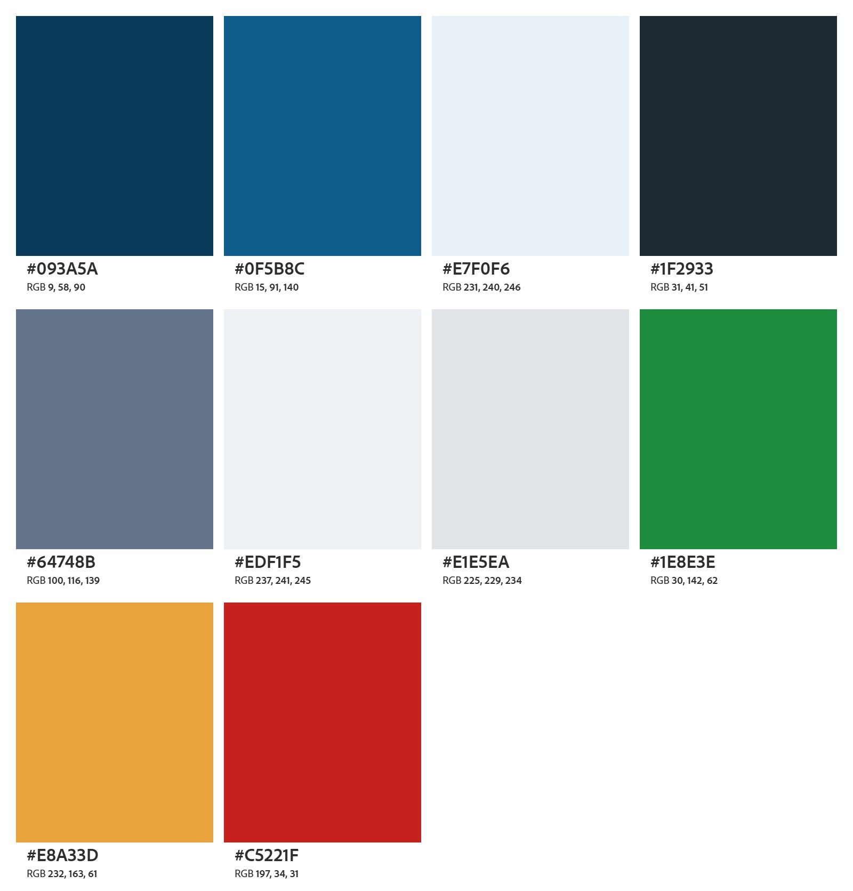

- **Azul Petróleo Profundo — #093A5A:** transmite autoridad, seriedad y solidez institucional. Se emplea como fondo en las secciones de mayor peso comunicacional de la Landing Page —el encabezado principal y el llamado a la acción final— y en los bloques donde el producto afirma su propuesta. Su profundidad hace que el contenido claro colocado encima se lea como documento sobre una superficie estable.
- **Azul Institucional — #0F5B8C:** es el color base de la marca y el único color de acción del producto. Se reserva para botones primarios, el elemento activo de la navegación, el indicador de foco y el resaltado de la columna ganadora en una comparación. Al ser el único color que representa acción, el usuario aprende en una pantalla dónde puede pulsar.
- **Azul Bruma — #E7F0F6:** tono claro derivado del anterior, empleado para fondos de resaltado, filas seleccionadas y fichas de versión. Permite destacar sin recurrir a bordes adicionales ni a sombras, lo que mantiene limpia una tabla ya densa.

- **Grafito — #1F2933:** color del texto principal y de los titulares. Se eligió por encima del negro puro porque reduce el contraste extremo en pantallas de trabajo prolongado, sin sacrificar la relación mínima de 4.5:1 exigida por la norma de accesibilidad.
- **Gris Neutro — #64748B:** texto secundario, etiquetas de campo, descripciones y unidades. Su función es jerárquica: separa el dato de su rótulo sin necesidad de cambiar de tamaño ni de peso.
- **Gris Documento — #F5F7FA y #EDF1F5:** fondos del área de contenido y filas alternadas de tabla. Estos tonos permiten que las tarjetas y tablas blancas se perciban como documentos colocados sobre una superficie, metáfora coherente con un producto que trabaja con cotizaciones.
- **Gris Borde — #E1E5EA:** bordes y divisores. El sistema prefiere el borde a la sombra para separar contenido dentro de una misma superficie, porque la sombra sugiere elevación y en una tabla comparativa todos los elementos están al mismo nivel.

- **Verde Conformidad — #1E8E3E sobre #E6F4EA:** indica que una cotización *cumple* un criterio técnico, que un dato fue verificado, que el nivel de confianza es alto o que una orden fue emitida. Es el color de la certeza.
- **Ámbar Revisión — #E8A33D sobre #FDF3E3:** indica que una cotización *cumple parcialmente*, que un dato detectado tiene confianza baja o que un resultado de simulación quedó desactualizado. Es el color que reclama la atención de una persona, y por eso nunca se usa para decorar: cada aparición del ámbar en pantalla es una tarea pendiente.
- **Rojo Exclusión — #C5221F sobre #FBE9E9:** indica que una cotización *no cumple* un criterio obligatorio, que un dato quedó no resuelto, que un documento no es procesable o que una orden fue anulada. Es el color que detiene el proceso.


#### Tipografía

SmartQuote emplea dos familias tipográficas con roles claramente separados, ambas de licencia abierta y disponibles en Google Fonts.

Se seleccionó **Manrope** como fuente principal para los títulos de SmartQuote por su estilo geométrico moderno y por sus formas ligeramente estrechas, que le permiten sostener titulares extensos en español sin dividirse en demasiadas líneas. Se utiliza en pesos altos para asegurar que los encabezados sean sólidos, técnicos y de lectura inmediata, transmitiendo el carácter de una herramienta de decisión sin caer en la frialdad de una tipografía puramente industrial.

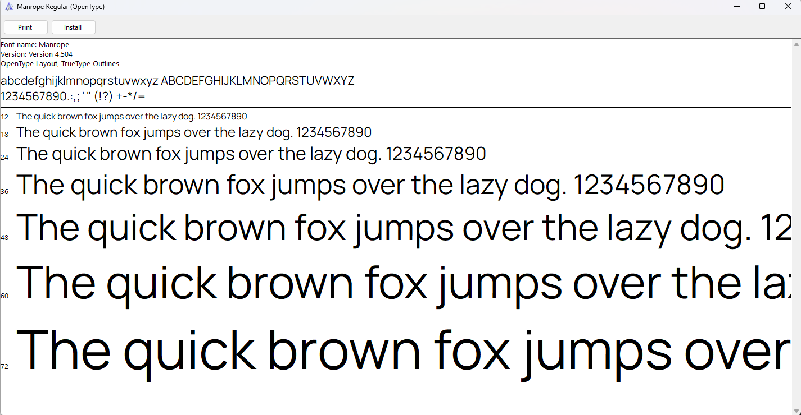

Se seleccionó **Inter** como fuente secundaria para el texto de cuerpo, la navegación, los formularios y, sobre todo, para las tablas de datos. La razón es funcional antes que estética: Inter dispone de **cifras tabulares**, es decir, todos sus dígitos ocupan el mismo ancho. En un producto cuya pantalla central compara precios por tonelada entre varios proveedores, esta característica hace que las cifras queden alineadas verticalmente en la columna y que la diferencia entre 1,980.00 y 1,890.00 se perciba de inmediato. Con una tipografía de cifras proporcionales, esa misma comparación exigiría un esfuerzo visual innecesario.


En cuanto al tamaño, se utiliza jerárquicamente en toda la plataforma para resaltar títulos principales, botones de acción y texto de soporte. Los tamaños más grandes en los encabezados guían al usuario rápidamente por los puntos clave del mensaje en la Landing Page, mientras que los más pequeños en párrafos, etiquetas y celdas aseguran la comprensión y la eficiencia en la lectura de detalles secundarios. Dentro de la aplicación web esta escala se comprime de forma deliberada, ya que cada píxel destinado a la tipografía es un píxel menos disponible para comparar cotizaciones. Los titulares emplean además un interletrado ligeramente negativo para compensar la apertura natural de la geometría de Manrope en tamaños grandes, y el texto de cuerpo mantiene líneas de menos de setenta caracteres para no fatigar la lectura en párrafos largos.

#### Branding

El branding de SmartQuote busca comunicar comparación y decisión, no tecnología genérica. El logo  y los iconos están formados por tres barras verticales de distinta altura, que representan las alternativas que se comparan, acompañadas de una marca de verificación sobre la barra seleccionada, que representa la decisión sustentada.


#### Espaciado

El espaciado se organiza en una escala de múltiplos de 4 px, aplicada de forma consistente en las tres superficies. Su función va más allá de la estética: en SmartQuote la densidad es una decisión de diseño que responde a la tarea, no a la plataforma. Una vista de comparación es densa por necesidad, porque el analista debe ver tres cotizaciones y cinco criterios simultáneamente; una sección de la Landing Page respira, porque el visitante está leyendo, no trabajando.

#### Dimensiones para el tono de comunicación y lenguaje aplicado

El tono de SmartQuote es **profesional, directo y verificable**. La plataforma asiste una decisión que el usuario deberá justificar ante su organización y, eventualmente, ante una auditoría; por lo tanto, el lenguaje nunca debe prometer más certeza de la que el sistema realmente posee.

De esa premisa se derivan seis reglas de redacción:

| Regla | Ejemplo correcto | Ejemplo incorrecto |
|---|---|---|
| El sistema se refiere a sí mismo en tercera persona, nunca en primera | "El análisis detectó 18.5 % de proteína cruda" | "Encontré 18.5 % de proteína cruda" |
| La incertidumbre se declara, no se oculta | "Plazo de entrega: no resuelto" | "Plazo de entrega: 7 días (estimado)" |
| Los errores indican causa y acción correctiva | "El archivo está dañado o no es una cotización legible. Cárgalo nuevamente o registra la cotización de forma manual" | "Error al procesar el archivo" |
| No se emplea lenguaje promocional sobre la inteligencia artificial | "Análisis automático" | "IA inteligente", "análisis mágico" |
| No se expone terminología de implementación | "Datos detectados", "Resultado de la simulación" | "Extracción del agente", "snapshot de la simulación" |
| Las acciones se nombran con verbo y objeto explícito | "Generar orden de compra" | "Continuar", "Enviar" |

Además, se consideraron tres aspectos transversales:

- **Consistencia.** Una acción conserva el mismo nombre a lo largo de todo el flujo: el botón que dice "Emitir orden" produce un estado que dice "Emitida". El vocabulario de la interfaz es la señalización con la que el usuario aprende a moverse por el producto, y cambiar el término a mitad del recorrido lo obliga a reaprender.
- **Navegación.** La estructura sigue las etapas reales del ciclo de adquisición, de modo que el usuario encuentra la información donde el proceso la produce. Los menús son mínimos y cada vista de detalle mantiene visible el camino recorrido, porque en este producto saber de dónde viene un dato forma parte del dato.
- **Accesibilidad.** La plataforma se diseña para ser operable por completo con teclado, legible con lector de pantalla y utilizable con el texto ampliado al 200 %.

#### Elementos de diseño

Junto a los lineamientos de color, tipografía y branding, el diseño visual de SmartQuote aplica de forma consciente los elementos fundamentales del diseño gráfico, siempre subordinados a la lectura del dato.

La **línea** cumple una función estructural y no ornamental: separa filas en las tablas de datos, delimita tarjetas y marca la columna congelada de criterios en el cuadro comparativo. Su presencia es deliberadamente discreta, de 1 px y en Gris Borde, porque en una pantalla con tres columnas de datos toda línea adicional compite con la información.

El **color** opera en dos registros simultáneos, ya descritos: identidad y estado. Su valor comunicativo depende por completo de mantenerlos separados, y es la razón por la cual el sistema renuncia a un color de acento decorativo.

El **tamaño** establece la jerarquía sin necesidad de recurrir a más recursos. Los titulares grandes conducen al visitante por los puntos clave de la Landing Page, mientras que dentro de la aplicación la escala se comprime deliberadamente: el título de página mide 24 px y el cuerpo 14 px, porque cada píxel destinado a la tipografía es un píxel menos disponible para comparar cotizaciones.

La **textura** es plana y limpia. El producto no emplea degradados, patrones ni sombras difusas como decoración; la única variación de superficie proviene del contraste entre el fondo Gris Documento y las tarjetas blancas, que produce la sensación de documentos sobre un escritorio, coherente con un sistema cuya materia prima son cotizaciones en PDF.

El **espacio** es el elemento que más trabaja en este sistema, precisamente porque escasea en las vistas de comparación. Se administra con la escala de 4 px y se distribuye de forma asimétrica entre superficies: generoso en la Landing Page, medido en la aplicación web.

El **brillo** o valor separa las capas de la interfaz. El fondo claro sostiene tarjetas blancas, y sobre ellas los elementos de acción concentran el mayor contraste. Esta gradación permite que el usuario identifique en menos de un segundo dónde puede actuar en una pantalla saturada de datos.

La **forma** utiliza geometrías de bordes redondeados con radios diferenciados por jerarquía. El redondeo suaviza una interfaz que de otro modo resultaría severa por su densidad, y el hecho de que el radio varíe según el tipo de elemento aporta una señal adicional sobre qué es un control y qué es un contenedor.

#### Principios de diseño

El **contraste** garantiza que los elementos críticos —el botón primario de cada vista, los distintivos de cumplimiento y la banda de advertencia de un resultado desactualizado— se distingan de inmediato sobre fondos neutros. En SmartQuote el contraste no es solo un recurso estético sino un requisito de accesibilidad verificable, con umbrales medidos antes de cerrar cada pantalla.

La **repetición** de la paleta, de los tres iconos de estado y de los patrones de tabla construye familiaridad a lo largo del producto. Un analista que aprendió a leer el cuadro comparativo puede leer el listado de órdenes sin instrucción adicional, porque ambos emplean el mismo vocabulario visual. Esta consistencia reduce la curva de aprendizaje en un producto que se usa a diario y bajo presión de tiempo.

La **alineación** aporta el orden que un documento de sustento exige. La grilla de 12 columnas, la alineación a la izquierda de las etiquetas y la alineación a la derecha de todas las cifras producen una lectura predecible; esta última es la que permite comparar precios recorriendo la columna con la vista, sin detenerse en cada celda.

La **proximidad** agrupa lo que pertenece junto: el dato detectado con su nivel de confianza, la cotización excluida con el criterio que incumplió, la orden de compra con los enlaces hacia la simulación que la originó. En un producto cuya propuesta de valor es la trazabilidad, la cercanía física entre un hecho y su justificación es la expresión visual del argumento.

### 4.1.2. Web Style Guidelines

El diseño web de SmartQuote traduce el sistema visual de 4.1.1 a dos superficies con propósitos distintos: la Landing Page, construida en HTML5, CSS3 y JavaScript, orientada a la lectura y al convencimiento del visitante; y la aplicación web, construida en Vue.js con PrimeVue y Material Design, orientada al trabajo diario del analista de adquisiciones. Ambas comparten los mismos valores de color, tipografía y espaciado, pero los expresan con ritmos diferentes: la Landing emplea contenedores amplios y separaciones generosas entre secciones para permitir descansos visuales, mientras que la aplicación web comprime deliberadamente esos mismos valores, porque su tarea central —comparar varias cotizaciones contra un conjunto de criterios— exige alta densidad de información en pantalla. La composición se resuelve con CSS Grid y Flexbox sobre una grilla de doce columnas, lo que mantiene la alineación entre bloques de distinta naturaleza y evita que la información se disperse al cambiar el tamaño de la ventana.

La estrategia responsiva es intencionalmente mixta. La Landing Page se diseña mobile-first, ya que el descubrimiento del producto ocurre con frecuencia desde el teléfono, y sus secciones de varias columnas se apilan progresivamente hasta los 360 px. La aplicación web se diseña desktop-first y define un comportamiento propio en cada punto de quiebre: la barra lateral pasa de expandida a iconos y finalmente a panel deslizante, mientras que el cuadro comparativo se desplaza horizontalmente conservando congelada la columna de criterios. Esta última decisión es deliberada: reducir el ancho ocultando las etiquetas de estado dejaría al color y al icono comunicando solos, lo que contradice la primera regla del sistema declarada en 4.1.1.

En cuanto a la interactividad, la plataforma utiliza una lógica de componentes claramente identificables, apoyada en la librería PrimeVue para el producto y en componentes propios equivalentes para la Landing. Los botones de acción emplean el azul institucional como único color de acción, con estados visuales de hover, focus, disabled y loading que ofrecen retroalimentación inmediata y enseñan al usuario dónde puede pulsar. La navegación se apoya en un marco persistente —barra lateral, barra superior con búsqueda global y selector de idioma, y migas de pan en cada vista de detalle— que mantiene siempre disponibles las herramientas principales, incluido el sistema de internacionalización con inglés como idioma predeterminado y español de Latinoamérica como alterno. Las transiciones son breves y siempre responden a una acción del usuario, nunca al desplazamiento de la página, y se anulan cuando el sistema declara preferencia de movimiento reducido.


### 4.1.3. Mobile Style Guidelines

#### 4.1.3.1. iOS Mobile Style Guidelines

#### 4.1.3.2. Android Mobile Style Guidelines

## 4.2. Information Architecture

### 4.2.1. Organization Systems

En SmartQuote se emplea una organización jerárquica (visual hierarchy) para destacar la información que sostiene la decisión de compra. En el cuadro comparativo, los criterios obligatorios y el puntaje total ocupan la posición de mayor peso visual, mientras que las condiciones comerciales secundarias descienden a niveles inferiores. Esta jerarquía permite que el analista identifique en segundos qué cotización queda excluida y por qué, sin recorrer el documento completo.

Asimismo, se aplica una organización secuencial (step-by-step) en los procesos que exigen una progresión lógica. En la Landing Page se evidencia en la sección "Cómo funciona", que recorre los cinco pasos del ciclo de adquisición. En la aplicación web se materializa en el asistente que acompaña el flujo Solicitud → Cotizaciones → Criterios → Simulación → Orden, impidiendo que se avance a una simulación mientras existan cotizaciones sin verificar.

Respecto a los esquemas de categorización, el contenido de la aplicación se agrupa por tópicos, reproduciendo los cuatro bounded contexts definidos en la arquitectura, de modo que la interfaz y el modelo de software compartan el mismo mapa mental: Solicitudes, Cotizaciones, Evaluación y Órdenes de compra. Dentro de cada módulo se emplea una organización cronológica para los listados, ordenados por fecha de creación descendente, y una organización por estado del proceso mediante pestañas de filtrado. Finalmente, el contenido se clasifica según audiencia, segmentando funcionalidades de acuerdo con los dos User Personas identificados: Analistas de Adquisiciones, enfocados en la evaluación y adjudicación, y Especialistas de Producción y Sanidad, orientados al registro y seguimiento de solicitudes desde la granja.

### 4.2.2. Labeling Systems

El sistema de etiquetado de SmartQuote se deriva del Ubiquitous Language del proyecto, buscando que cada término coincida con el vocabulario que el personal de adquisiciones ya emplea. Se evita deliberadamente exponer terminología de implementación: el usuario nunca lee "agente de IA" ni "extracción", sino Análisis automático y Datos detectados.

**Landing Page**

- **Pruébalo**: Conduce al simulador donde el visitante ajusta los pesos y observa cómo cambia la alternativa ganadora.
- **Cómo funciona**: Explica la ubicación de la plataforma dentro del proceso de compra existente.
- **Para tu equipo**: Diferencia los beneficios según el área que utilizará cada aplicación.
- **Planes**: Estructura la oferta comercial según el volumen de cotizaciones analizadas al mes.
- **Solicitar demostración**: Botón de acción principal, con texto idéntico en todas sus apariciones para reforzar el reconocimiento.

**Aplicación Web – Analistas de Adquisiciones**

- **Solicitudes**: Listado de necesidades registradas por las áreas operativas, con su estado y número de cotizaciones asociadas.
- **Cotizaciones**: Documentos cargados por proveedor, con el estado del análisis automático.
- **Datos detectados**: Campos extraídos de cada documento, acompañados de su nivel de confianza y de los valores marcados como No resuelto.
- **Criterios obligatorios / Criterios ponderados**: Distingue las condiciones que excluyen una oferta de las que solo aportan puntaje.
- **Ejecutar simulación**: Etiqueta de alta visibilidad que dispara la evaluación comparativa.
Generar orden de compra: Acción de cierre, deshabilitada mientras el resultado no esté vigente.

**Aplicación Móvil – Especialistas de Producción y Sanidad**

- **Nueva solicitud**: Registro del insumo, cantidad, fecha requerida y prioridad desde el entorno operativo.
- **Requisitos técnicos**: Condiciones que el insumo debe cumplir, como composición nutricional o concentración.
- **Mis solicitudes**: Relación de las necesidades registradas por el usuario con su estado vigente.
- **Seguimiento**: Historial cronológico de cada solicitud, indicando el área responsable de la siguiente acción.

### 4.2.3. SEO Tags and Meta Tags

1. **Landing Page**

**Charset**

<meta charset="UTF-8" />

Establece la codificación universal de caracteres. Su función es garantizar que el navegador interprete correctamente los textos del sistema i18n, asegurando que tildes, la letra "ñ" y símbolos técnicos como el de porcentaje o el de mayor o igual se visualicen sin errores en español e inglés.

**Viewport (Responsive)**

<meta name="viewport" content="width=device-width, initial-scale=1.0" />

Controla el escalado de la página en distintos dispositivos. Su función es ajustar el ancho del contenido al tamaño de la pantalla, algo crítico porque el descubrimiento del producto ocurre con frecuencia desde el teléfono del jefe de compras.

**Title (SEO)**

<title>SmartQuote — Compara cotizaciones y emite tu orden de compra</title>

Define el título que aparece en la pestaña del navegador y en los resultados de búsqueda. Su función es identificar de inmediato la marca y el problema que resuelve, siendo un factor determinante para el posicionamiento orgánico.

**Meta Description (SEO)**

<meta name="description" content="Plataforma SaaS que lee las cotizaciones de tus proveedores en PDF, las contrasta con tus criterios técnicos y comerciales, y entrega una recomendación trazable y la orden de compra lista para aprobar.">

Provee un resumen conciso del contenido del sitio. Su función es aparecer como fragmento en los resultados de Google, explicando cómo SmartQuote resuelve la evaluación manual de cotizaciones heterogéneas.

**Meta Keywords (SEO)**

<meta name="keywords" content="comparación de cotizaciones, software de compras, sector avícola, evaluación de proveedores, orden de compra, SaaS">

Especifica palabras clave relevantes para la temática. Su función es ayudar a los algoritmos de indexación a clasificar el sitio dentro del nicho de tecnología para abastecimiento y compras del sector pecuario.

**Meta Author**

<meta name="author" content="SmartQuote">

Identifica formalmente a los creadores de la plataforma, vinculando el desarrollo técnico con la startup responsable.

**Meta Copyright**

<meta name="copyright" content="SmartQuote 2026">

Establece la titularidad de la propiedad intelectual de la página y el año de vigencia, protegiendo el contenido y el diseño del sitio.

**Meta Robots**

<meta name="robots" content="index, follow">

Instruye a los motores de búsqueda para que incluyan la página en sus índices y sigan sus enlaces internos. Cabe precisar que la aplicación web declara lo contrario, noindex, nofollow, ya que su contenido es privado y su exposición revelaría rutas internas sin aportar valor.

**Meta Language**

<html lang="en">

Declara el idioma principal de la estructura del sitio. Su función es informar a navegadores y buscadores que el texto base está en inglés, coherente con el idioma predeterminado definido para la plataforma, mientras que el español de Latinoamérica se declara como alternativa mediante etiquetas hreflang.

### 4.2.4. Searching Systems

En esta sección se describen los mecanismos de recuperación de información diseñados para SmartQuote. El objetivo es que el analista localice una solicitud, una cotización o una orden sin recorrer listados extensos, especialmente cuando debe responder a una consulta sobre una compra realizada meses atrás.

**Vista del Analista de Adquisiciones**

**1. Medios de ayuda para la búsqueda de datos**

- Búsqueda global: Disponible en la barra superior desde cualquier vista, accesible además con el atajo de teclado Ctrl/Cmd + K.
- Autocompletado: Sugiere códigos de solicitud, razones sociales de proveedores y números de orden conforme el usuario escribe, a partir del tercer carácter.
- Tolerancia a la escritura: La búsqueda es insensible a mayúsculas y tildes y admite coincidencias parciales, evitando resultados vacíos por una letra acentuada.
- Mensajes contextuales: Cuando no hay coincidencias, el sistema confirma el término buscado y sugiere ampliar el rango de fechas o revisar los filtros activos.
- Historial reciente: Al abrir el campo vacío se muestran las últimas cinco búsquedas del usuario.

**2. Filtros y opciones**

- Por Estado: Filtrado de solicitudes entre "Abierta", "En evaluación", "Adjudicada" y "Cerrada".
- Por Proveedor: Localización de todas las cotizaciones remitidas por una misma empresa.
- Por Tipo de Insumo: Segmentación entre alimento balanceado, vacunas, medicamentos y material de empaque.
- Por Estado de Verificación: Filtrado de cotizaciones "Verificadas", "Requieren revisión" o "No procesables".
- Por Rango de Fechas y de Monto: Acotamiento de órdenes de compra por periodo de emisión o por importe.

**3. Visualización de resultados**

- Resultados agrupados: La búsqueda global presenta los hallazgos separados por tipo de entidad, con un máximo de cinco por grupo y un enlace "Ver todos".
- Tablas de datos: Los listados muestran encabezado fijo, ordenamiento por columna y filas alternadas para facilitar el recorrido horizontal.
- Indicadores de color, siempre acompañados de icono y texto:
- Verde: Cotización verificada o criterio cumplido.
- Ámbar: Nivel de confianza bajo o resultado desactualizado.
- Rojo: Criterio incumplido, dato no resuelto o documento no procesable.
- Filtros como fichas removibles: Las condiciones aplicadas permanecen visibles sobre el listado, junto a una acción de "Limpiar filtros".

**Vista del Especialista de Producción y Sanidad**

**1. Medios de ayuda para la búsqueda de datos**

- Buscador de solicitudes: Permite localizar una necesidad registrada por código o por nombre del insumo.
- Sugerencias por fecha: Selector de periodo para consultar solicitudes de campañas anteriores.
- Acceso directo al seguimiento: Desde el resultado se llega al historial de estados sin pasos intermedios.

**2. Filtros y opciones**

- Por Estado de Atención: Filtrado entre solicitudes "En evaluación", "Adjudicadas" y "Con orden emitida".
- Por Prioridad: Separación de las necesidades críticas de abastecimiento respecto de las regulares.
- Por Tipo de Insumo: Distinción entre alimento, productos sanitarios y materiales.

**3. Visualización de resultados**

- Tarjetas de solicitud: Incluyen código, insumo, cantidad, fecha requerida y una etiqueta de estado de alta visibilidad.
- Línea de tiempo de eventos: Historial cronológico con la fecha de cada cambio de estado y el responsable de la siguiente acción.
- Colores de estado:
  - Verde: Orden emitida para la solicitud.
  - Ámbar: En evaluación, a la espera de una acción de adquisiciones.
  - Rojo: Solicitud observada o devuelta por información incompleta.

### 4.2.5. Navigation Systems

La navegación en SmartQuote se diseñó para que el usuario nunca pierda de vista el origen de un dato, ya que la trazabilidad es la propuesta de valor del producto. En la Landing Page se emplea un sistema de desplazamiento vertical (smooth scroll) que recorre de forma narrativa el problema, el simulador, el proceso y los planes, conduciendo al visitante hacia los llamados a la acción. Esta navegación se apoya en una barra superior persistente (Sticky Nav) que incluye el selector de idioma (i18n), permitiendo cambiar el contexto lingüístico en cualquier punto del recorrido sin perder la posición.

Dentro de la aplicación web, la navegación principal se organiza mediante una barra lateral fija (Sidebar) que otorga acceso inmediato a los módulos del dominio: Solicitudes, Cotizaciones, Evaluación, Órdenes de compra, Proveedores y Configuración. Esta estructura permite que el analista alterne entre la revisión de un documento y el cuadro comparativo sin abandonar el contexto de la solicitud que está atendiendo. La barra superior concentra las herramientas transversales —búsqueda global, idioma, notificaciones y menú de cuenta—, mientras que las migas de pan y las pestañas dentro de cada vista de detalle indican en todo momento la posición dentro del proceso.

Un rasgo distintivo del sistema es la navegación complementaria bidireccional: desde una orden de compra se alcanza la simulación que la originó, desde la simulación se llega a las cotizaciones evaluadas y desde estas a la solicitud inicial, y el recorrido funciona igualmente en sentido inverso. Esta capacidad es la expresión en interfaz de la trazabilidad que el sistema conserva internamente, y responde directamente al problema levantado en la sección 1.2.1 sobre la dificultad de justificar por qué se eligió a un proveedor determinado.

Finalmente, la experiencia se adapta según el perfil. Los Especialistas de Producción y Sanidad acceden desde la aplicación móvil a una vista simplificada, centrada en el registro y el seguimiento de sus solicitudes, mientras que los Analistas de Adquisiciones disponen en la web de controles operativos completos. El uso de un asistente por pasos dentro del flujo de evaluación asegura que el usuario conozca la etapa en que se encuentra y las que ya completó, garantizando un recorrido coherente con la naturaleza secuencial del proceso de compra.

## 4.3. Landing Page UI Design

### 4.3.1. Landing Page Wireframe

A continuación, se presentan los wireframes de las principales secciones de la landing page. Cada imagen ilustra el diseño propuesto para las distintas secciones, flujos de navegación y elementos de interacción de la plataforma. Se elaboraron en baja fidelidad y en escala de grises, con el fin de validar la estructura y la jerarquía del contenido antes de aplicar el sistema visual definido en 4.1.1.
 
**Principios Aplicados**
 
- **Jerarquía visual clara:** El contenido se ordena de modo que el visitante reconozca primero el problema y luego la solución. El encabezado principal presenta las tres cotizaciones tal como llegan del proveedor, y a partir de ahí se conduce al usuario por el simulador de criterios, el proceso completo, la cadena de trazabilidad, los beneficios por rol y los planes de membresía, cerrando con el llamado a la acción.
- **Demostración antes que enunciado:** Las dos piezas de mayor peso estructural no describen la propuesta de valor, la ejecutan. El conmutador del encabezado transforma los documentos heterogéneos en el cuadro comparativo normalizado, y el simulador permite que el visitante mueva los pesos y observe cómo cambia la cotización ganadora. La estructura reserva a ambas el espacio más amplio de la página.
- **Consistencia visual:** Se mantuvieron patrones uniformes en tarjetas, botones y listados, con un único botón primario por sección y con el llamado a la acción principal conservando la misma posición y etiqueta en todas sus apariciones.
- **Contraste y accesibilidad:** La estructura contempla un contorno de foco visible en todos los controles, objetivos táctiles de al menos 44 px y estados que combinan color, icono y texto, de modo que ningún resultado de comparación dependa únicamente del color para ser comprendido.
- **Optimización para dispositivos móviles:** Los wireframes contemplan una navegación móvil dedicada, con los enlaces colapsados en un menú desplegable mientras el botón principal permanece visible. Las cuadrículas de varias columnas se reorganizan en una sola columna y el cuadro comparativo se desplaza horizontalmente conservando la columna de criterios, en lugar de suprimir las etiquetas de estado.
- **Diseño inclusivo:** La estructura es compatible con el sistema i18n, reservando entre 25 % y 30 % de holgura horizontal en botones y etiquetas de navegación para absorber la mayor extensión de las traducciones al español respecto del inglés predeterminado.

##### Versión Desktop Web Browser
 
En esta primera sección se presenta la pantalla Home de la landing page, con el encabezado principal, el acceso al sistema de internacionalización (i18n) y el botón de llamada a la acción. Debajo del titular se ubica el conmutador de dos estados y los tres documentos de cotización tal como los remiten los proveedores, cada uno con una estructura interna distinta para evidenciar el problema que resuelve la plataforma.
 


A continuación, se muestra la franja de contexto operativo y la sección del simulador de criterios. En la columna izquierda se disponen el requisito obligatorio y los tres controles de ponderación; en la derecha, el ranking resultante con el puntaje de cada cotización y la advertencia de la oferta excluida por incumplir la especificación técnica.
 


Se presenta la sección "Dónde entra la plataforma en tu proceso", estructurada como un riel de cinco pasos numerados. Cada fila mantiene el título a la izquierda y la descripción a la derecha, lo que permite recorrer el proceso completo sin desplazamiento excesivo.
 


El siguiente frame corresponde a la sección de trazabilidad, donde la cadena solicitud, cotización, simulación y orden de compra se presenta como un grupo de eslabones seleccionables acompañados de un bloque de detalle. Debajo inicia la segmentación de beneficios por rol.
 


Se presenta la sección "Dos equipos, dos formas de entrar", donde se segmentan los beneficios específicos para cada usuario objetivo: los analistas de adquisiciones, orientados a la evaluación y adjudicación en la aplicación web, y los especialistas de producción y sanidad, orientados al registro y seguimiento desde la aplicación móvil. Cierra la franja de enfoque sectorial con los insumos cubiertos.
 


A continuación, se muestra la sección de Planes de membresía, con la estructura de precios en tres columnas y el plan intermedio destacado, diseñada de forma escaneable para facilitar la comparación comercial. Debajo inicia la sección de preguntas frecuentes.
 


Se presenta la sección de preguntas frecuentes, resuelta como un acordeón de seis filas colapsadas con un campo de filtrado por texto en la parte superior, que permite localizar una duda específica sin recorrer la lista completa.
 


Finalmente, se presenta el llamado a la acción de cierre, con un formulario de contacto de tres campos, seguido del footer con sus cuatro columnas de enlaces, el selector de idioma y la franja legal con los créditos del equipo.
 


##### Versión Mobile Web Browser
 
A continuación, se presenta la adaptación responsiva de SmartQuote para dispositivos móviles. En estas vistas se observa la reorganización de los elementos en una estructura vertical y el uso de componentes optimizados para la interacción táctil.
 
**Pantalla Home y navegación móvil:** Se muestra la adaptación del encabezado principal, con los enlaces de navegación colapsados en el botón hamburguesa mientras el llamado a la acción permanece visible. Los tres documentos de cotización pasan de una fila de tres columnas a una pila vertical y se enderezan, eliminando la rotación que en escritorio sugiere papeles sobre un escritorio.
 


**Simulador de criterios en móvil:** El simulador pasa de dos columnas a un flujo vertical. Primero se presentan el requisito obligatorio y los tres controles de ponderación con su porcentaje visible, y a continuación el ranking resultante con el puntaje de cada cotización y la nota explicativa de la exclusión. Esta separación asegura que el usuario complete la configuración antes de ver el resultado, reforzando la relación causa-efecto que la sección busca comunicar.
 


**Proceso y trazabilidad en móvil:** El riel de cinco pasos conserva su numeración y apila el título sobre la descripción, alineando el texto respecto del título y no del número. La cadena de trazabilidad reorganiza sus cuatro eslabones en dos filas, manteniendo el bloque de detalle inmediatamente debajo para que la relación entre el eslabón seleccionado y su información no se pierda.
 


**Roles del sistema en móvil:** Se adapta la segmentación de beneficios mediante un flujo vertical, presentando primero el bloque de adquisiciones y luego el de producción y sanidad. Cada rol se muestra de forma independiente, con su fragmento de interfaz debajo del texto, para que el impacto de los beneficios específicos no se pierda en pantallas reducidas.
 


**Enfoque sectorial y planes en móvil:** La franja de insumos cubiertos pasa de una disposición horizontal a una lista de etiquetas envolventes. Las tres columnas de planes se transforman en tarjetas apiladas, ubicando primero el plan destacado para que la alternativa recomendada sea la primera que el visitante encuentra al desplazarse.
 


**Preguntas frecuentes, cierre y footer en móvil:** El acordeón conserva el campo de filtrado y ocupa el ancho completo. El formulario de contacto pasa a un solo campo por fila para facilitar el ingreso táctil, y el footer transforma sus cuatro columnas en bloques verticales que incluyen los enlaces, el selector de idioma y los créditos del equipo de forma compacta al final del recorrido.
 


### 4.3.2. Landing Page Mock-up

A continuación, se presentan los mock-ups de las principales secciones de la landing page. Cada imagen aplica sobre la estructura validada en 4.3.1 el sistema visual definido en 4.1.1 y sus reglas de aplicación web establecidas en 4.1.2, incorporando datos representativos del rubro avícola en lugar de contenido de relleno.
 
##### Versión Desktop Web Browser
 
En esta primera sección se presenta la pantalla Home con el sistema visual aplicado. El encabezado emplea el azul petróleo profundo como fondo para anclar la percepción de solidez, y los tres documentos de cotización se diferencian deliberadamente entre sí mediante tipografías distintas, una con remates, una moderna y una monoespaciada con apariencia de escaneo, ya que la heterogeneidad de los formatos es el problema que la landing comunica.
 


A continuación, se muestra la franja de contexto operativo y el simulador de criterios. El ranking aplica la codificación semántica de la paleta: la cotización recomendada se destaca con el azul institucional y la excluida se presenta atenuada con el rojo de exclusión, acompañada del criterio obligatorio que incumplió, cumpliendo la regla de que ningún estado se comunique únicamente mediante color.
 


Se presenta la sección del proceso, resuelta sobre fondo azul profundo con la numeración en el azul claro de la paleta. La disposición de tres columnas por fila mantiene el título junto a su descripción y aprovecha el ancho disponible, evitando el espacio vacío que produciría una sola columna de texto.
 


El siguiente frame corresponde a la sección de trazabilidad. El eslabón seleccionado se marca con el azul institucional y los anteriores con el azul bruma, comunicando visualmente que el recorrido hacia atrás permanece disponible, que es la expresión en interfaz de la trazabilidad descrita en 4.2.5.
 


Se presenta la segmentación de beneficios por rol, donde cada bloque se acompaña de un fragmento real de interfaz en lugar de una fotografía: los datos detectados con sus niveles de confianza para adquisiciones, y las solicitudes con su estado para producción y sanidad. Cierra la franja de enfoque sectorial sobre el azul institucional.
 


A continuación, se muestran los planes de membresía. El plan intermedio se destaca mediante un borde en el color de marca y un rótulo de recomendación, reservando el único botón primario de la sección para esa alternativa y manteniendo los demás como botones de contorno.
 


Se presenta la sección de preguntas frecuentes con el sistema visual aplicado, sobre fondo gris documento para separarla de las secciones contiguas sin recurrir a divisores, conforme a la regla de espaciado establecida en 4.1.1.
 


Finalmente, se presenta el llamado a la acción de cierre y el footer. El cierre retoma el azul petróleo profundo del encabezado, de modo que el mayor contraste de la página quede reservado para los dos puntos de conversión, mientras que el footer emplea el grafito de la escala neutra para diferenciarse de ambos.
 


##### Versión Mobile Web Browser
 
A continuación, se presentan los mock-ups de la versión móvil. Cada imagen muestra la adaptación responsiva de las secciones principales conservando los mismos tokens de color, tipografía y espaciado declarados para escritorio.
 
**Pantalla Home y navegación móvil:** Se muestra el encabezado con los enlaces colapsados en el botón hamburguesa y el llamado a la acción siempre visible. Los documentos de cotización se apilan y se enderezan, y el conmutador de dos estados conserva su tamaño de objetivo táctil.
 


**Simulador de criterios en móvil:** Los controles y el resultado se presentan en secuencia vertical. Los porcentajes de ponderación mantienen las cifras tabulares para que el usuario perciba el cambio al desplazar cada control, y el ranking conserva la barra de progreso y el distintivo de exclusión.
 


**Proceso y trazabilidad en móvil:** El riel conserva la numeración en azul claro sobre fondo profundo y reduce el tamaño tipográfico sin comprometer la relación mínima de contraste. La cadena de trazabilidad distribuye sus eslabones en dos filas manteniendo visible el estado seleccionado.
 


**Roles del sistema en móvil:** Cada rol se presenta de forma independiente con su fragmento de interfaz debajo del texto, conservando los distintivos de nivel de confianza y los estados de solicitud con su codificación semántica completa de color, icono y texto.
 


**Enfoque sectorial y planes en móvil:** La franja de insumos conserva el azul institucional de fondo con las etiquetas envolviendo en varias líneas. Los planes se apilan ubicando primero el destacado, que mantiene su borde en el color de marca y su botón primario.
 


**Preguntas frecuentes, cierre y footer en móvil:** El acordeón ocupa el ancho completo conservando el campo de filtrado. El formulario de contacto pasa a un campo por fila, con las etiquetas siempre visibles sobre cada campo y no como texto de sugerencia, y el footer presenta los enlaces, el selector de idioma y los créditos del equipo de manera compacta y accesible al final del recorrido.
 


## 4.4. Mobile Applications UX/UI Design

### 4.4.1. Mobile Applications Wireframes

### 4.4.2. Mobile Applications Wireflow Diagrams

### 4.4.3. Mobile Applications Mock-ups

### 4.4.4. Mobile Applications User Flow Diagrams

## 4.5. Mobile Applications Prototyping

### 4.5.1. Android Mobile Applications Prototyping

### 4.5.2. iOS Mobile Applications Prototyping

## 4.6. Web Applications UX/UI Design

### 4.6.1. Web Applications Wireframes

### 4.6.2. Web Applications Wireflow Diagrams

### 4.6.3. Web Applications Mock-ups

### 4.6.4. Web Applications User Flow Diagrams

## 4.7. Web Applications Prototyping

## 4.8. Domain-Driven Software Architecture

### Architecture Overview Diagram

La arquitectura de **SmartQuote** adopta un **monolito modular** basado en *Domain-Driven Design* (DDD) y *Clean Architecture*. El backend se despliega como una sola aplicación ASP.NET Core, pero organiza el modelo y los casos de uso en módulos con límites de negocio explícitos. Esta decisión permite mantener consistencia transaccional durante la primera etapa del producto sin perder la separación necesaria para que cada módulo pueda evolucionar de forma independiente.

La solución se divide en los siguientes *bounded contexts*:

| Bounded Context | Clasificación | Responsabilidad principal |
| --- | --- | --- |
| **Supply Requests Context** | Supporting Domain | Registra las solicitudes de insumos provenientes de la granja, sus requerimientos técnicos y biológicos, prioridad, archivos adjuntos y estado de atención. |
| **Quotation Intake Context** | Supporting Domain | Recibe cotizaciones en formatos heterogéneos, coordina la extracción mediante IA, conserva el nivel de confianza y permite verificar o corregir los datos obtenidos. |
| **Evaluation & Simulation Context** | Core Domain | Define escenarios de evaluación, aplica primero las reglas técnicas obligatorias y después pondera criterios como precio y plazo de entrega para producir un ranking y una recomendación trazable. |
| **Purchase Ordering Context** | Supporting Domain | Autoriza el resultado seleccionado y genera una orden de compra idempotente a partir de una simulación aprobada, preservando la trazabilidad de la decisión. |

El flujo principal del dominio avanza desde la solicitud del insumo hasta la emisión de la orden de compra: **Supply Requests → Quotation Intake → Evaluation & Simulation → Purchase Ordering**. Los contextos no acceden directamente a los modelos internos de otros módulos; intercambian identificadores, contratos de aplicación y *snapshots* inmutables. De esta manera, una simulación conserva los datos con los que fue ejecutada y una orden de compra mantiene la evidencia de la recomendación que le dio origen.

En el backend, cada contexto contiene las capas **Domain**, **Application**, **Infrastructure** e **Interfaces**. En la aplicación web se emplean **Domain**, **Application**, **Infrastructure** y **Presentation**. Las dependencias apuntan hacia el dominio: la presentación ejecuta casos de uso, la infraestructura implementa los puertos definidos por la aplicación y el dominio permanece independiente de frameworks, bases de datos y servicios externos.

Aunque el backend utiliza un único contenedor PostgreSQL, cada contexto es propietario de sus datos y los accede mediante adaptadores de persistencia específicos. Del mismo modo, la comunicación con OpenAI queda encapsulada dentro de la infraestructura de **Quotation Intake**, evitando que el proveedor de IA se convierta en una dependencia del dominio.

### 4.8.1. Software Architecture Context Diagram

El diagrama de contexto presenta a **SmartQuote** como una caja negra y delimita las interacciones que determinan el alcance del sistema. El **Poultry Purchase Analyst** carga y verifica cotizaciones, configura simulaciones, analiza resultados y gestiona la emisión de órdenes de compra. El **Poultry Production Specialist / Veterinarian** registra desde la granja las solicitudes de alimentos, medicamentos o vacunas con sus especificaciones técnicas, y consulta su estado de atención.

La **OpenAI Platform / LLM Service** es el único sistema externo representado. SmartQuote la consume mediante HTTPS para interpretar cotizaciones no estructuradas y obtener una salida estructurada. La decisión de aceptación, corrección, evaluación y compra permanece bajo el control de SmartQuote y sus usuarios; el servicio externo no accede directamente a la base de datos ni ejecuta reglas del negocio.

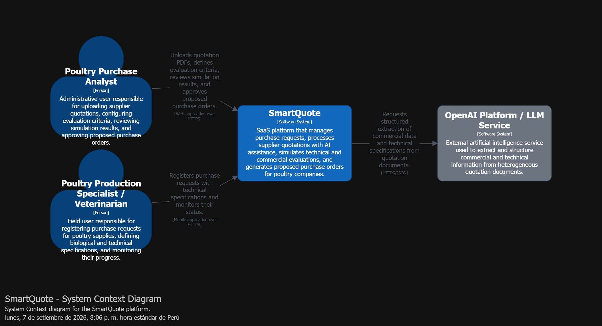

### 4.8.2. Software Architecture Container Diagrams

El diagrama de contenedores descompone SmartQuote en las aplicaciones ejecutables y almacenes de datos que participan en la solución. La separación responde a los canales de interacción de cada actor y concentra las reglas de negocio en el backend.

| Contenedor | Tecnología | Responsabilidad |
| --- | --- | --- |
| **Landing Page** | HTML5, CSS3 y JavaScript | Comunica la propuesta de valor de SmartQuote, presenta el servicio SaaS y permite a los visitantes conocer el producto. |
| **Web Application** | Vue.js, PrimeVue y Material Design | Permite al analista consultar solicitudes, cargar y verificar cotizaciones, configurar simulaciones, revisar resultados y gestionar órdenes de compra. |
| **Native Mobile Application** | Flutter y Dart para Android | Permite al especialista de producción o veterinario registrar solicitudes de insumos desde la granja y consultar su estado e historial. |
| **Web Services RESTful API** | ASP.NET Core y C# | Expone los casos de uso, aplica las reglas del dominio, controla la seguridad, coordina la persistencia y orquesta la extracción de cotizaciones mediante Semantic Kernel y OpenAI. |
| **Database** | PostgreSQL | Almacena la información estructurada de los cuatro contextos mediante esquemas y adaptadores de persistencia lógicamente separados. |

Las aplicaciones web y móvil consumen el API mediante HTTPS/JSON. El API es el único contenedor con acceso a PostgreSQL y con autorización para invocar el servicio de OpenAI; por ello, las credenciales, reglas de negocio y transacciones no se exponen en los clientes. La Landing Page es estática e independiente de las operaciones internas del sistema.

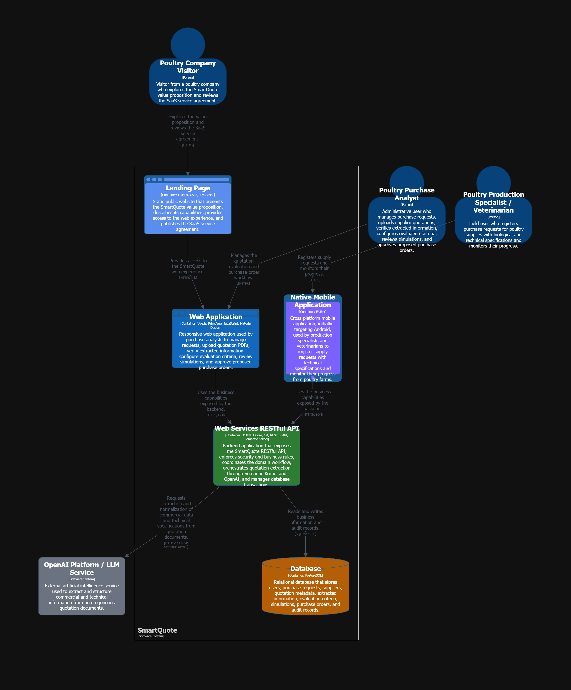

### 4.8.3. Software Architecture Components Diagrams

Los diagramas de componentes detallan la organización interna del API REST, la aplicación web y la aplicación móvil. En el backend y la aplicación web se conserva la misma división por *bounded contexts*, mientras que cada módulo aplica las responsabilidades de *Clean Architecture* correspondientes a su plataforma.

#### Web Services RESTful API (`smartquote-web-services`)

El API se implementa como un monolito modular en ASP.NET Core. Los controladores de la capa **Interfaces** reciben las solicitudes HTTP; la capa **Application** coordina casos de uso y contratos; la capa **Domain** contiene agregados, objetos de valor y servicios de dominio; y **Infrastructure** implementa persistencia e integraciones externas. Un despachador de eventos en proceso permite comunicar hechos de negocio sin crear dependencias directas entre los modelos internos de los contextos.

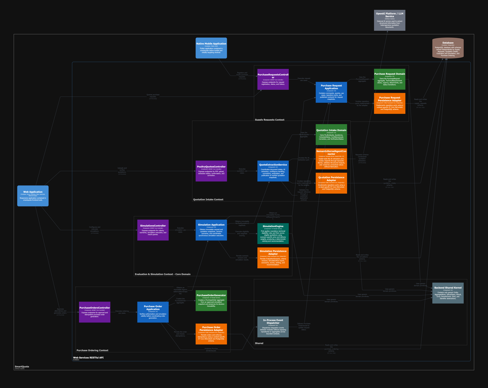

##### Supply Requests Context

Este contexto es propietario del agregado `PurchaseRequest`, de los requerimientos técnicos y de las transiciones de estado de una solicitud. `PurchaseRequestsController` expone el registro, la consulta de estado y el historial; **Purchase Request Application** ejecuta los casos de uso y publica contratos de consulta; y el adaptador de persistencia implementa los puertos del módulo mediante Entity Framework Core y un esquema PostgreSQL propio.

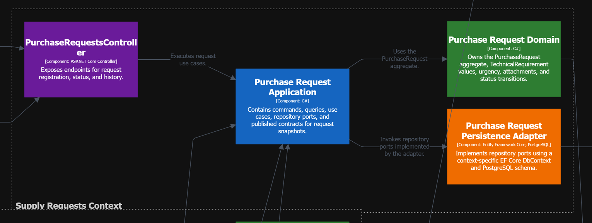

##### Quotation Intake Context

Este contexto administra el ciclo de recepción, extracción, verificación y corrección de las cotizaciones. `PoultryQuotesController` recibe los documentos y las acciones del analista, mientras `QuoteExtractionService` coordina el procesamiento y conserva los valores extraídos, niveles de confianza y correcciones. `SemanticKernelAgentConnector` implementa el puerto de extracción con IA, valida la salida estructurada y conserva como no resueltos los datos que no puede determinar con suficiente certeza, sin inventar información comercial.

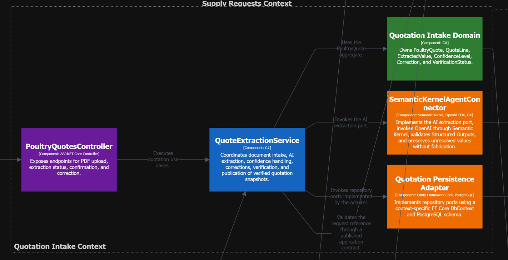

##### Evaluation & Simulation Context — Core Domain

Este es el **Core Domain** de SmartQuote porque transforma solicitudes y cotizaciones verificadas en una decisión comparable y trazable. `SimulationsController` expone la configuración de criterios, la ejecución y la consulta de resultados; **Simulation Application** obtiene *snapshots* inmutables de las entradas y versiona los escenarios; y `SimulationEngine` descarta primero las ofertas que incumplen requisitos técnicos obligatorios antes de aplicar ponderaciones de precio y tiempo de entrega. El resultado contiene exclusiones, puntajes, ranking y recomendación, de modo que distintos escenarios no alteran la evidencia de ejecuciones anteriores.

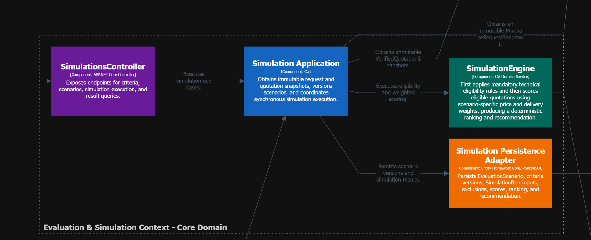

##### Purchase Ordering Context

Este contexto convierte una simulación aprobada en una orden de compra. `PurchaseOrdersController` expone la aprobación y generación; **Purchase Order Application** comprueba la autorización y vigencia del resultado; y `PurchaseOrderGenerator` construye el agregado `PurchaseOrder` a partir de un *snapshot* de la decisión. El adaptador de persistencia aplica idempotencia para impedir que una misma aprobación genere órdenes duplicadas y conserva la referencia hacia la simulación de origen.

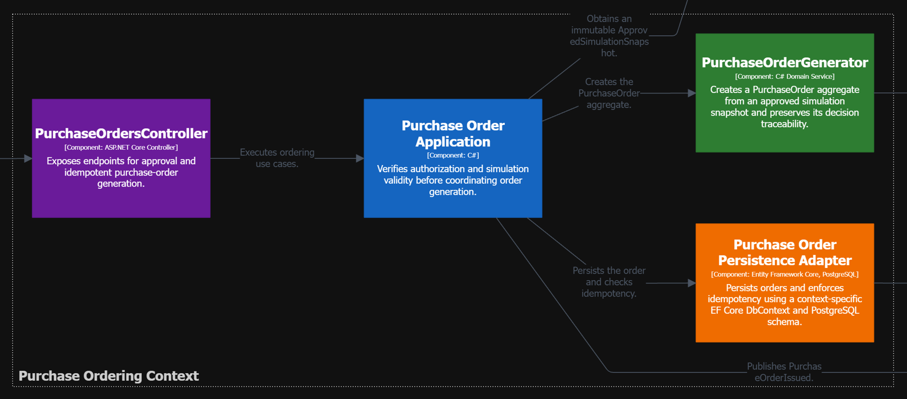

#### Web Application (`smartquote-frontend-web`)

La aplicación web se implementa como un monolito modular de cliente con Vue.js, PrimeVue, Pinia y JavaScript. Cada contexto contiene componentes de **Presentation**, casos de uso y estado en **Application**, modelos del lado cliente en **Domain** y un repositorio HTTP en **Infrastructure**. El **Application Shell**, Vue Router, el cliente HTTP común y los tipos verdaderamente genéricos residen en `Shared`; las reglas y modelos particulares permanecen dentro del contexto que los posee.

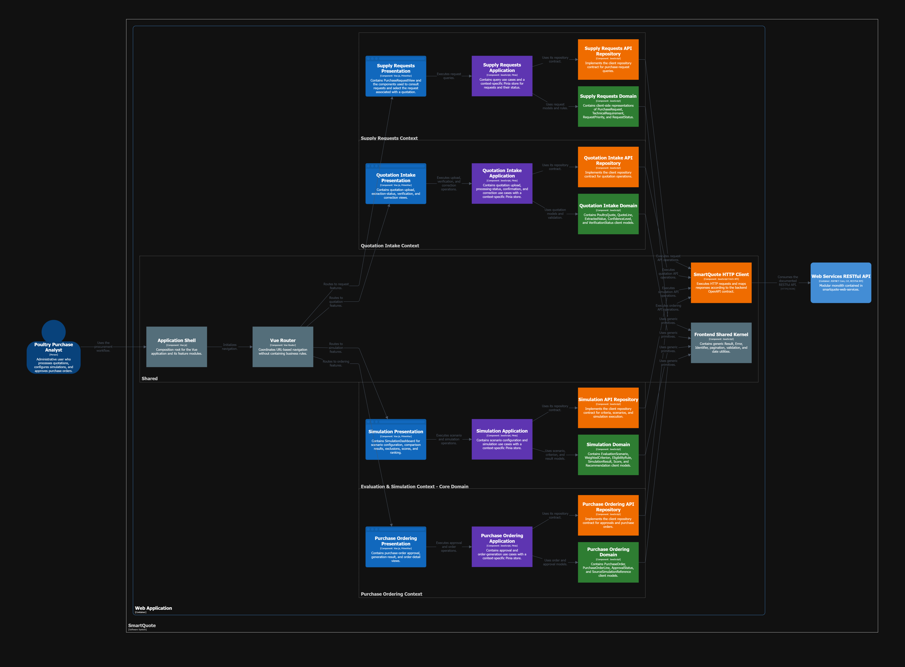

##### Supply Requests Context

La presentación permite al analista consultar las solicitudes y seleccionar la que será atendida con cotizaciones. La capa de aplicación coordina estas consultas y mantiene únicamente el estado necesario del módulo en Pinia. El repositorio del contexto implementa el contrato de acceso al API, mientras el dominio del cliente representa solicitudes, requerimientos técnicos, prioridad y estado sin reutilizar directamente las entidades del backend.

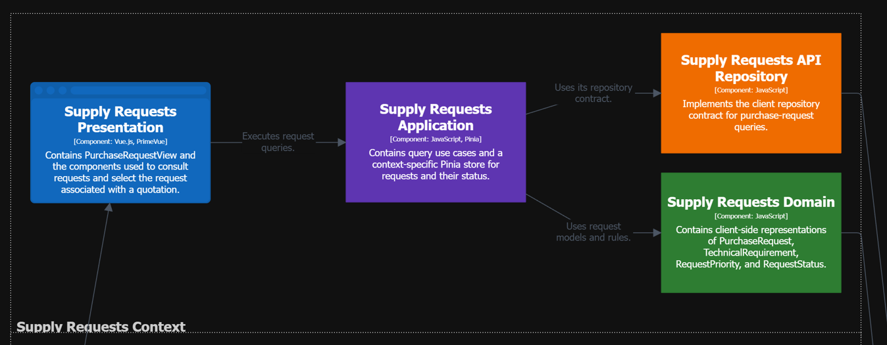

##### Quotation Intake Context

Este módulo reúne las vistas para cargar documentos, observar el estado de extracción, verificar la información obtenida y registrar correcciones. Su capa de aplicación coordina esas operaciones y mantiene el estado de las cotizaciones pendientes. El repositorio HTTP traduce las acciones del cliente a los endpoints del API y el modelo de dominio del frontend representa cotizaciones, líneas, niveles de confianza y estado de verificación.

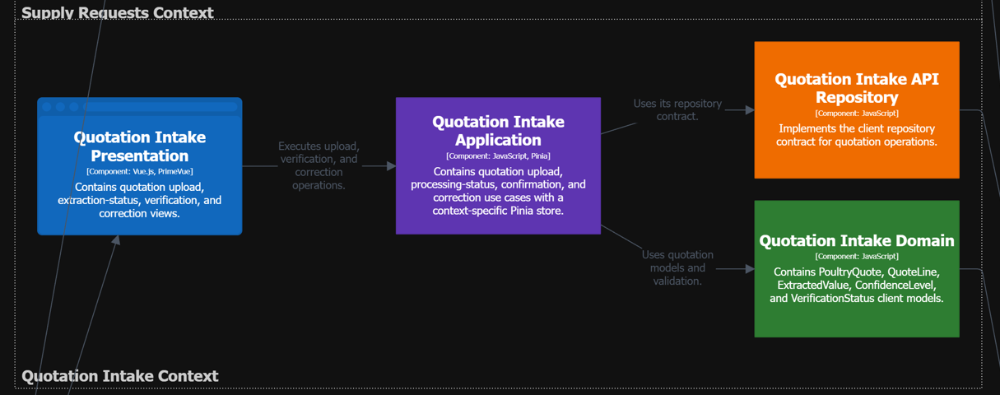

##### Evaluation & Simulation Context — Core Domain

El módulo de simulación contiene el tablero donde el analista configura escenarios, ejecuta comparaciones y revisa exclusiones, puntajes, rankings y recomendaciones. La capa de aplicación controla el estado de cada escenario y ejecución, y el repositorio consume las operaciones de simulación del API. Los modelos del cliente permiten presentar criterios, reglas de elegibilidad y resultados sin trasladar al navegador el algoritmo de decisión, que permanece en el backend.

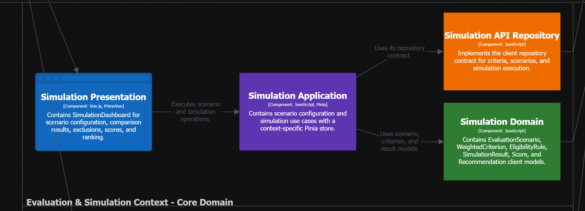

##### Purchase Ordering Context

Este módulo presenta el resultado aprobado, permite solicitar la generación de la orden y consultar su detalle. La capa de aplicación coordina la aprobación y conserva su estado, mientras el repositorio del contexto consume los endpoints correspondientes. El dominio del cliente representa la orden, sus líneas, el estado de aprobación y la referencia a la simulación, pero la validación definitiva y la generación idempotente se ejecutan exclusivamente en el backend.

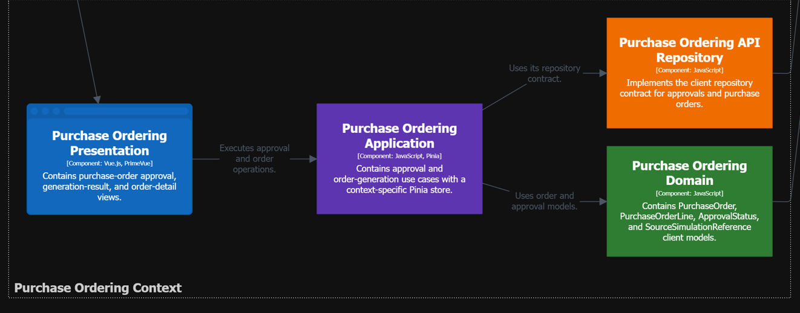

#### Native Mobile Application (`smartquote-native-mobile`)

La aplicación Flutter se concentra inicialmente en **Supply Requests Context**, porque el especialista de producción o veterinario necesita registrar desde el campo los insumos y requerimientos biológicos, además de consultar el estado e historial de sus solicitudes. `RequestFormWidget` y `RequestTrackingList` conforman la presentación; `RequestStateController` administra los estados de carga, éxito y error; y los casos de uso de registro y seguimiento dependen de un repositorio REST, no de una implementación de red concreta.

El cliente HTTP, el almacenamiento seguro de credenciales y los tipos genéricos se mantienen en **Shared**. Esta carpeta brinda capacidades técnicas comunes, pero no contiene reglas del negocio ni constituye otro *bounded context*. Si el alcance móvil crece en iteraciones posteriores, los nuevos módulos deberán incorporarse respetando los mismos límites del dominio.

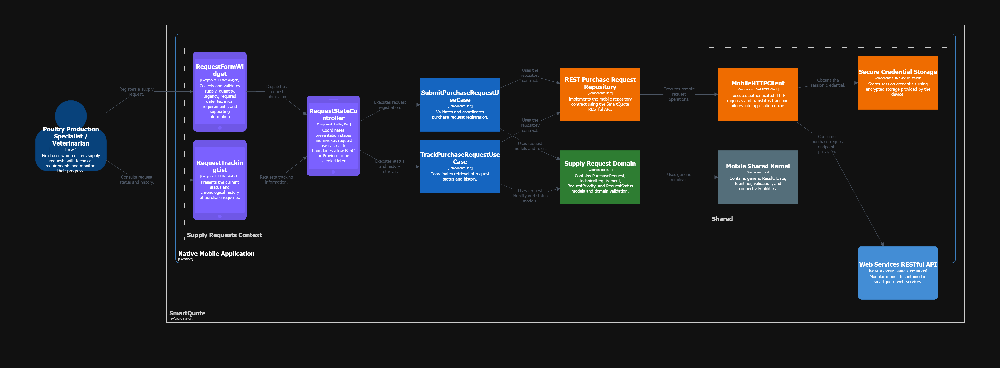

## 4.9. Software Object-Oriented Design

### 4.9.1. Class Diagrams

Los diagramas de clases representan el modelo interno del backend para cada *bounded context*. Se mantiene la separación de **Clean Architecture**: las interfaces reciben las solicitudes REST, la aplicación coordina los casos de uso, el dominio concentra las reglas de negocio y la infraestructura implementa persistencia o integraciones externas. Cada contexto posee su propio agregado raíz y sus objetos de valor; la comunicación entre contextos se realiza mediante contratos de aplicación y snapshots, no mediante referencias directas a entidades ajenas.

#### 4.9.1.1. Supply Requests Context

El agregado raíz `PurchaseRequest` representa la necesidad de abastecimiento registrada por el especialista de producción o sanidad. El agregado contiene los ítems solicitados, sus requisitos técnicos, los archivos de sustento y el historial de estados. `PurchaseRequestCommandService` coordina el registro, los adjuntos y las transiciones, mientras `PurchaseRequestQueryService` atiende las consultas y publica un `PurchaseRequestSnapshot` de solo lectura para los contextos que necesitan evaluar la solicitud. La persistencia se implementa mediante un repositorio PostgreSQL y los cambios de estado generan eventos de dominio que pueden activar la notificación al solicitante.

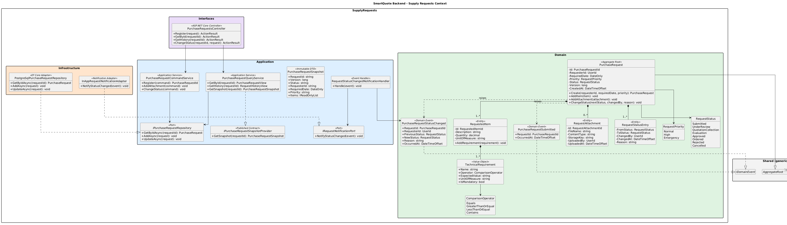

#### 4.9.1.2. Quotation Intake Context

El agregado `PoultryQuote` encapsula una cotización asociada a una solicitud, su proveedor, documento de origen, líneas y campos extraídos. `QuoteExtractionService` coordina la carga, el procesamiento, la confirmación y la corrección de datos. El puerto `IQuoteExtractionAgent` permite conectar `SemanticKernelAgentConnector` con OpenAI sin introducir esa dependencia en el dominio. Cada campo conserva su nivel de confianza, referencia al documento y registro de correcciones; por ello, una cotización no puede marcarse como verificada si mantiene datos críticos sin resolver. Las cotizaciones verificadas se exponen como `VerifiedQuotationSnapshot` para el contexto de evaluación.

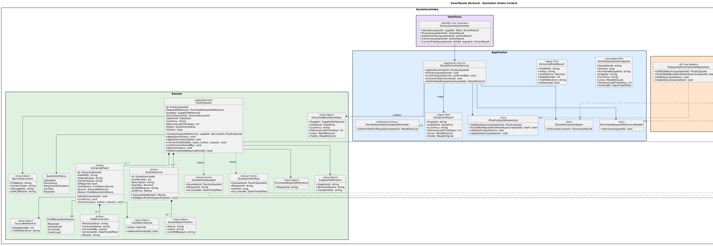

#### 4.9.1.3. Evaluation & Simulation Context — Core Domain

`EvaluationScenario` es el agregado que versiona los criterios de una evaluación. Sus criterios pueden ser obligatorios o ponderados y pertenecen a las categorías de cumplimiento técnico, precio y plazo de entrega. `SimulationEngine` es el servicio de dominio central: recibe un conjunto local de datos, aplica primero las reglas obligatorias, excluye las ofertas no elegibles y calcula el puntaje ponderado de las restantes. `SimulationRun` conserva las evaluaciones, exclusiones, ranking, recomendación y la `InputFingerprint` formada por las versiones de la solicitud, cotizaciones y criterios. Esta huella permite comprobar que una ejecución sigue vigente y que el mismo conjunto de entradas produce un resultado determinista. El contexto publica un `ApprovedSimulationSnapshot` para Purchase Ordering.

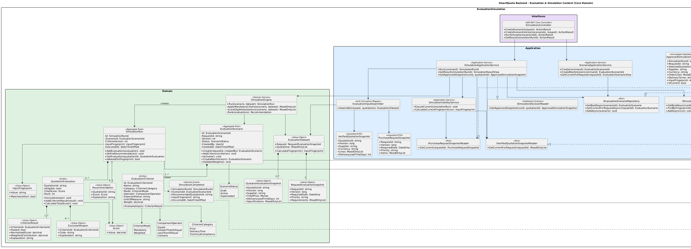

#### 4.9.1.4. Purchase Ordering Context

El agregado raíz `PurchaseOrder` representa la orden emitida a partir de una decisión de simulación aprobada. `PurchaseOrderApplicationService` valida la autorización, solicita al contexto de evaluación un `ApprovedSimulationSnapshot`, lo transforma mediante `ApprovedDecisionMapper` y delega la construcción a `PurchaseOrderGenerator`. La orden conserva el proveedor, las partidas, las condiciones de entrega y la referencia a la solicitud, cotización y simulación de origen. `Approval` incluye una clave idempotente; junto con las restricciones únicas del repositorio PostgreSQL, evita que una solicitud repetida genere órdenes duplicadas.

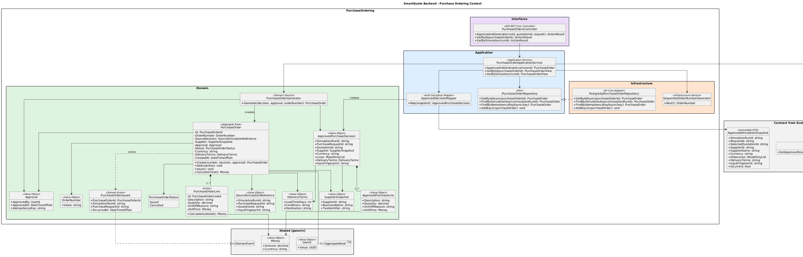

### 4.9.2. Class Dictionary

## 4.10. Database Design

### 4.10.1. Relational/Non-Relational Database Diagram

El diseño de datos de SmartQuote utiliza una base de datos relacional PostgreSQL. El modelo se organiza de acuerdo con los cuatro *bounded contexts* definidos en la arquitectura: **Supply Requests**, **Quotation Intake**, **Evaluation & Simulation** y **Purchase Ordering**. Las tablas que pertenecen a un mismo contexto mantienen relaciones mediante claves foráneas internas, mientras que las referencias entre contextos se conservan mediante identificadores y copias versionadas de los datos utilizados en cada decisión.

El modelo completo integra las entidades necesarias para registrar solicitudes de insumos, almacenar sus requisitos técnicos y adjuntos, recibir cotizaciones, conservar la extracción asistida por IA, verificar y corregir datos, versionar escenarios de evaluación, guardar los snapshots de cada simulación, registrar resultados y exclusiones, conservar la recomendación y generar órdenes de compra trazables e idempotentes.

El diagrama fue elaborado utilizando **Lucidchart**.

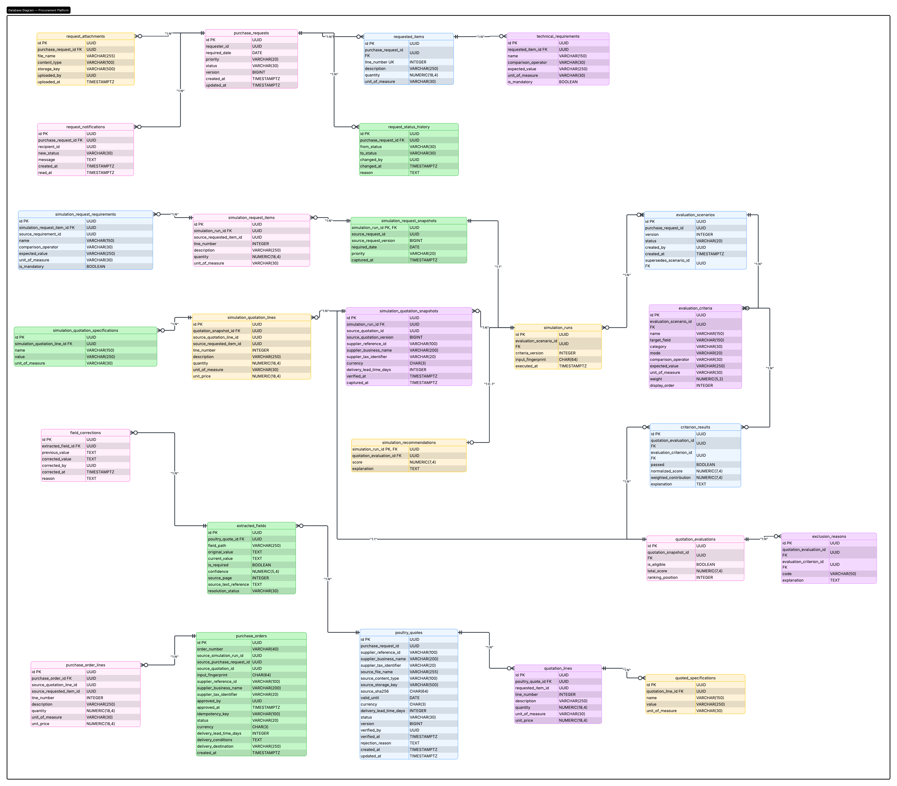

#### 4.10.1.1. Supply Requests Context

Este contexto contiene la información originada en la operación de la granja. `purchase_requests` representa la solicitud de abastecimiento y se relaciona con `requested_items`, que contiene los insumos requeridos. Cada ítem puede tener múltiples `technical_requirements`, donde se registran condiciones como porcentajes nutricionales, concentraciones o características sanitarias. `request_attachments` conserva los documentos de sustento, `request_status_history` permite reconstruir la evolución de la solicitud y `request_notifications` registra los avisos dirigidos al solicitante.

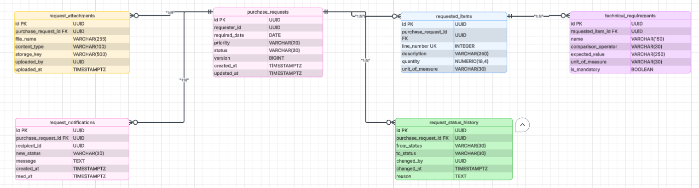

#### 4.10.1.2. Quotation Intake Context

Este contexto administra las cotizaciones recibidas de los proveedores. `poultry_quotes` conserva la solicitud asociada, la referencia del proveedor, los metadatos y hash del documento de origen, el plazo de entrega, la moneda, la versión y el estado de verificación. Sus partidas se almacenan en `quotation_lines` y sus especificaciones en `quoted_specifications`. La tabla `extracted_fields` conserva el valor original, el valor vigente, el nivel de confianza y la referencia al documento; `field_corrections` mantiene el historial de correcciones realizadas por el analista.

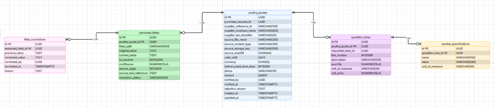

#### 4.10.1.3. Evaluation & Simulation Context — Core Domain

Este contexto conserva la configuración y la evidencia de las evaluaciones. `evaluation_scenarios` permite versionar los escenarios y `evaluation_criteria` almacena sus criterios obligatorios o ponderados. Cada ejecución se registra en `simulation_runs` junto con su `input_fingerprint`. Las tablas `simulation_request_snapshots` y `simulation_quotation_snapshots`, junto con sus tablas de ítems, requisitos, líneas y especificaciones, conservan copias de solo lectura de los datos utilizados en la ejecución. Finalmente, `quotation_evaluations`, `criterion_results`, `exclusion_reasons` y `simulation_recommendations` guardan la elegibilidad, los puntajes, las causas de exclusión y la recomendación resultante.

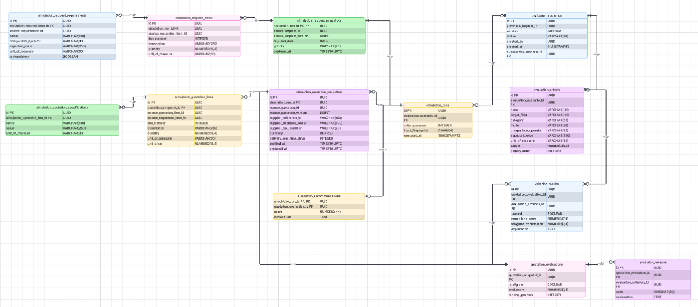

#### 4.10.1.4. Purchase Ordering Context

Este contexto registra la decisión de compra convertida en una orden. `purchase_orders` conserva el número de orden, las referencias de la simulación, solicitud y cotización de origen, la huella de entrada, los datos del proveedor, la autorización, la clave de idempotencia, el estado y las condiciones de entrega. `purchase_order_lines` almacena las partidas emitidas y sus referencias de trazabilidad hacia los datos evaluados. Las restricciones únicas sobre `order_number`, `source_simulation_run_id` e `idempotency_key` evitan la generación de órdenes duplicadas.

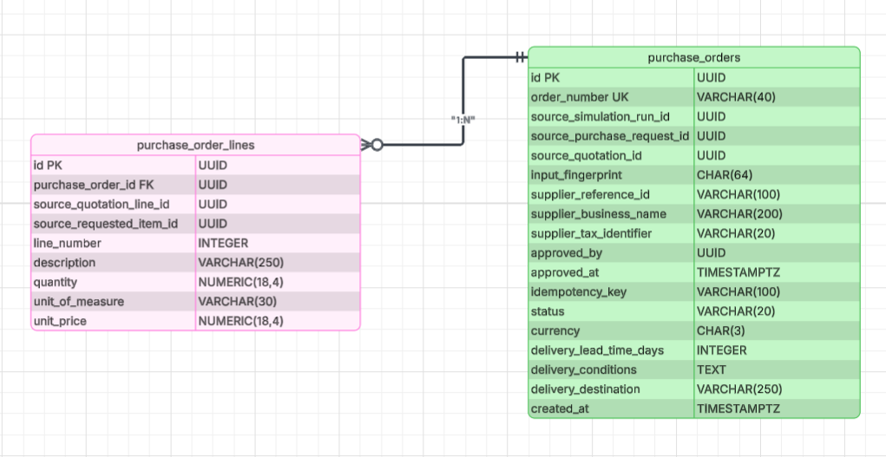

# Capítulo V: Product Implementation

## 5.1. Software Configuration Management

Esta sección define las herramientas, convenciones y controles que permiten al equipo desarrollar SmartQuote de forma consistente. La configuración abarca desde la gestión de requisitos y diseño hasta la construcción, prueba, documentación, publicación y recuperación local del producto. Las decisiones se aplican a los cinco repositorios del proyecto y deben mantenerse alineadas durante todo el ciclo de vida.

### 5.1.1. Software Development Environment Configuration

El equipo utilizará un entorno de trabajo homogéneo. Cada integrante deberá instalar las herramientas indicadas, usar las versiones de SDK y dependencias fijadas por los archivos de configuración de cada repositorio, y evitar cambios globales de versión no coordinados. Las credenciales, claves de API y cadenas de conexión no se almacenarán en el código fuente; se usarán archivos locales `.env` no versionados y secretos configurados en GitHub y Azure.

| Actividad del Ciclo de Vida | Nombre del Producto | Propósito Específico en el Proyecto |
| --- | --- | --- |
| Project Management | Jira Software | Gestionar el Product Backlog, épicas, User Stories, tareas, sprints, responsables y avance del equipo. Cada User Story conservará su identificador en Jira y en las ramas y registros de modificación asociados. |
| Requirements Management | UXPressia | Elaborar y mantener User Personas, Empathy Maps, Journey Maps e Impact Maps a partir de la investigación con los segmentos objetivo. |
| Product UX/UI Design | Figma | Diseñar wireframes, mock-ups, prototipos y componentes visuales para la aplicación web, la aplicación móvil y la Landing Page. |
| Scenario, Wireflow and User Flow Design | Lucidchart | Elaborar los As-Is y To-Be Scenario Maps, Wireflows y User Flows que documenten la experiencia y navegación del producto. |
| Software Architecture | Structurizr DSL y PlantUML | Modelar los diagramas C4 mediante Structurizr DSL y los diagramas de clases mediante PlantUML, conservando su código fuente versionado junto con el informe. |
| Database Design | Lucidchart | Diseñar y mantener el modelo relacional PostgreSQL, sus tablas, claves, relaciones y restricciones por bounded context. |
| Landing Page and Web Frontend Development | WebStorm | Desarrollar la Landing Page con HTML5, CSS3 y JavaScript, y la aplicación web con Vue.js, PrimeVue y Material Design. |
| Backend Development | JetBrains Rider | Desarrollar el monolito modular RESTful con ASP.NET Core, C#, Entity Framework Core y la estructura Clean Architecture + DDD. |
| Mobile Development | Flutter SDK y Android Studio | Desarrollar, ejecutar y depurar la aplicación Android en Flutter/Dart, incluyendo la prueba en emulador o dispositivo físico. |
| Report Documentation | Visual Studio Code | Redactar el informe en Markdown, administrar los assets versionados y previsualizar la documentación antes de integrarla al repositorio del informe. |
| Source Code Management | Git y GitHub | Controlar versiones, administrar Pull Requests, proteger ramas, almacenar código y centralizar la revisión colaborativa. |
| Software Testing | Reqnroll, xUnit y Smartsheet | Automatizar escenarios BDD en Gherkin para los Web Services mediante Reqnroll y xUnit; planificar, registrar evidencias y dar seguimiento a pruebas manuales en Smartsheet. |
| Software Documentation | OpenAPI Specification y Swagger UI | Documentar y probar los endpoints RESTful del backend mediante una especificación OpenAPI publicada con Swagger UI. |
| Continuous Integration and Deployment | GitHub Actions y Azure Portal | Ejecutar compilación, análisis, pruebas y despliegues controlados desde GitHub hacia los servicios de Azure. |
| Local Deployment and Contingency | Docker Desktop y Docker Compose | Levantar PostgreSQL y los servicios web en localhost para desarrollo, integración y demostraciones sin depender de Azure. |


### 5.1.2. Source Code Management

SmartQuote empleará Git como sistema de control de versiones y GitHub como plataforma central de almacenamiento, revisión y colaboración. Cada producto mantiene un repositorio independiente para reducir acoplamiento entre entregables, permitir pipelines específicos y administrar versiones de manera autónoma.

| Producto | Repositorio | URL | Estado al redactar este informe |
| --- | --- | --- | --- |
| Informe | `smartquote-report` | [https://github.com/upc-pre-202620-1asi0732-9108-smartquote/smartquote-report](https://github.com/upc-pre-202620-1asi0732-9108-smartquote/smartquote-report) | Confirmado |
| Landing Page | `smartquote-landing-page` | [https://github.com/upc-pre-202620-1asi0732-9108-smartquote/smartquote-landing-page](https://github.com/upc-pre-202620-1asi0732-9108-smartquote/smartquote-landing-page) | URL objetivo; pendiente de crear o confirmar antes del primer despliegue |
| Frontend Web | `smartquote-frontend-web` | [https://github.com/upc-pre-202620-1asi0732-9108-smartquote/smartquote-frontend-web](https://github.com/upc-pre-202620-1asi0732-9108-smartquote/smartquote-frontend-web) | URL objetivo; pendiente de crear o confirmar antes del primer despliegue |
| Aplicación móvil | `smartquote-native-mobile` | [https://github.com/upc-pre-202620-1asi0732-9108-smartquote/smartquote-native-mobile](https://github.com/upc-pre-202620-1asi0732-9108-smartquote/smartquote-native-mobile) | URL objetivo; pendiente de crear o confirmar antes del primer despliegue |
| Web Services | `smartquote-web-services` | [https://github.com/upc-pre-202620-1asi0732-9108-smartquote/smartquote-web-services](https://github.com/upc-pre-202620-1asi0732-9108-smartquote/smartquote-web-services) | URL objetivo; pendiente de crear o confirmar antes del primer despliegue |

Antes de la entrega pública, el equipo deberá crear o verificar los cuatro repositorios marcados como pendientes y reemplazar su estado por una URL pública comprobada. No se deberá modificar la URL del repositorio del informe sin actualizar esta tabla.

#### GitFlow Workflow

La estrategia de ramificación se basa en GitFlow. No se permiten registros de modificación directos sobre `main` ni `develop`; toda integración se realizará mediante Pull Request, con las comprobaciones automáticas correspondientes y revisión de al menos un integrante distinto del autor cuando el cambio afecte código de producto.

| Rama | Propósito | Nomenclatura y regla de uso |
| --- | --- | --- |
| `main` | Contiene versiones estables, demostrables y listas para producción. | Es inmutable mediante protección de rama. Solo recibe merges desde `release/` o `hotfix/` y se etiqueta con una versión SemVer. |
| `develop` | Integra las funcionalidades aprobadas para la siguiente versión. | Es la rama base de las ramas `feature/` y del siguiente `release/`. |
| `feature/` | Desarrolla una User Story o una mejora acotada. | `feature/US##-ShortTitle`, por ejemplo: `feature/US07-SimulateQuotations`. Nace de `develop` y retorna a `develop` por Pull Request. |
| `release/` | Prepara una versión para pruebas finales, documentación, configuración y corrección de defectos menores. | `release/V{Major}.{Minor}.{Patch}`, por ejemplo: `release/V1.0.0`. Nace de `develop` y se integra en `main` y `develop`. |
| `hotfix/` | Corrige un defecto crítico detectado en producción. | `hotfix/V{Major}.{Minor}.{Patch}-ShortTitle`, por ejemplo: `hotfix/V1.0.1-CorrectOrderDuplication`. Nace de `main` y se integra en `main` y `develop`. |

El repositorio del informe puede emple  | ar ramas documentales con la forma `feature/chapter-##`, porque sus cambios no implementan una User Story de producto. Estas ramas siguen las mismas reglas de Pull Request hacia `develop`.

#### Conventional Commits

Cada registro de modificación seguirá Conventional Commits y utilizará el identificador de la User Story como *scope*. El formato obligatorio será:

```text
<type>(<scope>): <short imperative description in English>
```

Ejemplos:

```text
feat(US07): simulate eligible quotations
fix(US08): prevent duplicate purchase orders
test(US05): verify quotation correction scenarios
docs(US01): update landing page content evidence
ci(US07): add simulation test workflow
```

| Tipo | Uso en SmartQuote |
| --- | --- |
| `feat` | Incorpora una funcionalidad de producto. |
| `fix` | Corrige un defecto. |
| `docs` | Actualiza documentación o evidencias. |
| `style` | Ajusta formato sin modificar el comportamiento. |
| `refactor` | Mejora la estructura interna sin cambiar el comportamiento observable. |
| `test` | Agrega o actualiza pruebas automatizadas o sus datos. |
| `chore` | Modifica tareas de mantenimiento, dependencias o configuración no funcional. |
| `ci` | Ajusta GitHub Actions, validaciones o automatización de integración y despliegue. |

Los títulos deben ser breves, estar en inglés, usar modo imperativo y no terminar con punto. La especificación de referencia se incorporará en la bibliografía del informe.

#### Semantic Versioning

Cada producto desplegable utilizará Semantic Versioning 2.0.0 con el formato `V{Major}.{Minor}.{Patch}` y etiquetas anotadas sobre `main`.

| Componente | Cuándo se incrementa | Ejemplo |
| --- | --- | --- |
| `Major` | Se introduce una incompatibilidad con contratos públicos, API REST, esquema de datos o comportamiento de cliente ya publicado. | `V1.4.2` → `V2.0.0` |
| `Minor` | Se agrega una funcionalidad compatible hacia atrás, como una nueva User Story terminada o endpoint no disruptivo. | `V1.4.2` → `V1.5.0` |
| `Patch` | Se corrige un defecto compatible, una vulnerabilidad o una configuración de producción sin añadir funcionalidad. | `V1.4.2` → `V1.4.3` |

El informe se etiqueta junto con la versión de producto cuya evidencia describe. Los cambios exclusivamente editoriales no modifican la versión funcional del sistema, salvo que se publique una nueva evidencia asociada a una entrega formal.

### 5.1.3. Source Code Style Guide & Conventions

El equipo aplicará guías oficiales y herramientas de formato para mantener un código legible, consistente y fácil de revisar. Las reglas se aplicarán automáticamente cuando sea posible y se revisarán en los Pull Requests antes de integrar una rama.

| Tecnología o artefacto | Estándar de referencia | Convenciones aplicadas en SmartQuote |
| --- | --- | --- |
| HTML5 y CSS3 | Google HTML/CSS Style Guide | HTML semántico, atributos en minúsculas, CSS en archivos o módulos con nombres en kebab-case, diseño responsivo y cumplimiento básico de accesibilidad. |
| JavaScript | Google JavaScript Style Guide y MDN JavaScript Guide | `const` por defecto, `let` solo cuando se reasigna, funciones pequeñas, manejo explícito de errores, módulos sin código muerto y formato aplicado por Prettier y ESLint. |
| Vue.js y PrimeVue | Vue Style Guide | Componentes en PascalCase, composables con prefijo `use`, vistas sin reglas de negocio y estado limitado al bounded context correspondiente mediante Pinia. |
| C# y ASP.NET Core | C# Coding Conventions y ASP.NET Core Guidelines | Cuatro espacios de indentación, tipos y métodos en PascalCase, variables y parámetros en camelCase, interfaces con prefijo `I`, métodos asíncronos con sufijo `Async`, `CancellationToken` en operaciones de E/S y reglas centralizadas en `.editorconfig`. |
| PostgreSQL | PostgreSQL Documentation | Esquemas y tablas en `snake_case` plural, columnas y restricciones en `snake_case` inglés, claves primarias UUID y nombres explícitos para índices, claves foráneas y restricciones únicas. |
| Gherkin y BDD | Gherkin Reference y Reqnroll Documentation | Archivos `.feature` en inglés, escenarios independientes y comprobables, una intención por escenario y estructura Given-When-Then. Los criterios académicos del informe pueden estar en español, pero las especificaciones ejecutables y sus *step definitions* permanecen en inglés. |
| Markdown del informe | CommonMark | Encabezados jerárquicos, enlaces relativos para assets del repositorio, tablas legibles y previsualización en Visual Studio Code antes de integrar cambios. |

#### Regla de idioma para código y contratos técnicos

Todo el código fuente se escribe estrictamente en inglés: variables, métodos, clases, interfaces, namespaces, rutas, endpoints, contratos JSON, archivos de prueba, tablas, columnas, restricciones de base de datos y componentes de OpenAPI/Swagger. La interfaz pública del producto se internacionaliza mediante recursos de idioma para atender los idiomas definidos en las User Stories; esto no modifica la regla de inglés para identificadores técnicos.

### 5.1.4. Software Deployment Configuration

La publicación de SmartQuote se realiza mediante servicios administrados de Azure y automatización en GitHub Actions. La separación de destinos permite desplegar cada producto con el mecanismo que corresponde a su naturaleza, mantener el backend aislado de los clientes y utilizar PostgreSQL como almacén relacional central.

| Componente | Destino de despliegue | Configuración y justificación |
| --- | --- | --- |
| Landing Page | GitHub Pages | Publica los archivos estáticos HTML5, CSS3 y JavaScript desde la rama o artefacto de producción. Es apropiado para contenido informativo, versionado con Git y sin lógica de negocio en servidor. |
| Aplicación web Vue.js | Azure Static Web Apps | Compila y publica los assets de Vue.js y PrimeVue desde GitHub Actions. Ofrece distribución global de contenido estático, HTTPS y entornos de vista previa asociados a Pull Requests. |
| Web Services ASP.NET Core | Azure App Service | Ejecuta el monolito modular RESTful en C#. App Service proporciona un entorno PaaS administrado que permite configurar variables, comprobar salud y escalar la aplicación sin administrar servidores. |
| Base de datos | Azure Database for PostgreSQL Flexible Server | Aloja la base de datos relacional PostgreSQL, sus esquemas por bounded context, copias de seguridad y controles de acceso. El backend es el único componente con acceso directo a la cadena de conexión. |
| Aplicación móvil Android | GitHub Actions y GitHub Releases | Compila el APK de Flutter, ejecuta sus pruebas y publica artefactos versionados para distribución interna y demostraciones. La aplicación móvil consume el API desplegado en Azure App Service. |

#### Pipeline de integración y despliegue

1. Un Pull Request hacia `develop` activa GitHub Actions para restaurar dependencias, ejecutar análisis de estilo, compilar y ejecutar pruebas automatizadas. No se publica producción desde un Pull Request.
2. Al integrar una funcionalidad en `develop`, los repositorios pueden desplegar un entorno de validación o generar artefactos de prueba. Azure Static Web Apps puede generar vistas previas para Pull Requests de la aplicación web.
3. Una rama `release/` consolida la versión candidata, actualiza la documentación y ejecuta las pruebas de regresión.
4. Al integrar un `release/` o `hotfix/` en `main` y crear una etiqueta `V{Major}.{Minor}.{Patch}`, el pipeline genera los artefactos de producción: publicación de GitHub Pages, compilación de Vue.js hacia Azure Static Web Apps, publicación del API en Azure App Service y construcción del APK Android.
5. Antes de aplicar migraciones de Entity Framework Core sobre Azure Database for PostgreSQL, el pipeline realiza una copia de seguridad y exige aprobación del responsable. Las migraciones se ejecutan de manera controlada para no introducir cambios destructivos sobre datos existentes.
6. Las claves de Azure, la cadena de conexión PostgreSQL, `OPENAI_API_KEY` y demás secretos se administran mediante GitHub Secrets y la configuración de Azure App Service. Nunca se registran en Git ni se colocan en archivos de ejemplo con valores reales.
7. Tras el despliegue, el pipeline comprueba el endpoint de salud del API y registra el resultado de la versión publicada. La aplicación web solo puede consumir los dominios autorizados mediante la configuración CORS del backend.

#### Configuración local de contingencia

El equipo mantendrá una configuración local síncrona mediante Docker Compose para las demostraciones. El archivo `docker-compose.yml` levantará, como mínimo, los siguientes servicios dentro de una red local:

| Servicio local | Puerto de referencia | Responsabilidad |
| --- | --- | --- |
| `postgres` | `5432` | Ejecuta PostgreSQL con un volumen persistente para el modelo relacional de SmartQuote. |
| `api` | `8080` | Ejecuta los Web Services ASP.NET Core, aplica migraciones controladas y se conecta a la base de datos local. |
| `web` | `5173` | Sirve la aplicación Vue.js para la demostración y consume el API local. |
| `landing` | `8081` | Sirve la Landing Page estática cuando se requiera mostrar el recorrido completo. |

La demostración local se iniciará con un comando documentado equivalente a `docker compose up --build`. Las credenciales de desarrollo se cargarán desde `.env`, mientras que `.env.example` contendrá únicamente nombres de variables y valores ficticios. La aplicación móvil Android apuntará a `http://10.0.2.2:8080` desde el emulador o a la dirección IP local del equipo anfitrión desde un dispositivo físico.

La extracción real con OpenAI requiere conectividad. Por ello, el backend incluirá una configuración de demostración `AI_PROVIDER=stub` que reemplaza el adaptador externo por resultados estructurados previamente validados para PDFs de prueba. Esta alternativa permite demostrar el flujo completo de carga, verificación, simulación y orden de compra sin Internet, sin afirmar que la IA externa está disponible localmente.

El plan de contingencia se prueba antes de cada demostración: se descarga previamente la imagen de PostgreSQL, se construyen los contenedores, se ejecutan migraciones y datos de ejemplo, se verifica el acceso desde la aplicación web y móvil, y se confirma que el modo `stub` funciona sin conexión a Azure ni a OpenAI.

## 5.2. Product Implementation & Deployment

### 5.2.1. Sprint Backlogs

#### 5.2.1.1. Sprint 1

El Sprint 1 comprende todo el alcance funcional priorizado para la primera versión de SmartQuote. Durante esta iteración se desarrollará un incremento integrado y demostrable que cubra el descubrimiento público del producto, el registro y seguimiento de solicitudes de insumos, la incorporación y análisis de cotizaciones, la evaluación técnica y comercial de las alternativas y la generación trazable de una orden de compra.

##### Sprint Planning 1

La reunión de planificación establece el objetivo común, el periodo de trabajo, la capacidad inicial y los ítems que permitirán obtener el primer incremento de SmartQuote. El equipo acuerda desarrollar el flujo de extremo a extremo y validar tempranamente la incertidumbre de la extracción asistida por IA, sin perder la supervisión humana ni la trazabilidad de la decisión de compra.

| Sprint # | Sprint 1 |
| --- | --- |
| **Sprint Planning Background** | Primera planificación orientada a entregar y demostrar el flujo integral de SmartQuote para una adquisición avícola. |
| Date | 2026-09-07 |
| Time | 07:00 PM – 08:00 PM (GMT-5) |
| Location | Reunión virtual mediante Google Meet |
| Prepared By | Vallejo Trujillo, Fabio Cesar |
| Attendees (to planning meeting) | Bardales Tejada, Luis Alexis / De La Cruz De Los Santos, Mathias Marcelo / Guerrero Vasquez, Jhon Danny / Vallejo Trujillo, Fabio Cesar |
| Sprint 0 Review Summary |  |
| Sprint 0 Retrospective Summary |  |
| **Sprint Goal & User Stories** | US01, US02, US03, US04, TS01, US05, US06, US07, US08 y SP01. |
| Sprint 1 Goal | **Nuestro enfoque está en** entregar un incremento demostrable de SmartQuote que permita conocer la propuesta de valor, registrar y seguir una solicitud avícola, incorporar y verificar cotizaciones PDF, compararlas mediante criterios técnicos y comerciales y generar una orden de compra trazable.<br><br>**Nosotros creemos que cumple** una decisión de compra más ágil, consistente y justificable a los analistas y jefes de adquisiciones, así como visibilidad y control de los requisitos técnicos a los especialistas de producción y sanidad.<br><br>**Esto sera confirmado cuando** un visitante consulte la Landing Page en inglés y español; un especialista registre una solicitud y consulte su historial; un analista procese al menos dos cotizaciones verificadas, obtenga un ranking repetible con explicación de criterios y genere una única orden ante solicitudes repetidas; y el Spike documente los resultados de extracción sobre al menos quince cotizaciones anonimizadas de tres estructuras diferentes, con una meta inicial de 90 % de precisión en los campos obligatorios. |
| Sprint 1 Velocity | 60 Story Points de capacidad planificada. Por ser la primera iteración, este valor constituye una línea base y no una velocidad histórica. |
| Sum of Story Points | 60 Story Points |

El Sprint Goal es específico respecto del flujo que se entregará, medible mediante eventos observables de extremo a extremo, relevante para ambos segmentos objetivo y limitado al periodo del Sprint. Los criterios de aceptación de cada ítem complementan estas medidas y determinan cuándo el trabajo puede considerarse terminado.

##### Aspect Leaders and Collaborators

La Leadership-and-Collaboration Matrix (LACX) organiza el trabajo en cuatro aspectos que corresponden a las superficies y capacidades principales del incremento. Cada aspecto cuenta con un líder responsable de facilitar las decisiones y la integración, mientras los demás integrantes participan como colaboradores. Esta responsabilidad se refleja posteriormente en la asignación de los Work-items del Sprint Backlog.

| Team Member (Last Name, First Name) | GitHub Username | Presencia digital (US01) (L/C) | Solicitudes y experiencia móvil (US02, US03) (L/C) | Cotizaciones y extracción asistida por IA (SP01, US04, TS01, US05) (L/C) | Evaluación, decisión y orden de compra (US06, US07, US08) (L/C) |
| --- | --- | :---: | :---: | :---: | :---: |
| Bardales Tejada, Luis Alexis | AlexisBardales | L | C | C | C |
| De La Cruz De Los Santos, Mathias Marcelo | Dela050406 | C | C | L | C |
| Guerrero Vasquez, Jhon Danny | Feli386 | C | L | C | C |
| Vallejo Trujillo, Fabio Cesar | fabiovallejo | C | C | C | L |

La designación de líder no concentra todo el trabajo de un aspecto en una sola persona. El liderazgo implica coordinar las decisiones, verificar que las tareas contribuyan al Sprint Goal y solicitar la colaboración necesaria para mantener integrado el incremento.

##### Sprint Backlog 1

El Sprint Backlog descompone los 10 ítems seleccionados en Work-items verificables y asigna responsables de manera equitativa. Los Story Points expresan complejidad y esfuerzo relativos a nivel de Product Backlog; las horas corresponden a estimaciones operativas de las tareas y no deben interpretarse como una conversión directa de puntos a tiempo. Al representar la línea base acordada durante el Sprint Planning, todos los Work-items comienzan en estado `To-do` y deberán actualizarse en el Board conforme avance la iteración.

**Duración:** 4 semanas

**Board del Sprint 1:** al momento de consolidar esta planificación, el repositorio no contiene una URL pública verificable del Board de Jira ni una captura de su estado inicial. Para evitar registrar evidencia ficticia, ambos elementos quedan pendientes de incorporar antes de la entrega en `assets/product-implementation/sprint-1/sprint-board.png` y en este apartado.

| Sprint # | Sprint 1 |  |  |  |  |  |  |
| --- | --- | --- | --- | --- | ---: | --- | --- |
| **User Story** |  | **Work-item / Task** |  |  |  |  |  |
| **Id** | **Title** | **Id** | **Title** | **Description** | **Estimation (Hours)** | **Assigned To** | **Status** |
| US01 | Conocer la propuesta de valor de SmartQuote | TK01 | Estructurar el contenido bilingüe | Redactar y organizar la propuesta de valor, capacidades, segmentos y llamados a la acción equivalentes en inglés y español. | 2 | Luis Alexis Bardales Tejada | To-do |
| US01 | Conocer la propuesta de valor de SmartQuote | TK02 | Implementar la Landing Page responsiva | Construir las secciones públicas y su adaptación a desktop y mobile conforme a los mock-ups y Style Guidelines. | 2 | Mathias Marcelo de La Cruz de Los Santos | To-do |
| US01 | Conocer la propuesta de valor de SmartQuote | TK03 | Validar i18n, accesibilidad y enlaces | Configurar el idioma inglés predeterminado y español alterno, comprobar navegación por teclado y verificar los enlaces hacia contacto y experiencia web. | 2 | Luis Alexis Bardales Tejada | To-do |
| SP01 | Evaluar la viabilidad de extraer datos de cotizaciones heterogéneas con IA | TK04 | Preparar el corpus anonimizado | Seleccionar, anonimizar y clasificar al menos quince cotizaciones correspondientes a tres o más estructuras documentales. | 4 | Jhon Danny Guerrero Vasquez | To-do |
| SP01 | Evaluar la viabilidad de extraer datos de cotizaciones heterogéneas con IA | TK05 | Implementar la prueba de concepto | Probar alternativas de extracción y producir una salida estructurada con referencias al documento y valores no resueltos. | 4 | Jhon Danny Guerrero Vasquez | To-do |
| SP01 | Evaluar la viabilidad de extraer datos de cotizaciones heterogéneas con IA | TK06 | Medir precisión y rendimiento | Construir la referencia verificada y calcular precisión por campo, fallos y tiempo de procesamiento de la prueba de concepto. | 4 | Luis Alexis Bardales Tejada | To-do |
| SP01 | Evaluar la viabilidad de extraer datos de cotizaciones heterogéneas con IA | TK07 | Documentar resultados y umbral | Elaborar el informe del Spike con alternativa recomendada, limitaciones, riesgos y umbral de confianza propuesto. | 2 | Luis Alexis Bardales Tejada | To-do |
| SP01 | Evaluar la viabilidad de extraer datos de cotizaciones heterogéneas con IA | TK08 | Revisar privacidad de los documentos | Verificar la anonimización, el manejo de credenciales y las medidas de protección aplicables a la información de proveedores. | 2 | Mathias Marcelo De La Cruz De Los Santos | To-do |
| US02 | Registrar una solicitud de insumos desde la operación | TK09 | Implementar el formulario móvil | Construir el registro del insumo, cantidad, fecha requerida, prioridad y requisitos técnicos en Flutter. | 4 | Mathias Marcelo De La Cruz De Los Santos | To-do |
| US02 | Registrar una solicitud de insumos desde la operación | TK10 | Implementar el caso de uso de registro | Desarrollar el agregado, endpoint y persistencia de Purchase Request con identificador, solicitante y estado inicial. | 2 | Jhon Danny Guerrero Vasquez | To-do |
| US02 | Registrar una solicitud de insumos desde la operación | TK11 | Integrar archivos de sustento | Permitir adjuntar archivos autorizados desde la aplicación móvil y conservar sus metadatos en la solicitud. | 2 | Mathias Marcelo De La Cruz De Los Santos | To-do |
| US02 | Registrar una solicitud de insumos desde la operación | TK12 | Probar validaciones de la solicitud | Automatizar los escenarios de creación completa, rechazo por datos faltantes y asociación de documentos. | 2 | Luis Alexis Bardales Tejada | To-do |
| US04 | Incorporar cotizaciones de proveedores | TK13 | Construir la carga web de cotizaciones | Implementar la selección de PDFs, proveedor y solicitud de destino en la aplicación web. | 2 | Mathias Marcelo De La Cruz De Los Santos | To-do |
| US04 | Incorporar cotizaciones de proveedores | TK14 | Implementar recepción y persistencia | Recibir los archivos válidos, registrar metadatos y asociar cada cotización con su solicitud y proveedor. | 4 | Jhon Danny Guerrero Vasquez | To-do |
| US04 | Incorporar cotizaciones de proveedores | TK15 | Controlar archivos inválidos y duplicados | Validar formato y legibilidad, calcular el hash del documento y evitar registros duplicados sin descartar los archivos válidos del lote. | 2 | Jhon Danny Guerrero Vasquez | To-do |
| US04 | Incorporar cotizaciones de proveedores | TK16 | Probar la incorporación de cotizaciones | Verificar mediante pruebas de integración los casos válidos, inválidos, dañados y duplicados. | 2 | Fabio Cesar Vallejo Trujillo | To-do |
| TS01 | Procesar cotizaciones mediante un servicio RESTful de extracción | TK17 | Definir el contrato OpenAPI | Especificar la solicitud, respuesta normalizada, niveles de confianza, referencias de origen y errores del servicio RESTful. | 2 | Luis Alexis Bardales Tejada | To-do |
| TS01 | Procesar cotizaciones mediante un servicio RESTful de extracción | TK18 | Orquestar el procesamiento autorizado | Implementar el endpoint, autorización y coordinación asíncrona del procesamiento de una cotización soportada. | 4 | Jhon Danny Guerrero Vasquez | To-do |
| TS01 | Procesar cotizaciones mediante un servicio RESTful de extracción | TK19 | Normalizar el resultado de extracción | Mapear proveedor, vigencia, moneda, partidas, cantidades, precios, entrega y especificaciones sin inventar datos ausentes. | 2 | Jhon Danny Guerrero Vasquez | To-do |
| TS01 | Procesar cotizaciones mediante un servicio RESTful de extracción | TK20 | Implementar el adaptador de extracción | Integrar Semantic Kernel y OpenAI detrás de un puerto de infraestructura, validar la salida estructurada y proveer el modo `stub` para contingencia. | 6 | Fabio Cesar Vallejo Trujillo | To-do |
| TS01 | Procesar cotizaciones mediante un servicio RESTful de extracción | TK21 | Probar el contrato y los errores REST | Automatizar respuestas exitosas, datos ambiguos, formatos no soportados y errores estructurados sin exposición de información sensible. | 2 | Mathias Marcelo De La Cruz De Los Santos | To-do |
| US05 | Verificar la información extraída de una cotización | TK22 | Construir la interfaz de verificación | Mostrar los datos detectados, niveles de confianza, origen y acciones para confirmar o corregir valores. | 4 | Jhon Danny Guerrero Vasquez | To-do |
| US05 | Verificar la información extraída de una cotización | TK23 | Implementar la auditoría de correcciones | Conservar el valor original y vigente, autor, fecha y justificación, e impedir la verificación con datos críticos pendientes. | 4 | Fabio Cesar Vallejo Trujillo | To-do |
| US05 | Verificar la información extraída de una cotización | TK24 | Probar confirmaciones y correcciones | Automatizar los escenarios de confirmación, corrección trazable y bloqueo por campos obligatorios no verificados. | 2 | Luis Alexis Bardales Tejada | To-do |
| US06 | Definir los criterios de evaluación de cotizaciones | TK25 | Construir la configuración de criterios | Implementar la interfaz para criterios obligatorios y ponderados de cumplimiento técnico, precio y plazo de entrega. | 2 | Mathias Marcelo De La Cruz De Los Santos | To-do |
| US06 | Definir los criterios de evaluación de cotizaciones | TK26 | Modelar escenarios versionados | Implementar Evaluation Scenario, sus versiones y la validación del rango y suma de ponderaciones. | 4 | Fabio Cesar Vallejo Trujillo | To-do |
| US06 | Definir los criterios de evaluación de cotizaciones | TK27 | Invalidar resultados desactualizados | Marcar las simulaciones que deben repetirse cuando cambie la versión vigente de los criterios. | 2 | Fabio Cesar Vallejo Trujillo | To-do |
| US06 | Definir los criterios de evaluación de cotizaciones | TK28 | Probar ponderación y versionado | Automatizar configuraciones válidas, ponderaciones inválidas y conservación de versiones anteriores. | 2 | Luis Alexis Bardales Tejada | To-do |
| US07 | Simular y comparar las cotizaciones elegibles | TK29 | Implementar el motor de simulación | Aplicar requisitos obligatorios, excluir ofertas no elegibles, calcular puntajes ponderados y generar el ranking. | 6 | Fabio Cesar Vallejo Trujillo | To-do |
| US07 | Simular y comparar las cotizaciones elegibles | TK30 | Construir el cuadro comparativo | Presentar ofertas, contribución por criterio, exclusiones, puntajes y recomendación en la aplicación web. | 2 | Jhon Danny Guerrero Vasquez | To-do |
| US07 | Simular y comparar las cotizaciones elegibles | TK31 | Conservar snapshots y huella de entrada | Registrar versiones inmutables de solicitud, cotizaciones y criterios para garantizar la repetibilidad del resultado. | 2 | Fabio Cesar Vallejo Trujillo | To-do |
| US07 | Simular y comparar las cotizaciones elegibles | TK32 | Probar elegibilidad y repetibilidad | Automatizar la exclusión por criterios obligatorios y la igualdad de resultados con entradas sin cambios. | 2 | Luis Alexis Bardales Tejada | To-do |
| US07 | Simular y comparar las cotizaciones elegibles | TK33 | Integrar ejecución y consulta de resultados | Conectar la aplicación web con los endpoints de configuración, ejecución y consulta de simulaciones. | 2 | Luis Alexis Bardales Tejada | To-do |
| US07 | Simular y comparar las cotizaciones elegibles | TK34 | Ejecutar prueba de extremo a extremo | Comprobar el ranking explicable utilizando al menos dos cotizaciones verificadas y una versión vigente de criterios. | 2 | Mathias Marcelo De La Cruz De Los Santos | To-do |
| US08 | Aprobar la alternativa seleccionada y generar la orden de compra | TK35 | Implementar generación idempotente | Crear el agregado y la persistencia de Purchase Order a partir de una aprobación autorizada, con restricciones contra duplicados. | 4 | Fabio Cesar Vallejo Trujillo | To-do |
| US08 | Aprobar la alternativa seleccionada y generar la orden de compra | TK36 | Construir el detalle de la orden | Presentar proveedor, partidas, cantidades, precios, moneda, entrega y referencias de origen en la aplicación web. | 2 | Jhon Danny Guerrero Vasquez | To-do |
| US08 | Aprobar la alternativa seleccionada y generar la orden de compra | TK37 | Validar vigencia y trazabilidad | Comprobar que solicitud, cotización, criterios y simulación continúan vigentes antes de aprobar y conservar sus referencias. | 4 | Luis Alexis Bardales Tejada | To-do |
| US08 | Aprobar la alternativa seleccionada y generar la orden de compra | TK38 | Integrar aprobación y generación | Conectar las acciones de aprobación y generación de la aplicación web con los endpoints del API. | 2 | Mathias Marcelo De La Cruz De Los Santos | To-do |
| US08 | Aprobar la alternativa seleccionada y generar la orden de compra | TK39 | Probar duplicados y datos desactualizados | Automatizar el rechazo de simulaciones obsoletas y la devolución de la orden existente ante una solicitud repetida. | 2 | Luis Alexis Bardales Tejada | To-do |
| US08 | Aprobar la alternativa seleccionada y generar la orden de compra | TK40 | Ejecutar prueba de generación completa | Validar de extremo a extremo que una decisión aprobada produce una orden consistente y que la repetición no crea otra orden. | 2 | Mathias Marcelo De La Cruz De Los Santos | To-do |
| US03 | Conocer el avance de una solicitud de compra | TK41 | Construir seguimiento móvil | Implementar la lista de solicitudes y la vista de detalle con estado, última actualización y siguiente área responsable. | 4 | Mathias Marcelo De La Cruz De Los Santos | To-do |
| US03 | Conocer el avance de una solicitud de compra | TK42 | Implementar historial y notificaciones | Exponer el historial cronológico, registrar cambios con responsable y motivo y notificar al solicitante. | 4 | Mathias Marcelo De La Cruz De Los Santos | To-do |
| US03 | Conocer el avance de una solicitud de compra | TK43 | Probar seguimiento e historial | Verificar la consulta del estado, el orden cronológico de eventos y la notificación de cambios autorizados. | 2 | Luis Alexis Bardales Tejada | To-do |

La distribución de horas mantiene una carga inicial equivalente entre los integrantes, al mismo tiempo que asigna la mayor participación de cada aspecto a su líder correspondiente.

| Integrante | Horas estimadas | Porcentaje de la capacidad del equipo |
| --- | ---: | ---: |
| Luis Alexis Bardales Tejada | 30 | 25 % |
| Mathias Marcelo De La Cruz De Los Santos | 30 | 25 % |
| Jhon Danny Guerrero Vasquez | 30 | 25 % |
| Fabio Cesar Vallejo Trujillo | 30 | 25 % |
| **Total** | **120** | **100 %** |

### 5.2.2. Implemented Landing Page Evidence

### 5.2.3. Implemented Frontend-Web Application Evidence

### 5.2.4. Implemented Native-Mobile Application Evidence

### 5.2.5. Implemented RESTful API and/or Serverless Backend Evidence

### 5.2.6. RESTful API documentation

### 5.2.7. Team Collaboration Insights

## 5.3. Video About-the-Product

# Conclusiones

## Conclusiones y recomendaciones

# Bibliografía

- Coupa. (s. f.). *Coupa for suppliers*. Recuperado el 9 de septiembre de 2026, de https://docs.coupa.com/en/supplier-documentation/coupa-for-suppliers
- Fowler, M. (2006, 12 de diciembre). *Ubiquitous language*. MartinFowler.com. https://martinfowler.com/bliki/UbiquitousLanguage.html
- Odoo. (s. f.). *Calls for tenders*. Recuperado el 9 de septiembre de 2026, de https://www.odoo.com/documentation/18.0/applications/inventory_and_mrp/purchase/manage_deals/calls_for_tenders.html
- Open Practice Library. (s. f.). *Ubiquitous language*. Recuperado el 9 de septiembre de 2026, de https://openpracticelibrary.com/practice/ubiquitous-language/
- Oracle. (s. f.). *About Oracle Fusion Cloud Procurement*. Recuperado el 9 de septiembre de 2026, de https://docs.oracle.com/en/cloud/saas/procurement/25c/fainp/about-oracle-fusion-cloud-procurement.html
- SAP. (s. f.). *SAP Ariba Sourcing software*. Recuperado el 9 de septiembre de 2026, de https://www.sap.com/products/spend-management/ariba-sourcing.html

# Anexos

## Anexo A. Videos de Exposiciones
